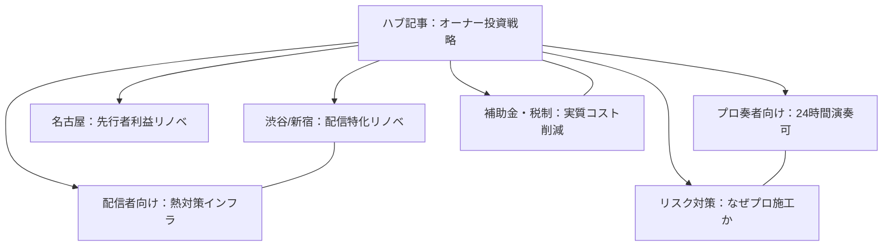

# 🧱 防音リノベーション：オーナー向けクラスター記事展開案（2026年戦略）

ハブ記事（[owner-soundproof-renovation-investment-strategy-2026](../owner-renovation-strategy-hub.md)）を補完し、特定の地域やペルソナ、状況（立地）に特化したクラスター記事の構成案です。

---

## 📍 1. 地域・立地特化型クラスター (Geographic/Location)

地域の不動産ポータル検索ボリューム（KW）に基づいた、各都市のオーナー向け戦略です。

### 1.1 【東京・渋谷/新宿エリア】「VTuber・法人配信」特化型リノベ
- **ターゲット**: 渋谷区・新宿区の築古マンションオーナー。
- **内容**: 
    - 高家賃プレミアム（+35%超）を狙う「完全防音(Dr-40) + 10Gbps専用回線」のセット導入。
    - ミュージション、ラシクラス等のブランドに対抗するための「内装デザイン（配信映え）」のコツ。
    - 近隣トラブル（深夜の叫び声）を完全に防止する「遮音性能証明書」の重要性。

### 1.2 【名古屋・中区エリア】「先行者利益」最大化リノベ
- **ターゲット**: 名古屋市中区栄・大須周辺の物件オーナー。
- **内容**: 
    - 東京に比べ極めて供給が少ない現状を「ブルーオーシャン」として捉える。
    - 名古屋特有の「楽器可」物件の少なさを補う、Dr-35程度のミドルレンジ防音の有効性。
    - 地元の音大（名古屋音大等）や配信コミュニティへのダイレクトなアプローチ手法。

---

## 🎭 2. ペルソナ・用途特化型クラスター (Persona/Use-case)

特定の入居者の「深い悩み」を解決することで、長期入居と高単価を狙う戦略です。

### 2.1 【プロ奏者・講師向け】「24時間演奏可能」という最強の資産
- **ターゲット**: 住宅街の静かな一軒家や低層マンションを持つオーナー。
- **内容**: 
    - ピアノ・バイオリン等のアコースティック楽器演奏に特化した「残響設計（RT60）」の基礎。
    - 講師が教室として使用する場合の「共用部・動線」の法規制（用途変更の有無）。
    - 音大生やプロ奏者（入居期間5年以上）を確保するための「学割・演奏特典」の設計。

### 2.2 【ハイエンド配信者向け】「防音 × 高効率空調」のインフラ投資
- **ターゲット**: PC機材の熱問題に悩む配信者をターゲットにしたいオーナー。
- **内容**: 
    - RTX 50シリーズ等の高発熱PCに対応した「換気ダクト防音」の設計。
    - 消音ダクトとダイキン等の高効率エアコンの組み合わせ事例。
    - 「冷えやすく、静か」な部屋がなぜ2026年の配信者に刺さるのか。

---

## 🛠️ 3. 解決策・コスト特化型クラスター (Solution/Technical)

オーナーが最も懸念する「コスト（支出）」と「リスク」に対処する記事です。

### 3.1 【DIY・簡易防音の落とし穴】オーナーが「専門業者」に頼むべき3つの理由
- **ターゲット**: 費用を抑えるためにDIY防音を検討しているオーナー。
- **内容**: 
    - 隣室からのクレーム（低周波音）はDIYでは防げない現実。
    - 万が一の火災時の「防音材の難燃性」と保険適用のリスク。
    - プロの「性能保証」があるからこそ、賃貸借契約で「強気の特約」が書ける。

### 3.2 【税制・補助金完全ガイド】2026年「みらいエコ住宅」活用術
- **ターゲット**: リフォーム資金の調達や節税を考えているオーナー。
- **内容**: 
    - 防音改修を「断熱・省エネ」として申請する具体的なフロー。
    - 確定申告でトクをする「リフォーム減税」の必要書類リスト。
    - 補助金分を「入居者プレゼント（例：高速ルーター設置）」に回して客付け力を上げるアイデア。

---

## 📌 クラスター記事間リンク構造 (Master Map)

---
*Generated by: .workspace/.data-set/analysis-global-research-multilingual-seo.md を踏まえた戦略案*
