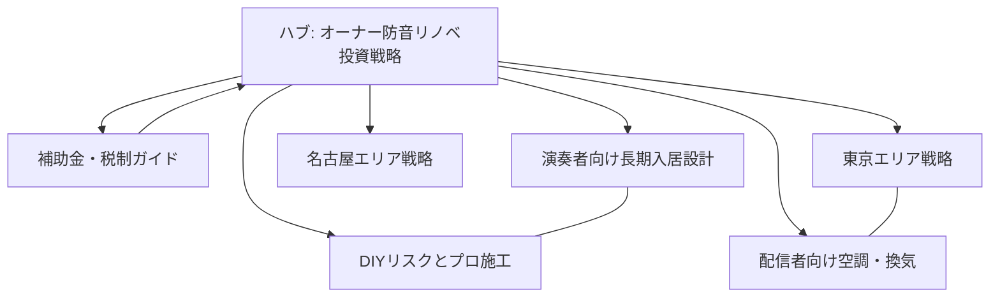

# 防音リノベーション：オーナー向けクラスター記事展開案（完成版）

ハブ記事（`owner-renovation-strategy-hub.md`）を補完する、オーナー向けクラスターの実行計画です。  
目的は、検索意図ごとの導線を作り、問い合わせ導線の取りこぼしを減らすことです。  

---

## クラスター設計の前提

- 収益キーワード: 防音リノベ ROI、空室対策、家賃プレミアム  
- 比較キーワード: 防音ユニット vs 造作、Dr等級、補助金対象  
- 地域キーワード: 東京、名古屋など供給ギャップの大きい都市  
- リスクキーワード: 近隣クレーム、防炎、契約特約、保証  

---

## 優先公開順（6本）

1. 補助金・税制ガイド（資金不安を解消）  
2. DIYとプロ施工の比較（失敗回避）  
3. 配信者向けインフラ設計（高単価需要）  
4. 東京エリア戦略（競争市場対応）  
5. 名古屋エリア戦略（先行者利益）  
6. 演奏者向け設計（長期入居の強化）  

---

## クラスター記事詳細

### C1 東京・渋谷/新宿エリア：配信特化リノベ

- 想定slug: `owner-soundproof-renovation-shibuya-shinjuku-streamer`  
- 検索意図: 高競争エリアで勝てる差別化策を知りたい  
- 主な読者: 築古区分のオーナー、管理会社  
- 骨子:
  - Dr-40前後 + 高速回線のセット戦略  
  - 深夜配信クレーム回避の運用設計  
  - 募集図面に載せる性能情報テンプレート  
- ハブへの戻し導線:
  - 投資回収期間の全体像はハブ記事へ  

### C2 名古屋・中区エリア：先行者利益リノベ

- 想定slug: `owner-soundproof-renovation-nagoya-first-mover`  
- 検索意図: 供給が少ない地域で勝つ方法を知りたい  
- 主な読者: 地方中核都市のオーナー  
- 骨子:
  - 地域の供給ギャップと家賃設計  
  - Dr-35〜40のミドル投資で狙う現実解  
  - 地元コミュニティ連携による客付け  
- ハブへの戻し導線:
  - ROI共通ロジックはハブ記事へ  

### C3 プロ奏者・講師向け：24時間演奏可の設計

- 想定slug: `owner-soundproof-renovation-musician-longstay`  
- 検索意図: 演奏需要向けの仕様を知りたい  
- 主な読者: 低層マンション・戸建賃貸オーナー  
- 骨子:
  - 楽器種別で異なる遮音と残響の考え方  
  - レッスン用途を見据えた動線・共用部配慮  
  - 長期入居を前提にした募集条件設計  
- ハブへの戻し導線:
  - 出口戦略とキャップレート評価はハブ記事へ  

### C4 ハイエンド配信者向け：防音 × 空調インフラ

- 想定slug: `owner-soundproof-renovation-streamer-hvac`  
- 検索意図: 高発熱配信環境の失敗を避けたい  
- 主な読者: 配信者向け物件を狙うオーナー  
- 骨子:
  - 換気ダクト防音と温熱設計の両立  
  - 夏季の騒音クレームと熱暴走リスク対策  
  - 「静かで冷える」訴求の募集設計  
- ハブへの戻し導線:
  - 投資判断の大枠はハブ記事へ  

### C5 DIY・簡易防音の落とし穴

- 想定slug: `owner-soundproof-renovation-diy-risk`  
- 検索意図: DIYで十分か、プロ施工が必要か知りたい  
- 主な読者: 小規模オーナー、初めての防音投資層  
- 骨子:
  - 低周波漏れと防音欠損の典型例  
  - 防炎・保険・契約責任の実務論点  
  - 保証付き施工の費用対効果  
- ハブへの戻し導線:
  - 施工コスト最適化はハブ記事へ  

### C6 税制・補助金ガイド（2026）

- 想定slug: `owner-soundproof-renovation-subsidy-tax-2026`  
- 検索意図: 初期投資の資金負担を下げたい  
- 主な読者: 補助金利用を前提に計画するオーナー  
- 骨子:
  - 内窓改修と防音の同時最適化  
  - 申請フローと必要書類の整理  
  - 補助金を客付け強化へ再投資する設計  
- ハブへの戻し導線:
  - 中長期収益モデルはハブ記事へ  

---

## 内部リンク構造（運用版）

---

## 制作時の統一ルール

- ハブへ必ず1本以上戻す  
- 各記事で「対象読者」「想定投資額」「失敗例」を明示  
- 机上の理論だけでなく、契約・運用まで記載  
- 数値は「前提条件」を併記し断定表現を避ける  

---

## 次アクション

- まずC6とC5を先行執筆  
- 2本公開後に検索クエリを確認  
- 流入の強いペルソナへC4/C1を追加展開  
