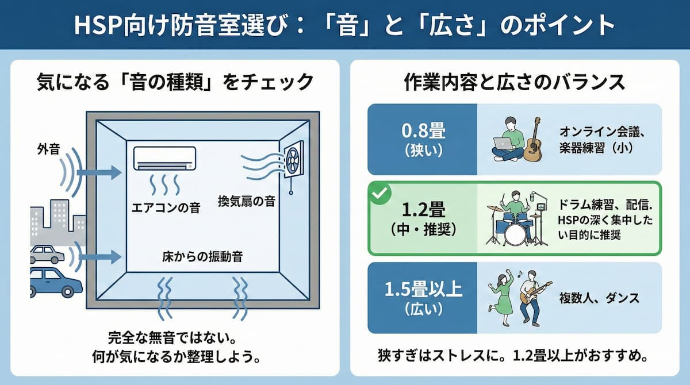

---
title: "HSPに防音室を勧めるなら？敏感さを活かす防音環境の選び方"
description: "HSP（敏感気質）で聴覚過敏がある人に防音室は本当に効果的なのか。普通の人より音にどれくらい敏感か、気になる音の選別方法、防音賃貸との選択、睡眠用防音ソリューション、そして防音室で深い集中を手に入れる方法を解説します。"
slug: "hsp-soundproof-room-guide"
date: "2025-12-21T00:00:00+09:00"
lastmod: "2026-02-28"
draft: false
lang: "ja"
category: "knowledge"
tags: ["HSP","敏感気質","聴覚過敏","防音室","睡眠","集中"]
image: ./cover.jpg
---
<RegionBanner />

HSP（Highly Sensitive Person：敏感気質）で、聴覚過敏がある方へ。あなたは周りの音に敏感すぎて、疲れていませんか？

「普通の人は気にならないレベルの音でも、自分は気になる」「何度も寝返りを打つ」「常に周りの音をチェックしてしまう」

そんな悩みを抱えている方にとって、<strong>防音室は本当に人生を変える選択肢になり得ます</strong>。

本記事では、HSPで聴覚過敏がある方に対して、防音室を勧めるにあたって知るべきことを解説します。

## HSPの聴覚過敏ってどれくらい敏感なのか

まず、HSPの聴覚過敏がどの程度のものなのかを理解することが大切です。

### 普通の人との違い：同じ音でも脳の反応が異なる

HSPの人の脳は、通常より<strong>刺激処理が深い</strong>という特性があります。つまり：

- 音の大きさだけでなく、「細かい音の変化」も感知する
- 同じ音でも「嫌だな」という感情が強く湧く
- 一度聞いた不快な音は、何度も思い出してしまう

この結果、同じレベル（デシベル）の音でも、HSPでない人より「うるさい」と感じるわけです。

### 実際のところ、どんな音が気になるか

よく聞く例：

- <strong>隣人の足音</strong>：床の上をスリスリ歩く音、物を引きずる音
- <strong>時計の秒針音</strong>：カチカチという一定のリズム
- <strong>冷蔵庫の音</strong>：ウーンという低周波ノイズ
- <strong>外の車音</strong>：エンジン音、クラクション
- <strong>隣人の生活音</strong>：ドアの開閉、トイレの音、会話

普通の人は気にならないかもしれませんが、HSPの方にはこれらが「睡眠を妨げる」「集中を邪魔する」という深刻な悩みになります。

## HSPに防音室を勧める理由：3つのメリット

では、なぜHSPに防音室が良いのか。3つの理由があります。

### 1. 聴覚過敏からの「心の休息」が手に入る

防音室に入った瞬間、あなたは多くの外部刺激から解放されます。

<strong>常に「音をチェック」する疲れが消える</strong>

HSPの方は、無意識に周りの音に注意を向けてしまいます。「次はどんな音がするだろう」「嫌な音が来るかも」という不安。

防音室ならば、その「音の監視」から自由になれます。

### 2. 睡眠の質が劇的に改善する

多くのHSPの方は、「軽い睡眠」で悩んでいます。

ちょっとした音で目が覚め、その後なかなか寝付けない。その結果、翌日疲れたままという悪循環。

防音室で寝ると、この悪循環から解放されます。<strong>深い睡眠が手に入る</strong>ということは、人生の質そのものが向上するということです。

### 3. 深い集中状態（フロー）に入りやすくなる

HSPの方は、周りの音で集中が遮られやすいです。

でも防音室なら、集中を妨げる音がありません。その結果、<strong>仕事や創作活動に深く集中でき、生産性が向上</strong>します。

## HSPの人が防音室を選ぶときの注意点

ただし、むやみに防音室を選べば良いわけではありません。いくつかのポイントを押さえておきましょう。

### 気になる「音の種類」をスクリーニングしよう

防音室は、外からの音を減らしますが、<strong>完全には消えません</strong>。また、防音室の中にも音源がありますね。

例えば：
- <strong>エアコンの音</strong>：小型防音室に設置されるエアコンは、わずかな音でも気になる場合がある
- <strong>床からの振動音</strong>：ビルの下階の音が振動として伝わることもある
- <strong>換気扇の音</strong>：新鮮な空気を取り入れるため、わずかな音が発生する

ですから、導入前に「何の音が特に気になるのか」を整理しておくことが大切です。

### 作業内容と広さのバランスを考える

防音室にはいくつかサイズがあります。

- <strong>0.8畳</strong>：オンライン会議、楽器練習（ギター等）
- <strong>1.2畳</strong>：ドラム練習、配信
- <strong>1.5畳以上</strong>：複数人の楽器練習、ダンス

HSPで「深く集中したい」という目的ならば、<strong>最低でも1.2畳以上</strong>がおすすめです。狭すぎると、その「狭さ」がストレスになる可能性があるからです。

## 防音賃貸との選択：HSPにとって最適な環境は？

防音室を購入するか、防音賃貸に住み替えるか。HSPの方には、防音賃貸を勧めることも多いです。

### 防音室の方が良いケース

- 賃貸住まいで、大家の同意が得られない
- 防音室だけあれば十分な睡眠・集中環境が手に入る
- 転居予定がない

### 防音賃貸の方が良いケース

- <strong>常に防音環境にいたい</strong>（24時間の安心感が欲しい）
- <strong>転居予定がある</strong>
- <strong>複数の部屋で防音環境が必要</strong>（寝室と仕事部屋など）
- <strong>HSP家族全員が聴覚過敏</strong>

つまり、HSPの方にとって「防音賃貸は最高のソリューション」です。なぜなら、眠るときも起きているときも、常に静かな環境にいられるから。

## HSPの睡眠を守る選択肢：防音室以外のアプローチ

防音室以外でも、HSPの睡眠を守る方法があります。

### 耳栓を活用する

質の高い耳栓を使うことで、わずかながら音を減らせます。ただし、完全には遮音できないため、HSPには物足りないかもしれません。

### ホワイトノイズ・環境音の活用

逆説的ですが、「一定の低周波ノイズ」をかけることで、周りの変動する音が気にならなくなることがあります。

例えば：
- 扇風機の音
- 川のせせらぎ
- 雨音

これらのホワイトノイズが「雑音マスキング」の役割を果たし、不快な音をかき消します。

### 睡眠用アイテム

最近は「睡眠用防音マスク」なるものも登場しています。形状は通常のアイメイスク+イヤーピース。わずかな遮音性があります。

ただし、本格的な防音性能は期待できません。

## 防音室で「敏感さ」を資産に変える

HSPで聴覚過敏という特性は、確かに<strong>日常生活ではハンディキャップ</strong>になります。

しかし、<strong>防音室という環境を手に入れることで、その敏感さが「資産」に変わります</strong>。

例えば：
- <strong>音楽制作</strong>：細かい音を感知できるため、ミックスに適している
- <strong>執筆・研究</strong>：深い集中力で高い生産性を発揮
- <strong>瞑想・ヨガ</strong>：静寂の中で深い自己観察ができる

つまり、防音室は単なる「騒音対策」ではなく、<strong>HSPの敏感さを活かす環境</strong>として機能するのです。

## まとめ：HSPだからこそ、防音室を選ぶ価値がある

HSPで聴覚過敏がある方にとって、防音室は人生を変える選択肢になり得ます。

完全な無音は期待できませんが、<strong>騒音ストレスが劇的に減る</strong>ことで：
- 睡眠の質が上がる
- 集中力が深まる
- 心の余裕が生まれる

結果として、人生全体のクオリティが向上します。

あなたの敏感さは、正しい環境があれば、むしろ大きな強みになります。防音室の導入を、ぜひ前向きに検討してみてください。

