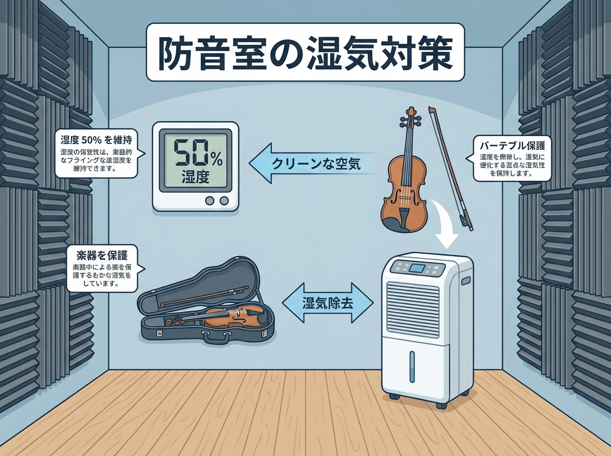

---
title: "防音室の湿度管理テクニック：密閉空間から楽器を守る"
description: "防音室の湿度管理テクニック。密閉空間特有の「湿度の罠」から高価な楽器を守る方法。湿度40-60%を維持するための除湿機・加湿器の選び方と、カビやひび割れを防ぐ24時間コンディション管理の極意を解説します。"
slug: "humidity-control"
date: "2026-03-13"
lastmod: "2026-02-28"
draft: false
lang: "ja"
category: "knowledge"
tags: ["湿度管理","エアコン","除湿機","楽器ケア","カビ対策"]
image: ./cover.png
---
<RegionBanner />

「防音室に入れたギターにカビが生えた…」
「冬場、バイオリンのペグが動かないくらい乾燥している…」

防音室ユーザーを悩ませる、<strong>「湿気」と「乾燥」</strong> の問題。
防音室はその高い気密性ゆえに、一般的な部屋よりも温湿度の環境が過酷になりがちです。

今回は、大切な楽器を守るための湿度管理テクニックを徹底解説します。

## 防音室は「巨大なタッパー」である

防音室は音を漏らさないために、隙間を極限までなくした「高気密・高断熱」な箱です。
これは食品保存容器（タッパー）と同じで、一度中の環境が変わると、空気が入れ替わりにくいことを意味します。

### 夏のリスク（多湿・カビ）

人間が防音室に入って演奏すると、呼気と汗で湿度が急上昇します。
そのままドアを閉め切ると、湿気は逃げ場を失い、吸音材や楽器ケースの中で結露し、最悪の場合はカビが発生します。

### 冬のリスク（過乾燥）

エアコン暖房をつけると、狭い空間なので一気に乾燥します。湿度20%台になることも珍しくなく、木製楽器にとってはひび割れのリスクがある危険な状態です。

<strong>理想の目標値は、湿度40%〜50%です。</strong>

## 基本の湿度対策：換気と調湿剤

### 1. 24時間換気は絶対止めない

多くの防音室には「ロスナイ」などの換気扇がついています。
「音が漏れるから」と演奏時以外止めてしまう人がいますが、<strong>絶対にNG</strong> です。
常に空気を動かし続けることが、カビ予防の第一歩です。

### 2. 演奏後のドア開放

練習が終わったら、すぐにドアを閉めず、数分〜数十分は開けっ放しにして、室内の湿気を逃がしましょう。サーキュレーターで風を送るとより効果的です。

### 3. 調湿剤の活用

楽器ケースの中には、必ず楽器用の湿度調整剤を入れてください。
また、防音室の床の隅に「炭八」などの大きめの調湿木炭を置いておくのも、湿度のバッファ（緩衝材）として有効です。

## 機械の力：除湿機とエアコンの活用

### エアコンのドライ機能

夏場はエアコンの「除湿（ドライ）」が最強です。ただし、部屋が冷えすぎる場合があるので注意が必要です。

### コンプレッサー式除湿機

エアコンがない場合や、梅雨時は除湿機が活躍します。
夏場は室温が上がりにくい「コンプレッサー式」がおすすめ。
音が出るので演奏中はOFFにし、退室後にタイマーで稼働させると良いでしょう。

### 気化式加湿器

冬場の乾燥対策には加湿器が必要ですが、スチーム式や超音波式は結露のリスクがあります。
防音室には、フィルターに風を当てて加湿する「気化式」が、過加湿になりにくく安全です。

## まとめ：1,000円の投資で楽器を守る

とにもかくにも、まずは <strong>「温湿度計」</strong> を防音室の中に置いてください。
Amazonで1,000円程度で買えるデジタル式で十分です。

「今の湿度は何％か？」
これを常に意識するだけで、あなたの楽器の寿命は劇的に延びます。

