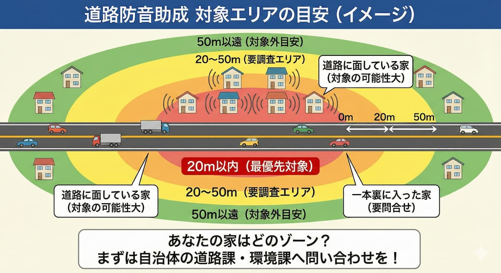

<RegionBanner />

高速道路や幹線道路沿いにお住まいの方へ。<strong>もしかして、防音工事の補助金が出る可能性があるのをご存知ですか？</strong>

道路沿いの騒音は、空港や基地と異なり、補助金制度が複雑です。だからこそ、正しい情報を得ることが大切です。

本記事では、道路沿いの防音工事補助金について、対象条件から申請方法まで、詳しく解説します。

## 高速・幹線道路沿いの防音工事に補助金が出るための3条件

道路騒音対策の助成金は、すべての道路が対象ではありません。以下の3つの条件をすべて満たす必要があります。

### 条件①：「沿道整備道路」として指定された区間であること

国道や高速道路、主要な地方道（東京都の環七・環八など）のうち、<strong>自治体が指定した区間に限られます</strong>。

つまり、「交通量の多い道路沿い」というだけでは対象にならないのです。自治体が公式に「騒音対策が必要」と認定した区間のみが対象となります。

### 条件②：道路の端から「一定の距離以内」に家があること

一般的に、道路端から<strong>20メートル以内、あるいは50メートル以内</strong>といった距離制限があります。

つまり：
- <strong>近すぎると：</strong>補助対象になりやすい
- <strong>遠すぎると：</strong>補助対象外になる可能性が高い

自治体によって距離基準が異なるため、必ず確認が必要です。

### 条件③：夜間の騒音レベルが基準値を超えていること

夜間の騒音（概ね22時〜6時）が<strong>65デシベル〜70デシベルを超えている</strong>ことが測定により証明される必要があります。

つまり、「感覚的に『うるさい』」ではなく、<strong>実測値で基準を超えていることが条件</strong>なのです。

## 道路沿いの防音工事で助成される金額と内容は？

### 工事費用の「4分の3」〜「全額」が目安

助成率は自治体や道路の種類により異なりますが、多くのケースで<strong>費用の大部分がカバーされます</strong>。

例えば：
- <strong>「費用の3/4まで補助」</strong>
- <strong>「上限100万円まで」</strong>
- <strong>「工事費全額」</strong>

といった具合に、自治体ごとにルールが異なります。

### 助成の対象となる主な工事項目

- <strong>防音サッシへの交換、二重窓（内窓）の設置</strong>
- <strong>換気口・吸気口への防音フード取り付け</strong>
- <strong>空調設備（エアコン）の設置（窓を閉め切る必要があるため）</strong>

つまり、空港・基地周辺ほど手厚くはありませんが、主要な工事はカバーされます。

## あなたの街は対象？助成が実施されている主な道路例

### 東京都内の主な対象道路

- <strong>環状7号線（環七）</strong>
- <strong>環状8号線（環八）</strong>
- <strong>目白通り</strong>
- <strong>中山道</strong>

など、<strong>交通量が極めて多い区間</strong>が指定されています。

### 全国の高速道路・国道沿い

- <strong>阪神高速43号線（大阪・兵庫）など、過去に<strong>騒音問題が訴訟等に発展した歴史のある区間は</strong>制度が手厚い傾向にあります。</strong>

つまり、「トラブルの歴史がある地域 = 補助金制度が手厚い」という傾向があるわけです。

## 防音工事の補助金を申請するまでの流れ

### ステップ1：役所の「道路課」または「環境課」へ相談

自宅が指定区間に入っているか、<strong>電話一本で確認できる場合が多いです</strong>。

焦る必要はありませんが、早めに相談することをおすすめします。

### ステップ2：騒音の現地測定

自治体の担当者または専門業者が、<strong>実際にあなたの家で騒音レベルを計測</strong>します。

つまり、ここで「本当に基準を超えているか」が実証されるわけです。

### ステップ3：審査と工事業者の決定

基準値を超えていれば助成が決定。<strong>指定の業者、あるいは相見積もりにより業者を選定</strong>します。

選定に際しては、複数の見積もりを比較できる場合がほとんどです。

## 道路沿いなのに「対象外」と言われた時の対処法

「調べたけど対象外だった」という場合の対策があります。

### 建築時期が「道路指定後」ではないか確認

道路が指定された「後」に建てられた家は、「<strong>騒音を知った上で建てた</strong>」とみなされ、助成を受けられないケースがあります。

もし「指定前に建てた家」であれば、もう一度申請を検討してみる価値があります。

### マンションの場合は管理組合に相談

窓（共用部）の工事になるため、個人での申請が難しい場合があります。

<strong>代わりに、管理組合が集団申請する</strong>という方法もあります。ダメもとで相談してみる価値があります。

## 補助金が出ない場合は「住宅省エネ補助金」を狙う

補助金が出ない場合、別の選択肢があります。

### 先進的窓リノベ事業なら道路の条件なし

道路沿いの特定助成が受けられなくても、<strong>国の省エネ補助金を使えば窓の防音化（内窓）が約半額で可能</strong>です。

つまり：
- <strong>全国どこでも対象</strong>
- <strong>エリア・距離・築年数の制限なし</strong>
- <strong>工事費のおよそ50%が戻ってくる</strong>

という非常に実用的な選択肢なのです。

### 防音性能の高い窓ガラスの選び方

補助金対象となる「断熱性能」を満たしつつ、<strong>遮音等級の高いガラスを選ぶ</strong>ことで、道路騒音を劇的に軽減できます。

実は、「省エネ窓 = 防音窓」という側面があるため、一石二鳥の対策なのです。

## まとめ：高速・幹線道路沿いの騒音は「公的助成」の有無をまず確認

調べるステップを整理すると：

1. <strong>「自治体名 ＋ 沿道整備 ＋ 防音」で検索</strong>
2. <strong>対象エリアなら自治体の予算で静かな生活が手に入る</strong>
3. <strong>対象外でも「窓リノベ補助金」という強力な代替案がある</strong>

道路騒音は、決して「仕方がない」ものではありません。公的制度を賢く利用することで、<strong>静かな環境は取り戻せます</strong>。

今すぐ役所に相談してみてください。あなたの生活環境改善は、すぐそこにあります。

