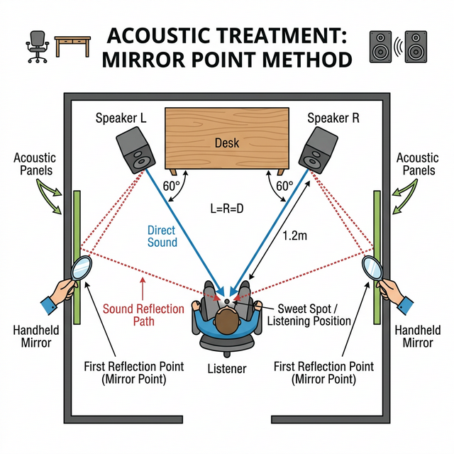

<RegionBanner />

吸音材を適当に貼っていませんか？

「音が悪い」とコメントで指摘されるのが怖くて、とりあえず手当たり次第に貼った経験がある人も多いはずです。

実は、貼る「量」よりも「位置」が重要です。

エンジニアの視点から、音質を劇的に変えるピンポイント解説を行います。

## 貼る位置で音は変わる｜まず押さえたい5つのポイント

部屋の響き（エコー）を抑えるには、<strong>音が壁に当たって跳ね返る場所</strong>を狙うのが鉄則です。専門的には「一次反射面」と呼びますが、難しく考える必要はありません。

先に結論から挙げると、優先すべき設置ポイントは次の5つです。

1. <strong>モニター裏</strong> : マイクが拾う背後からの反響を遮断
2. <strong>スピーカー裏（一次反射面）</strong> : 声がボヤける最大の原因ポイント
3. <strong>部屋のコーナー（四隅）</strong> : 低音がこもる場所
4. <strong>天井（机上・口元前方）</strong> : 上からの反響を防ぐ
5. <strong>天井の角（コーナー）</strong> : 背景に馴染ませつつ低域を追加処理

### なぜ壁一面に貼らなくても効果が出るのか

音は光源と同じように、最短距離で壁に反射します。

すべての壁を埋め尽くすと部屋が「デッド（無響）」になりすぎて不自然な音になります。

特定の反射ポイントだけを狙うことで、低予算かつスタイリッシュに音を整えられます。

### スピーカーから出た音が最初にぶつかる場所を探す

スピーカーの正面だけでなく、その「真後ろ」の壁が重要です。

ここから跳ね返った音がマイクに入ると、声がボヤけて聞こえる原因になります。

### 一次反射面を見つける具体手順

- <strong>手順1</strong> : 配信位置に座り、壁に小型鏡を当ててもらいます。
- <strong>手順2</strong> : 鏡にスピーカーや口元が映る地点をマーキングします。
- <strong>手順3</strong> : その点を中心に30〜60cm四方へ吸音材を設置します。

自分の声や音がどこで跳ね返って耳・マイクに届いているかは、図のように<strong>鏡に映る位置＝反射する位置</strong>という関係で視覚的に把握できます。

この方法なら、最小枚数でも効果点を外しにくくなります。

## 吸音パネルの素材選びと厚みの目安

市販の吸音パネルには主に3種類あります。

- <strong>ウレタンフォーム（スタジオフォーム）</strong> : 凹凸のある楔形・ピラミッド形が一般的です。中高音の吸収に優れ、配信・ボイス録音用途に最適です。10〜12枚セットで3,000〜10,000円程度です
- <strong>グラスウールボード</strong> : より幅広い周波数帯を吸収します。中低音の残響が気になる場合に有効ですが、取り扱いに注意が必要でカバーに入れて使うのが一般的です
- <strong>布製・フェルト系パネル</strong> : インテリアに馴染みやすいデザインが多い一方、吸音性能はフォーム系より低めです

配信・ゲーム実況では<strong>ウレタンフォーム系が最もコスパが高い</strong>選択肢です。

厚みによって吸収できる周波数帯も変わります。

| 厚み | よく吸収できる帯域 | 主な用途 |
|-----|----------------|---------|
| 20〜30mm | 高音〜中高音（2kHz以上） | 声の明瞭化・こもり軽減 |
| 50mm | 中音〜中高音（1kHz以上） | ボイス録音全般 |
| 100mm以上 | 中音〜低音（500Hz以上） | 低音のこもり・ドラム録音 |

配信・歌い手用途では<strong>50mmが最も汎用性が高く</strong>、低音のこもりが特に気になる場合はコーナーに100mm以上のベーストラップを追加してください。

<strong>最初はマイク正面に2〜4枚から始め、録音テストで効果を確認しながら枚数を増やす</strong>のが費用対効果の高い進め方です。

### 賃貸で壁を傷つけずに設置する方法

- <strong>剥がせる両面テープ（コマンドタブ等）</strong> : 軽量のウレタンパネルなら十分な粘着力があり、剥がす際も壁紙を傷めにくいです
- <strong>ピクチャーレール・突っ張り棒</strong> : パネルをS字フックで吊るせば壁に穴を開けずに設置できます
- <strong>スタンドに立てかける</strong> : パーテーションタイプなら移動も簡単です

## 配信映えと実用性を両立！モニター裏に吸音材を貼るメリット

多くの配信者が実践しているのが「モニター裏」への設置です。

### マイクが拾う「不快な反響」を物理的に遮断する

マイクは正面からの音には強いですが、背後の壁から跳ね返ってきた音も拾います。

モニター裏に吸音材を貼ることで、モニターと壁の間で起きる音の増幅を抑制できます。

### おすすめは「ピラミッド型」や「凹凸型」のウレタンスポンジ

平らな素材よりも、表面に凹凸がある吸音材の方が、音を乱反射させて減衰させる効果が高いです。

見た目もゲーミングデバイスとしての「配信映え」が期待できます。

## 天井とコーナー処理で仕上げる

側面だけ整えても、天井反射とコーナー低域が残ると「こもり感」が消えません。

最後はこの2点を追加します。

## 実践！スピーカー裏と部屋のコーナー（隅）へのピンポイント設置法

さらに音をクリアにしたいなら、以下の場所を追加しましょう。

### 低音が溜まりやすいルームコーナーの対策

部屋の「四隅」は音が溜まり、ボアボアした低音の反響を生みます。

ここに厚手の吸音材を配置するだけで、声の輪郭がハッキリします。

低音のこもりが特に強い場合は、通常の吸音材より専用の「ベーストラップ」が効果的です。

配置方法やDIYでの作り方は[ベーストラップ設置ガイド](/ja/diy/bass-trap-installation-guide/)で詳しく解説しています。

### 鏡を使って「一次反射面」を特定する裏技

壁に鏡を当て、リスニングポジションからスピーカーが映る場所を探してください。

そこが吸音材を貼るべき「黄金のポイント」です。

### 天井処理の目安

- <strong>設置位置</strong> : 机上の真上と、口元前方の天井を優先します。
- <strong>固定方法</strong> : 賃貸では軽量材とピン固定を併用します。
- <strong>注意点</strong> : 落下防止のため耐荷重を必ず確認します。

### コーナー処理の目安

- <strong>縦コーナー</strong> : 低域が溜まりやすいため、厚手材を優先します。
- <strong>天井角</strong> : 背景フレーム内で目立たない色を選びます。
- <strong>過剰吸音の回避</strong> : 全面施工せず、録音確認しながら追加します。

[吸音材の選び方完全ガイド](/ja/knowledge/absorption-vs-soundproofing-materials/) も参考にしてください。
