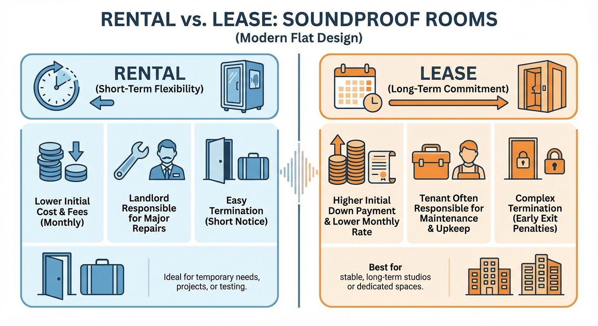

<RegionBanner />

「防音室が欲しいけど、100万円を一括で払うのは厳しい」
「転勤が多いから、引っ越しの時に邪魔になるのが怖い」

そんな時に選択肢に上がるのが、 <strong>防音室のレンタルやリース</strong> です。
しかし、いざ調べ始めると「個人でも借りられるの？」「結局買ったほうが安いのでは？」「経費で落ちるの？」と疑問が尽きません。

この記事では、スタジオエンジニアの視点ではなく、少し <strong>「経営者・実務家」</strong> の視点に立ち、防音室を「借りる」ための賢い方法を解説します。音レントの料金と契約条件をもとにした損益分岐の計算は、[防音室レンタルの初期費用と月額相場｜2026年最新・購入との損益分岐点](/ja/money/soundproof-room-rental-cost/)をご覧ください。

## そもそも「レンタル」と「リース」は何が違う？

言葉は似ていますが、契約の性質は全く違います。

### レンタル（個人・法人向け）

- <strong>期間 :</strong> 数か月から数年（比較的短い）。防音室は最短期間が決まっていることが多い。
- <strong>所有権 :</strong> レンタル会社にある。
- <strong>中途解約 :</strong> <strong>可能だが、最短期間内は残りのレンタル料の支払いが必要になる場合がある。</strong>
- <strong>商品 :</strong> レンタル会社の在庫から選ぶ（新品とUSED（中古）を選べる場合もある）。
- <strong>メリット :</strong> 購入より初期費用を抑えられる。最短期間を過ぎれば返却できる。

### リース（主に法人・個人事業主向け）

- <strong>期間 :</strong> 3年〜10年（長期）。
- <strong>所有権 :</strong> 基本的にリース会社。契約満了後に買い取りも可能。
- <strong>中途解約 :</strong> <strong>原則不可。</strong>
- <strong>商品 :</strong> 新品を自分の代わりにリース会社が買って貸してくれる。
- <strong>メリット :</strong> 初期費用0円で新品が導入できる。全額経費計上できる。

## 個人におすすめ：ヤマハ「音レント」などのレンタル

個人利用で現実的なのは、やはりレンタルです。

### ヤマハ「音レント」

防音室レンタルの代名詞です。2026年10月時点の[音レント公式サイト](https://rental.jp.yamaha.com/shop/c/c3042/)では、セフィーネNS（Dr-35）を2つのプランで貸し出しています。

#### 通常プラン

- <strong>月額 :</strong> 0.8〜2.0畳（エアコンなし）で、USED品が税込14,080円〜24,860円、新品が税込17,600円〜31,020円。エアコン付き（USEDのみ）は1.2畳18,700円、1.5畳20,790円、2.0畳27,940円。
- <strong>契約期間 :</strong> 最短15ヶ月〜最長48ヶ月。
- <strong>購入 :</strong> レンタル中はいつでも購入できます。支払済みのレンタル料は、購入価格に充当されます。
- <strong>特徴 :</strong> 新品とUSED（中古）から選べます。

公式の購入例では、いつ購入しても、レンタル料の合計が約49ヶ月分になります。

たとえば15ヶ月経過時の購入は、支払済み15ヶ月分に、残り34ヶ月分程度を足した金額です。

購入価格は取扱店が提示する金額です。購入を検討している場合は、取扱店に条件を問い合わせてください。

#### MCプラン（2025年11月20日受付開始）

- <strong>月額 :</strong> 新品が税込0.8畳12,760円、1.2畳14,080円、1.5畳15,950円、2.0畳22,440円（すべてエアコンなし）。USEDは0.8畳11,550円が掲載されています（在庫分のみ）。
- <strong>契約期間 :</strong> 最短15ヶ月〜上限なし。
- <strong>購入 :</strong> できません。
- <strong>特徴 :</strong> 通常プランより月額が安く、必要な期間だけ借り続けられます。

#### 共通の条件

- <strong>中途解約 :</strong> 最短期間より前に返却する場合は、登録料2,200円と最短期間までの残りのレンタル料の合計に加え、納入・返却に要する費用がかかります。
- <strong>登録料 :</strong> 初回2,200円（税込）です。ヤマハミュージックメンバーズのクレジット会員・プレミアム会員は免除されます。
- <strong>返却 :</strong> 希望日の2週間前までに連絡します。引き取りの時点まで、月額のレンタル料が発生します。

料金は予告なく変わることがあります。公式サイトも、取扱品の変更に伴う料金の変更があると案内しています。

<strong>「飽きたらどうしよう」「実際に部屋に置いたら圧迫感がすごかったら…」</strong> という不安がある人にとって、購入よりも初期負担が小さい点は利点です。

ただし最短15ヶ月は契約が続くため、数か月だけ試したい人には向きません。

## 法人・個人事業主におすすめ：リース契約

もしあなたが「防音室を経費で落としたい」と考えている個人事業主（ストリーマーや音楽講師）や法人なら、リースという選択肢がお得な場合があります。

### リースの最大のメリット：キャッシュフローと経費

1.  <strong>初期費用0円</strong> : 100万円の防音室を買うと、手元の現金が100万円減りますが、リースなら月々数万円の支払いで済みます。運転資金を温存できます。
2.  <strong>経費処理</strong> : 購入した場合、高額な防音室は「固定資産」となり、数年かけて減価償却しなければなりません。しかしリース料なら、毎月の支払いを <strong>「全額経費（リース料）」</strong> として計上できる場合が多いです（※契約内容や税制によるので税理士に要確認）。

## 「購入」vs「レンタル」損益分岐点はどこ？

ここで気になるのが、「借り続けるのと買うの、どっちが得か？」という問題です。

### 目安は「3年〜4年」

一般的に、レンタルの月額料金を払い続けると、約3年〜4年で <strong>「購入価格」を超えます。</strong>
（例：月3万円×36ヶ月＝108万円）。これは法人向けリース料を含めた相場感の目安です。音レントの新品レンタルを購入価格と比べた損益分岐点（0.8畳で、通常プランは約41ヶ月、MCプランは約56ヶ月）は[防音室レンタルの初期費用と月額相場｜2026年最新・購入との損益分岐点](/ja/money/soundproof-room-rental-cost/)で計算しています。

- <strong>最短期間（15ヶ月）〜3年ほど しか使わない（転勤族、受験期だけ） → <strong>レンタル がお得。</strong></strong>
- <strong>3年以上 使う（腰を据えて活動する） → <strong>購入（または</strong>分割払いローン） がお得。</strong>

### 隠れたコスト：送料と組立費

レンタルの場合も、返却時の解体・運送費がかかります。

ヤマハ「音レント」のセフィーネNSでは、納入時の運送・設置の基本料金はレンタル料に含まれます。

一方、返却時の費用は0.8畳で53,900円、2.0畳で77,000円です（税込、エアコン取外しは別途12,100円、階段上げ等の特殊作業料も別）。

最短期間のレンタル料に加えて、この「返却時のコスト」まで含めて計算しないと、短期利用では割高になることがあります。

## まとめ：あなたの「活動期間」で決める

1.  <strong>15ヶ月〜3年ほどの期間限定・転勤族</strong> → ヤマハ「音レント」などの <strong>レンタル</strong>。数か月だけ試したい場合は、時間貸しの防音スペースを使います。
2.  <strong>長期活動・持ち家</strong> → クレジットやローンでの <strong>購入</strong>。
3.  <strong>事業用・節税</strong> → 手元資金を残せる <strong>リース</strong>。

防音室は「空間を買う」買い物ですが、その支払い方法は一つではありません。
自分の活動スタイル（と懐事情）に合ったプランを選びましょう。
