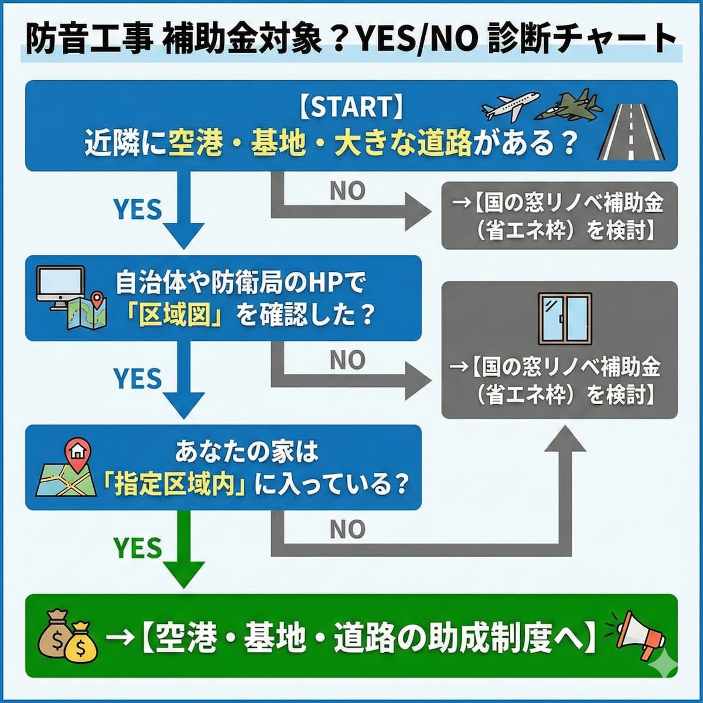
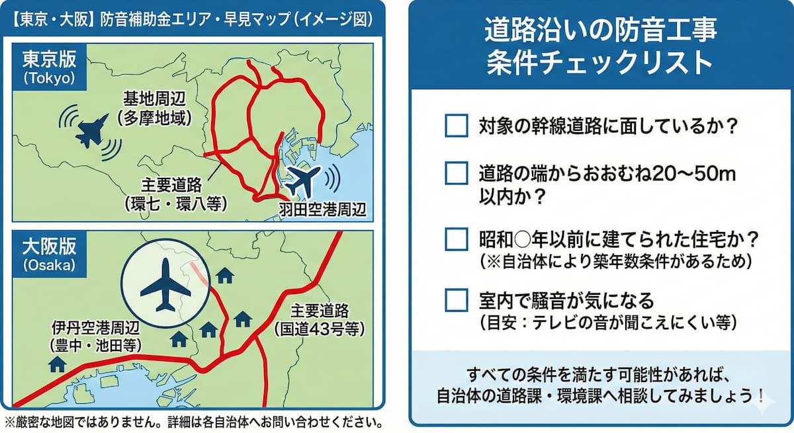

<RegionBanner />

防音工事の補助金が出ることを知っても、「うちの家は本当に対象なのか」という疑問が出てきますね。

結論から言うと、対象かどうかは「住所」と「騒音の大きさ」で決まり、最も確実なのは管轄窓口の区域図で確認する方法です。

この記事では、自宅が補助金の対象かどうかを最短で調べる方法と、東京・大阪の具体例、対象外だった場合の代替案を解説します。

最後に、これから日本でも増えそうな「データセンターの騒音」について、先行する米国の状況もまとめました。

## 防音工事の補助金対象エリアか調べる最短の手順

「対象かどうか、今すぐ知りたい」という方のために、3つのステップをお示しします。

### ステップ1：「住所 ＋ 防音工事 ＋ 助成」でネット検索する

最も確実なのは、自治体や管轄団体の「区域図（PDF等）」を見つけることです。

検索ワード例：
- <strong>「〇〇市 自衛隊 防音助成」</strong>
- <strong>「〇〇区 沿道整備 防音」</strong>
- <strong>「〇〇空港 騒音区域図」</strong>

Googleで検索すると、多くの場合、公式の区域図がヒットします。

### ステップ2：主要な管轄団体の「区域図システム」を活用する

空港周辺なら空港ごとの窓口、基地周辺なら「地方防衛局」が区域図を公開している場合が多いです。

対話的な地図を提供していることもあり、住所を入力すると判定結果が表示されます。

### ステップ3：不動産購入時の「重要事項説明書」を確認する

持ち家の場合、購入時の書類に「防音工事助成区域内であるか」が記載されていることが多いです。

書類の「環境・騒音」の項目をチェックしてみましょう。

## 【エリア別】防音工事の補助金が出る条件と判定基準

補助金が出るかどうかは、「どのような騒音源の近くにいるか」で判定されます。

### 空港・自衛隊周辺：「騒音レベル（Lden）」の線引き

空港や基地からの距離ではなく、「<strong>騒音指数（Lden）</strong>」で決まります。

第一種区域（Lden 62デシベル以上）に入っているかが分かれ目です。

防衛施設周辺では、平成25年4月1日以降の区域指定からLdenが使われています（[国土交通省の騒防法Q&A](https://www.mlit.go.jp/common/000234736.pdf)）。

つまり：
- <strong>遠くても、騒音指数が高い地域は</strong>対象になる
- <strong>近くても、防音壁などで音が減っている地域は</strong>対象外になる可能性がある

という、距離ではなく「音の大きさ」で判定されるわけです。

### 幹線道路沿い：「道路からの距離」と「騒音測定結果」

道路沿いの補助金判定は、より複雑です。

- <strong>道路端からの距離：</strong>20m〜50m以内といった距離制限がある
- <strong>騒音測定：</strong>自治体が測定を行い、基準値（夜間65デシベル等）を超えている地域が指定される
- <strong>築年数：</strong>特定の年より前からある建物に限られる場合がある

つまり、距離・音量・築年数のすべてを満たす必要があります。

## 東京・大阪の具体例：羽田・伊丹・環七環八

条件のイメージをつかむために、東京・大阪の代表的な4つのエリアを整理します。

| エリア | 騒音源 | 主な条件 | 相談先 |
|---|---|---|---|
| 羽田空港周辺（大田区） | 航空機 | 昭和52年4月2日時点で工事対象区域内にあった住宅 | 大田区環境政策課 |
| 厚木・横田基地周辺（町田市・福生市など） | 航空機（基地） | 防衛省の区域指定内の住宅 | 地方防衛局・各市の窓口 |
| 環七・環八沿い（世田谷区など） | 自動車 | 環七は道路端から約20m、環八は約20〜30m以内。夜間65デシベル以上または昼間70デシベル以上の居室 | 東京都建設局の沿道整備担当・各区の環境担当 |
| 伊丹空港周辺（豊中市・伊丹市・池田市・宝塚市など） | 航空機 | 区域区分による | 関西エアポートの助成窓口 |

羽田の対象条件は、[大田区の案内](https://www.city.ota.tokyo.jp/seikatsu/sumaimachinami/haneda_airport/kankyo/bouonkouji.html)に基づきます。

環七・環八の距離と騒音基準は、[世田谷区の案内](https://www.city.setagaya.lg.jp/01101/4825.html)に基づく記載です。

### 環七・環八は「建物の古さ」にも条件がある

世田谷区の案内では、環七は昭和61〜62年以前、環八は平成15年4月1日以前からある既存建物が対象とされています。

新築や、すでに助成を受けた建物、防音構造になっている建物は対象外です。

距離と騒音が基準を満たしていても、建築時期で外れるケースがあります。

### 助成の金額は「区域区分」で変わる

どのエリアでも、「一律いくら」という答えは存在しません。

空港周辺は、区域区分によって助成率・上限額・対象工事の範囲が変わります。

道路沿いは、東京都が審査した工事費の4分の3を助成する仕組みとされています（[東京都建設局](https://www.kensetsu.metro.tokyo.lg.jp/road/endo/bouon)）。

区によって上乗せがある場合もあるため、正確な金額は窓口で確認してください。

### 空港周辺は「エアコンの更新」も対象になる

窓だけでなく、防音工事で設置したエアコンなどの空気調和機器が、助成の対象になることがあります。

大田区では、機器が10年以上の使用で故障したり機能が失われたりした場合に、取り替え工事の補助があります。

伊丹空港周辺でも、前回工事から10年以上経過して機能が失われた機器の更新が助成の対象です。

## どこに聞けばいい？「防音工事の補助金」相談窓口まとめ

対象エリアかどうかを最終確認する際は、直接管轄団体に相談するのが確実です。

### 空港周辺（民間空港）の窓口

成田、羽田、伊丹、中部、福岡など主要空港ごとに、窓口が異なります。

例えば：
- <strong>羽田空港：</strong>大田区環境政策課（国土交通省 東京空港事務所の環境・地域振興課でも相談できます）
- <strong>伊丹空港：</strong>関西エアポートの防音工事等助成お問い合わせ窓口

各空港の公式サイトや自治体のページで「防音工事」「助成」を検索すれば、相談窓口が見つかります。

### 自衛隊基地・在日米軍施設周辺の窓口

全国の「地方防衛局」が窓口です。

- <strong>北海道：</strong>北海道防衛局
- <strong>東北：</strong>東北防衛局
- <strong>関東：</strong>北関東防衛局・南関東防衛局
- <strong>その他の地域：</strong>対応する地方防衛局

住宅防音工事の助成を受けるには、まず国（防衛局）へ「希望届」を提出します。

各地方防衛局は、Web上で「住宅防音工事」に関する情報を提供しています。

### 幹線道路（国道・高速道路）沿いの窓口

市役所や区役所の「環境課」や「道路課」が基本です。

東京都なら「沿道整備制度」など、自治体独自の名称があることもあります。例えば、環七・環八沿いなら東京都建設局の沿道整備担当や、世田谷区の環境保全課が窓口です。

このように、自治体ごとに部署名が異なります。

## 重要：場所が対象でも補助金が出ないケース

注意してください。<strong>対象エリアに住んでいても、補助金が出ない場合があります</strong>。

### 住宅の「建築時期」による制限

騒音区域に指定された「後」に建てた住宅には補助が出ないことが多いです。

理由は、「自ら騒音エリアに飛び込んだとみなされるため」です。つまり、区域指定の時点で既に家が建っていることが条件なのです。

### 過去に一度でも補助金を受けている場合

防音工事の助成は、原則として「一つの住宅につき一度きり」です。

ただし、エアコン等の機器更新は例外として、10年以上の使用など条件を満たせば、改めて助成を受けられることもあります。

## エリア対象外だった場合の「賢い防音対策」

「調べたけど、うちはギリギリ対象外だった…」という結果が出たかもしれません。

東京・大阪では、区域の線引きからわずかに外れただけで対象外になるケースも珍しくありません。

<strong>でも、がっかりしないでください。</strong> 代替案があります。

### 住宅省エネ補助金（窓リノベ）を「防音工事の補助金」として活用

騒音区域外でも、国の「先進的窓リノベ2026事業」を使えば、内窓（二重窓）の設置費用の約<strong>半額</strong>が補助されます。

この補助金は、居住エリアの制限がありません。

2025年度は上限200万円でしたが、2026年度は<strong>1戸あたり上限100万円</strong>に変わっています（[環境省](https://www.env.go.jp/earth/earth/ondanka/building_insulation/window_00004.html)）。

押さえておきたい点は次のとおりです。

- <strong>申請の主体</strong> : 消費者本人ではなく、登録された「窓リノベ事業者」が申請する
- <strong>期限</strong> : 交付申請は遅くとも2026年12月31日まで。予算上限に達した時点で終了する
- <strong>対象期間</strong> : 2025年11月28日以降に着工した工事が対象

予算上限で早期に終了する可能性があるため、検討中なら登録事業者への早めの相談をおすすめします（最新の受付状況は[公式サイト](https://window-renovation2026.env.go.jp/)で確認してください）。

なお、この補助金は断熱性能の向上が目的です。

防音効果は期待できますが、騒音の種類によって効き方が変わります。

窓の防音効果は[内窓の防音効果を実測した記事](/ja/diy/diy-internal-window-road-noise-reduction/)、賃貸と戸建てでの選び方は[窓の防音対策ガイド](/ja/soundproof-room/shanon-vs-bouon-window/)で解説しています。

### DIYや部分防音でコストを抑える

お金をかけない方法もあります。

- <strong>窓だけをプロに依頼し、壁や換気口は</strong>防音パネル等で自分で対策する
- <strong>防音カーテンを取り付ける</strong>
- <strong>隙間テープで窓の隙間をふさぐ</strong>

これらは完全な防音にはなりませんが、ある程度の効果は期待できます。

## これから増える騒音源：データセンターの騒音は、米国でも「補助金のない問題」

ここまでは、空港・基地・道路という「すでに制度がある騒音源」の話でした。

近い将来、AI需要でデータセンターが増えれば、日本の住宅地の近くでも新しい騒音問題が起きる可能性があります。

米国はその先行事例です。

結論から言うと、<strong>データセンターの騒音には、空港のような防音工事の補助制度が見当たらず、住民側の確実な解決策は「離れること」しかない</strong>のが現状です。

対策を左右するのは、自治体の規制と、事業者がどこまで設備側で対応するかです。

### 何が起きているのか

データセンターは、冷却ファンや非常用ディーゼル発電機が24時間稼働します。

米国の環境・エネルギー研究機関EESIの記事（2026年3月23日）によると、施設内部の騒音は最大96デシベル、ディーゼル発電機は最大105デシベルに達します（[EESI](https://www.eesi.org/articles/view/communities-are-raising-noise-pollution-concernsabout-data-centers)）。

バージニア州北部には約300のデータセンターがあり、その3分の1が住宅地から約60m（200フィート）以内にあると同記事は伝えています。

住民からは、頭痛・不眠・めまい・血圧上昇などの訴えが出ています。

2025年11月のBusiness Insider Japanの記事では、バージニア州マナサスの住民が、半径約1.6km以内に14施設がある環境で「目の奥に響くような絶え間ないうなり音」に悩まされ、条例改正を求めていると報じられています（[Business Insider Japan](https://www.businessinsider.jp/article/2510-living-next-to-data-centers-terrible-wont-leave-dream-home/)）。

### 騒音の基準は州・郡・市ごとにバラバラ

米国には、国が定める統一の騒音基準がありません。

連邦のEPA（環境保護庁）の騒音対策局は1981年に予算が打ち切られ、規制の権限は州や地方自治体に移りました（[EESI](https://www.eesi.org/articles/view/communities-are-raising-noise-pollution-concernsabout-data-centers)、[EPA Watch](https://epawatch.org/2026-05-29-data-centers-infrasound-pollution-linked-to-nausea-insomnia.html)）。

そのため、同じ「データセンター」でも、どこに建つかで適用される基準が変わります。

| 自治体 | 対応 |
|---|---|
| バージニア州ラウドン郡 | 住宅地の敷地境界で55dBAを上限とし、建設前と建設後の騒音調査を義務づけている。低周波音や連続した音の不快さは測定値に反映されにくく、条例の見直しは2027年春〜夏の見込み（[ラウドン郡](https://www.loudoun.gov/6405/Noise-Air-Quality-Concerns)） |
| バージニア州プリンスウィリアム郡 | 冷却設備の騒音を24時間規制する条例を可決。ただし規制値は当初案より緩く、住民側からは効果を疑問視する声が出ている（[Prince William Times](https://www.princewilliamtimes.com/news/supervisors-ok-compromise-noise-ordinance-aimed-at-data-centers/article_1288e464-5559-4c12-ab8f-2a28ca28d819.html)） |
| アリゾナ州チャンドラー市 | 2022年に立地の規制を強化。2025年には、騒音への懸念を理由に新規計画を市議会が全会一致で否決した（EESI） |

共通する課題は、規制が「デシベル」中心で、低周波のうなり音を捉えにくい点です。

### 空港には補助があるが、データセンターにはない

米国にも、空港の騒音には補助制度があります。

連邦航空局（FAA）の空港改良事業（AIP）では、騒音の大きい区域にある住宅の防音工事が、一定の条件で補助されています。

対象は、FAAが承認した騒音区域（65デシベルの等高線）の内側にあり、特定の年より前に建てられた住宅などです（[FAAの通達](https://www.faa.gov/documentLibrary/media/Advisory_Circular/150-5000-9B-Sound-Insulation-2022.pdf)）。

日本の「区域指定」「建築時期の条件」と、考え方はほぼ同じです。

一方、データセンターの騒音については、住民の防音工事費を国や州が補助する制度を、今回の調査では確認できませんでした。

事業者が近隣住宅の防音工事費を負担する事例も、確認できていません。

### なぜ防音工事では解決しにくいのか

原因は、データセンターの騒音が「低周波のうなり」と「振動」を含むことです。

壁や窓の遮音は、高い音には効きやすい一方、低い音は透過しやすい性質があります。

空気を伝わる音だけでなく、建物の構造を伝わる振動は、内窓や防音カーテンでは止めにくい性質があります。

低周波・振動を止めるには、音の発生源側での対策が必要になります（振動対策の基礎は[低周波・振動対策の基礎](/ja/knowledge/vibration-isolation-technology-trend/)で解説しています）。

だからこそ、住民側が自宅に防音工事をしても、根本的な解決にならない場合があります。

### 解決の鍵は、企業側の対策

事業者側の対策は、設備の騒音そのものを下げる方向です。

- <strong>防音壁・防音シュラウド</strong> : 敷地境界や屋上、機器まわりを囲って音を遮る。Amazonは一部の施設に防音シュラウドを設置したとEESIは伝えている
- <strong>低騒音機器</strong> : 低騒音のチラー、ファンのサイレンサー、圧縮機用の防音ブランケットなど
- <strong>液冷（液浸冷却）</strong> : 大型ファンを減らせる一方、ポンプなどが出す別種の振動音への対策が必要になる
- <strong>立地の選び方</strong> : 住宅地から離して建てる。EESIも、データセンターを住宅地から遠ざける立地規制を政策案として挙げている

ただし、これらを実施するかどうかは、事業者の判断と、地域の規制の強さに左右されます。

Amazonの広報は、報道の中で「地域の法令は順守している」とコメントしています。

つまり、規制の範囲内であれば、住民側の悩みが残っても、事業者に追加の対応を求める根拠が弱いのが現状です。

### 現時点で、住民ができること

米国の事例を見る限り、住民が個人でできる確実な解決策は限られています。

その中で、現時点でもっとも確実に避けられる方法は、<strong>データセンターのない（建たない）エリアに住むこと</strong>です。

引っ越しや住まい選びの前に、次の点を確認すると、後悔を減らせます。

- <strong>周辺の建設計画</strong> : 自治体の建築計画の公開情報や、説明会の案内で、大規模データセンターの計画がないか確認する
- <strong>既存施設との距離</strong> : 冷却設備や非常用発電機の位置が、住戸に近すぎないか現地で確認する
- <strong>夜間の音</strong> : 内見や下見を、夜間にも行い、低いうなり音がないか確かめる

すでに住んでいる場合は、騒音の日時や体感の記録を残し、自治体に相談する準備をしておくと役立ちます。

騒音トラブルの法的な整理は[2025-2026年の騒音規制アップデート](/ja/knowledge/noise-regulation-update-2025/)で確認できます。

### 日本ではどうなっている？

日本でも、すでに動きは始まっています。

東京都は2026年3月31日に、データセンター建設に関するガイドラインを策定しました。

事業者と地域住民が円滑に対話するための指針で、建設を止める法的拘束力はありません（[ITmedia](https://www.itmedia.co.jp/aiplus/articles/2603/31/news149.html)）。

江東区も、区民向けに「大規模データセンター建設計画における話し合いガイドライン」を2026年3月に公表しています。

空港周辺のような「防音工事費の助成制度」は、データセンターについては現時点で見当たりません。

日本でも、規制や助成が整うまでは、建設の初期段階で情報を集めて、住まい選びに反映することが現実的な備えになります。

## まとめ：防音工事の補助金を確認して、静かな住環境を取り戻そう

調べるステップを整理すると：

1. <strong>ネットで「区域図」を探す</strong>ことから。
2. <strong>対象なら、対応する管轄団体に申請</strong>。
3. <strong>対象外なら「窓リノベ補助金」を検討</strong>。

対象エリアなら、区域区分によっては工事費の大部分が助成されることもあります。

対象外でも、国の別の補助金で窓まわりの対策ができます。

制度や金額は年度ごとに変わるため、申請前に必ず窓口と公式サイトで最新情報を確認してください。

騒音ストレスを放置せず、公的制度を賢く利用しましょう。

## 補助金の全体整理はこちら

- [防音室の補助金2026年最新版｜二重窓リノベで最大200万円受給する裏技](/ja/money/soundproof-subsidy-news-2025/)
- [自宅に防音室がなくても「一人になれる空間」を作る4つの方法｜40〜60代の予算別ガイド](/ja/money/quiet-space-budget-decision-guide/)
