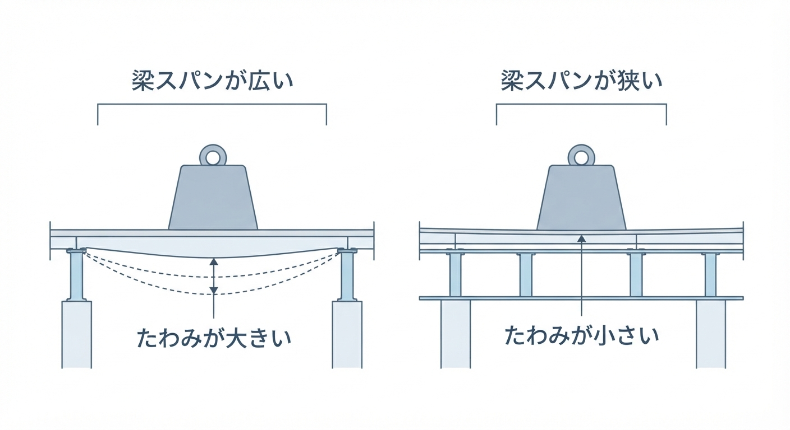

<RegionBanner />

「1.5畳の防音室を買いたいけれど、本体だけで500kg、ピアノを入れたら700kg近い……。築20年のマンションの床、抜けてしまわないだろうか？」

本格的な防音環境を求める奏者にとって、 <strong>「重量の壁」</strong> は最大の懸念事項です。
管理会社に聞いても「180kg/㎡を守ってください」という形式的な回答しか得られず、立ち止まってしまうケースも少なくありません。

結論から申し上げます。

<strong>RC（鉄筋コンクリート）造のマンションであれば、築20年（2000年代築）であっても、正しい「荷重分散」を行えば補強工事なしで500kg超の設置は十分に可能です。</strong>

本記事では、建築基準法の「180kg制限」の裏側にある真実と、あなたの部屋を守るための具体的な計算術をプロの視点で解説します。

## 建築基準法「180kg/㎡」の正体と構造的余力

マンションのパンフレットや契約書に必ず登場する「180kg/㎡（1,800N/㎡）」という数値。

これは住宅の居室に定められた <strong>「最低積載荷重」</strong> です。

### 180kgは「部屋全体が埋まった時」の想定

この数値は、「部屋の隅から隅まで、1平方メートルあたり180kgの家具や人がギッシリ詰まった状態」を想定して設計しなさい、というルールです。

そのため、構造体（スラブ）自体は、局所的な荷重に対して <strong>数倍〜十数倍の安全率</strong> を持って設計されています。

### 6〜8畳の部屋で計算すると：現実には到達しない数値

具体的な数字で見てみましょう。

6畳（約9.9㎡）の部屋全体に180kg/㎡をかけると、設計上の想定荷重は<strong>合計約1,782kg</strong>になります。

8畳（約13.2㎡）なら<strong>約2,376kg</strong>です。

一人暮らしの部屋で、家具・家電・人を含めてもこの重量に達することは現実的にはまず起こりません。

つまり「180kg/㎡」は、<strong>部屋全体を平均すれば余裕のある基準</strong>だと分かります。

一方で防音室は逆の性質を持ちます。

550kgの重量が部屋全体（9.9〜13.2㎡）に薄く広がるのではなく、<strong>設置面積2.5㎡程度に集中</strong>するからです。

同じ550kgでも「部屋全体の平均」で見れば余裕がありますが、「設置した一角」だけを見ると局所的な負荷は跳ね上がります。

だからこそ防音室では、総重量そのものより <strong>部屋のどこに置くか（設置位置）</strong> が重要な判断材料になります（具体的な置き場所の選び方は後述の「失敗しない設置場所」で解説します）。

築20年の経年劣化により安全率が新築時より目減りしている可能性はありますが、建築基準法はもともと数倍〜十数倍という余裕を確保しているため、局所荷重さえ管理できれば大きな問題にはなりません。

### 築20年（2000年代築）は「新耐震基準」の成熟期

2000年代に建てられたRCマンションは、構造計算が厳格化された後の物件です。

バブル期の過剰設計ほどではありませんが、現代の基準においても非常に堅牢。

ピアノや防音室のような <strong>「長期荷重」</strong> に対しても、構造体が破壊される（床が抜ける）ことはまず考えられません。

## 500kg超を安全に設置するための「荷重分散」計算

問題は「床が抜けるか」ではなく、 <strong>「フローリングや下地が凹んだり、扉が閉まらなくなったりしないか」</strong> です。

これを防ぐのが <strong>「㎡（平方メートル）単位」</strong> での思考です。

### 計算例：ヤマハ アビテックス 1.5畳（セフィーネNS）

- <strong>総重量 ：</strong>本体（約510kg）＋ エアコン・照明（約20kg）＝ <strong>530kg</strong>
- <strong>床面積 ：</strong>1,374mm × 1,814mm ＝ <strong>約2.5㎡</strong>

このままの数値で計算すると「530kg ÷ 2.5㎡ ＝ <strong>約212kg/㎡</strong> 」。

180kgを少しオーバーしていますが、実はこれだけでは不十分です。ユニット型防音室は「脚」で支えているため、実際には <strong>4〜6点の「点荷重」</strong> になっているからです。

### 解決策：ベースパネル（荷重分散板）による面化

厚さ15mm〜20mm程度の合板や、専用のベースパネル（荷重分散板）を敷き込むことで、530kgの圧力を「2.5㎡の面」に均等に広げます。

これにより、床材へのダメージを最小限に抑え、㎡あたりの負荷を建築基準法の許容範囲内に近づけることができます。

## 失敗しない設置場所：構造の「強い場所」を見抜く

床補強をしない場合、設置する「位置」が安定性を左右します。

### ① 「梁（はり）」の上、または壁際を狙う

部屋の中央は、床スラブが最もたわみやすい（しなりやすい）場所です。

逆に、 <strong>柱の近くや、壁に沿ったエリア（梁が通っている場所）</strong> は、構造的な剛性が非常に高くなっています。ここに防音室の重心が来るように配置するのが鉄則です。

### ② 築20年なら「小梁」の有無を確認

2000年代前後のマンションには、天井や床に「小梁」が隠れていることが多いです。

マンションの設計図面（伏図）を確認できるなら、梁の上を狙うことで、500kg程度の荷重は物ともしない安定性を得られます。

## 重量対策まとめ：製品別シミュレーション

| 防音室タイプ                | 面積        | 重量目安     | 対策の必要性                             |
| :-------------------------- | :---------- | :----------- | :--------------------------------------- |
| <strong>0.8畳（ボーカル用）</strong> | 約1.3㎡     | 200kg 〜     | 簡易的なカーペットや厚手マットで対応可   |
| <strong>1.5畳（管楽器・ピアノ）</strong> | <strong>約2.5㎡</strong> | <strong>500kg 〜</strong> | <strong>荷重分散板（ベースパネル）必須</strong> |
| <strong>2.0畳（グランドピアノ）</strong> | 約3.3㎡     | 800kg 〜     | <strong>分散板に加え、梁の位置特定を強く推奨</strong> |

## 住宅構造別に見る荷重分散の考え方：RC造・木造・軽量鉄骨の違い

ここまではRC造マンションを前提に解説してきました。

木造戸建てや軽量鉄骨造のアパートでは床を支える構造がまったく異なるため、同じ「荷重分散」でも注意点が変わります。

### RC造マンション：面で支えれば追従力が高い

RC造は床スラブ自体が厚いコンクリートの一枚板のため、ベースパネルで荷重を面に広げれば局所的な沈み込みはほぼ起こりません。

前章までの計算方法がそのまま当てはまります。

### 軽量鉄骨造アパート：床の「たわみ量」を事前確認

軽量鉄骨造は柱・梁が鋼材のため強度自体は高いですが、床は木質パネルや合板下地を鉄骨梁に渡して支える構造が一般的です。

上の図のように、同じ重さの荷重でも梁と梁の間隔（スパン）が広いほど、荷重をかけた点のたわみは大きくなります。

逆にスパンが狭く支持点が多い床は、同じ荷重でもたわみが目立ちにくくなります。

- <strong>梁間隔の確認</strong> : 鉄骨梁の間隔（スパン）が広い物件ほど床がたわみやすく、分散板だけでは不十分な場合がある
- <strong>管理会社への確認事項</strong> : 「床の積載荷重」に加えて梁のスパンを図面で確認できるか相談する
- <strong>設置位置</strong> : RC造と同様、梁の直上・壁際を優先する

### 木造戸建て（築古）：床は「根太」の間隔で強度が決まる

木造戸建て、特に築20年以上の物件は床の強度が「根太（ねだ）」と呼ばれる細い木材の間隔・太さに左右されます。

RC造のような一枚板の面ではなく、<strong>根太という「線」で荷重を支える構造</strong>だからです。

そのため防音室の脚や分散板が根太の位置と合っていないと、局所的に床が沈み込むリスクがRC造より高くなります。

- <strong>床下点検口からの確認</strong> : 可能であれば床下を覗き、根太の間隔（一般的に303mmまたは455mm間隔）と太さを確認する
- <strong>1階への設置を優先</strong> : 2階以上は梁・根太のスパンが長くなりがちで、たわみのリスクが増す
- <strong>分散板は根太を最低2〜3本またぐサイズを選ぶ</strong> : 脚が根太と根太の間（合板のみの部分）に集中すると凹みやすい

築古物件では図面が残っていないケースも多いため、確証が持てない場合は工務店・リフォーム会社に床下点検を依頼するのが確実です。

### 木造戸建て特有の注意点：退去時の原状回復リスク

賃貸の木造戸建てで防音室を設置する場合、原状回復の考え方がRC造の賃貸マンションと異なります。

RC造は床スラブ自体が傷むことはほぼないため、原状回復の対象は基本的に表面のフローリングに限られます。

一方、木造戸建てで根太に沿わない設置により床が沈んだ場合、<strong>フローリングだけでなく下地の根太・合板ごと交換が必要になるケースがあり、原状回復費用が高額化しやすい</strong>点に注意が必要です。

退去時のトラブルを避けるため、入居時に床の状態を写真で記録し、契約書の原状回復範囲（経年劣化とみなされる範囲）を事前に貸主・管理会社と書面で確認しておくことを強く推奨します。

持ち家の木造戸建てであれば原状回復の心配は不要ですが、代わりに<strong>将来の売却時に床の沈みが「瑕疵」として指摘されるリスク</strong>があるため、根太位置を踏まえた設置は同様に重要です。

## 専門家からのアドバイス：長期荷重の「クリープ現象」に注意

RC造の床が抜けることはありませんが、 <strong>「クリープ現象（長期間の重みでじわじわ変形すること）」</strong> は侮れません。

特に木造や軽量鉄骨の「アパート」とは比較にならない堅牢さを持つマンション（RC造）であっても、分散板なしでの設置は「退去時の床張り替え」を覚悟することになります。

<strong>「床は抜けない。しかし、凹ませないために面で支える」</strong>

この原則さえ守れば、築20年のマンションは、あなたの音楽人生を支える最高のスタジオに変わります。

搬入経路や空調まで含めた設置条件の全体像は、[賃貸でユニット型防音室を置く方法は？大家交渉と許可取得の完全ガイド](/ja/soundproof-rental/rental-unit-soundproof-room/)で確認できます。

グランドピアノとユニット型防音室を合わせて設置する場合の床荷重の考え方は、[ピアノ防音室ガイド｜アップライト・グランド別の費用とマンション設置の条件](/ja/soundproof-room/piano-room-guide/)でも解説しています。

賃貸オーナーが「24時間演奏可」物件としてグランドピアノ対応をアピールする場合も、同様の床荷重計算が欠かせません。

オーナー向けの集客戦略は、[「24時間演奏可」物件という最強の差別化：プロ奏者・音楽講師を長期入居者に変えるオーナー戦略](/ja/soundproof-rental/owner-renovation-musician-24h-practice-strategy/)で解説しています。
