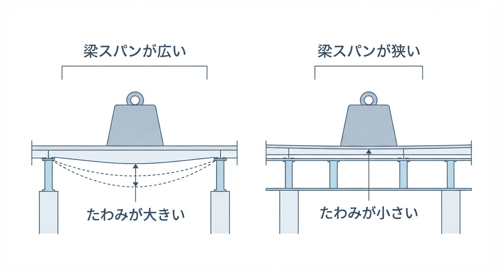

<RegionBanner />

築20年のマンションに500kgの防音室を置けるかは、築年数と総重量だけでは判断できません。

ここでの築年数と重さは検討する条件の例で、特定製品の仕様や設置可能な上限ではありません。

本体・機材・人の重さと、床に接する位置を整理し、管理会社や設置業者に確認する順番をまとめます。

## マンションの床荷重は、部屋の平均だけで判断しない

部屋全体に重さが広がる場合と、防音室の脚などに集中する場合を分けて考えます。

部屋の面積で総重量を割るだけでは、脚の下の床材や下地にかかる負担は分かりません。

契約書や管理側の案内に床荷重の数値がある場合も、それだけで設置できるとは判断しません。

その数値が何を対象にした条件か、設置業者と管理会社に確認してください。

## 防音室の荷重を整理する方法

製品の重さと寸法は、設置する型番の説明書で確かめます。

| 確認するもの | 相談時に渡す内容 |
| :-- | :-- |
| 総重量 | 本体に空調・楽器・家具・人などを含めた重さ |
| 支え方 | 底面全体で支えるか、脚や台座で支えるか |
| 設置面 | 外寸だけでなく、実際に床へ接する部分の位置 |
| 床の状態 | 仕上げ材、下地、沈み込みや傷の有無 |

荷重分散板や専用ベースパネルは、接する部分の負担を広げるための候補です。

ただし、板を敷くだけで床の耐力が増すわけではありません。

必要な厚みや広さ、設置方法は、床と防音室の組み合わせによるため、業者に確認します。

## 防音室で床は抜ける？重さを外寸と部屋全体で見る例

防音室で床が抜けるかどうかは、重さの合計だけでは「抜ける」とも「抜けない」とも決められません。

私なら、置き場所を考えるための「外寸あたりの重さ」と、床が重さを受ける「接地位置」を分けて見ます。

| 防音室の例 | 本体重量 | 外寸（幅×奥行） | 外寸あたりの本体重量 |
| --- | --- | --- | --- |
| ヤマハ セフィーネNS 0.8畳・Dr-35 | 約292kg | 1,002×1,443mm | 292÷(1.002×1.443)＝約202kg/㎡ |
| ヤマハ セフィーネNS 1.5畳・Dr-40（AMDC15H） | 468kg | 1,443×1,884mm | 468÷(1.443×1.884)＝約172kg/㎡ |

Drは防音室の遮音等級です。寸法・重量は2026年11月に確認したヤマハの仕様によります。[0.8畳の仕様](https://jp.yamaha.com/musical-instruments/soundproofing/products/ready-made-rooms/size-08-15/amdb08h/specs.html)、[1.5畳の仕様](https://jp.yamaha.com/musical-instruments/soundproofing/products/ready-made-rooms/size-08-15/amdc15h/specs.html)

この例では、本体が重い1.5畳の機種のほうが、外寸あたりの数字は小さくなります。

表の面積は置き場所を上から見た長方形で、人や機材の重さは含みません。

住宅の居室で、床の構造計算に使える積載荷重の表の値は1,800N/㎡です。[建築基準法施行令第85条](https://laws.e-gov.go.jp/law/325CO0000000338)

同条では、積載荷重は使用の実態に応じて計算し、表の数値を用いることもできるとしています。条文は2026年11月に確認しました。

1,800÷9.80665＝約184kg/㎡は、この計算用の値を重さに換算した数字です。

<strong>防音室を一台置いてよいかは、この数字との大小だけでは決まりません。</strong>

### 6畳の部屋に0.8畳の防音室を置く例

6畳を1.62㎡×6＝9.72㎡とすると、表の値は部屋全体で9.72×1,800÷9.80665＝約1,784kgに相当します。

本体約292kgに体重60kgの人を足すと352kgで、352÷1,784＝約20％です。

ここで分かるのは、部屋全体に換算した値に対する割合です。

残りを積めるという意味でも、脚や一部の床に重さが集中しても大丈夫という意味でもありません。

自分の候補で確かめるときは、本体の型番と重量に、使う人・楽器・機材の重さを添えて設置業者に伝えます。

## タワマンに防音室を置く前に確かめる規約・全館空調・換気

タワマンでは、設置に関する規約に加え、部屋の空調と防音室内の換気をどう両立させるかを確認します。

| 確認先 | 聞くこと |
| --- | --- |
| 管理会社・管理組合 | ユニットの設置や設備への変更に申請が要るか。どの書類を出すか |
| 全館空調の管理窓口 | 設置場所が既存の吹き出し口や吸い込み口をふさがないか |
| 設置業者 | 防音室内の給気・排気の位置と、機材や人の熱を外へ逃がす方法 |

置き場所を書いた間取り図に、吹き出し口と換気口の位置を印で示すと、配置を変えた場合も相談しやすくなります。

空調を別に用意する場合は、[防音室のエアコン選びと換気の確認点](/ja/soundproof-room/proofroom-aircondition-select/)を見てください。

## 設置場所は図面と床の状態を確認して選ぶ

梁や壁の位置を手がかりにしても、見た目だけで床の強い場所とは決められません。

管理会社に設計図面や床の仕様を確認できるか尋ね、候補の位置を設置業者へ伝えます。

沈み込みやきしみが気になる場所は、材料を重ねる前に点検を相談してください。

## 住宅構造別に見る荷重分散の考え方：RC造・木造・軽量鉄骨の違い

RC造でも、表面の床材や下地まで一体のコンクリートとは限りません。

構造名だけで局所的な沈み込みが起こらないとは判断せず、床の構成を確かめます。

軽量鉄骨造では、床を支える梁の位置や間隔も確認する材料になります。

図は支える間隔とたわみの関係を考えるイメージで、特定の住宅への設置可否を示すものではありません。

木造では、床下の根太や梁の位置・状態も含めて点検を相談します。

図面が残っていなければ、工務店やリフォーム会社に確認できる範囲を聞いてください。

賃貸では設置前の床を写真で記録し、傷や沈み込みが生じた場合の原状回復も管理会社と確認します。

## 軽い組み立て式防音室（だんぼっち等）でも床の対策は要る？

軽い組み立て式でも、本体の重さだけで床の対策を省けるとは限りません。

だんぼっち等を候補にする場合も、底面や脚のどこが床に触れるかを確認します。

購入前に、説明書の設置条件も確認してください。

軽くても、接する部分が狭ければ、その下に負担が集中するためです。

重量ユニットとの違いは、耐力の相談に加え、日常の床の傷や手入れも先に考えておきたい点です。

コンパネなどの合板は、床に接する負担を分散する候補になります。

ただし、一律の厚みや価格で安全を保証できるものではありません。

使う板はブースの支え方に合わせて業者へ確認し、敷く前に床の砂やごみを取り除きます。

板と床の間に保護材を使う場合も、床材との相性を確かめてください。

床の保護と振動への対策は、別に確認します。

防振ゴムやマットを追加すれば階下への音が止まるとは考えず、ブースの安定を保てる構成か相談します。

また、板やマットの下を点検できるようにし、湿気やカビの有無を確かめます。

除湿シートを挟むだけで、退去時の修繕を避けられる保証はありません。

設置前には、次の点を管理会社・設置業者と確認してください。

- <strong>床の状態</strong> : 既存の傷や沈み込みを記録し、設置する範囲を伝える
- <strong>板とブースの配置</strong> : 板の端やブースがドアの開閉・通行を妨げないかを見る
- <strong>設置後の手入れ</strong> : 床の清掃や湿気の点検を、どのように行うか決める

軽量ブースでも、賃貸の設置許可と原状回復の扱いを先に確かめると、材料選びの条件がはっきりします。

## 長く置く場合も、床の状態を点検する

設置時に問題が見えなくても、長く重さがかかる場所は継続して状態を確認します。

沈み込みや扉の開閉の変化があれば、放置せず管理会社や施工業者へ相談してください。

構造と設置可否の判断は、建築・施工の専門家に確認します。

搬入経路や空調まで含めた設置条件の全体像は、[賃貸にユニット型防音室を置くときの許可と大家さんへの相談](/ja/soundproof-rental/rental-unit-soundproof-room/)で確認できます。

グランドピアノとユニット型防音室を合わせて設置する場合の床荷重の考え方は、[ピアノ防音室ガイド｜アップライト・グランド別の費用とマンション設置の条件](/ja/soundproof-room/piano-room-guide/)でも解説しています。

賃貸オーナーが「24時間演奏可」物件としてグランドピアノ対応をアピールする場合も、同様の床荷重計算が欠かせません。

オーナー向けの集客戦略は、[「24時間演奏可」物件で差別化する：プロ奏者・音楽講師を長期入居者に変えるオーナー戦略](/ja/soundproof-rental/owner-renovation-musician-24h-practice-strategy/)で解説しています。
