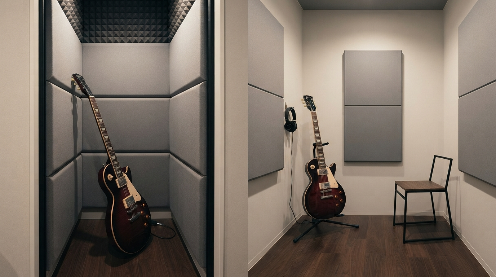

<RegionBanner />

「ヘッドホンアンプに変えたから、もう近所迷惑にはならないはず」——そう思ってエレキギターの練習量を増やした結果、実はトラブルの芽を育てていることがあります。

<strong>ヘッドホンアンプが消してくれるのは、アンプから出るスピーカーの音だけです。</strong>弦を弾く生音、フレットのビビり音、ギター本体の共鳴音は、ヘッドホンをつけていても変わらず鳴り続けています。

そしてトラブルになるかどうかを分けるのは、演奏の上手さでも隣人との関係の良さでもありません。<strong>音が出ている事実に対して、どれだけ配慮できているか</strong>です。

この記事では、ヘッドホンアンプにしても消えない音の正体を科学的に整理したうえで、賃貸マンションで実践できる配慮の考え方と具体的な軽減策を解説します。

## なぜ「対策したのに」トラブルになるのか

良かれと思って導入した対策が、なぜ思わぬトラブルにつながるのでしょうか。背景には3つの誤解があります。

### 誤解1：「ヘッドホンアンプ＝無音」ではない

ヘッドホンアンプは、アンプが空気を振動させて出す音（増幅された音）を耳元だけに閉じ込める機材です。

<strong>弦そのものが振動して出す生音は、アンプを経由していないため一切減衰しません。</strong>「機材で対策した」という安心感が、生音への意識を薄れさせてしまうのが最初の落とし穴です。

### 誤解2：「上手に弾けば許される」わけではない

演奏が上達すれば近隣の理解が得られる、というのも誤解です。

隣人にとっての問題は<strong>「音楽として上手いかどうか」ではなく「音が生活の妨げになっているかどうか」</strong>です。技術の高さは、音が出ている時間帯や頻度への配慮の代わりにはなりません。

### 誤解3：「隣人と仲がいいから大丈夫」とは限らない

挨拶を交わす仲だから多少の音は大丈夫、という思い込みも危険です。

良好な関係のときほど、相手は<strong>「言い出しにくい」</strong>という心理が働きます。表面上は何も言われていなくても、内心では我慢が積み重なっているケースは珍しくありません。

## ヘッドホンアンプにしても消えない音の正体

「配慮する」といっても、何に配慮すればよいのか分からなければ対策のしようがありません。ここでは生音の発生源を音響の仕組みから整理します。

### 弦の振動が直接空気を伝わる音

ギターの弦は、ピックアップやマイクを通さなくても、弾いた瞬間に周囲の空気を振動させています。

アコースティックギターほど大きくはありませんが、静かな夜間の室内では十分に聞こえるレベルです。

### フレットのビビり音・ピッキングノイズ

弦を押さえる指の動き、フレットに弦が当たる音、ピックが弦をはじく音も、電気信号に変換される前の物理的な音として発生します。

エフェクターやアンプの設定をどれだけ変えても、これらの音自体には影響しません。

### ギター本体の共鳴と、床へ伝わる固体伝搬音

ギターのボディは弦の振動を共鳴させる構造になっており、本体全体がスピーカーのように空気を震わせます。

さらに、椅子に座って膝の上や床に近い位置で構えている場合、<strong>振動が床や壁を伝わる「固体伝搬音」</strong>として階下・隣室に伝わることもあります。

## トラブルにしないための考え方

音の正体が分かったところで、次は「どう向き合うか」という考え方の整理です。

### ゴールは「無音」ではなく「配慮が伝わること」

生音を完全にゼロにすることは現実的ではありません。<strong>目指すべきは無音化ではなく、時間帯や頻度に対する配慮が相手に伝わる状態</strong>です。

- <strong>時間帯を選ぶ</strong> : 深夜・早朝を避け、常識的な時間帯に練習を集中させる
- <strong>連続時間を区切る</strong> : 長時間ぶっ通しではなく、休憩を挟んで音の出る時間を分散させる
- <strong>入居時・気になったタイミングで一声かける</strong> : 「音が出ることがあります」と事前に伝えておくだけで、相手の受け止め方は大きく変わる

### 「言わないだけで我慢している」可能性を前提にする

クレームが来ていないことを「問題ない」の証明だと考えないことが重要です。

不安な場合は、管理会社や大家に一度相談しておくと、後々のトラブルを未然に防ぎやすくなります。マンション全体での楽器演奏の目安については、[マンションで楽器は何時まで？規約例は9〜21時｜条例と受忍限度で判断](/ja/knowledge/mansion-instrument-practice-time-rules/)で解説している「受忍限度」という考え方もあわせて参考にしてください。

## 生音由来のノイズを減らす具体策

配慮の姿勢に加えて、物理的にノイズ自体を減らす工夫も組み合わせると効果的です。

- <strong>練習用ミュート弦・サイレントピック</strong> : 弦の振動そのものを抑え、生音の音量を物理的に下げる
- <strong>フェルトのブリッジミュート</strong> : 弦とブリッジの間に挟み、余韻を短くして音の伝わる時間を減らす
- <strong>厚手のラグ・防振マットの上で演奏する</strong> : 床への固体伝搬音を軽減する
- <strong>ギタースタンドを壁際・床に直接置かない</strong> : 共鳴しやすい配置を避ける

これらは生音を完全に消すものではありませんが、<strong>「聞こえるかどうか」の境界線を室内側に寄せる</strong>効果が期待できます。

## それでも自由に弾きたい場合の選択肢

時間帯を気にせず、生音の心配もなく弾きたい場合は、防音室や簡易防音ブースの導入が根本的な解決策になります。

省スペースの防音ブースであれば、初期費用を抑えつつ生音・固体伝搬音の両方を大きく減らすことができます。導入を検討する際の考え方は、[予算別防音室選び方ガイド｜50万円・100万円・200万円で選ぶ方法](/ja/soundproof-room/soundproof-room-budget-selection-guide/)を参考にしてください。

ただし、<strong>ギターは畳数選びで失敗しやすい楽器</strong>です。0.8〜1畳クラスの電話ボックスサイズは、立って構えるとネックが壁に当たり、そもそも演奏がままなりません。

購入を検討する場合は、最低でも1.2畳、椅子に座って余裕を持って弾きたいなら<strong>1.5畳以上</strong>を目安にしてください。内寸（実際に使える広さ）ベースでの選び方は[ユニット防音室のサイズと選び方：演奏スタイルに合わせた内寸確認法](/ja/soundproof-room/soundproof-room-size/)で詳しく解説しています。

## まとめ

- <strong>ヘッドホンアンプが消すのはアンプの音だけ</strong> : 弦・フレット・ボディの生音は残る
- <strong>トラブルの分かれ目は技術でも関係性でもない</strong> : 音への配慮ができているかどうかが重要
- <strong>「言われていない＝問題ない」ではない</strong> : 相手が我慢している可能性を前提にする
- <strong>時間帯・頻度・一声</strong> : 具体的な配慮の実践方法
- <strong>物理的な軽減策と組み合わせる</strong> : ミュート弦・防振マットなどで生音そのものも減らせる

「対策したつもり」で終わらせず、消えない音の存在を前提に配慮を重ねることが、長く安心してギターを続けるための一番の近道です。

## 次のステップ

マンション・賃貸全体での楽器演奏の時間帯ルールは、[マンションで楽器は何時まで？規約例は9〜21時｜条例と受忍限度で判断](/ja/knowledge/mansion-instrument-practice-time-rules/)で管理規約・自治体条例・受忍限度の3つの観点から解説しています。
