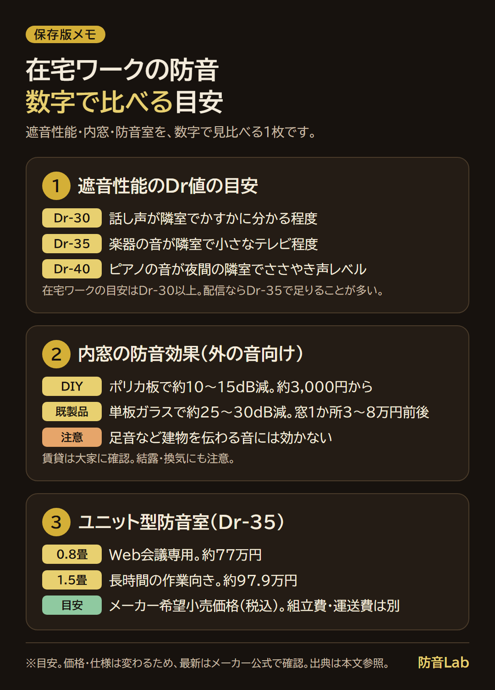

<RegionBanner />

在宅ワークの音の悩みは、<strong>家族の声などが入ってくる悩み、Web会議で声が漏れる悩み、寝室で仕事をする悩み</strong>の3つに分かれます。

どれも「防音室を買うしかない」と考える前に、確認できる手軽な対処があります。

この記事は、悩みを切り分けて、手軽な対処から順に、窓やドア、防音室まで選べるように整理します。

予算別の目安も、最後にまとめています。

## 在宅ワークが「家族の幸せ」を奪った？

在宅ワークを始めたとき、通勤がなくなり、家族との時間が増えると期待したはずです。

ところが現実には、家族に「静かにして」と言い続けて、関係がぎくしゃくすることがあります。

その原因は、<strong>仕事の空間と生活の空間の間に「音の境界」がないこと</strong>にあります。

### なぜ「同じ空間」では共存しにくいのか

会議中に子どもの声が聞こえると、集中が途切れます。

これは、意志が弱いからではありません。

一定のリズムで鳴り続ける音（エアコンなど）は、背景として慣れやすいものです。

一方、不規則に出る音（子どもの声、ドアの開閉、話し声）は、注意を引きやすい傾向があります。

家族の側にも負担があります。

自宅は本来、一番自由に過ごせる場所です。

「今は静かにして」「テレビの音を小さくして」と言われ続けると、家族は肩身が狭くなります。

### 「我慢」だけでは続かない

「家族に我慢してもらおう」「自分が我慢しよう」と考える方は多いでしょう。

しかし、毎日何時間も何か月も続ける我慢には、限界があります。

家族に「静かにして」と言うたびに、罪悪感が積もる方もいます。

だからこそ、我慢ではなく<strong>仕組みで音を分ける</strong>ことが必要になります。

## まず、どの悩みかを切り分ける

次の表で、自分の悩みに近い行を確認してください。

| 悩み | 例 | 向く対策 |
| :--- | :--- | :--- |
| 入ってくる音 | 家族の声、テレビ、ドアの開閉、外の音が気になる | 手軽な対処 → 窓・ドアの隙間 → 内窓 → 防音室 |
| 漏れる音（会議の相手に） | 家族の声がマイクに入る。生活感を聞かれたくない | マイク設定、ノイズ抑制、背景の整理 → 防音室 |
| 漏れる音（周囲に） | 隣や家族に会議の声が聞こえる。声を抑えてしまう | パーティション、隙間処理 → 防音室 |
| 寝室で仕事をしている | 夜寝つけない。仕事中にベッドが気になる | レイアウト → 防音室 |

「家族に会議の声や生活音を聞かれたくない」という気持ちは、自然なものです。

その不安が、声を小さくしてしまう原因になることもあります。

## 手軽な対処｜今日から無料〜数千円で試せる

最初に、費用がほとんどかからない対処を確認します。

- <strong>家族との時間割</strong> : 会議の時間帯を共有します。会議中はドアを閉める、という合図を決めておきます
- <strong>マイクの入力レベルを見直す</strong> : 「声が小さい」と言われる場合は、OSや会議ツールの入力レベルを70〜80%程度に上げてみます。環境音も拾いやすくなる点は、トレードオフです
- <strong>ノイズ抑制を使う</strong> : Zoom・Teams・Google Meetなどの会議ツールには、ノイズ抑制の設定があります。エアコン音やPCファン音は、この設定で抑えられることがあります
- <strong>マイクの背後に布製品を置く</strong> : クッションや畳んだ毛布を置くと、壁からの反射が減り、声の輪郭がはっきりします
- <strong>ドアの隙間テープ</strong> : ドアの枠と下部に貼ります。500円〜2,000円ほどで、ドア下からの音の侵入を減らせます

ノイズ抑制の設定名や場所は、ツールの更新で変わることがあります。

実際の設定は、各ツールの最新の画面で確認してください。

これらは手軽ですが、<strong>家族の声そのものを消すものではありません</strong>。

人の声、特に子どもの高い声は、ノイズ抑制でも残ることがあります。

足りない場合は、次の段階に進みます。

## 声が漏れる・声を抑えてしまうとき

Web会議で「声が少し遠いです」と言われたとき、マイクを買い替えようとする方は多いでしょう。

しかし、原因は機材ではなく、<strong>隣や家族を気にして声を抑えていること</strong>かもしれません。

「隣に会議の内容を聞かれたくない」「うるさいと思われたくない」という不安が、無意識に声を小さくします。

声を抑えると、自信がない印象になりやすく、熱量も伝わりにくくなります。

まず、マイク設定の見直しを試してください。

それでも改善しない場合は、<strong>声が漏れないようにする対策</strong>が必要です。

### パーティション・簡易ブースで声漏れを減らす

オフィスや共用スペース、自宅のワークスペースで使いやすい方法が、パーティションの改善です。

布張りやアクリル板のパーティションは、1m²あたり数kg程度と軽く、遮音性能が低い部類です。

目安は、住宅の遮音等級でD-15〜D-20程度で、声の内容が聞き取れるレベルです。

改善は、次の3つを<strong>セットで</strong>行います。

- <strong>遮音層</strong> : 遮音シート（面密度の目安は1m²あたり3〜5kg程度）を貼り、重さを足します
- <strong>吸音層</strong> : 室内側に、厚み20〜30mm程度の吸音パネルを貼ります。反響が減り、マイクが拾うノイズも減ります
- <strong>隙間処理</strong> : 足元と床の隙間、パネル同士の連結部を、ボトムシールや隙間テープで塞ぎます

どれか1つだけでは、効果が限られます。

特に、隙間があると、音はそこから回り込みます。

| 部材 | 目安価格 |
| :--- | :--- |
| 遮音シート（1m²あたり） | 2,000〜4,000円程度 |
| 吸音パネル（60×60cm・1枚） | 1,000〜3,000円程度 |
| 隙間テープ・ボトムシール | 数百円〜 |

高さ1.8m×幅1.2m程度のパーティション1面で、部材費は1〜2万円程度が目安です。

効果は、「内容まではっきり聞き取れる」状態から、「何か話しているのは分かるが、内容は判別しにくい」状態への改善が一般的な目安です。

完全な無音にはなりません。

原状回復のために、ビス留めではなく、両面テープやマグネット式の部材を選んでください。

賃貸オフィスでは、火災報知器やスプリンクラーを塞がないことにも注意が必要です。

遮音と吸音の基本は、[吸音材か遮音材か迷う人へ｜あなたの環境で"必要なのはどっち？"徹底ガイド](/ja/knowledge/absorption-vs-soundproofing-materials/)で解説しています。

机に置くだけの既製の防音ブースは、[東京防音レビュー｜ホワイトキューオンとOkudakeは合うか](/ja/knowledge/tokyo-bouon-whitekyuon-okudake-review/)で検証しています。

企業や公共施設の個室ブースの導入状況は、[プライバシーポッド市場が伸びる背景](/ja/business/privacy-pod-market-growth/)で解説しています。

## 寝室で仕事をしている場合

「リビングは家族がいるから、静かな寝室で仕事をするしかない」という方は、多いはずです。

寝室で仕事をすると、夜寝つけない、仕事中にベッドが気になるという声が出やすくなります。

人は、場所と行動をセットで覚える傾向があります。

寝る場所で仕事をすると、その場所が「休む場所」なのか「仕事の場所」なのか、曖昧になりやすいのです。

この記事では、睡眠への健康上の効果は断定しません。

眠れない状態が続く場合は、医療機関への相談も検討してください。

### レイアウトで境界を作る

防音室を入れる前に、家具の配置で境界を作ります。

- <strong>デスクを壁に向ける</strong> : 座ったときに、ベッドが視界に入らないようにします
- <strong>パーティションや本棚を置く</strong> : 高さ160cm以上のものを、ベッドとデスクの間に置きます
- <strong>照明を切り替える</strong> : 仕事中は昼光色、就寝前は電球色にするなど、光の色で時間帯を分けます

### Web会議で寝室が映る不安

寝室で仕事をする場合は、会議中にベッドが映ることを気にする方も多いでしょう。

- <strong>背景ぼかし・バーチャル背景</strong> : 会議ツールの機能で、寝室であることを隠せます
- <strong>カメラの画角を調整する</strong> : デスクの向きとカメラの高さを変えて、ベッドや私物が入らないようにします
- <strong>パーティションを背景に使う</strong> : 視界の遮断と、背景の整理を兼ねられます

社外の相手との会議では、背景に配慮しておくと安心です。

### 寝室で聞こえる音に悩んでいる場合

仕事とは別に、寝室で聞こえる音で眠れない場合は、音の種類ごとに対策が変わります。

[上の階の足音・隣の話し声で眠れない｜音の種類で変わる寝室の騒音対策の選び方](/ja/soundproof-rental/bedroom-noise-type-solution-guide/)で整理しています。

## 音の境界を作る｜窓・ドア・防音室

手軽な対処で足りない場合は、<strong>音の境界</strong>を物理的に作る段階です。

音の境界とは、仕事の空間と生活の空間を、音で分けることです。

境界があれば、あなたは集中でき、家族は気を遣わずに過ごせます。

### Dr値で必要な遮音性能を確認する

遮音性能の目安に、Dr値（音響透過損失等級）があります。

数字が大きいほど、遮音性能が高くなります。

Dr値、内窓の効果、防音室の価格を、数字で見比べられる1枚にまとめました。

在宅ワークでは、Dr-30以上が一つの目安です。

ただし、部屋全体の遮音性能は、<strong>最も弱い部分</strong>で決まります。

壁が強くても、ドアに隙間があれば、そこから音が漏れます。

音の侵入経路は、次の3つが代表的です。

1. ドアの隙間（特にドア下部）
2. 窓（ガラスが薄く、音を通しやすい）
3. 換気扇などの開口部

壁に吸音材を貼る前に、<strong>この3つの弱点から対処</strong>してください。

遮音等級の基準は、[遮音性能の基準「D値」とは？楽器・用途別の目安を徹底解説](/ja/soundproof-room/bouon-dchiseinou-meyasu/)で解説しています。

### 予算3万円以下｜ドアと窓の簡易対策

- <strong>ドアの隙間テープ</strong> : 最も費用対効果が高い対策です
- <strong>遮音カーテン（5,000円〜15,000円）</strong> : 窓から入る外の音を和らげます。部屋の中の音を外に漏らさない効果は、あまり期待できません
- <strong>ノイズキャンセリングイヤホン（3,000円〜30,000円）</strong> : 外の音を打ち消します。ただし、人の高い声は、完全には消せません

これらは試しやすい一方で、<strong>根本的な解決にはならない</strong>ことがあります。

### 予算10万円前後｜内窓で窓の弱点を減らす

外の音が気になる場合、窓は音の主な侵入口の一つです。

内窓は、既存の窓の内側にもう1枚窓を足す方法で、賃貸でも原状回復しやすい製品があります。

効果の目安は、DIYのポリカ板で約10〜15dB減、既製の内窓（単板ガラス）で約25〜30dB減です。

数値と費用は、上のメモにまとめています。

出典は、当サイトの[内窓の防音効果を実測した記事](/ja/diy/diy-internal-window-road-noise-reduction/)と、[賃貸と戸建てで変わる窓の防音対策](/ja/soundproof-room/shanon-vs-bouon-window/)です。

内窓は、家族の足音など、建物を伝わる音には効きません。

賃貸では、大家や管理会社に事前に確認してください。

窓まわりを密閉すると、結露やカビの原因になることがあります。

換気にも気を配ってください。

### 予算100万円前後｜ユニット型防音室

「防音室は高い。本当に効果があるのか分からないうちに払う気になれない」と感じる方は多いでしょう。

その慎重さは、自然な判断です。

まず、手軽な対処と内窓を試し、それでも足りないときに検討するのが現実的です。

ユニット型防音室は、既存の部屋の中に置く、箱型の防音空間です。

- <strong>工事不要</strong> : 組み立て式で、賃貸にも置けます
- <strong>遮音性能</strong> : Dr-35が標準的なタイプです。Dr-40のタイプもあり、価格は上がります
- <strong>移設可能</strong> : 引っ越し時に、分解して持ち運べます

価格の目安は、Dr-35の標準タイプで、0.8畳が約77万円、1.5畳が約97.9万円です。

出典は、ヤマハ公式の仕様ページ（[0.8畳](https://jp.yamaha.com/products/soundproofing/ready-made_rooms/size_08-15/amdb08h/specs.html)、[1.5畳](https://jp.yamaha.com/products/soundproofing/ready-made_rooms/size_08-15/amdb15h/specs.html)）の希望小売価格（税込、組立費・運送費は別）です。

価格や仕様は変わります。

購入前に、各メーカーの最新情報を確認してください。

防音室の中では、家族の声が気にならなくなり、自分の声も周囲に遠慮せず出せます。

扉を閉めることが、「仕事を始める合図」になる利点もあります。

家族は、防音室に入っている間、静かにする必要がなくなります。

寝室の隅に置く場合は、0.8畳タイプなら、6畳の部屋にも収まります。

そして、防音室を出たときに「仕事が終わった」と切り替えやすくなります。

予算別の選び方は、[予算別防音室選び方ガイド｜50万円・100万円・200万円で選ぶ方法](/ja/soundproof-room/soundproof-room-budget-selection-guide/)で解説しています。

メーカー別の比較は、[防音室おすすめ比較｜失敗しない選び方](/ja/soundproof-room/bouon-osusume-hikaku/)で確認できます。

楽器店のショールームなどで、実際に中に入って確認すると、静けさの違いが分かります。

## 悩み別｜効く順の早見表

保存して見返せる1枚にまとめました。

上から順に試して、足りなければ次の段階に進みます。

最初から防音室を決める必要はありません。

## 費用・ローン・経費の考え方

防音室を導入する場合の資金計画や経費の考え方は、別の記事にまとめています。

[テレワーク・在宅勤務のための防音室ローン活用](/ja/money/telework-soundproof-loan-strategy/)

税務の取り扱いは、状況によって変わります。

個別の判断は、税理士などの専門家に確認してください。

## まとめ：悩みを切り分けて、順番に試す

在宅ワークの音の悩みは、入る音、漏れる音、寝室での仕事の3つに分けて考えると、試すべき対策が見えてきます。

- <strong>入ってくる音</strong> : 時間割と隙間対策から始め、足りなければ内窓や防音室へ進みます
- <strong>会議で漏れる音</strong> : マイク設定と背景の整理から始め、必要なら防音室を検討します
- <strong>周囲に声が漏れる</strong> : 遮音・吸音・隙間処理の3点セットで改善します
- <strong>寝室で仕事</strong> : レイアウトで境界を作り、足りなければ防音室で空間を分けます

最初から全部を揃える必要はありません。

手軽な対処、部分的な対策、防音室の順に進めれば、無駄な出費を減らせます。

## 次に読む記事

- [上の階の足音・隣の話し声で眠れない｜音の種類で変わる寝室の騒音対策の選び方](/ja/soundproof-rental/bedroom-noise-type-solution-guide/)
- [音の悩みの解決策は3つ｜引っ越し・後付け・注文住宅の設計段階で伝える道](/ja/soundproof-room/noise-solutions-relocate-retrofit-custom-home/)
- [テレワーク・在宅勤務のための防音室ローン活用](/ja/money/telework-soundproof-loan-strategy/)
- [予算別防音室選び方ガイド｜50万円・100万円・200万円で選ぶ方法](/ja/soundproof-room/soundproof-room-budget-selection-guide/)
- [2030年の防音Lab：無声音声インターフェース(SSI)が「遮音」の常識を破壊する](/ja/knowledge/future-ssi-silent-speech-interface-revolution/)
