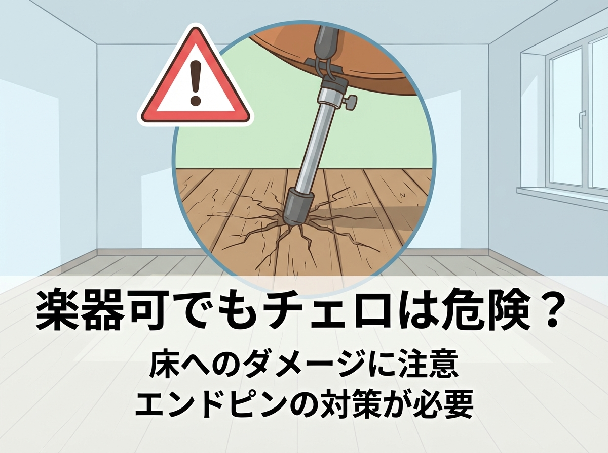

<RegionBanner />

「やっと見つけた『楽器可』のマンション。これで毎日チェロが弾ける！」

そう思って入居した一週間後、管理会社から一本の電話が。
「階下の方から、重低音が響くと苦情が来ています」

実は、賃貸物件における「楽器可」において、<strong>チェロはピアノ以上に警戒すべき楽器</strong> なのです。
今回は、その理由と物件選びのポイントを解説します。

## 「楽器可」=「何でも弾いていい」ではない現実

### 規約の「種類」を確認せよ

賃貸の募集図面に「楽器可（相談）」と書いてあっても、詳細な規約（細則）を見ると以下のような制限があることが一般的です。

1.  <strong>ピアノのみ可</strong>: アップライトピアノはOKだが、他の楽器は要相談。
2.  <strong>管楽器不可</strong>: 音圧が高いサックスやトランペットはNG。
3.  <strong>弦楽器の制限</strong>: バイオリンはOKだが、低音楽器（チェロ・コントラバス）はNGまたは時間制限あり。

### なぜチェロは嫌われるのか？

音量（dB）だけで言えば、チェロはグランドピアノよりも小さい楽器です。
しかし、マンション構造においてチェロは<strong>最悪の特性</strong>を持っています。

それは <strong>「エンドピン」</strong> です。

ピアノは4本の脚で重量を分散していますが、チェロは演奏時の振動エネルギーを、鋭利なエンドピン1点に集中させて床に突き刺します。
これは、<strong>電動ドリルで床を振動させているのと同じ</strong> ようなものです。
この「固体伝搬音」は、コンクリートを伝って階下だけでなく、斜め下の部屋にまで「ブーン」という不快な重低音として響きます。個体伝搬音への対策は、ドラムの防音記事「[ドラム防音のD値基準｜振動対策と個体伝搬音の壁](/ja/soundproof-room/soundproof-performance-drum/)」でも詳しく解説しています。

## チェロ奏者が賃貸選びで確認すべき3つのポイント

では、どのような物件なら安心して弾けるのでしょうか？

1.  <strong>「重低温・弦楽器可」の明記</strong>:
    仲介業者を通じて、「チェロです」とはっきり伝え、過去にチェロ奏者の入居実績があるか確認しましょう。
2.  <strong>1階または角部屋</strong>:
    階下が地面である「1階」は、エンドピン振動のリスクが大幅に減ります。また、隣接住戸が少ない角部屋も有利です。
3.  <strong>床の構造</strong>:
    「防音フローリング（L-45など）」が入っているか、あるいはスラブ厚が十分（200mm以上）あるRC造を選びましょう。木造・軽量鉄骨は基本的にNGです。

## 入居後にトラブルにならないための「防衛策」

運良く入居できたとしても、対策は必須です。

- <strong>防振エンドピンストッパー:</strong>
  床に直接刺すのは論外です。厚手の防振ゴムが付いたストッパーを使用してください。
- <strong>浮き床（防振ステージ）:</strong>
  ストッパーの下にさらに一枚、防振用のボードやマットを敷き、床との縁を切りましょう。
- <strong>挨拶まわり:</strong>
  入居時の挨拶で、「チェロを弾きます。もしうるさかったらすぐに仰ってください」と伝えておくことで、相手の許容度が大きく変わります。

## まとめ：許可と対策の両輪で守る

チェロは美しい音色の楽器ですが、日本の集合住宅においてその重低音は「凶器」になり得ます。

「楽器可だから大丈夫」と思い込まず、<strong>「チェロという特殊な振動源を持ち込む」</strong> という意識を持って、物件選びと床対策を行ってください。
それが、あなたとご近所さんの平和な生活を守る唯一の方法です。
