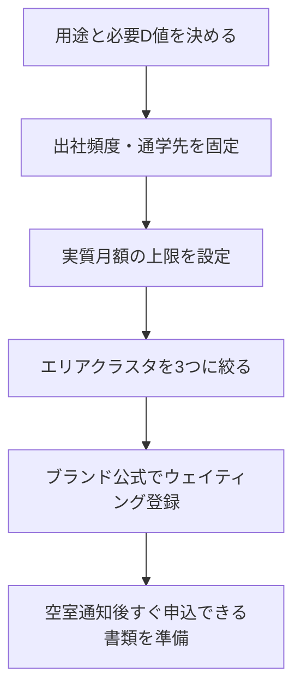

<RegionBanner />

「防音賃貸の家賃相場を調べたら、だいたい8〜12万円」と感じた方は多いはずです。

しかし、実際に物件を絞り込むと、都心の新築は16万円超、埼玉の旧棟は9万円台という<strong>幅の大きさ</strong>に直面します。「結局いくら見ておけばいいのか分からない」という不安が、部屋探しを止めてしまう一番の原因です。

本記事の結論を先に述べます。

<strong>防音賃貸の「8〜12万」は、首都圏ブランド物件（1K）の中央帯です。</strong>

利便性を下げれば7万円台まで下がりますが、一般賃貸との差（防音プレミアム）は郊外でも30〜60%と縮まりません。

家賃だけで比較すると失敗しやすいので、<strong>通勤コスト・必須オプション・入居難易度・用途（D値）</strong>まで含めた「実質コスパ」で選ぶ必要があります。

## 防音賃貸の家賃相場「8〜12万」は何の平均か

ネット上の相場記事や物件一覧を平均すると、1Kで8〜12万円前後に収まりがちです。

2026年6月時点の調査では、MUSISION（ミュージション）公式掲載の1K下限26棟を集計したところ、次の数値になりました。

| 指標 | 数値 | 補足 |
| :--- | :---: | :--- |
| 1K賃料下限の中央値 | <strong>10.3万円</strong> | n=26棟 |
| 1K賃料下限の平均 | 10.06万円 | 同上 |
| 最安 | 6.70万円 | 小平小川町（多摩西部） |
| 最高 | 16.25万円 | 下北沢（都心） |

つまり、<strong>「8〜12万」は大きく外れではなく、ブランド防音の1Kにおける“よくある帯”</strong>です。

ただし、この数字には3つのバイアスが乗っているため、内訳を箇条書きで分けて確認します。

- <strong>都心・駅近・新築</strong>の物件が相場記事で目立つ
- <strong>ブランド防音</strong>（D値開示・24時間演奏可）に限定すると下限が上がる
- <strong>空室待ち</strong>が常態化しており、「今すぐ入れる安い部屋」の在庫感と乖離する

相場の全体像は[【2026完全版】防音賃貸・防音マンション完全ガイド](/ja/soundproof-rental/bouon-rental-market-guide/)もあわせて確認してください。

## 比較の前提：4種類の「防音っぽい物件」を混ぜない

家賃相場がブレる最大の原因は、物件タイプの定義がバラバラなことです。
本記事では次の4類型に分けて考えます。

| タイプ | 家賃帯（1K目安） | D値 | 24時間演奏 | 呼び方 |
| :--- | :--- | :--- | :--- | :--- |
| <strong>A. ブランド防音賃貸</strong> | 7〜20万円 | D-60〜80開示 | 可 | 防音賃貸・防音マンション |
| <strong>B. 楽器相談可</strong> | 一般相場±10% | 非開示が多い | 不可（時間帯制限） | 楽器可（別物） |
| <strong>C. オーナーリノベ防音</strong> | 地域差大 | 部屋のみ計測あり | 契約次第 | 防音仕様付き |
| <strong>D. 一般賃貸＋ユニット防音室</strong> | 家賃＋月4〜6万 | 製品依存 | 室内のみ | 比較対象（後述） |

<strong>「楽器可」は遮音性能の保証ではありません。</strong>
D値の見方は[防音賃貸の「D値」とは？楽器別の推奨レベルと失敗しない物件選びの基準](/ja/soundproof-rental/bourental-syaouseid-choiceindi/)を参照してください。

## エリア別：都心と郊外で家賃はどれだけ違うか

MUSISION全棟データをエリアクラスタに分けた結果です（2026-06-24時点）。

| クラスタ | 代表エリア | 1K下限のレンジ | 中央値 | 都心主要駅までの目安 |
| :--- | :--- | :---: | :---: | :--- |
| <strong>都心・人気エリア</strong> | 下北沢・早稲田・世田谷・板橋駅前 | 12.7〜16.3万 | <strong>13.2万</strong> | 15〜25分 |
| <strong>23区北部・西部</strong> | 野方・西台・江古田・下赤塚 | 7.9〜10.8万 | <strong>9.8万</strong> | 25〜40分 |
| <strong>埼玉・多摩西部</strong> | 川越・小平・志木・朝霞 | 6.7〜8.5万 | <strong>8.0万</strong> | 40〜60分 |
| <strong>神奈川・千葉</strong> | 川崎・登戸・武蔵中原・千葉駅前 | 9.2〜10.5万 | <strong>9.8万</strong> | 20〜45分 |

<strong>都心クラスタと埼玉・多摩西部の中央値差は約5.2万円（+65%）</strong>です。

郊外に目を向ければ、家賃の絶対額は確かに下がります。

一方で、安い帯に偏る物件には共通する条件があり、家賃だけでは見えないリスクとして3点に整理できます。

- <strong>築年数が古い</strong>（川越2000年築、志木2003年築など）
- <strong>間取りが1DK中心</strong>で、1K在庫が少ない
- <strong>空室待ち</strong>が長期化しやすい

東京エリアの詳細は[東京の防音賃貸相場2026｜エリア別の家賃目安・失敗しない選び方](/ja/local/tokyo-soundproof-rental-summary/)、千葉は[千葉の防音賃貸ガイド](/ja/local/chiba-soundproof-rental-guide/)、埼玉は[埼玉の防音賃貸ガイド](/ja/local/saitama-soundproof-rental-guide/)が参考になります。

## 郊外は安いのに「お得」にならない理由：防音プレミアム率

家賃の絶対額だけ見ると、郊外は都心より3〜5万円安く見えます。

しかし、<strong>その地域の一般賃貸と比べた上乗せ率（防音プレミアム）</strong>は、郊外でも大きいままです。「郊外なら安く済む」という期待は、この時点で一度見直す必要があります。

| エリア | 一般1K相場（2026年） | 防音1K実勢 | プレミアム率 |
| :--- | :---: | :---: | :---: |
| 渋谷区（下北沢） | 11.2万 | 16.3万 | <strong>+45%</strong> |
| 世田谷区（赤堤・新築） | 8.5万 | 13.2万 | <strong>+55%</strong> |
| 板橋区（西台） | 6.3万 | 12.6万 | <strong>+100%</strong> |
| 中野区（野方） | 7.8万 | 12.5万 | <strong>+60%</strong> |
| 川越市 | 5.6万 | 9.1万 | <strong>+63%</strong> |
| 志木市 | 6.0万 | 10.6万 | <strong>+77%</strong> |
| 千葉市中央区（駅近） | 7.5万（推定） | 10.0万 | <strong>+33%</strong> |

この表から読み取れる解釈は3点に整理できます。

- <strong>郊外の防音賃貸は「地域相場の安さ」＋「防音の上乗せ」</strong>の合成
- プレミアム率そのものは、都心だから安くなるわけではない
- ラシクラスなどでは周辺相場の<strong>約130%</strong>設定でも満室という事例もある（三井不動産レジデンシャルリース調査）

「安いエリアだから防音も安くなる」と期待すると、予算設計がずれます。
[【調査報告】首都圏・関西圏における高性能防音賃貸市場の定量的分析](/ja/soundproof-rental/report-japan-soundproof-rental-market-needs/)でも、新宿・渋谷で+40%前後のプレミアムが報告されています。

## 実質コストの計算式：家賃以外に何を足すか

防音賃貸のコスパ比較では、次の式で揃えることを推奨します。

<strong>実質月額 ＝ 家賃 ＋ 管理費 ＋ 必須オプション ＋ 通勤交通費（該当する場合）</strong>

### ミュージションの必須オプション（見落とし注意）

| 項目 | 金額 | 月額換算 |
| :--- | :--- | :---: |
| 入居者専用ポータル（2年） | 26,400円（税込） | 1,100円 |
| 24時間緊急対応（2年・必須） | 15,000円（税込） | 625円 |
| <strong>合計</strong> | — | <strong>約1,725円/月</strong> |

家賃表の数字だけで比較すると、月2,000円弱の誤差が出ます。

### 通勤コストの目安（都心勤務を想定）

| 住居エリア | 家賃＋管理費目安 | 都心への通勤（片道・月20日出勤） | 実質月額目安 |
| :--- | :---: | :---: | :---: |
| 下北沢（都心） | 16.3万＋0.95万 | ほぼ0〜0.3万 | <strong>約17.5万</strong> |
| 野方（23区西北部） | 12.5万＋0.5万 | 0.8〜1.0万 | <strong>約13.8〜14.0万</strong> |
| 武蔵中原（神奈川） | 12.2万＋0.5万 | 0.7〜0.9万 | <strong>約13.4〜13.6万</strong> |
| 志木（埼玉） | 10.6万＋0.35万 | 1.0〜1.2万 | <strong>約12.0〜12.2万</strong> |
| 川越（埼玉） | 9.1万＋0.5万 | 1.2〜1.5万 | <strong>約10.8〜11.1万</strong> |

通勤は「片道60分・往復1,000円前後・月20日」で概算しています。

実際の勤務地・在宅日数で大きく変わるため、<strong>自分の出社頻度で再計算</strong>してください。

### 示唆：出社頻度で最適解が変わる

実質月額は出社頻度によって順位が入れ替わるため、3パターンに分けて整理します。

- <strong>週5出社・都心勤務</strong> : 野方・武蔵中原など23区西北部〜神奈川がバランス型。志木・川越は家賃差が通勤で相殺されやすい
- <strong>週1〜2出社・リモート中心</strong> : 志木・川越の実質コスト優位が出やすい。都心16万超との差は月4〜5万に迫る
- <strong>通学・音大圏で固定</strong> : 国立・早稲田・下北沢など立地固定が正解になりやすい。家賃より「通学時間」が支配要因

## スタジオ代・防音室購入との損益比較

防音賃貸は「高い家賃」に見えますが、代替手段と並べると意味が変わります。

| 選択肢 | 月額コスト目安 | 初期費用 | 引越し時 |
| :--- | :--- | :--- | :--- |
| <strong>防音賃貸（1K）</strong> | 10〜16万（エリア差大） | 敷金・礼金2〜4か月 | 退去のみ |
| <strong>一般賃貸＋レンタルスタジオ</strong> | 家賃8万＋スタジオ4〜6万＝<strong>12万〜</strong> | 敷金・礼金 | スタジオ契約別 |
| <strong>一般賃貸＋ユニット防音室</strong> | 家賃＋ローン4〜6万/月 | 本体100〜150万 | 移設・売却が必要 |

毎日スタジオを使う演奏者なら、防音賃貸の上乗せ3〜5万は合理的な場合があります。
詳細な損益分岐は[「防音室は買わずに借りる時代」とは言うが損益分岐はどこだ](/ja/money/rental-vs-purchase-soundproof-room/)を参照してください。

## ペルソナ別：家賃相場から逆算するエリア選び

家賃相場は「誰が」「どんな生活パターンで」住むかによって最適解が変わります。
代表的な4パターンに分けて、優先エリアと妥協ポイントを整理します。

### 音大生・プロ奏者（通学・練習が生活の中心）

| 項目 | 推奨 |
| :--- | :--- |
| <strong>優先エリア</strong> | 国立・早稲田・下北沢・国立駅圏 |
| <strong>家賃帯</strong> | 10〜16万円（1K） |
| <strong>妥協しやすい</strong> | 築年・専有面積 |
| <strong>妥協しにくい</strong> | D値、楽器搬入動線、24時間演奏の可否 |

音大周辺は需要が集中し、家賃は下がりにくい一方、通学コストを家賃に換算すると合理的になることが多いです。

### VTuber・ゲーム配信者（深夜の声出しが課題）

| 項目 | 推奨 |
| :--- | :--- |
| <strong>優先エリア</strong> | 野方・西台・千葉駅前・江古田 |
| <strong>家賃帯</strong> | 10〜13万円 |
| <strong>妥協しやすい</strong> | 都心からの距離（リモート前提） |
| <strong>妥協しにくい</strong> | 深夜帯のD-60以上、10Gbps回線、空調音 |

配信者向けの住み心地の実例は[防音賃貸の住み心地｜ゲーム配信者が語る引っ越して半年のリアルな暮らし](/ja/creator/soundproof-rental-life-streamer/)も参考になります。

### 会社員（週3出社・都心勤務）

| 項目 | 推奨 |
| :--- | :--- |
| <strong>優先エリア</strong> | 武蔵中原・登戸・下赤塚・溝の口 |
| <strong>家賃帯</strong> | 10〜12万円 |
| <strong>妥協しやすい</strong> | 築年、部屋の広さ |
| <strong>妥協しにくい</strong> | 通勤1本・駅徒歩10分以内 |

「家賃2万安い郊外」より、通勤が乗り換え2回以上増える物件は実質コスパが悪化しやすいです。

### コスパ最優先（入居までの待ちは許容）

| 項目 | 推奨 |
| :--- | :--- |
| <strong>優先エリア</strong> | 川越・小平・志木・朝霞 |
| <strong>家賃帯</strong> | 7〜10万円 |
| <strong>妥協しやすい</strong> | 利便性、築年、設備の新しさ |
| <strong>妥協しにくい</strong> | ウェイティング期間、審査準備 |

## 主要ブランドの家賃帯と「選べるか」

| ブランド | 1K目安 | 規模感 | 入居率目安 | コスパ上の特徴 |
| :--- | :--- | :--- | :--- | :--- |
| <strong>MUSISION</strong> | 7〜16万 | 44棟916戸 | 99.3% | エリア幅が広い。最安〜都心まで一本で比較できる |
| <strong>Livlan</strong> | 18〜22万 | 37棟900戸 | 95〜98% | 音大周辺・高単価。性能と立地で割高 |
| <strong>Sonare</strong> | 12〜18万 | 15棟程度 | 85〜90% | 音楽教室併設物件あり。やや抑えめ帯 |
| <strong>ラシクラス</strong> | 周辺130%前後 | 120棟超（計画含む） | ほぼ満室 | 板橋・練馬・北区に分散。エリア固定しにくい |

2026年4月時点で、MUSISIONのウェイティング登録者は<strong>13,000人超</strong>、入居受付中はごく一部（世田谷赤堤など）に限られます。

「予算内の物件が見つかった」と思っても、そもそも申し込めるとは限りません。

つまり、<strong>「安いから選ぶ」以前に「入れるか」が最初のフィルター</strong>です。

ミュージションの詳細は[ミュージション（MUSISION）完全攻略ガイド](/ja/soundproof-rental/musision-comprehensive-guide/)を参照してください。

## コスパ判断フロー：5ステップでエリアを決める

上の5ステップは判断順序を示すものなので、各ステップで何を確認すべきかを番号付きで補足します。

1. <strong>用途とD値</strong> : ピアノならD-60以上、深夜絶叫配信ならD-60〜65、テレワークのみならD-50前後から検討
2. <strong>出社・通学</strong> : 週5出社なら野方・武蔵中原帯、リモートなら川越・志木帯を候補に
3. <strong>実質月額</strong> : 家賃＋管理費＋1,725円＋通勤（月額換算）で上限を決める
4. <strong>エリア絞り</strong> : 都心／23区西北部／埼玉・多摩西部の3クラスタから2つに絞る
5. <strong>入居準備</strong> : 収入証明・在職証明を事前用意。空室は数日で埋まる前提で動く

[【調査報告】首都圏・関西圏における高性能防音賃貸市場の定量的分析](/ja/soundproof-rental/report-japan-soundproof-rental-market-needs/)でも、エリアを広げることが実務上の必須策として述べられています。

## エリア別スポット解説：家賃・通勤・実用性の三つ巴

エリアごとに条件を並べただけでは比較しづらいため、家賃・通勤・実用性・向いている人の4観点で統一して箇条書きにします。

### 下北沢（都心クラスタ）— 家賃は最高、通勤コストは最小

- <strong>家賃</strong> : 1K下限16.25万円（2025年築・駅徒歩3分）
- <strong>通勤</strong> : 渋谷・新宿へ15〜20分。実質コストで不利になりにくい
- <strong>実用性</strong> : クリエイター需要が集中。入居競争は最激
- <strong>向いている人</strong> : 予算に余裕があり、移動時間を演奏・配信に充てたい人

### 野方・西台（23区西北部）— コスパと都心アクセスのバランス型

- <strong>家賃</strong> : 野方1K 12.5万、西台1K 12.6万（掲載実績）
- <strong>通勤</strong> : 新宿へ30〜40分。月交通費0.8〜1.0万程度
- <strong>実用性</strong> : 23区内でありながら都心より3〜4万安い。D値はブランド標準
- <strong>向いている人</strong> : 週3〜5出社の会社員、都心完全リモートの配信者

### 武蔵中原・登戸（神奈川）— 都心勤務でも実質が崩れにくい

- <strong>家賃</strong> : 武蔵中原1K 12.2万、登戸1K 10.5〜11.9万
- <strong>通勤</strong> : 渋谷・新宿へ30〜45分。南武線・小田急の本数は多い
- <strong>実用性</strong> : 神奈川クラスタの中で「都心通勤＋防音」のバランスが良い
- <strong>向いている人</strong> : 横浜・川崎勤務と都心勤務のハイブリッド

### 川越・志木（埼玉）— 絶対家賃は最安、実質は出社頻度次第

- <strong>家賃</strong> : 川越1K 9.1万、志木1DK 10.6万（旧棟実例）
- <strong>通勤</strong> : 池袋・新宿へ40〜60分。月1.0〜1.5万
- <strong>実用性</strong> : 築20年前後の物件が多い。設備の古さは許容が必要
- <strong>向いている人</strong> : リモート中心、コスパ最優先、ウェイティングに耐えられる人

### 千葉駅前 — 駅近新築で10万台前後

- <strong>家賃</strong> : 1K下限10.0万（2021年築・千葉駅徒歩2分）
- <strong>通勤</strong> : 東京駅へ30〜40分。総武線快速利用
- <strong>実用性</strong> : 都心より安く、駅近・比較的新しい選択肢
- <strong>向いている人</strong> : 千葉・船橋圏勤務、または週1〜2都心出社の配信者

## よくある誤解と正しい見方

### 誤解1：「平均10万なら、どこでも10万前後で入れる」

<strong>正しくは</strong>、10万は中央値であり、都心新築は13〜16万、最安帯は7万台です。
さらに空室待ちが前提なので、希望エリアのウェイティング登録が先です。

### 誤解2：「郊外に住めば防音プレミアムも下がる」

<strong>正しくは</strong>、川越でも+63%、志木でも+77%と、地域相場に対する上乗せは大きいままです。

下がるのは<strong>家賃の絶対額</strong>であって、プレミアム率ではありません。

### 誤解3：「家賃が安い物件ほどコスパが良い」

<strong>正しくは</strong>、築古・通勤長・設備旧のトレードオフがあります。
週5出社なら、野方12.5万の方が志木10.6万より実質安くなるケースがあります。

### 誤解4：「楽器可物件を探せば同じことができる」

<strong>正しくは</strong>、楽器可は管理規約上の許可であり、D値保証ではありません。
深夜演奏・ドラム・絶叫配信には不向きです。

## 入居までにやるべきこと（コスパを落とさない準備）

防音賃貸は「安いエリアを見つけた」時点で勝ちではありません。

入居までの実務を5つの工程に分け、抜け漏れを防ぐためにチェック形式で示します。

1. <strong>候補ブランドの公式サイトでウェイティング登録</strong> : SUUMO掲載前に埋まることが多い
2. <strong>審査書類を事前に揃える</strong> : 在職証明・収入証明・保証人要件の確認
3. <strong>希望エリアを2クラスタ以上に広げる</strong> : 都心のみだと待機が長期化しやすい
4. <strong>実質月額の上限を決めてから内見する</strong> : 家賃＋通勤＋オプション込み
5. <strong>契約前チェック</strong> : [賃貸に防音室を置く前に確認すべき契約書チェックリスト](/ja/soundproof-rental/rental-proofroom-contractcheck/)で演奏・配信の明示確認

統計の読み方を深掘りしたい場合は[防音賃貸の家賃相場はどう決まる？13都市統計の読み方](/ja/soundproof-rental/rental-price-index-13cities-soundproof/)も参照してください。

## まとめ：家賃相場から選ぶときの3つの軸

防音賃貸の家賃相場を整理すると、次の3軸で考えるのが実用的です。

| 軸 | 問い | 本記事の答え |
| :--- | :--- | :--- |
| <strong>相場の帯</strong> | 8〜12万は妥当か | 首都圏ブランド1Kの中央値は<strong>約10.3万</strong>。都心13万超・郊外7万台まで幅がある |
| <strong>実質コスパ</strong> | 何と比較すべきか | 一般賃貸プレミアム、通勤、必須オプション、スタジオ代替まで含める |
| <strong>実用性</strong> | 安くても入れるか | ウェイティング13,000人超。安い郊外ほど築古・待機長のリスク |

<strong>都心にこだわるなら13万円前後から、利便性を下げるなら7万円台から</strong>が現実的なレンジです。

ただし、どちらも「防音の上乗せ」は避けられません。<strong>「静けさ」にお金を払っているのだと割り切れるかどうか</strong>が、後悔しない選択の分かれ目です。

最後に、自分の条件を一言で言語化してからエリアを絞ってください。

出社頻度・通学事情・予算の優先度によって、適したエリアは次のように分かれます。

- <strong>週5都心出社</strong> → 野方・武蔵中原・下赤塚
- <strong>リモート中心</strong> → 川越・志木・千葉駅前
- <strong>通学・音大固定</strong> → 国立・早稲田・下北沢
- <strong>予算最優先で待てる</strong> → 川越・小平＋ウェイティング複数登録

全国の相場・D値・ブランド比較の総合版は[【2026完全版】防音賃貸・防音マンション完全ガイド](/ja/soundproof-rental/bouon-rental-market-guide/)へ進んでください。
