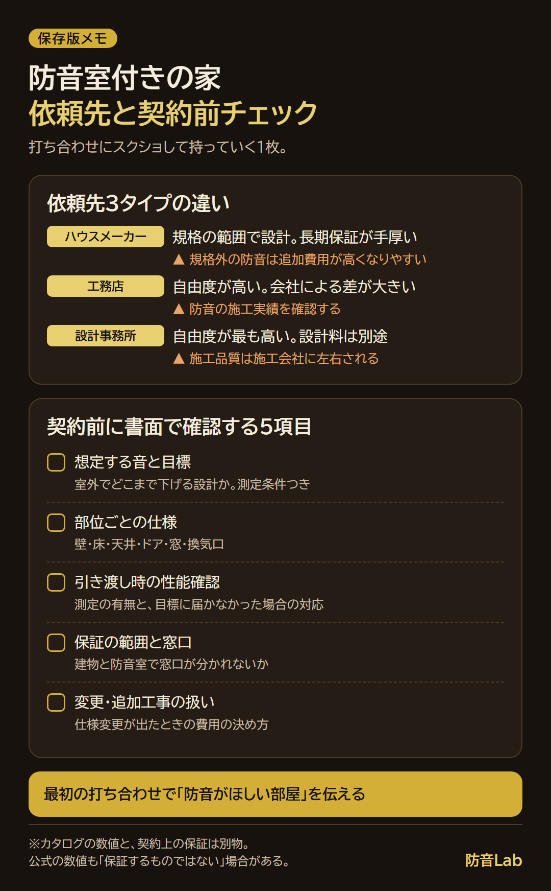

<RegionBanner />

注文住宅の強みは、<strong>設計の段階で「防音がほしい部屋がある」と伝えられること</strong>です。

防音室を作る場合も、寝室や書斎を静かにしたい場合も、伝えるタイミングが早いほど選べる方法が増えます。

そのうえで、先に「必要な防音の程度」を決め、その程度を数値と書面で示してくれる依頼先を選ぶと、失敗しにくくなります。

「ハウスメーカーか工務店か」を比べる前に、どの部屋で、どんな音を、何時に出すかを決めてください。

賃貸の防音に限界を感じて、持ち家で解決しようと考え始めた方も多いはずです。

この記事では、注文住宅・自由設計・建売住宅の違い、防音の程度の決め方、依頼先3タイプの違い、検討から引き渡しまでの流れ、契約前に書面で確認する項目をまとめます。

## 注文住宅は、設計の段階で防音の要望を伝えられる

防音を考えるうえで、家の買い方によって、できることが大きく変わります。

次の表は、アットホームと三菱地所ホームの解説をもとに、3つの買い方を防音の視点で整理したものです。

| 項目 | 注文住宅 | 自由設計（建築条件付き土地） | 建売住宅 |
| :--- | :--- | :--- | :--- |
| 設計の自由度 | 間取りや仕様、設備を自由に設計できる | 建築会社のモデルプランをベースに、間取りをある程度自由に決められる。建築会社は指定される | 土地と建物がセットで、間取りや設備は決まっている |
| 防音の要望の伝えやすさ | 設計の段階で、部屋ごとに伝えられる | プランの範囲で相談できる。大幅な変更は追加費用がかかる場合がある | 完成済みは原則変更できない。建築中や着工前なら、可能な範囲で相談できる場合がある |
| 入居までの期間の目安 | 半年から1年以上 | 半年から10か月程度 | 完成済みなら1〜3か月程度 |

つまり、建売住宅では、防音の仕様があらかじめ決まっているのが一般的です。

入居後に防音が必要になった場合は、後付けの工事が中心になります。

後付けの防音工事の種類と費用は、[防音工事の種類と価格比較](/ja/soundproof-room/construction-types-cost-comparison/)で整理しています。

引っ越し・後付け・設計の段階で伝える道の3つを比べたい場合は、[音の悩みの解決策は3つ](/ja/soundproof-room/noise-solutions-relocate-retrofit-custom-home/)をご覧ください。

一方、注文住宅は、<strong>家を建てる・注文する段階で「防音性能がほしい部屋がある」と伝える</strong>ことで、後付けより選択肢が広がります。

ここで大切なのは、伝える対象が「防音室」だけとは限らないことです。

防音の要望は、次の3段階に分けて考えると整理しやすくなります。

| 段階 | 内容 | 想定する人 |
| :--- | :--- | :--- |
| 専用の防音室 | 楽器・ドラム・シアターなどのために、部屋ごと防音を設計する | 音を大きく出す人 |
| 部屋ごとの防音強化 | 寝室・書斎・テレワークの部屋などの、壁・床・ドアの仕様を上げる | 静かな部屋がほしい人 |
| 間取りでの配慮 | 防音室を作らず、部屋の配置で生活音を避ける | 子育て世帯や睡眠を重視する人 |

防音室と別に、静かな部屋を用意する選択肢は、ハウスメーカーの公式にもあります。

たとえば大和ハウスは、防音室「奏でる家」とは別に、テレワーク・勉強・寝室向けの静音室「やすらぐ家」を用意しています。

三井ホームは、遮音床構造の標準仕様に加えて、遮音性能を高めた2つのタイプを用意しています。

間取りでの配慮は、ある住宅会社の解説では、子ども部屋をリビングの真上に配置しない、水回りを寝室やリビングから遠ざける、といった例が挙げられています。

どの段階で足りるかは、出す音と時間帯で決まります。

次の章で、防音の程度の決め方を整理します。

## 先に決めるのは「依頼先」ではなく「防音の程度」

防音室といっても、必要な性能は出す音で大きく変わります。

次の表は、大和ハウスが公式に分けている3つのグレードを、防音の程度を考える例として並べたものです。

| 出す音の程度 | 主な用途 | 大和ハウスの公式区分（減音目安） |
| :--- | :--- | :--- |
| 静けさを守りたい | テレワーク・勉強・寝室 | 静音室「やすらぐ家」（45dBA） |
| 楽器や映画を楽しみたい | ピアノ・ホームシアター・カラオケ | 防音室「奏でる家」（55dBA） |
| 大きな音・低音を出したい | ドラム・バンド演奏 | 防音室「奏でる家＋」（70dBA） |

このように、防音は程度によって別の設計になります。

ただし、大和ハウスは「性能値として保証するものではなく、使用状況や周辺の環境、間取りなどにより異なる場合があります」と注記しています。

数値は目安であり、契約上の保証とは別物だと考えてください。

ピアノなど楽器ごとの必要性能は、[ピアノ防音室ガイド](/ja/soundproof-room/piano-room-guide/)で整理しています。

映画とカラオケを両立したい場合の設計は、[自宅映画と自宅カラオケを両立する防音設計ガイド](/ja/soundproof-rental/home-theater-karaoke-soundproof-design/)が参考になります。

防音の程度を決めたあとの部屋の位置・広さ・窓の考え方は、[注文住宅で防音室を作る間取りのポイント](/ja/soundproof-room/custom-home-soundproof-room-layout/)にまとめています。

## 防音室を家に組み込む3つの方法

防音室の作り方は、大きく3つに分かれます。

| 方法 | 内容 | 向く場合 | 注意点 |
| :--- | :--- | :--- | :--- |
| 建物と一体で設計する | 壁・床・天井を含めて部屋ごと設計する。ハウスメーカーの商品プランや、工務店・設計事務所の個別設計 | 部屋の広さや形にこだわりたい | 防音の仕様が見積書に具体的に書かれているか確認する |
| ユニット型防音室を部屋に置く | 組み立て式の防音室を新築の部屋に設置する | 性能が製品として決まっていてほしい | 床の荷重・搬入経路・換気を設計段階で反映する |
| 建物は通常仕様で建て、防音は専門業者に依頼する | 防音工事の専門業者が防音室を施工する | 高い遮音性能が必要な場合 | 建物と防音室で保証や窓口が分かれないか確認する |

建物と一体で設計する方法の例として、大和ハウスは2026年4月から、用途ごとに空間を設計する専用空間「私の自由区」の提案を始めました。

同社は「建物と一体設計で防音室・静音室をつくれるので、長期のアフターサービスをご利用いただけます」としています。

この専用空間の内容は、[大和ハウス「私の自由区」防音室を検討して分かったこと](/ja/soundproof-room/daiwa-house-jiyuku-soundproof-review/)で整理しています。

高い遮音性能が必要な場合の専門業者の選び方は、[防音リフォーム業者の選び方](/ja/money/soundproof-contractor-selection-guide/)も参考になります。

## ハウスメーカー・工務店・設計事務所の違い

注文住宅の依頼先は、一般にハウスメーカー・工務店・設計事務所の3タイプに分かれます。

次の表は、LIFULL HOME'Sの解説をもとに、防音室を作る視点で整理したものです。

| 依頼先 | 一般的な特徴 | 防音で期待できること | 防音で気をつけること |
| :--- | :--- | :--- | :--- |
| ハウスメーカー | 設計は規格の範囲内。長期保証やアフターサポートが手厚い。工期は短め | 防音室を商品として用意している会社がある | 規格外の防音は追加費用が高くなりやすい |
| 工務店 | 設計の自由度が高く、地域に密着している。会社による差が大きい | 部屋ごとの個別対応がしやすい | 防音の施工実績は会社ごとに大きく違うため、実績の確認が必要 |
| 設計事務所 | 設計の自由度が最も高い。設計料・監理料が別途かかる | 防音の希望に合わせてゼロから設計できる | 施工は工務店が行うため、施工品質は施工会社に左右される |

ここで、多くの方が心の中で思うことがあります。

「大手に任せれば、防音も何とかしてくれるはず」という期待です。

その気持ちは自然ですが、期待があるほど、防音の性能を確認する質問を飲み込みやすくなります。

防音の数値は会社ごとに測り方が違い、公式にも「保証するものではない」と書かれています。

<strong>確認することは、会社を疑うことではなく、自分の安心を確かめること</strong>です。

各社の防音の公式表記の違いは、[防音室が作れるハウスメーカーおすすめ4社](/ja/soundproof-rental/housing-builder-soundproof-comparison/)で整理しています。

どの依頼先にも向き不向きがあり、「この依頼先が防音に一番強い」とは言い切れません。

必要な防音の程度と、確認できる実績・測定結果で判断するのが現実的です。

## 検討から引き渡しまでの流れと、防音の確認ポイント

注文住宅の流れは、情報収集から引き渡しまで段階に分かれます。

防音室付きの場合は、各段階で確認することが増えます。

| 段階 | やること | 防音のための確認 |
| :--- | :--- | :--- |
| 音の条件の整理 | 楽器・音量・時間帯・隣家との距離を書き出す | 間取りが決まる前に、防音の希望を最初の打ち合わせで伝える |
| 資金計画 | 総予算と、防音室に回せる金額を決める | 費用の目安は[防音 注文住宅の坪単価相場](/ja/money/custom-home-soundproof-price-guide/)を参照 |
| 情報収集 | 公式サイトの防音の記載、実例、見学会などを見る | 数値の測り方が会社で違うことを前提に比べる |
| 複数社に同条件で相談 | 同じ音の条件を伝えて、プランと概算を取る | 防音室の施工実績と、低音の演奏への対応実績を聞く |
| 見積もり・仕様の比較 | 壁・床・天井・ドア・窓・換気の項目ごとに比べる | 見積書に防音の仕様が具体的に書かれているか確認する |
| 契約 | 契約書・仕様書で防音の内容を確認する | 測定条件・保証・引き渡し時の性能確認を書面に残す |
| 着工から引き渡し | 工事の進み具合を確認する | 引き渡し前に、防音性能を確認する |

特に大切なのは、最初の段階です。

間取りが先に決まってから防音を足そうとすると、部屋の位置や窓の配置が制約になりやすくなります。

間取りの打ち合わせで防音の話を後回しにする失敗を避けるには、<strong>最初の打ち合わせで防音の希望を伝える</strong>ことです。

家づくりが初めてで、どう整理すればよいか分からない場合は、相談窓口を使う方法もあります。

その場合の整理の仕方と伝え方は、[注文住宅の家づくり相談で防音室の要望を伝える方法](/ja/soundproof-room/custom-home-soundproof-consultation-prep/)で解説しています。

住宅ローンへの組み込み方は、[防音室・ピアノ室は住宅ローンに組み込める](/ja/money/piano-soundproof-mortgage-tax-guide/)で整理しています。

ローンや税金の扱いは条件によって変わるため、金融機関や税理士などの専門家に確認してください。

## 契約前に書面で確認したい防音の項目

打ち合わせでの口頭の説明は、あとから確認できません。

契約前に、次の項目を契約書・仕様書・見積書に残すよう依頼してください。

- <strong>想定する音と目標</strong> : 出す音の種類と、室外でどの程度まで下げる設計か（測定条件つき）
- <strong>部位ごとの仕様</strong> : 壁・床・天井・ドア・窓・換気口の仕様と施工方法
- <strong>引き渡し時の性能確認</strong> : 測定の有無と、目標に届かなかった場合の対応
- <strong>保証の範囲と窓口</strong> : 建物と防音室で窓口が分かれないか、保証の期間と内容
- <strong>変更・追加工事の扱い</strong> : 仕様変更や追加が出たときの費用の決め方

打ち合わせに持っていける、依頼先の違いと確認項目の1枚にまとめました。

カタログの数値と、契約上の保証は別のものです。

数値が大きいことよりも、<strong>その数値が何を、どの条件で測ったものか</strong>を確認してください。

防音室は気密性が高くなるため、換気・結露・空調の計画も同時に決めておくことが大切です。

換気が不十分だと空気がこもり、結露やカビの原因になります。

防音の仕様と換気の仕様は、セットで確認してください。

## よくある失敗と防ぎ方

防音室付きの注文住宅で起こりやすい失敗を、防ぎ方とあわせて整理します。

| 失敗の例 | 原因 | 防ぎ方 |
| :--- | :--- | :--- |
| 窓から音が漏れた | 防音ガラスを使っても、サッシの選び方や取り付け方で性能が変わる | 防音室の施工実績を確認し、窓の仕様を見積書に残す |
| 思ったほど防音の効果がなかった | 契約内容が曖昧で、性能の保証がなかった | 仕様書で防音性能を確認し、引き渡し前に性能を確認する |
| 間取りが決まってから防音を足せなかった | 防音の希望を伝えるのが遅れた | 最初の打ち合わせで防音の希望を伝える |
| 担当者に防音の意図が伝わらなかった | 営業と設計の間で情報が共有されなかった | 設計担当者と直接話し、要望を文書で渡す |

上の2つの失敗例は、HOME4Uの解説にある「専門知識がない施工会社に依頼した場合」と「契約内容の曖昧さで性能保証がなかった場合」に基づいています。

後半の2つは、編集部が一般的な打ち合わせの進め方から整理した注意点です。

## まとめ：防音の程度から決め、契約前に書面に残す

防音室付きの注文住宅は、次の順で進めると判断しやすくなります。

- 出す音の種類と時間帯から、必要な防音の程度を決める
- 依頼先のタイプ（ハウスメーカー・工務店・設計事務所）の違いを知る
- 複数社に同じ条件でプランと概算を依頼する
- 契約前に、防音の仕様・測定条件・保証・引き渡し時の確認を書面に残す

最終的に目指すのは、夜に気兼ねなく音を出せて、近隣や家族と音の問題で揉めない暮らしです。

そのための確認は、時間がかかっても、契約前にしておく価値があります。

## 次に読む記事

- [音の悩みの解決策は3つ｜引っ越し・後付け・注文住宅の設計段階で伝える道](/ja/soundproof-room/noise-solutions-relocate-retrofit-custom-home/)
- [注文住宅で防音室を作る間取りのポイント](/ja/soundproof-room/custom-home-soundproof-room-layout/)
- [注文住宅の家づくり相談で防音室の要望を伝える方法](/ja/soundproof-room/custom-home-soundproof-consultation-prep/)
- [防音室が作れるハウスメーカーおすすめ4社](/ja/soundproof-rental/housing-builder-soundproof-comparison/)
- [防音 注文住宅の坪単価相場](/ja/money/custom-home-soundproof-price-guide/)
- [防音室・ピアノ室は住宅ローンに組み込める](/ja/money/piano-soundproof-mortgage-tax-guide/)

## 出典・確認日

各社の記載や制度は変更されることがあります。契約前に、最新の情報と見積書・仕様書を確認してください。

- 大和ハウス「音の自由区」提案開始のプレスリリース（2023年4月20日）：[PR TIMES](https://prtimes.jp/main/html/rd/p/000001895.000002296.html)（確認日：2026年10月6日）
- 大和ハウス「私の自由区」提案開始のプレスリリース（2026年4月23日）：[共同通信PRワイヤー](https://kyodonewsprwire.jp/release/202604227922)（確認日：2026年10月6日）
- アットホーム「自由設計とは？注文住宅・建売住宅と何が違う？」（2024年10月28日更新）：[アットホーム](https://www.athome.co.jp/contents/custom/build-kiso/free-design/)（確認日：2026年10月6日）
- 三菱地所ホーム「建売住宅と注文住宅の違いとは？」（2025年11月17日）：[三菱地所ホーム](https://www.mitsubishi-home.com/column/9579/)（確認日：2026年10月6日）
- 住宅工房アリアンス「注文住宅でできる防音対策5選」（2021年8月15日）：[住宅工房アリアンス](https://neo.ac/column/12202/)（確認日：2026年10月6日）
- 三井ホーム「快適に暮らす」（遮音床構造）：[三井ホーム](https://www.mitsuihome.co.jp/home/mocxwall/comfortable/)（確認日：2026年10月6日）
- LIFULL HOME'S「注文住宅はハウスメーカー、工務店、設計事務所のどこに依頼するのがいいのか？」：[ホームズ](https://www.homes.co.jp/cont/iezukuri/iezukuri_00001/)（確認日：2026年10月6日）
- HOME4U「注文住宅に防音室を作る際の注意点！おすすめ間取り5選と費用シミュレーションも」：[HOME4U](https://house.home4u.jp/contents/madori-47-9105)（確認日：2026年10月6日）
