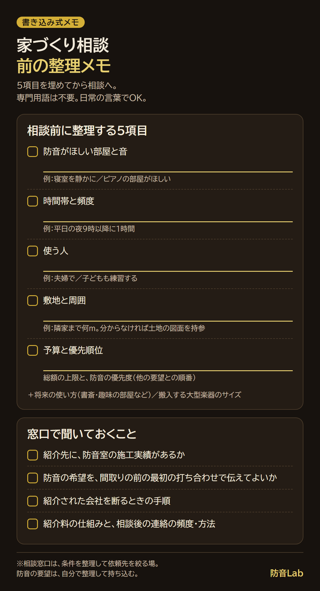

<RegionBanner />

注文住宅の家づくり相談に、防音の話を持ち込んでも構いません。

専用の防音室を作る場合も、寝室や書斎を静かにしたいだけの場合も、設計の前に伝えるほど選べる方法が増えます。

ただし、相談窓口は防音の専門家に設計を任せる場所ではなく、<strong>条件を整理して依頼先を絞るための場所</strong>です。

だから、相談の前に防音の要望を整理しておくことが大切です。

整理するのは、<strong>防音がほしい部屋と音の種類・時間帯・使う人・敷地・予算と優先順位</strong>の5項目です。

専門用語は必要なく、「どの部屋で、何の音を、何時に出すか」を日常の言葉で言えれば十分です。

この記事では、相談窓口でできること・できないこと、利用者の口コミ、5つの整理項目、伝え方の例をまとめます。

## 家づくり相談の窓口でできること・できないこと

家づくり相談は、住宅の購入や新築を考える人が、会社選びの前に無料で相談できるサービスです。

例として、LIFULL HOME'Sの「住まいの窓口」の公式情報を整理します（2026年10月6日確認）。

| 項目 | 公式の記載 |
| :--- | :--- |
| 対象 | 注文住宅・新築一戸建て・中古一戸建て・中古マンション・リフォームやリノベーションを検討する人 |
| 相談できる内容 | 資金計画・住宅ローン、希望条件の整理、建築・不動産会社選び、ファイナンシャルプランナーの紹介（無料） |
| 費用 | 完全無料。建築会社・不動産会社からの紹介料で運営される |
| 相談の方法 | 店舗・オンライン・電話・LINE |
| 流れ | 資金計画、条件整理、建築・不動産会社選び、その後のサポート |

「無料だと、何か裏があるのでは」と感じる方もいるかもしれません。

公式には、建築会社や不動産会社からの紹介料で運営されると書かれています。

つまり、費用は依頼先の会社が負担する仕組みで、相談者が支払うものではありません。

一方で、この仕組みには知っておきたい前提もあります。

| 期待しやすいこと | 実際に押さえておくこと |
| :--- | :--- |
| 防音に強い会社を選んでくれる | 紹介されるのは、一般に窓口が提携している会社です。防音の施工実績は会社ごとに違うため、自分で確認します |
| 防音の設計や性能を相談できる | 防音の設計・性能は、紹介先の設計担当や施工側が決めます。窓口は条件の整理と会社選びが中心です |
| 予算の相談ができる | 資金計画の相談はできますが、防音室に回す金額は自分で優先順位を決めて伝えます |

窓口が「防音の専門家」とは限らないからこそ、<strong>防音の要望は自分で整理して持ち込む</strong>ことが重要になります。

## 利用者の口コミ：良い声と気になる声

実際の利用者は、どう感じているのでしょうか。

公開されている口コミを、媒体の性格とあわせて整理します。原文は各出典ページで確認してください。

| 媒体 | 規模・日付 | 良い声（要旨） | 気になる声（要旨） |
| :--- | :--- | :--- | :--- |
| 家語（家づくり比較サイト） | 口コミ44件、総合4.47点（5点満点）。利用者は20〜50代 | 家づくりの知識がなくても説明してもらえる。営業がなく中立に助言してもらえた。断りの連絡を代行してもらえた | 紹介された業者が期待に届かなかった。営業のノルマを感じた。窓口のあるエリアが限られる。事前の予約が必要 |
| LIFULL HOME'S 公式記事（運営会社自身の記事） | 2021年9月掲載、2025年6月更新 | 今の悩みだけでなく将来まで考えた助言をもらえた。条件整理を手伝ってもらい、会社選びがしやすくなった | 悪い口コミの掲載はなし。店舗相談は一戸建て向けで、予約が必要 |
| ダイヤモンド不動産研究所（記者の体験談） | 2021年公開、2022年更新 | 希望をもとに4社を紹介され、うち1社と契約。紹介後のフォローもあった | 気になった点の記載はなし |

媒体ごとに性格が違う点に注意してください。

運営会社自身の記事は、利用者を増やす目的で書かれているため、第三者の口コミとは分けて読む必要があります。

比較サイトの口コミも、評価の集計方法が公開されていない場合があります。

公式サイトの利用満足度は98.6%（調査対象2,078組、集計期間は2023年8月から2026年7月）、相談実績は27,000件以上と掲載されています。

ここで、<strong>確認できた口コミの中に、防音や音について相談した内容は見つかりませんでした</strong>。

家づくり相談の口コミは、資金計画や会社選びについてのものが中心です。

だから、防音の要望は、相談窓口が自然に拾ってくれるとは考えず、自分から具体的に伝える前提で準備します。

防音室という言葉を使わなくても、「この部屋の音を気にしたい」と部屋と音を具体的に伝えれば、会話は成り立ちます。

## 相談前に整理する5つの項目

ここで、防音の知識がなくて不安な方に伝えたいことがあります。

<strong>専門用語や数値を知らなくても、相談は成り立ちます</strong>。

次の5項目を、日常の言葉でメモしておけば十分です。

注文住宅は、建売住宅と違い、設計の段階で部屋ごとに防音の要望を伝えられます。

防音室を作るほどではなくても、<strong>「この部屋は静かにしたい」と伝えるだけで、床や壁の仕様、部屋の配置を検討してもらえる</strong>可能性があります。

注文住宅・自由設計・建売住宅の違いは、[注文住宅で防音室を作る依頼先](/ja/soundproof-room/custom-home-soundproof-builder-selection/)で整理しています。

| 項目 | 決めること | 日常の言葉での言い換え例 |
| :--- | :--- | :--- |
| 防音がほしい部屋と音の種類 | どの部屋で、何の音を出す・防ぎたいか（楽器・歌・配信・映画・カラオケ・テレワーク・睡眠・子どもの足音など） | 「ピアノを弾く部屋がほしい」「寝室を静かにしたい」「子ども部屋の音を下の階に響かせたくない」 |
| 時間帯と頻度 | 何時に、週に何回、1回何時間 | 「平日の夜9時以降に1時間」 |
| 使う人 | 一人で使うか、家族で使うか、将来の使い方 | 「夫婦で使う」「子どもも練習する」 |
| 敷地と周囲 | 隣家との距離、道路、近隣の環境 | 「隣の家まで何mくらいか」（分からなければ土地の図面を持参する） |
| 予算と優先順位 | 総予算の上限、防音の優先度 | 「総額の上限は決まっていて、防音は最優先」 |

予算を言うと、そこまで使わされそうで気が重い方もいるでしょう。

その場合は、<strong>総額の上限</strong>と、<strong>他の要望との優先順位</strong>を分けて伝えると、提案の精度が上がります。

優先順位は、たとえば「防音」「広さ」「立地」「デザイン」を並べて、順番をつけるだけで構いません。

費用の目安は、[防音 注文住宅の坪単価相場](/ja/money/custom-home-soundproof-price-guide/)で整理しています。

5項目に加えて、次の2つも伝えておくと、あとの打ち合わせが楽になります。

- <strong>将来の使い方</strong> : 子どもが独立したあとに、書斎や趣味の部屋として使うかどうか
- <strong>搬入する楽器・機材</strong> : グランドピアノなど大型の楽器があるか、サイズはどのくらいか

書き込んで使えるメモにまとめました。

防音室の位置・広さ・窓・換気の考え方は、[注文住宅で防音室を作る間取りのポイント](/ja/soundproof-room/custom-home-soundproof-room-layout/)にまとめています。

要望を整理する段階で読んでおくと、相談の場で具体的に話せます。

## 相談当日の伝え方の例と、聞いておきたいこと

伝え方に迷う方のために、例を示します。以下は一般的な例文で、実際の相談内容を引用したものではありません。

- 「2階の子ども部屋の足音が、1階の寝室に響かない間取りにしたい」
- 「ピアノを夜21時まで弾きたいので、防音の程度から相談したい」
- 「ドラムを叩く予定なので、低音への対応実績がある会社を知りたい」
- 「夜に映画を大きな音で見たいので、家族の寝室に響かない間取りを考えたい」

あわせて、窓口には次のことも確認しておくと安心です。

- 紹介してもらえる会社に、防音室の施工実績があるか
- 防音の希望を、間取りを決める前の最初の打ち合わせで伝えてよいか
- 紹介を受けた会社を断るときの手順（口コミには、断りを代行してもらえたという声があります。公式で確認してください）
- 紹介料の仕組みと、相談後の連絡の頻度や方法

「一度相談したら、断れなくなりそう」と不安な方は、連絡手段と頻度を最初に確認しておくだけでも、気持ちが軽くなります。

## 相談したあとの進め方

家づくり相談は、依頼先を決めるための入口です。

相談後は、<strong>複数社に同じ条件でプランと概算を依頼</strong>して比べます。

ハウスメーカー・工務店・設計事務所の違いや、契約までの流れは、[防音室付き注文住宅の依頼先｜選び方と流れ](/ja/soundproof-room/custom-home-soundproof-builder-selection/)で解説しています。

各社の防音の公式表記の違いと、数値の読み方は、[防音室が作れるハウスメーカーおすすめ4社](/ja/soundproof-rental/housing-builder-soundproof-comparison/)が参考になります。

契約前には、防音の性能・測定条件・保証・引き渡し時の確認を書面に残すことを忘れないでください。

ローンの組み方や税金の扱いは条件によって変わります。

詳しくは[防音室・ピアノ室は住宅ローンに組み込める](/ja/money/piano-soundproof-mortgage-tax-guide/)を読んだうえで、金融機関や税理士などの専門家に確認してください。

## 家づくり相談を使う前に知っておくこと

家づくり相談は便利ですが、いくつか前提があります。

- <strong>対応エリア</strong> : 店舗は一部の地域に限られます。オンライン・電話・LINEでの相談もあるため、最新の対応エリアと方法は公式サイトで確認してください
- <strong>予約</strong> : 口コミでも、事前の予約が必要という声があります
- <strong>紹介先</strong> : 紹介される会社は窓口と提携した会社が中心です。気になる声にも、紹介された会社が期待に届かなかったというものがありました
- <strong>ほかの方法との併用</strong> : 相談だけで終えてもよく、ハウスメーカーへの直接の問い合わせや展示場の見学も並行できます

防音室は気密性が高くなるため、換気・結露の計画も、相談の早い段階で依頼先に確認しておきましょう。

## まとめ：防音の要望は、自分で整理して持ち込む

家づくり相談は、依頼先を決める前に条件を具体化する場です。

防音について窓口が何をしてくれるかは確認できていないため、<strong>防音がほしい部屋と音の種類・時間帯・使う人・敷地・予算と優先順位の5項目</strong>を自分で整理して持ち込むのが近道です。

目指すのは、夜に気兼ねなく音を出せて、近隣や家族と音の問題で揉めない暮らしです。

相談の質を上げる準備が、その暮らしに近づく最初の一歩になります。

## 次に読む記事

- [音の悩みの解決策は3つ｜引っ越し・後付け・注文住宅の設計段階で伝える道](/ja/soundproof-room/noise-solutions-relocate-retrofit-custom-home/)
- [注文住宅で防音室を作る間取りのポイント](/ja/soundproof-room/custom-home-soundproof-room-layout/)
- [防音室付き注文住宅の依頼先｜選び方と流れ](/ja/soundproof-room/custom-home-soundproof-builder-selection/)
- [防音室が作れるハウスメーカーおすすめ4社](/ja/soundproof-rental/housing-builder-soundproof-comparison/)
- [防音 注文住宅の坪単価相場](/ja/money/custom-home-soundproof-price-guide/)
- [防音室・ピアノ室は住宅ローンに組み込める](/ja/money/piano-soundproof-mortgage-tax-guide/)

## 出典・確認日

サービスの内容や対応エリアは変更されることがあります。利用前に最新の公式情報を確認してください。

- LIFULL HOME'S 住まいの窓口（公式）：[住まいの窓口](https://counter.homes.co.jp/)（確認日：2026年10月6日）
- 家語「ライフルホームズ住まいの窓口の口コミ・評判」：[家語](https://iegatari.com/sodan/lifullhomes.html)（確認日：2026年10月6日）
- LIFULL HOME'S「住まいの窓口の口コミや評判」（運営会社自身の記事）：[ホームズ](https://www.homes.co.jp/cont/buy_kodate/buy_kodate_00843/)（確認日：2026年10月6日）
- ダイヤモンド不動産研究所「LIFULL HOME'S住まいの窓口の評判は？」：[ダイヤモンド不動産研究所](https://diamond-fudosan.jp/articles/-/1111320)（確認日：2026年10月6日）
