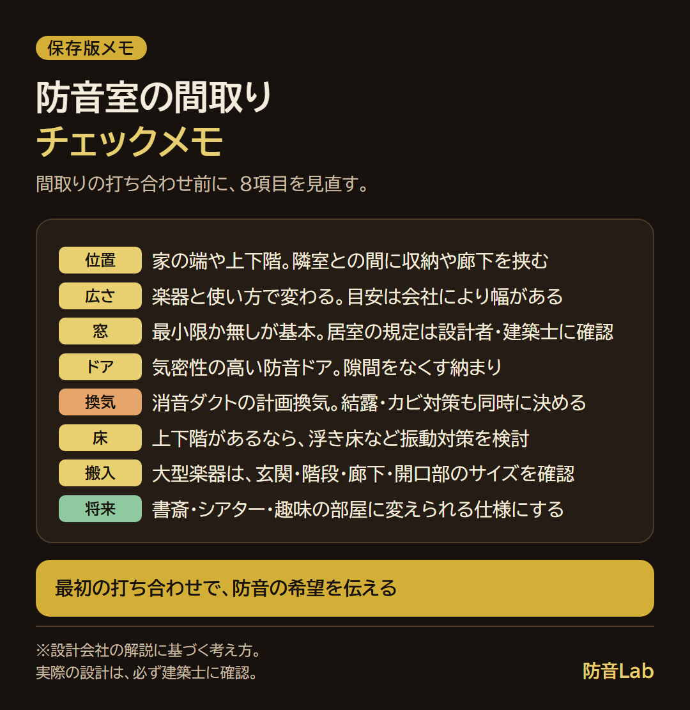

<RegionBanner />

注文住宅で防音室を作る間取りは、<strong>防音室を置く位置を最初に決め、窓・換気・搬入を位置に合わせて組み立てる</strong>と失敗しにくくなります。

基本は、家の端や上下階に置き、隣の部屋との間に収納や廊下を挟むことです。

窓は最小限か無しを基本にし、換気は音を抑えた計画換気で確保します。

間取りが決まってから防音を足そうとすると、位置や窓の配置が制約になります。

だから、<strong>最初の打ち合わせで防音の希望を伝える</strong>ことが、間取りで失敗しない最大のポイントです。

専用の防音室を作らない場合も、寝室や書斎を静かにするための考え方は共通しています。

この記事では、位置・広さ・窓やドア・換気・床・搬入経路・将来の用途変更に加えて、防音室を作らない部屋の考え方も、出典つきで整理します。

## 防音室を置く位置｜端・上下階・収納や廊下を挟む

防音室の位置は、間取りの中で最初に決めるべき要素です。

設計会社の解説では、防音室は家の端や上下階に配置し、隣接する部屋との間に収納や廊下を挟むことで、音漏れをさらに抑えられるとされています。

別の設計事務所も、生活空間とワンクッション置いた配置が有効だと述べています。

つまり、防音室の壁一枚で音を止めるのではなく、<strong>周囲に緩衝になる空間を置く</strong>考え方です。

次の表は、配置の考え方を整理したものです。実例の間取りではなく、考え方のパターンです。

| 配置の考え方 | 内容 | 気をつけること |
| :--- | :--- | :--- |
| 家の端に置く | 隣室が片側だけになり、音が伝わる方向を減らせる | 外壁側の窓や隣家との距離を確認する |
| 隣室との間に収納・廊下を挟む | 収納や廊下が音の緩衝になる | 収納の壁も遮音の仕様を確認する |
| 上下階の関係を考える | 防音室の真上や真下に寝室などを置かない | 床の振動の伝わり方を設計者に確認する |
| 地下・離れ・屋上など別の場所に置く | 生活空間から離せる | 地下は湿気・換気、離れは動線に注意する |

地下・離れ（別棟）・屋上は、設置場所の選択肢として設計会社の解説に挙げられています。

ここで、多くの方が迷うことがあります。

家族の気配を感じられるリビングの近くに置きたい一方で、音が漏れるのは避けたい、という気持ちです。

家の端に置くと家族と離れる寂しさがあり、近くに置くと音が気になります。

折衷案として、<strong>収納や前室を挟みつつ、視覚的なつながりを持たせる</strong>方法があります。

ただし、窓は防音上の弱点になるため、位置と仕様は設計者と相談してください。

## 広さ｜楽器と使い方で変わる目安

防音室の広さは、楽器と使い方で変わります。

設計会社の解説では、広さの目安が次のように示されています。

| 用途 | 広さの目安（設計会社Aの記載） |
| :--- | :--- |
| ボーカル・管楽器 | 1〜2畳 |
| アップライトピアノ・ギター | 2〜3畳 |
| グランドピアノ | 3畳以上 |
| バンド演奏・映画鑑賞 | 6畳以上 |

別の設計会社の解説では、6畳がピアノ・カラオケ向け、10畳がドラム・映画鑑賞向け、15畳以上がバンド練習・シアター向けとされており、数値が異なります。

違いが出るのは、<strong>演奏者が使う内寸を指すのか、壁の厚みを含めた部屋の大きさを指すのか</strong>など、基準が会社ごとに違うためと考えられます。

そのため、広さの数値は<strong>会社により幅がある目安</strong>として受け取ってください。

実際の必要面積は、楽器の大きさ、座る位置、機材の量、使う人数で変わります。

ピアノの具体的な条件は、[ピアノ防音室ガイド](/ja/soundproof-room/piano-room-guide/)で整理しています。

防音室を大きくすると、そのぶん他の部屋が削られ、費用も増えます。

家全体のバランスの中で、必要な広さを決めることが大切です。

費用の目安は、[防音 注文住宅の坪単価相場](/ja/money/custom-home-soundproof-price-guide/)を参照してください。

## 窓・ドア・換気・床の考え方

位置と広さが決まったら、開口部と設備を考えます。

### 窓

防音性能を重視するなら、窓なしが理想とされています。

ただし、居室として扱う場合には、建築基準法に関わる規定があるとされています。

窓を設けるかどうか、どのような仕様にするかは、<strong>設計者・建築士に確認</strong>してください。

窓を設ける場合は、防音サッシや二重サッシ構造にして、窓の前に音の緩衝になる空間（前室）を設ける方法が挙げられています。

窓の防音の基本は、[賃貸と戸建てで変わる窓の防音対策](/ja/soundproof-room/shanon-vs-bouon-window/)も参考になります。

窓から音が漏れる点は、閉塞感との間で迷いやすい部分です。

窓がないと息苦しそうだと感じる場合は、照明や壁の仕上げで広がりを出す方法もあります。

### ドア

ドアは気密性の高い防音ドアを使い、隙間を極力なくす納まりにします。

壁が高性能でも、ドアに隙間があると、そこから音が抜けます。

### 換気・空調

防音室は気密性が高いため、空気がこもりやすくなります。

そのため、<strong>消音ダクトを組み込んだ計画換気</strong>や、音の小さい換気扇、空調の計画が必要です。

換気が不十分だと、結露やカビのリスクも高まります。

演奏中は体温や機材の熱で室温が上がるため、空調の計画も同時に決めてください。

### 床

上下階がある場合は、床の振動の伝わりも検討します。

振動を抑える工法のひとつに、浮き床構造があります。

浮き床の考え方は、[低周波・振動対策の基礎](/ja/knowledge/vibration-isolation-technology-trend/)に詳しくまとめています。

## 搬入経路と将来の用途変更

見落とされやすいのが、楽器や機材を運び込む経路です。

グランドピアノのような大型楽器は、玄関・階段・廊下・開口部のサイズによっては、搬入できない場合があります。

設計の段階で、搬入する楽器のサイズと、運び込む経路を確認してください。

もうひとつ、多くの方が不安に感じることがあります。

子どもが独立して演奏しなくなったら、使い道のない部屋になるのでは、という心配です。

この不安への現実的な答えは、<strong>将来の用途変更を前提に設計する</strong>ことです。

たとえば、次のような使い方に切り替えられる仕様にしておくと安心です。

- 書斎・テレワークの部屋
- ホームシアターや趣味の部屋
- 来客用の寝室

用途が変わっても使えるように、コンセントの位置や数、照明、換気の余裕を設計に織り込みます。

防音室は、音を出すための部屋であると同時に、静かに過ごせる部屋でもあります。

## 防音室を作らない部屋の考え方｜寝室・書斎・子ども部屋

注文住宅では、専用の防音室を作らなくても、設計の段階で伝えることで、静かな部屋を作れる可能性があります。

ある住宅会社の解説では、防音対策として次の内容が挙げられています。

- <strong>間取りの工夫</strong> : 子ども部屋をリビングの真上に配置しない。水回り（洗濯機・浴室・トイレ）を寝室やリビングから遠ざける。隣家との境界に水回りを置かない
- <strong>部分ごとの対策</strong> : 天井・床・壁を二重構造にする。窓は隣家から遠い位置に配置し、二重窓や複層ガラスを採用する。玄関に防音ドアを検討する

ハウスメーカーの公式にも、防音室とは別の選択肢があります。

大和ハウスは、テレワーク・勉強・寝室向けの静音室「やすらぐ家」（減音目安45dBA）を用意しています。

三井ホームは、遮音床構造の標準仕様に加えて、遮音性能を高めた2つのタイプを用意しています。

次の表は、部屋ごとに伝えるとよい内容を整理したものです。上記の解説をもとにした編集上の整理で、各社の仕様とは別です。

| 部屋 | 気になる音 | 設計で伝えるとよいこと |
| :--- | :--- | :--- |
| 寝室 | 外の音・水回りの音・家族の生活音 | 水回りから離す位置、窓の位置、必要なら床・壁の仕様強化 |
| 書斎・テレワークの部屋 | 家族の声・来客・外の音 | 出入口やリビングから離す位置、ドアの仕様 |
| 子ども部屋 | 足音・遊ぶ音（階下や隣室へ） | リビングや寝室の真上に置かない配置、床の仕様 |

どの程度の仕様まで必要かは、敷地や構造、出す音の大きさによって変わります。

「防音室にするほどではないが、この部屋は静かにしたい」と、部屋と音を具体的に伝えてください。

建売住宅は、間取りや仕様があらかじめ決まっているのが一般的です。

注文住宅と建売住宅の違いは、[注文住宅で防音室を作る依頼先](/ja/soundproof-room/custom-home-soundproof-builder-selection/)で整理しています。

## 用途別の間取りの考え方

用途によって、間取りで優先するポイントが変わります。

次の表は、各用途で優先して確認したい点の編集上の整理です。

| 用途 | 優先して確認すること |
| :--- | :--- |
| ピアノ・管楽器・歌 | 時間帯に合わせた防音の程度、近隣との距離、広さ、換気 |
| ドラム・バンド | 低音は振動として伝わりやすいため、位置・床の構造・隣室との距離を最優先 |
| ホームシアター・カラオケ | 遮音に加えて、音の響き（残響）の調整、換気 |
| テレワーク・配信 | 外の音の影響、換気、声が漏れない程度の防音 |

ドラムなどの低音は、壁だけでなく床や構造を伝わって響きます。

そのため、位置と床の構造の検討を最優先にしてください。

ホームシアターとカラオケを両立する設計は、[自宅映画と自宅カラオケを両立する防音設計ガイド](/ja/soundproof-rental/home-theater-karaoke-soundproof-design/)で解説しています。

ハウスメーカーごとの防音の公式表記は、[防音室が作れるハウスメーカーおすすめ4社](/ja/soundproof-rental/housing-builder-soundproof-comparison/)で整理しています。

## 間取りの希望を整理して、打ち合わせへ

間取りの考え方を踏まえて、次の項目をメモにまとめてから打ち合わせに臨みます。

- 防音室の位置の希望と、近くに置きたくない部屋
- 想定する広さと、置く楽器・機材のサイズ
- 窓の有無と、換気・空調の希望
- 搬入する大型楽器の有無
- 将来の使い方

打ち合わせの前に見直せる、8項目の1枚にまとめました。

依頼先ごとの違いや、契約までの流れは、[防音室付き注文住宅の依頼先｜選び方と流れ](/ja/soundproof-room/custom-home-soundproof-builder-selection/)で解説しています。

家づくりの相談窓口を使う場合の整理の仕方と伝え方は、[注文住宅の家づくり相談で防音室の要望を伝える方法](/ja/soundproof-room/custom-home-soundproof-consultation-prep/)にまとめています。

間取りの打ち合わせでは、<strong>最初の打ち合わせで防音の希望を伝える</strong>こと、そして、聞いて分からないことは遠慮せず質問することが大切です。

図面を見て防音の意図が分からないときは、「この壁・床・ドアで、何を想定していますか」と聞いてください。

## まとめ：位置から決めて、窓・換気・搬入を合わせる

防音室付きの間取りは、次の順で考えると整理しやすくなります。

- 位置：家の端や上下階、収納や廊下を挟む
- 広さ：楽器と使い方に合わせた幅のある目安
- 窓・ドア・換気：窓は最小限か無し、気密の高いドア、計画換気
- 搬入と将来：搬入経路の確認と、用途変更に強い設計

目指すのは、夜に気兼ねなく音を出せて、家族と音の問題で揉めない暮らしです。

そのための間取りは、最初の打ち合わせから防音を前提に組み立てることで実現しやすくなります。

## 次に読む記事

- [音の悩みの解決策は3つ｜引っ越し・後付け・注文住宅の設計段階で伝える道](/ja/soundproof-room/noise-solutions-relocate-retrofit-custom-home/)
- [防音室付き注文住宅の依頼先｜選び方と流れ](/ja/soundproof-room/custom-home-soundproof-builder-selection/)
- [注文住宅の家づくり相談で防音室の要望を伝える方法](/ja/soundproof-room/custom-home-soundproof-consultation-prep/)
- [防音室が作れるハウスメーカーおすすめ4社](/ja/soundproof-rental/housing-builder-soundproof-comparison/)
- [防音 注文住宅の坪単価相場](/ja/money/custom-home-soundproof-price-guide/)
- [ピアノ防音室ガイド](/ja/soundproof-room/piano-room-guide/)

## 出典・確認日

設計会社の目安や規定は変更されることがあります。実際の設計は、必ず建築士や依頼先の設計担当者に確認してください。

- Studio AIA「注文住宅で防音室を設ける実例集｜間取り・工法・注意点を徹底解説」（2026年3月9日）：[Studio AIA](https://studioaia.jp/media/detail/20260309/)（確認日：2026年10月6日）
- アーネストアーキテクツ「注文住宅の防音室とは？ 用途別の空間設計や後悔しないためのポイント」（2025年10月6日）：[アーネストアーキテクツ](https://earnest-arch.jp/column/luxury-custom-house/soundproofroom/)（確認日：2026年10月6日）
- 住宅工房アリアンス「注文住宅でできる防音対策5選」（2021年8月15日）：[住宅工房アリアンス](https://neo.ac/column/12202/)（確認日：2026年10月6日）
- 大和ハウス「音の自由区」提案開始のプレスリリース（2023年4月20日）：[PR TIMES](https://prtimes.jp/main/html/rd/p/000001895.000002296.html)（確認日：2026年10月6日）
- 三井ホーム「快適に暮らす」（遮音床構造）：[三井ホーム](https://www.mitsuihome.co.jp/home/mocxwall/comfortable/)（確認日：2026年10月6日）
- WPC100「注文住宅の防音室｜新築で後悔しない間取りづくりのポイント」（2026年8月28日）：[WPC100](https://www.wpc100.co.jp/housing-column/%E6%B3%A8%E6%96%87%E4%BD%8F%E5%AE%85%E3%81%AE%E9%98%B2%E9%9F%B3%E5%AE%A4%EF%BD%9C%E6%96%B0%E7%AF%89%E3%81%A7%E5%BE%8C%E6%82%94%E3%81%97%E3%81%AA%E3%81%84%E9%96%93%E5%8F%96%E3%82%8A%E3%81%A5%E3%81%8F/)（確認日：2026年10月6日）
