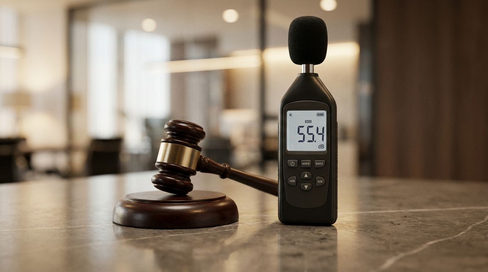
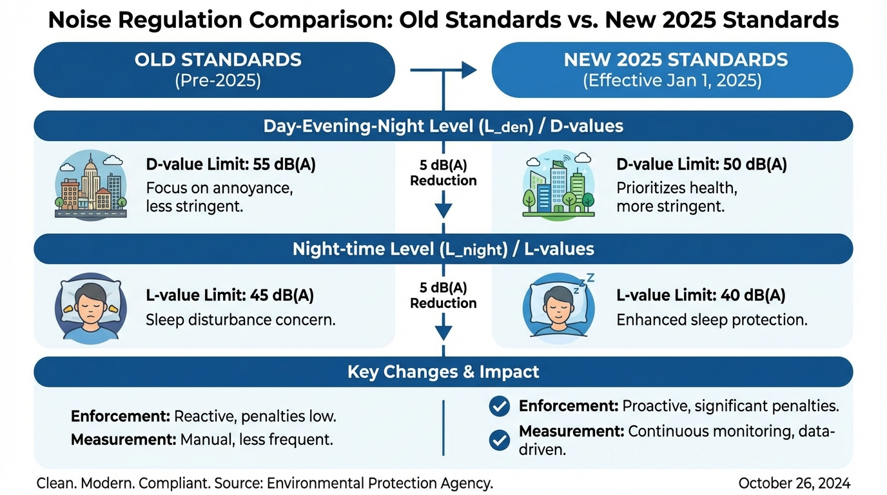

"Is the neighbor's TV too loud to sleep?" "Did you get a complaint about your child’s footsteps?" —— For too long, noise disputes in Japanese apartments were a "suffer in silence" game. But <strong>everything changes with the 2025 legal update.</strong>

The Ministry of the Environment has significantly lowered the hurdles for administrative intervention in "Lifestyle Noise." It's no longer just about decibel levels (dB); the <strong>redefined "Tolerable Limits"</strong> now give victims actual legal ground to stand on. Silence is no longer a luxury; it is a right that can be defended with evidence.

In this article, we explain how the latest 2025 regulations protect your peace of mind and the exact steps to handle noise disputes with "Legal Victory" using modern measurement standards.

## 1. The 2025 Legal Shift: From Industrial to \"Lifestyle Noise\"

Traditional noise laws in Japan focused primarily on \"Industrial Noise\" from factories or construction. In 2025, the focus shifts toward <strong>\"Lifestyle Noise\" (Seikatsu Souon)</strong>.

### Stronger Guidelines for Dispute Resolution

The Ministry of the Environment is providing clearer guidelines for local governments to handle noise complaints between neighbors.

- <strong>Lower Hurdle for Intervention</strong>: Local governments are being encouraged to take a more active role in measuring and mediating disputes.
- <strong>Redefining \"Tolerable Limits\"</strong>: Standards are becoming stricter, considering not just decibel levels but also the type of sound (e.g., low-frequency noise) and specific timeframes.

## 2. The \"Energy Efficiency = Silence\" Revolution

The mandatory energy efficiency standards for all new buildings starting April 2025 are a huge boost for soundproofing.

### Window Upgrades Boost \"D-Values\"

To meet energy standards, buildings must upgrade their windows—the weakest link for both heat and sound.

- <strong>High-Performance Sash and Double Glazing</strong>: Airtight, energy-efficient windows are naturally excellent at blocking external noise.
- <strong>Improved Base Performance</strong>: Post-2025 new builds will likely achieve <strong>D-35 to D-40 insulation performance</strong> as standard, without extra options.

This creates a clear gap between new \"Silent Homes\" and older, noisy properties, affecting their relative value.

## 3. Latest 2025: Moving Toward Mandatory Disclosure

The Ministry of Land, Infrastructure, Transport and Tourism is considering making \"Sound Insulation Grades\" a more prominent part of housing performance disclosure.

| Category                     | 2025 Trends/Goals              | Expected Impact                           |
| :--------------------------- | :----------------------------- | :---------------------------------------- |
| <strong>Airborne Sound (D-value)</strong> | Targeting D-45+ for apartments | Fewer disputes over neighbors' voices/TVs |
| <strong>Impact Sound (L-value)</strong>   | Targeting L-60 or lower        | Reduced stress from footsteps above       |
| <strong>Windows/Sashes</strong>           | T-2 to T-3 grades as standard  | Freedom from road and aircraft noise      |

Consumers will soon be able to compare \"How silent is this home?\" using standardized numbers.

## 4. Market Impact: Silence as a Determinant of Asset Value

1.  <strong>Premium for Soundproof Rentals</strong>: Specialized brands like \"Musision\" will likely see even higher demand and premium rent as legal standards rise.
2.  <strong>Renovation Era</strong>: The gap between new builds and existing homes is driving a massive market for \"Soundproof Window Retrofitting\" and DIY acoustic panels, supported by government subsidies.
3.  <strong>Legal Risks for Landlords</strong>: As \"Silence\" becomes a standard expectation, landlords may face more legal pressure to ensure rooms meet modern acoustic needs.

## 5. Global Comparison: Moving Toward the \"Silent Standard\"

In countries like Germany and the UK, "Acoustic Comfort" is already a legal obligation for healthy living. Japan's 2025 reforms are a major step toward catching up with these <strong>International "Silent Standards."</strong>

## Conclusion: Protecting Silence as a Right

The 2025 reforms send a clear message: living in silence is a right.

- <strong>Buyers</strong>: Demand high acoustic performance in new builds to protect your future asset value.
- <strong>Owners</strong>: Now is the best time to invest in window retrofitting while subsidies like \"Window Renovation 2025\" are available.

The era of \"Silence is Luxury\" is over. Welcome to the era where silence is a standard part of a high-quality life in Japan.

---

## Related Posts

- <strong>[Advanced Window Renovation 2025: Up to 2M JPY Subsidy](/en/knowledge/building-code-reform-2025-soundproof/)</strong> : Strategic funding for silence.
- <strong>[Apartment Noise Disputes and Legal Limits](/en/knowledge/noise-complaint-solution/)</strong> : The boundary of what you must tolerate.
- <strong>[ESG Investment and the Soundproof Industry](/en/knowledge/soundproof-market-esg-trend/)</strong> : Why silence is becoming an investment target.
