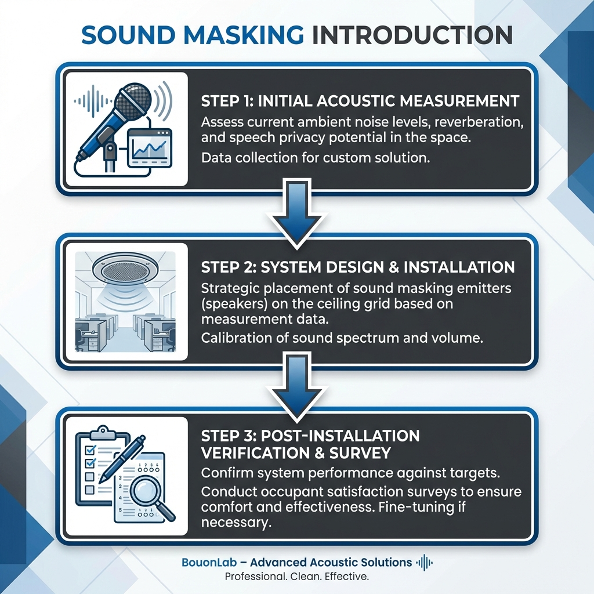

Are confidential information or personnel discussions leaking from your office meeting rooms?

Resting assured just because you "thickened the walls" is dangerous. In fact, in a quiet office, even "conversation content" leaking from slight gaps can be heard clearly.

In this article, I will explain the <strong>"Sound Masking" technology that hides sound with sound</strong> from a professional perspective, addressing sound leak risks that physical soundproofing construction alone cannot prevent.

_Fig: The paradox where a quieter office makes "conversation content" leak more easily_

## [Conclusion] Sound Leak Risks That "Wall Thickness" Cannot Prevent

To conclude, in office soundproofing, simply increasing the "Wall Sound Insulation Performance (Dr Value / STC)" is often insufficient.

This is because humans have the auditory characteristic that <strong>"the quieter the environment, the more clearly they can hear even small voices."</strong>

### The Identity of Voice Frequency and "Audibility"

Generally, the main components of male speech are around 500Hz to 1kHz, and female speech is in a slightly higher frequency band. These are the bands that the human ear picks up most sensitively.

For example, even if a high-performance soundproof wall reduces the volume (dB) by half, if the surroundings are dead silent, the content of that "halved voice" will be heard clearly. This state is referred to as <strong>"Speech Privacy" being compromised</strong>.

### Many Information Leaks Come from "Carelessness" and "Eavesdropping"

As a factor in information security accidents, this "analog sound leak" should be guarded against just as much as cyber attacks.

- <strong>Executive voices leaking from the gaps in meeting room doors</strong>
- <strong>Telephone contents resonating in quiet workspaces</strong>

These naturally enter the ears of employees with no ill intent, resulting in lowered morale and the spread of unexpected rumors.

## What is Sound Masking? Hiding Sound with Sound

An effective solution to this is <strong>"Sound Masking"</strong>. This is a technology that intentionally plays a special "background sound (masking sound)" that covers the frequency band of conversation, making the content of the conversation difficult to hear.

### Difference from Noise Canceling

It is often confused, but the approach is the opposite of noise canceling.

- <strong>Noise Canceling :</strong> A technology that hits noise with anti-phase sound to <strong>erase the noise itself.</strong>
- <strong>Sound Masking :</strong> A technology that plays environmental sounds like air conditioning noise to <strong>hide (make less noticeable) the conversation.</strong>

It relies on the same principle as why whispering in a quiet library is distracting, but conversations at the next table in a busy cafe don't bother you much (the reverse use of the Cocktail Party Effect).

### Implementation Effect: Making Conversation Content "Unclear"

Sound masking does not reduce sound leakage itself to zero. However, it creates a state where <strong>"you can tell someone is talking, but you cannot make out the content."</strong>

| State            | Audibility                                                        | Security Level             |
| :--------------- | :---------------------------------------------------------------- | :------------------------- |
| <strong>No Measures</strong> | "Regarding the project for Company A, the budget is 3 million..." | Dangerous (Content Leaked) |
| <strong>With Masking</strong> | "...buzz... (unclear sound) ..."                                  | Safe (Content Unclear)     |

_Fig: Difference in approach - hiding sound vs. erasing sound_

The greatest benefit is turning meaningful "information" into meaningless "sound" this way.

### "Background Sound" Technology That Doesn't Hinder Concentration

You might worry, "Won't playing extra sound prevent concentration?" but modern systems are designed very cleverly.

Because they use frequency characteristics close to the "sound of air conditioning wind" (such as adjusted pink noise) that are familiar to the human ear, the brain naturally processes it as "background sound (environmental sound)" and excludes it from consciousness. Within a few days of introduction, many employees forget the sound even exists.

## Acoustic Design to Raise Office Security Levels

To maximize effectiveness, speaker placement and volume settings are crucial.

### Areas to Install (Around Meeting Rooms, Open Spaces)

The rule of thumb for masking sound is to play it not in the "place where you don't want sound to be heard" but in the <strong>"place where sound is leaking to (where the listeners are)."</strong>

1.  <strong>Corridor side of meeting rooms</strong> : To erase voices leaking from door gaps in the hallway.
2.  <strong>Ceiling of open spaces</strong> : To hide telephone voices in workspaces that are too quiet.

### Cases Where Combination with Physical Soundproofing (Partitions) is Essential

Sound masking is not magic. If there are large holes in the wall or partitions are too low, allowing "direct sound" to reach, the effect is diminished.

- <strong>Walls/Partitions :</strong> Reduce the <strong>Volume of sound (Primary measure)</strong>
- <strong>Sound Masking :</strong> Hide the <strong>Content of the remaining sound (Finishing measure)</strong>

By combining these two, you can build the highest security environment while keeping costs down.

### Demerits and Limitations: Understanding It's Not Total Silence

One point to explain to the company before introduction is that "it will not become silent." Rather, for those who prefer dead silence, there is a non-zero possibility that the slight "hissing" sound might be distracting.

Therefore, I recommend selecting a system with the function to adjust volume for each area.

## Checklist Before Introduction

To ensure a successful introduction, please proceed with the following steps.

### Measuring the Current "Sound Leak Level"

First, grasp how much conversation is actually leaking. Simple measurement with a smartphone app is possible, but it is certain to ask a professional contractor to measure "which frequency bands are leaking."

### Cost-Effectiveness and Alignment with Security Policy

Rebuilding walls with soundproofing construction costs millions of yen and takes weeks. On the other hand, sound masking often requires <strong>about 1/3 to 1/5 of the cost of soundproofing construction</strong> because it only requires installing speakers in the ceiling.

For "rental offices where physical renovation is difficult" or "companies with frequent layout changes," this can be said to be a very rational (Optimized) investment.

### Importance of Employee "Discomfort" Tests

Before full-scale introduction, I strongly recommend borrowing a demo unit and conducting a trial.

- <strong>Is it actually hiding the sound?</strong>
- <strong>Does the sound bother you during work?</strong>

By testing these two points for about a week and taking a survey on-site, you can prevent trouble after introduction.

_Fig: Confirming a successful implementation flow_

---

## Summary: Sound Security is an "Invisible Wall" Protecting Corporate Trust

Office sound leak measures are not just noise problems. They are <strong>"Security Investments"</strong> to protect customer information and management strategies.

1.  <strong>Walls alone are not enough</strong> : Silence promotes sound leakage.
2.  <strong>Sound Masking</strong> : A smart technology that protects information by making conversation "unclear".
3.  <strong>Hybrid Measures</strong> : Optimize the environment with good cost performance by combining with physical sound insulation.

To prevent information leaks due to "carelessness" and create an environment where employees can discuss with peace of mind, please consider introducing sound masking.

## Related Articles

- <strong>[Basics]: [How much does a Soundproof Room Cost? (2025 Market Price)](soundproof-room-price-complete-guide)</strong>
- <strong>[Comparison]: [Sound Absorption vs. Insulation: How to Use Them Effectively](sound-insulation-vs-absorption)</strong>
- <strong>[Practical]: [Latest Trends in Office Soundproof Booths and Their Benefits](workbooth-office-soundproof-trend)</strong>

