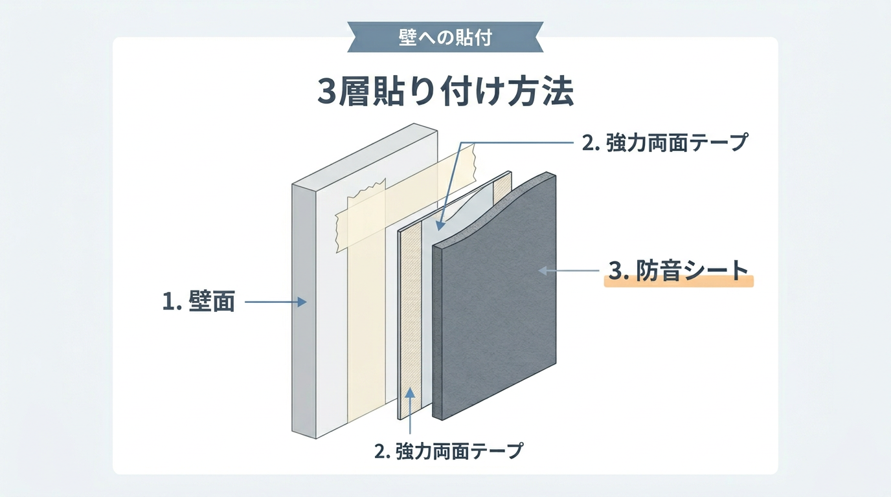
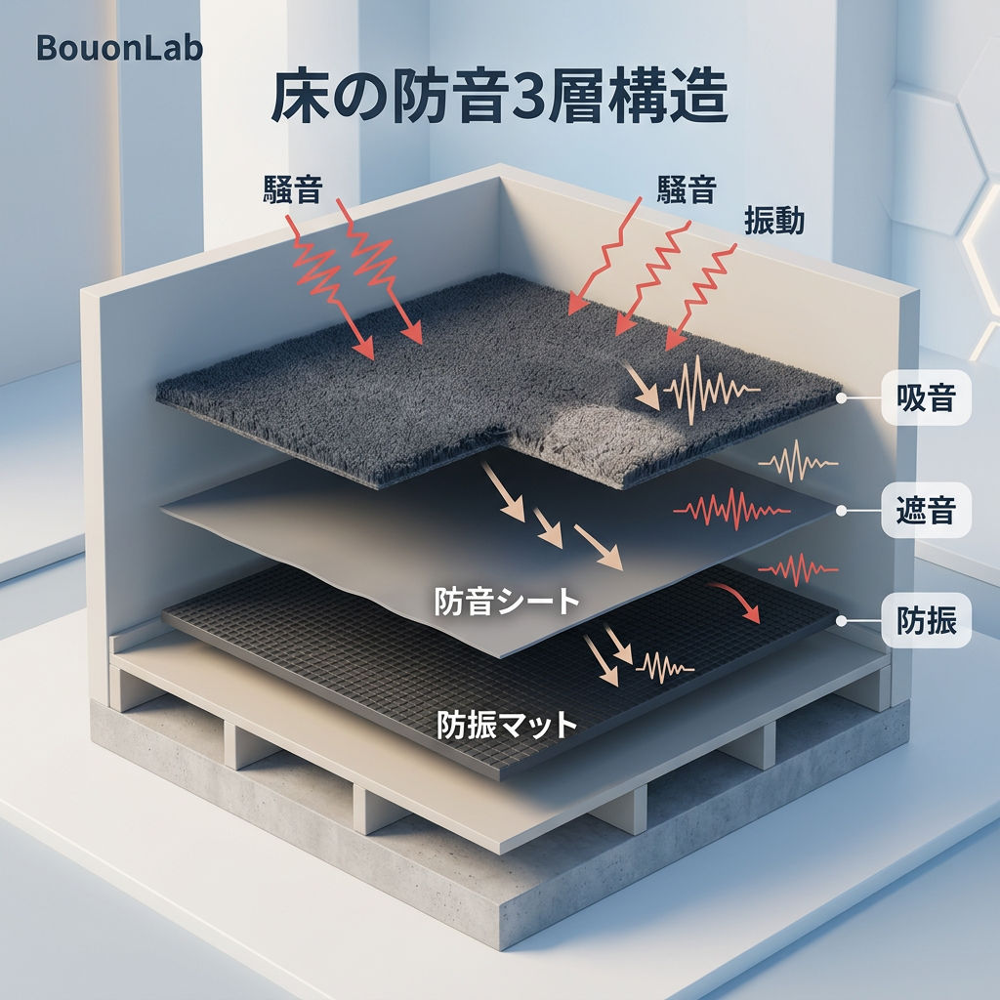

---
title: "Zero Restoration Costs! 5 Hacks to Create Studio-Level Silence in Japanese Rentals Without Damagi..."
description: "Solutions for soundproofing Japanese rentals without wall damage. Pro DIY tips for zero restoration costs using masking tape, Diawall, and 3-layer floor systems to create your ultimate private studio."
slug: "renter-parent-house-soundproofing"
date: "2026-03-03"
lastmod: "2026-03-03"
draft: false
lang: "en"
category: "knowledge"
tags: ["防音"]
image: ./cover.jpg
---
"I want to start streaming, but I can't drill holes in the walls of my rental..."
"I'm depressed about being scolded by my parents in the morning after getting excited in voice chat late at night."

Do you have such troubles? For Gen Z and Gen α, the desire to make their room the "ultimate secret base" always coexists with the worry about moving-out costs and their parents' eyes.

However, there is no need to give up. If you understand the nature of "sound" and use the correct DIY techniques, <strong>you can obtain a quiet environment like a soundproof room for zero (or low) cost without damaging a single spot on the wall.</strong>

In this article, we will share the secrets of "smart soundproofing" that turn the constraints of restoration into an advantage.

## The Secret to Avoiding "Restoration Costs" and "Parental Discovery" in Japanese Rentals

The one thing you must never do in soundproof DIY is <strong>"sticking soundproofing materials directly to the wall."</strong>

Strong double-sided tape will take the surface of the wallpaper with it when you peel it off. This directly leads to restoration costs (moving-out fees) in the tens of thousands of yen. Also, if you peel it off forcibly and leave marks, your DIY, which you proceeded with secretly from your parents, will be discovered instantly.

The basic of smart soundproofing is <strong>"not touching the existing wall, or sandwiching a peelable layer in between."</strong> This "floating" technique is the key to maximizing soundproofing effects with zero risk.

## Stick Soundproof Sheets Without Damage! The "Masking Tape + Strong Double-sided Tape" Golden Combo

When installing soundproof sheets (heavy walls) on a wall surface, the safest and most reliable method is to use "masking tape" as a base.

- <strong>Conclusion</strong>: No matter how heavy the sheet is, if you apply wide masking tape over a wide area, it becomes a "peelable soundproof wall."
- <strong>Procedure</strong>:
  1. Apply <strong>wide masking tape</strong> vertically to the wallpaper.
  2. Apply strong double-sided tape on top of the masking tape.
  3. Stick the soundproof sheet on top of that.

_Fig: The 3-layer system of MT + double-sided tape + soundproof sheet. A professional layering technique to support heavy soundproofing materials without damaging the wall._

Soundproof sheets are heavier than expected, so if the area of the masking tape is small, it will peel off due to the weight. The pro tip for balancing fall prevention and restoration is to create a base as if you are "covering the entire wall with masking tape."

## Build Your Own Soundproof Wall with Diawall! How to Set Up Pillars Without Touching the Wall

For those who are "even afraid to stick masking tape" or "want more serious soundproofing performance," we recommend DIY using <strong>Diawall</strong> or <strong>Labrico</strong>.

- <strong>Mechanism</strong>: Use 2x4 (two-by-four) lumber to bridge the ceiling and floor, creating independent "pillars."
- <strong>Specifics</strong>:
  - Fix sound-absorbing boards or plasterboards to the pillars with screws.
  - By creating a <strong>1-2cm air gap between the existing wall and the new board</strong>, you can physically block sound from traveling through the wall.

With this method, you can build a "double wall" that can withstand guitar playing or streaming in a loud voice without touching the wall by even 1 millimeter.

## The Ultimate Weapon Against "Parental Intrusion"! Sealing the "Weight" and "Gaps" of the Door

90% of the reason why your parents' voices from the living room or your own voice leak into the hallway is the "gap in the door." Sound is like water; it will leak out even through a hole the size of a needle.

1. <strong>Sealing with Gap Tape</strong>:
   - Buy "EPDM rubber" gap tape sold at 100-yen shops (Daiso, Seria, etc.) and stick it to all four sides of the door frame.
   - The point is to seal it so tightly that you feel a "thud" when you close the door.

2. <strong>Make the Door "Heavy"</strong>:
   - Since doors are thinner than walls, noise passes right through. Apply the "masking tape + soundproof sheet" technique mentioned before to the entire door.
   - By physically increasing the weight of the door, you can drastically suppress the transmission of speech (airborne sound).

## The Three-Layer Rule for Floor Soundproofing! How to Prevent "Floor Thumping" to the Neighbors Below

The most common trouble in rentals is actually not the walls, but the "impact sound" on the floor. Just laying one layer of joint mats cannot prevent low vibration sounds (thumping sounds).

- <strong>The Ultimate 3-Layer System</strong>:
  1. <strong>Bottom Layer</strong>: <strong>Vibration-damping mat (rubber)</strong>. Absorbs the "vibration" of chair movement or walking.
  2. <strong>Middle Layer</strong>: <strong>Soundproof sheet</strong>. Reflects the "sound" leaking to the floor below.
  3. <strong>Top Layer</strong>: <strong>Ultra-thick rug or sound-absorbing tile carpet</strong>. Reduces reflection on the surface and ensures a good feel.

_Fig: 3-layer system to block vibrations and sound. The combination of damping (mat) + insulation (sheet) + absorption (rug) is the ultimate solution for apartments._

By using this three-layer structure, you can minimize the sound of moving a gaming chair late at night or the footsteps when you accidentally stand up excitedly.

## The Closet is a "0 Yen" Recording Studio! The Hack to Turn Clothes into Sound-Absorbing Material

If your budget is absolutely zero, go inside the <strong>closet</strong> without hesitation.

The large amount of clothes hanging in the closet actually plays the same role as the "sound-absorbing material" used in professional studios. The clothes cause sound to reflect complexly and absorb energy, allowing for surprisingly clear voice recording.

- <strong>How to do it</strong>:
  - Take your microphone into the closet and close the door.
  - Furthermore, stuff towels into the gaps, and you're done.

"It looks surreal," but for late-night "Utattemita" (I tried singing) recordings or narration recording, there is no more cost-effective method than this.

## Summary: You Can Create Your "Ideal Secret Base" by Turning Constraints into Advantages

The "restraint of not being able to make scratches" in a rental or parent's house can be turned into the fun of DIY with a little ingenuity.

- <strong>Walls</strong>: Masking tape + double-sided tape, or Diawall.
- <strong>Gaps</strong>: Thoroughly seal with gap tape.
- <strong>Floors</strong>: Shut out vibrations with a three-layer structure.

Start by trying familiar items you can buy at 100-yen shops or home centers. The process of crushing each sound leak one by one is just like a game walkthrough.

Take a step forward and get the "ultimate private space" that doesn't cause trouble for your parents or your landlord.

---

[Related Articles]

- If you want to know about more professional materials: [A Complete Guide to Choosing Sound-Absorbing and Sound-Insulating Materials](absorption-vs-soundproofing-materials)
- To further pursue door soundproofing: [How to Double the Soundproofing Performance of Your Door with 100-Yen Gap Tape](100yen-gap-tape-door-soundproofing)
- If you want to compare with professional soundproof rooms: [Comprehensive Guide to Yamaha Cefine NS: 2026 Performance and Selection](yamaha-avitecs-cefine-ns-guide)

