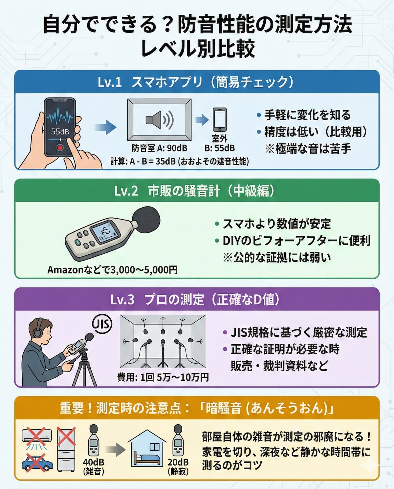

"How effective is the soundproof room I made with DIY?"
"The sound from my neighbor's house is noisy, I want to leave evidence."

To quantify invisible "sound", measurement is necessary.
Nowadays, you can measure decibels (dB) even with a free smartphone app, but <strong>is that numerical value really trustworthy?</strong>

In this article, we will explain the simple check methods you can do yourself and the differences from professional measurement.

---

## 1. Measuring with a Smartphone App (Simple Check)

If you just want to know a "vague change", a smartphone app is enough.
Apps such as "Sonic Tools" and "Sound Meter" are famous.

### Measurement Procedure (When you want to know the soundproofing effect)

1.  <strong>Prepare a sound source</strong>: Place a Bluetooth speaker inside the soundproof room and play "pink noise (a static-like sound)" at a constant volume (you can find it on YouTube, etc.).
2.  <strong>Measure inside (A)</strong>: First, measure the value 1m away from the speaker inside the soundproof room. (Example: 90dB)
3.  <strong>Measure outside (B)</strong>: Close the door of the soundproof room and measure the value at the same position outside. (Example: 55dB)
4.  <strong>Calculation</strong>: A - B = <strong>35dB</strong>. This is the "approximate sound insulation performance (D-Value)".

### Limits of the App

Since smartphone microphones are optimized for "calls", <strong>they cannot pick up extremely low or high sounds</strong>.
Also, the numerical value may shift by 10dB or more depending on the model.
Use it as a <strong>comparison</strong> such as "has it become quieter than before?".

## 2. Measuring with a Commercially Available Sound Level Meter (Intermediate)

Using a "digital sound level meter" sold for $30 to $50 on Amazon etc., the accuracy improves a little.

- <strong>Merits:</strong> The microphone performance is better than a smartphone, and the numerical value is stable.
- <strong>Demerits:</strong> Since it is just a simple device, it is weak as official "evidence".

If you want to check the before and after of DIY soundproofing, it's convenient to have one device of this level.

## 3. Professional Measurement (Accurate D-Value)

If accurate proof is required, such as "D-50 is required by the apartment's rules", request a professional.

- <strong>Measurement based on JIS standards:</strong> Using a precision sound level meter, measure according to strict rules such as taking an average of 5 locations in the source room and the receiving room.
- <strong>Cost:</strong> about $500 to $1,000 per time.
- <strong>Who is it recommended for?:</strong>
- <strong>People who want to sell self-made soundproof rooms.</strong>
- <strong>People who need court materials for noise trouble with neighbors.</strong>

## Precautions for Measurement: "Ambient Noise"

The biggest obstacle in measurement is the "<strong>noise already in the room (ambient noise)</strong>".
If the sound of the air conditioner, refrigerator, car outside, etc., is about "40dB", sounds lower than that cannot be measured as they are buried.

No matter how high-performance the soundproof room is, <strong>if the room itself where you measure is noisy, the correct performance (low numerical value) will not come out</strong>.
The tip for measuring is to turn off all home appliances and do it in a quiet time slot such as late at night.

## Summary

- <strong>Smartphone App:</strong> Play level to confirm "Oh, it might have become a little quieter".
- <strong>Sound Level Meter of tens of dollars:</strong> This is enough to confirm the results of DIY.
- <strong>Professional Measurement:</strong> For trouble resolution or performance proof.

First, try "subtraction of sound" with a free app and start by feeling the world of sound in numerical values.
If you know the loudness of the sound, it will be easier to judge how it actually sounds by referring to the "reduction rate" in the specifications of the soundproof room.

[→ Related: Guide to Sound Insulation Performance Dr Grade (D-Value)](soundproof-performance-dr-standard)
[→ Sound Insulation Performance D-Value Guide (Top)](bouon-dchiseinou-meyasu)

