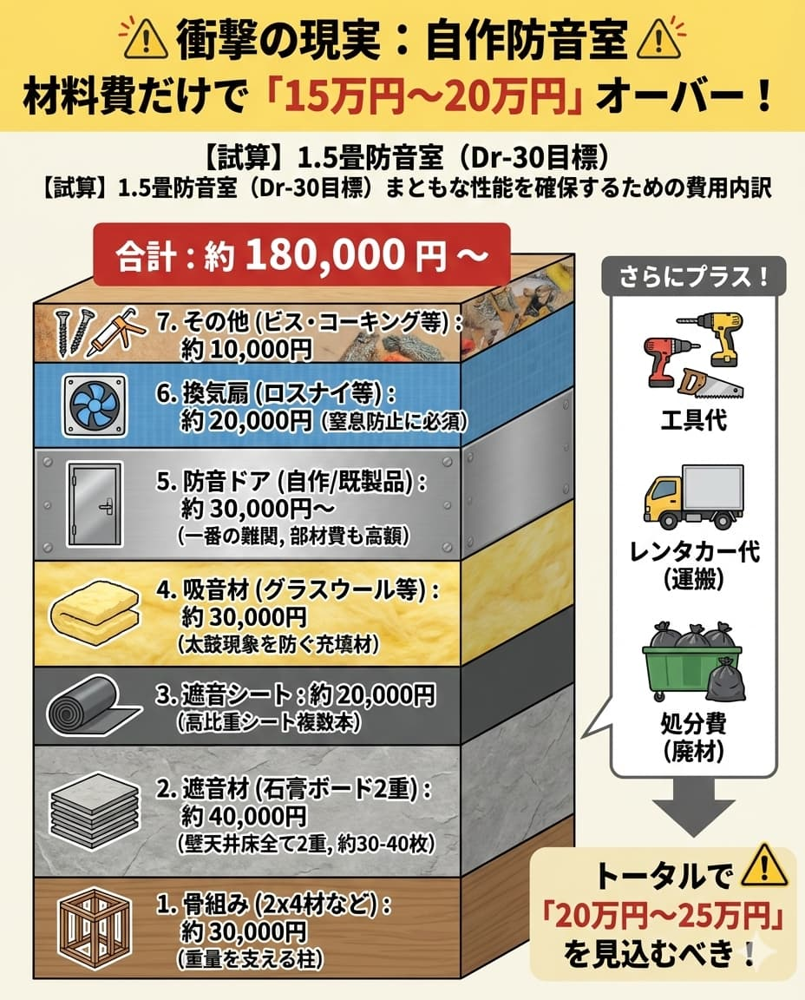

"Manufacturer-made ones are expensive, so I want to make it myself and save money!"
If you are good at DIY, "Self-made soundproof room" is something you think about at least once.

There are videos on the internet that say "I made it for $500!", but if you aim for performance that can be used for instrument practice (Dr-30 to 35), <strong>$500 ends with buying gypsum board and lumber.</strong>

In this article, we will disclose a realistic material cost simulation for a "1.5-tatami size" soundproof room with decent performance.

---

## Shocking Reality: " $1,500 - $2,000" for Materials Alone

When trying to ensure decent soundproof performance (weight and airtightness), the amount of materials becomes huge.

### [Trial Calculation] Material Cost Breakdown of 1.5-tatami Soundproof Room (Target Dr-30)

\*Prices are the standard market prices at home centers, etc.

1.  <strong>Framework (2x4 lumber, etc.)</strong>: <strong>About $300</strong>
- <strong>To support the weight, firm pillars are necessary.</strong>
2.  <strong>Sound Insulation Material (Gypsum board 12.5mm x 2 layers)</strong>: <strong>About $400</strong>
- <strong>Sound won't stop unless you double-layer all walls, ceilings, and floors. About 30-40 sheets required.</strong>
3.  <strong>Sound Insulation Sheet</strong>: <strong>About $200</strong>
- <strong>High-density sheets such as Sandam. Several rolls are needed.</strong>
4.  <strong>Sound Absorption Material (Glass wool / Rock wool)</strong>: <strong>About $300</strong>
- <strong>Insulation and sound-absorbing material to be filled inside the walls. Without this, the sound will echo due to the drum phenomenon.</strong>
5.  <strong>Soundproof Door (Self-made or ready-made)</strong>: <strong>About $300 -</strong>
- <strong>The biggest hurdle. Buying a ready-made one costs $500 to $1,000 here alone. Even with self-made, material costs for Gremon handles and packing are incurred.</strong>
6.  <strong>Ventilation Fan (Lossnay, etc.)</strong>: <strong>About $200</strong>
- <strong>Essential to avoid suffocation. Tools for making holes are also necessary.</strong>
7.  <strong>Others (Screws, caulking, floor materials)</strong>: <strong>About $100</strong>

Total: About $1,800 or more

Plus, "tool costs" such as electric screwdrivers and circular saws, "rental car costs" for carrying materials, and "disposal costs" for throwing away waste are incurred.
You should expect <strong>$2,000 to $2,500</strong> in total.

## "Invisible Costs" other than Money

If a soundproof room can be made for $2,000, it's definitely cheaper than the manufacturer-made one ($10,000!), right?
However, from here is the true horror of DIY.

### 1. Production Period: All of your holidays disappear

Write a blueprint, go shopping, cut, and assemble.
Even for those who are used to it, it takes <strong>1 to 2 months</strong> using Saturdays and Sundays to the full. Have you ever thought about your "hourly wage" during that time?

### 2. Performance Guarantee: Unknown until completed

Even if you work hard to build it, there is a high possibility of "sound leaks more than I thought...". Especially <strong>door gap treatment</strong> is difficult even for professionals, and sound will leak tremendously from here in amateur DIY.
There is no "Dr-35 guarantee" like manufacturer-made ones. Everything is at your own risk.

### 3. Dismantling and Disposal: Hell when throwing it away

A self-made soundproof room is a mass of "huge bulky waste".
If you move, you have to dismantle it and dispose of it as industrial waste for several light trucks, and <strong>disposal costs of hundreds of dollars</strong> may be incurred.
There is a risk of becoming a "liability" which is the polar opposite of manufacturer-made ones that can be sold on the used market.

## Conclusion: DIY is something you do as a "hobby", not for cheapness

If you start DIY with the motivation of "anyway, keep it cheap", there is a high probability of either giving up on the way or ending up making trash with lukewarm performance.

"<strong>People who can enjoy the building process itself</strong>"
"<strong>People who want to customize in millimeters according to the shape of the room</strong>"

For such people, a self-made soundproof room becomes the best project.
If you just want to "keep it cheap", it is more certain in terms of time, performance, and asset value to find a used unit soundproof room and take out a loan.

[→ Related: Soundproof Room Price Market | See the difference in price between new and used](soundproof-room-price-market)
[→ Back to Soundproof Room Price Map (Top)](bouon-price-souba)

