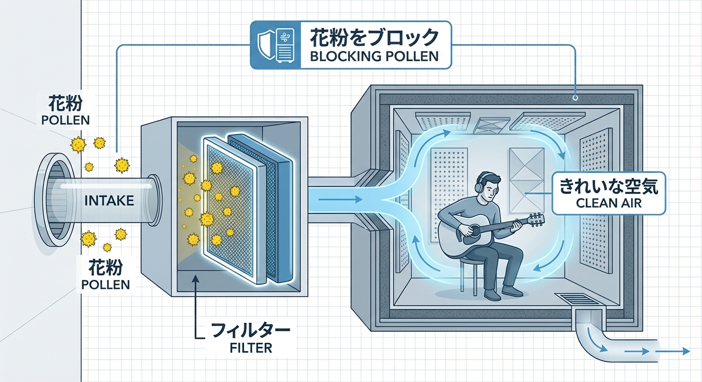

---
title: "Pollen Protection for Soundproof Rooms | How to Block Pollen & Dust Without Stopping Ventilation"
description: "How to manage ventilation and pollen protection in your soundproof room. This guide covers filter selection, 'Lossnay' maintenance, and tips for allergic musicians to keep their practice sanctuary clean and comfortable during Japan's pollen season."
slug: "soundproof-room-pollen-protection"
date: "2026-02-23"
lastmod: "2026-02-28"
draft: false
lang: "en"
category: "knowledge"
tags: ["防音"]
image: ./cover.jpg
---
"When spring arrives in Japan, I'm tempted to turn off my soundproof room's fan just to keep the pollen out."

If you suffer from Japan's notorious <strong>Kafun-sho (Hay Fever)</strong>, your soundproof booth might feel like your only sanctuary. However, turning off the ventilation is a <strong>dangerous mistake</strong>. Because soundproof rooms are highly airtight, the CO2 levels will skyrocket within just 15 minutes, leading to drowsiness, headaches, and a massive drop in recording performance.

The secret isn't to stop the air—it's to <strong>filter it</strong>. In this guide, we’ll show you how to maintain perfect air quality in your booth while keeping spring’s allergens at bay.

## 1. The Danger of "Stale Air" (Oxygen Depletion)

Have you ever felt unusually tired or lost focus after just a few minutes of recording? In a tiny 1-tatami or 1.5-tatami booth, a single adult breathing can push CO2 levels past 2,000ppm—the "danger zone" for concentration—faster than you think.

- <strong>15 Minutes to Brain Fog</strong>: Without active ventilation, you are breathing recycled carbon dioxide.
- <strong>Heat Buildup</strong>: Even in spring, PCs and amps generate heat. Stopping the fan can cause your equipment to reach thermal limits, leading to crashes or noise.

## 2. Upgrading Your Fan with "Pollen Guards"

Standard fans included with units like Yamaha or Kawai often have basic filters designed for large dust, not microscopic pollen. You need to upgrade to <strong>High-Efficiency Filters</strong>.

### Lossnay High-Efficiency Filters

If your booth uses a <strong>"Lossnay"</strong> exchange fan (common in Japan), Mitsubishi Electric sells specialized "Pollen Removal Filters" that block over 95% of fine particles.

- <strong>Why it works</strong>: These can be swapped in seconds and maintain your booth’s soundproofing performance while creating a sterile air environment.

### External Inlet Filters (e.g., "Poretto")

For DIY booths or rooms with basic wall vents, you can use adhesive filters like <strong>"Poretto"</strong> by Kyowa Nasta. These catch pollen at the source before it ever enters your booth’s intake.

## 3. The Desktop Air Purifier: Your Last Line of Defense

No matter how careful you are, pollen will enter on your clothes and hair when you open the door. In a small space, a <strong>Compact Desktop Air Purifier</strong> is incredibly effective.

- <strong>Placement</strong>: Place it near your workspace or equipment rack.
- <strong>HEPA is Mandatory</strong>: Ensure it uses a <strong>HEPA filter</strong> capable of catching 99.97% of particles as small as 0.3μm.

## 4. Spring Maintenance: The Cleaning Rules

Don't wait until summer to clean your booth. Follow these spring-specific rules:

1.  <strong>Disposable Filters</strong>: It’s more hygienic to replace your intake filters entirely after the peak pollen season ends (usually late May).
2.  <strong>Vacuum Only, No Wet Wiping</strong>: Pollen sticks to acoustic foam and fabric panels. Do <strong>NOT</strong> use a wet cloth, as this can press the pollen deeper into the fibers. Use a vacuum with a HEPA filter and a brush attachment.

## 5. Conclusion: Best Performance Through High-Quality Air

Closing your booth to block pollen is bad for your health and your art.

- <strong>Apply high-efficiency filters to your intake.</strong>
- <strong>Keep the 24-hour ventilation running.</strong>
- <strong>Use a small air purifier inside.</strong>

By following these three steps, your soundproof room will remain the ultimate safe haven where you can create at 100% capacity, even during Japan's toughest allergy season.

