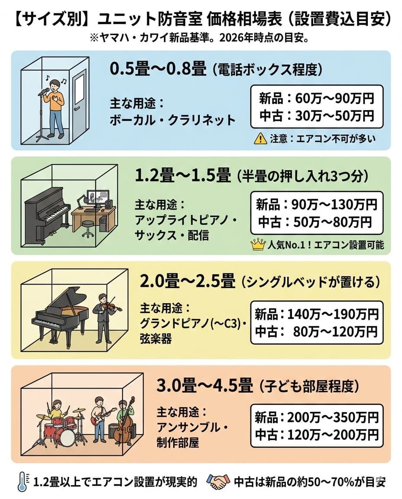

"A soundproof room, maybe around $10,000...?"
That sense is half correct and half wrong.

The price of a soundproof room is determined by the multiplication of "<strong>size (width)</strong>" and "<strong>sound insulation performance (Dr grade)</strong>".
For example, even for the same 1.5 tatami, there are those for "$6,000" and those for "$15,000".

In this article, for a budget plan that won't fail, we will explain the realistic "<strong>price market (unit price + installation cost)</strong>" for each size.

---

## [By Size] Unit Soundproof Room Price Market Table

This is an estimate including installation costs based on the new prices of major manufacturers (Yamaha, Kawai).

| Size                  | Guide for Width         | Price Market (New)    | Price Market (Used)   |
| :-------------------- | :---------------------- | :-------------------- | :-------------------- |
| <strong>0.5 to 0.8 Tatami</strong> | About a telephone booth | <strong>$6,000 - $9,000</strong> | <strong>$3,000 - $5,000</strong> |
| <strong>1.2 to 1.5 Tatami</strong> | 3 half-tatami closets   | <strong>$9,000 - $13,000</strong> | <strong>$5,000 - $8,000</strong> |
| <strong>2.0 to 2.5 Tatami</strong> | Can place a single bed  | <strong>$14,000 - $19,000</strong> | <strong>$8,000 - $12,000</strong> |
| <strong>3.0 to 4.5 Tatami</strong> | About a child's room    | <strong>$20,000 - $35,000</strong> | <strong>$12,000 - $20,000</strong> |

### 0.5 to 0.8 Tatami (Vocals, Clarinet)

- <strong>Market Price:</strong> around $7,000
- <strong>Features:</strong> Anyway, it's narrow. The limit is to sing standing up or sitting on a small chair to blow a wind instrument. Caution is required as there are many models that cannot have air conditioners attached.

### 1.2 to 1.5 Tatami (Upright Piano, Saxophone, Streaming)

- <strong>Market Price:</strong> around $11,000
- <strong>Features:</strong> <strong>The best-selling size. A width that an upright piano barely fits. It is also ideal for creating a comfortable streaming booth with a desk and chair. Air conditioner installation also becomes possible.</strong>

### 2.0 to 2.5 Tatami (Grand Piano C3 Class, String Instruments)

- <strong>Market Price:</strong> around $16,000
- <strong>Features:</strong> Grand pianos (up to C3 size) fit. This width is also necessary for instruments like violin where the bow is moved greatly. At least this size if two people are having a lesson.

## "Hidden Costs" Incidental to the Unit Price

When making a budget, are you only looking at the unit price?
Actually, for soundproof rooms, there are "<strong>costs that always occur other than the unit</strong>". Without including these, you will be over budget.

1.  <strong>Assembly and Transportation Cost ($1,000 - $2,000)</strong>
- <strong>Soundproof rooms are carried by professional contractors and assembled on-site. Including air conditioning work, you need to see at least $1,000.</strong>
2.  <strong>Air Conditioner Unit ($500 - $1,000)</strong>
- <strong>There is no dedicated air conditioner for soundproof rooms, but a compact 6-tatami air conditioner needs to be purchased separately.</strong>
3.  <strong>Floor Reinforcement Work (Only if necessary)</strong>
- <strong>If the floor is weak, such as in a wooden apartment, reinforcement may be necessary (hundreds of dollars -).</strong>

> <strong>Conclusion</strong>: The amount added "<strong>+$2,000</strong>" to the catalog price is the total amount actually paid.

## By Budget: Recommended Options for You

### Budget Under $5,000

- <strong>New unit soundproof rooms are tough.</strong>
- <strong>Options:</strong> Search for "Used 0.8 to 1.2 Tatami", or "Simple Soundproof Room (Danbocchi, etc.)", "DIY".

### Budget $10,000

- <strong>Options:</strong> "New 1.2 Tatami (Standard Performance)" or "Used 2.0 Tatami" are the targets.
- <strong>This is the line with the most options and is realistic.</strong>

### Budget $20,000

- <strong>Options:</strong> "New 2.5 Tatami (High Insulation Dr-40)" or "3.0 Tatami" can be obtained.
- <strong>If you can afford this much, you can create a comfortable environment where you can enjoy grand piano and ensemble with family.</strong>

## Summary

A soundproof room is close to the feeling of buying "one car".
It is never cheap, but since the used market is also active, stepping up such as "<strong>buying cheaply as used at first, and selling and replacing when it becomes cramped</strong>" is also a wise method.

[→ Related: Limits of Cheap Soundproof Rooms and Recommendations | How much can be done under $1,000?](soundproof-room-cheapest)
[→ Back to Soundproof Room Price Map (Top)](bouon-price-souba)

