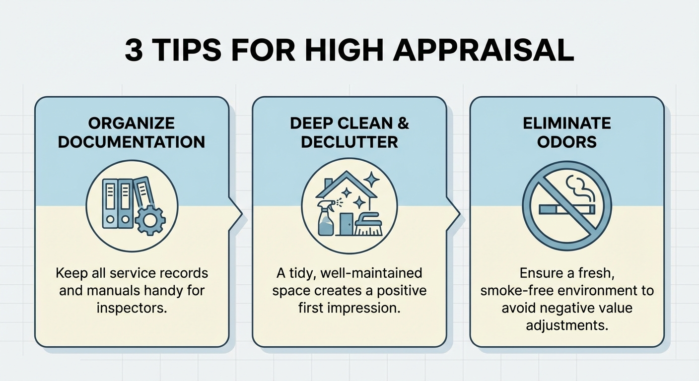

---
title: "Can Unused Soundproof Rooms Be Sold High? Appraisal Points and Market Rates of Popular Manufacturers"
description: "Don't throw away a soundproof room you no longer use! Thorough explanation of the buyback market for brand soundproof rooms such as Yamaha and Kawai, tips for raising the appraisal price, and how to avoid a 0-yen appraisal."
slug: "soundproof-room-purchase-price"
date: "2026-02-10T23:00:00+09:00"
lastmod: "2026-02-28"
draft: false
lang: "en"
category: "knowledge"
tags: ["Soundproof Room","Buyback","Appraisal","Used","Yamaha"]
image: ./cover.jpg
---
\"I can't place a soundproof room because of a relocation.\"
\"My child's entrance exam is over, so I don't use it anymore.\"

In such cases, the first thing that might come to mind is the despair of <strong>"Must I throw it away..."</strong>
However, your soundproof room actually has the potential to be converted into money.

As a Kind Life Advisor, I'll tell you the buyback market and smart ways to sell soundproof rooms in this article.

## Conclusion: Brand Soundproof Rooms are Worth "Buyback"

Let's say the conclusion first.
Soundproof rooms that meet the following conditions are worth <strong>asking a buyback company for an appraisal</strong>.

- <strong>Manufacturer</strong>: Major brands such as Yamaha (Avitecs) and Kawai (Nasal)
- <strong>Type</strong>: Assembly-type unit (can be disassembled without construction)
- <strong>Condition</strong>: No noticeable scratches or offensive odors
- <strong>Age</strong>: Within 10 years

Conversely, if the following apply, buyback is often difficult (or results in a 0-yen appraisal).

- DIY self-made soundproof rooms
- Custom-made construction-type soundproof rooms (cannot be disassembled)
- Old models from more than 20 years ago
- Strong offensive odors from smoking or pet ownership

## Buyback Market: Guide by Manufacturer

| Manufacturer/Model | New Price | Buyback Market (Guide) |
| :--- | :--- | :--- |
| Yamaha Avitecs 0.8 Mats | Approx. 500,000 JPY | 50,000 - 150,000 JPY |
| Yamaha Avitecs 1.5 Mats | Approx. 800,000 JPY | 100,000 - 250,000 JPY |
| Kawai Nasal 1.2 Mats | Approx. 700,000 JPY | 80,000 - 200,000 JPY |
| Danbotchi (VERYQ) | Approx. 120,000 JPY | 10,000 - 30,000 JPY |

*Varies greatly depending on condition, age, and demand.

## 3 Tips to Increase the Appraisal Price by <strong>100,000 Yen</strong>

### 1. Keep All Accessories Ready

Keep everything that came with the purchase, such as the manual, assembly tools, and spare gaskets (rubber parts).
Just <strong>"not having the manual"</strong> can lower the appraisal price by tens of thousands of yen.

### 2. Be Thorough with Deodorization and Cleaning

Since the soundproof room is a private room, odors can easily stick. Please do the following before appraisal:

- <strong>Ventilation</strong>: Leave the door wide open for about a week.
- <strong>Wiping</strong>: Wipe the wall panels with a tightly wrung cloth.
- <strong>Deodorization</strong>: Rent an ozone deodorizer for processing (costs from 5,000 JPY).

### 3. Honestly Declare Smoking/Pet History

Even if you hide it, it will be found out as soon as the appraiser arrives.
Declaring it in advance and appealing that you've <strong>"already completed deodorization treatment"</strong> gives a better impression and can suppress the width of the price reduction.

## Buyback Flow: From Appraisal to Removal

1.  <strong>Request Appraisal Online</strong> (Send photos and model number)
2.  <strong>On-site Appraisal</strong> (Formal price presentation upon seeing the actual item)
3.  <strong>Contract/Disassembly</strong> (If contracted on the spot, the company disassembles)
4.  <strong>Removal/Payment</strong> (Disassembly/removal in a few days to a week, payment later)

<strong>Note</strong>: Appraisal is free, but be sure to check the <strong>"removal/disassembly costs"</strong> when getting the estimate.
Even if the buyback price is 100,000 yen, if the disassembly/removal fee is 80,000 yen, your take-home pay is 20,000 yen.

## How to Choose a Recommended Buyback Company

### Specialist Companies vs. General Second-hand Shops

| | Specialist Company | General Second-hand Shop |
| :--- | :--- | :--- |
| <strong>Buyback Price</strong> | Higher | Low (or not buyable) |
| <strong>Disassembly Skill</strong> | Yes | No (condition: you disassemble it yourself) |
| <strong>Service Area</strong> | Limited | Wide |

<strong>Conclusion</strong>: It's best to ask a buyback company specializing in soundproof rooms (those affiliated with instrument stores, etc.).

## Summary: Try Getting an Appraisal First

Before giving up thinking "it will be 0 yen anyway...", I recommend trying a <strong>free appraisal</strong> first.
Unexpectedly high prices can occur, and even at 0 yen, being able to have it <strong>picked up for free</strong> is a big deal as it saves disposal costs.

---

## Related Articles

- <strong>[Personal Sales]</strong>: [Precautions When Selling Soundproof Rooms on Mercari or Yahoo Auctions | Arranging Delivery and Assembly to Prevent Trouble](soundproof-room-sell-personal)
- <strong>[Relocation]</strong>: How much does it cost to relocate a soundproof room when moving? Summary of precautions for air conditioner removal and transportation (Article in preparation)

