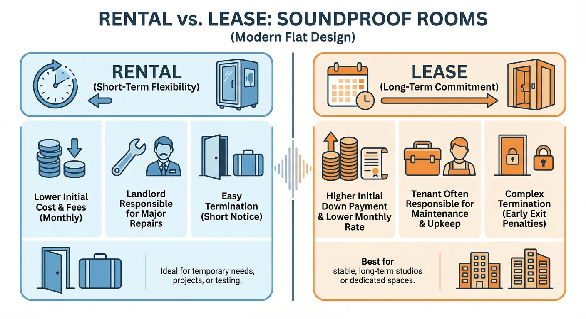

\"I want a soundproof room, but it's tough to pay 1 million yen in full.\"
\"I move a lot, so I'm afraid it will be a hindrance when I leave.\"

In such cases, <strong>renting or leasing a soundproof room</strong> becomes an option.
However, once you start looking into it, questions like "Can individuals borrow?", "Is it cheaper to just buy it after all?", or "Can I write it off as an expense?" never end.

In this article, instead of the perspective of a studio engineer, I'll take the perspective of a <strong>"Manager/Business Person"</strong> and explain the smart ways to "borrow" a soundproof room.

## What's the Difference Between "Rental" and "Lease" Anyway?

The words are similar, but the nature of the contracts is completely different.

### Rental (For Individuals and Corporations)

- <strong>Period:</strong> From a few days to a few years (relatively short).
- <strong>Ownership:</strong> Belongs to the rental company.
- <strong>Cancellation:</strong> <strong>Possible (cancellation fees may occur).</strong>
- <strong>Product:</strong> Choose from the rental company's inventory (mostly used).
- <strong>Pros:</strong> Easy to try. Can be returned when no longer needed.

### Lease (Mainly for Corporations and Sole Proprietors)

- <strong>Period:</strong> 3 to 10 years (long-term).
- <strong>Ownership:</strong> Basically the leasing company. Can be purchased after the contract expires.
- <strong>Cancellation:</strong> <strong>Principally not possible.</strong>
- <strong>Product:</strong> The leasing company buys a new one on your behalf and lends it to you.
- <strong>Pros:</strong> Can introduce a new product with 0 yen initial cost. Can be fully recorded as an expense.

## Recommended for Individuals: Rentals like Yamaha's "Oto-Rent"

For individual use, rentals are the most realistic.

### Yamaha's "Oto-Rent"

This is synonymous with soundproof room rentals in Japan.

- <strong>Monthly Fee:</strong> From approx. 15,000 JPY (varies by size).
- <strong>Minimum Period:</strong> From at least 12 months.
- <strong>Features:</strong> Rental items are cleaned used products. If you like it, you can perform a <strong>"buyout mid-contract" by applying the rental fees you've paid.</strong>

For people who worry, <strong>"What if I get bored?"</strong> or <strong>"What if it feels too oppressive once I actually put it in the room?"</strong>, this is ideal as a trial period.

### Waltz

- <strong>Features:</strong> Handles Kawai's "Nasal" soundproof rooms.
- <strong>Pros:</strong> In some cases, there are more options than Yamaha.

## Recommended for Corporations & Sole Proprietors: Lease Contracts

If you are a sole proprietor (streamer, music instructor) or a corporation thinking "I want to write off the soundproof room as a business expense," a lease might be a better deal.

### Biggest Benefits of a Lease: Cash Flow and Expenses

1.  <strong>0 Yen Initial Cost</strong>: If you buy a 1.0 million yen soundproof room, the cash on hand decreases by 1.0 million yen, but with a lease, you only have to pay tens of thousands of yen monthly. You can preserve your operating capital.
2.  <strong>Expense Processing</strong>: If purchased, an expensive soundproof room becomes a "fixed asset" and must be depreciated over several years. However, with lease fees, you can often record each monthly payment as a <strong>"full expense (lease fee)"</strong> (please check with a tax accountant as it depends on contract details and tax laws).

## "Buy" vs. "Rental": Where is the Break-even Point?

What you're probably concerned about is, "Which is a better deal: continuing to borrow or buying?"

### The Guide is "3 to 4 Years"

Generally, if you continue to pay monthly rental fees, they will <strong>exceed the "purchase price"</strong> in about 3 to 4 years.
(Example: 30,000 JPY/month x 36 months = 1.08 million JPY)

- <strong>If you use it for <strong>less than 3 years (moving for work, only during exam season) → <strong>Rental is a better deal.</strong></strong></strong>
- <strong>If you use it for <strong>more than 3 years (settling down for activities) → <strong>Purchase (or installment loan) is a better deal.</strong></strong></strong>

### Hidden Costs: Shipping and Assembly Fees

In the case of rentals, delivery/assembly fees (tens of thousands of yen) and disassembly/removal fees upon return are also incurred.
If you don't calculate including these "round-trip costs," you might end up in the red even with short-term use.

## Summary: Decide by Your "Activity Period"

1.  <strong>Trial / Short-term / Moving for work</strong> → <strong>Rental</strong> like Yamaha's "Oto-Rent."
2.  <strong>Long-term Activity / Owned Home</strong> → <strong>Purchase</strong> with credit or a loan.
3.  <strong>Business Use / Tax Saving</strong> → <strong>Lease</strong>, which preserves your cash on hand.

A soundproof room is an "investment in space," but there is more than one way to pay for it. Choose the plan that suits your activity style (and your wallet).

## Related Articles

- <strong>[Basics]: [【2026 Definitive Version】VTuber Soundproof Room Selection | Covering Everything from Equipment to Costs and Heat Measures](vtuber-proofroom-knowledge)</strong>
- <strong>[Market Rates]: [Soundproof Room Price & Cost Guide | Market Rates by Size and Performance](soundproof-room-price)</strong>

