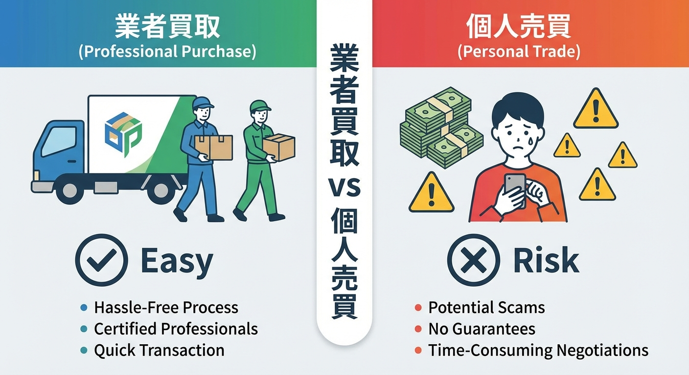

---
title: "Precautions When Selling Soundproof Rooms on Mercari or Yahoo Auctions | Arranging Delivery and A..."
description: "I want to sell my soundproof room for as high as possible! For people who are dissatisfied with professional buyback prices and are thinking of personal sales on Mercari or Yahoo Auctions, we'll explain how to avoid troubles with the biggest hurdles: 'Delivery' and 'Assembly'."
slug: "soundproof-room-sell-personal"
date: "2026-02-10T22:30:00+09:00"
lastmod: "2026-02-28"
draft: false
lang: "en"
category: "knowledge"
tags: ["Soundproof Room","Selling","Mercari","Yahoo Auctions","Personal Sales"]
image: ./cover.jpg
---
\"When I got a quote from a buyer to sell my soundproof room, it was surprisingly cheap... (or I was told it was 0 yen).\"
\"I want to sell it for as much as possible, so I want to sell it directly on Mercari or Yahoo Auctions!\"

I understand that feeling very well. It's not rare for a soundproof room that cost 1 million yen upon purchase to be worth only tens of thousands of yen when it comes to buyback.
However, personal sales of soundproof rooms are a super high-difficulty mission where huge walls called <strong>"Delivery" and "Assembly"</strong> stand in the way.

As a Kind Counselor, in this article, I'll teach you "Safe Trading Rules" to avoid getting caught in quagmire trouble in personal sales of soundproof rooms.

## The Sweet Trap of Mercari and Yahoo Auctions Rates

Certainly, on flea market apps, it looks like transactions are being made at prices 2 to 3 times higher than professional buybacks.
However, it's dangerous to judge based on price alone.

### Why Are Personal Sales Difficult?

Because a soundproof room is a <strong>"Small House (Architecture)"</strong>, not "Furniture."
It's a completely different situation from selling a dresser.

1.  <strong>Cannot be taken out from the room unless disassembled.</strong>
2.  <strong>Ordinary courier services (like Rakuraku Kazaikyubin) say "No to soundproof rooms."</strong>
3.  <strong>Even with instructions, an amateur cannot assemble it (orientation of gaskets, order of soundproofing panels, etc.).</strong>

## The Biggest Hurdle: How to Deal with "Delivery"?

This is the biggest pitfall.
If you carelessly sell with "Shipping Included (Bearer: Seller)" at the time of listing, you'll see hell later.

### General Delivery Companies Cannot Be Used

Large furniture delivery services such as Yamato Home Convenience are almost always <strong>"Not Applicable"</strong> for soundproof rooms (heavy goods that require disassembly).
Cases where buyers try to send it anyway and are refused by the driver who comes to pick it up, resulting in a transaction cancellation, are frequent.

### Solution: Arrange a Specialist or Have the Buyer Arrange One

The only way to sell safely is to use a <strong>"Soundproof Room Specialist Relocation Company."</strong>
However, this relocation cost is high (starting from 100,000 yen even for short distances).

<strong>Listing Rules for Success:</strong>

- Clearly state <strong>[Pickup Only]</strong> or <strong>[Buyer Responsible for Delivery Arrangement]</strong> instead of <strong>[Shipping Included]</strong>.
- Be sure to include the following conditions in the description:
  > "Please arrange and pay for the specialist for disassembly, removal, transportation, and assembly yourself."
  > "We refuse removal by anyone other than a specialist (to prevent trouble of scratching walls and floors)."

## Common Trouble Examples: The Darkness of Personal Sales

### 1. "I Can't Assemble It!" Complaints

A pattern where a buyer says "I'm good at DIY so I'll do it myself" and comes with a light truck to pick it up, only to complain later that "the parts won't fit" or "screws are missing."
An assembly-type soundproof room's gaskets can deteriorate once taken apart, or if the procedure is wrong, it will be full of gaps.

<strong>Countermeasure</strong>: Include a disclaimer stating, "We bear no responsibility for any malfunctions due to self-disassembly/assembly."

### 2. "It Smells!" Complaints

A soundproof room is a private room. An odor you are used to can be felt intensely as <strong>"Cigarette odor," "Pet odor," or "Living odor"</strong> by others.
An odor in a private room has sufficient power as a reason for return.

<strong>Countermeasure</strong>: Honestly write smoking and pet ownership history, and clearly state whether you've taken deodorizing actions (ozone deodorization, etc.).

## Ultimately, Which Is Better: Professional Buyback or Personal Sales?

| | Professional Buyback | Personal Sales (Mercari, etc.) |
| :--- | :--- | :--- |
| <strong>Sales Amount</strong> | Low (up to tens of thousands) | Higher (hundreds of thousands +) |
| <strong>Take-home Pay</strong> | Full sales amount | Sales Amount - Fee(10%) - <strong>Trouble handling cost</strong> |
| <strong>Effort</strong> | Completed with one phone call | Photography, answering questions, arranging specialists, handling complaints |
| <strong>Risk</strong> | None | Delivery impossible, returns, damage trouble |

### Conclusion: Unless You Are Someone Who Can Enjoy the Risks, "Professional" Is Safer

If you have the resolve that "even if it takes effort, I want to leave as much cash as possible" or "I don't mind handling trouble," it's worth trying personal sales.
Conversely, for people who are "busy" or "hate disputes," having a specialist buy it (or take it for free) even if it's cheap would be the <strong>"best deal"</strong> for your mental health.

---

## Related Articles

- <strong>[Buyback Market]</strong>: [Can Unused Soundproof Rooms Be Sold High? Appraisal Points and Market Rates of Popular Manufacturers](soundproof-room-purchase-price)
- <strong>[Relocation Cost]</strong>: [How much does it cost to relocate a soundproof room when moving? Summary of precautions for air conditioner removal and transportation](soundproof-room-relocation-cost)

