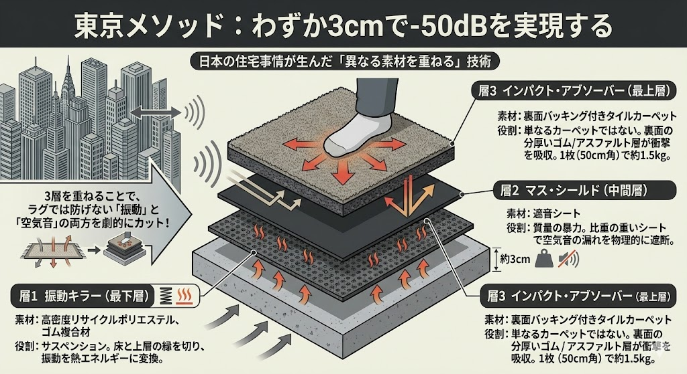

## The "80% Rug Rule" is Broken. Here’s Why.

If you live in a rented apartment in New York, London, or Toronto, you’ve likely signed a lease with the dreaded <strong>"80% Rule."</strong>
It mandates that 80% of your floor must be covered with carpets or rugs to dampen noise for the neighbors downstairs.

So, you went to IKEA, bought a thick, fluffy rug, and thought you were safe.
<strong>But your downstairs neighbor is still banging on their ceiling.</strong>

Why?
Because <strong>"Fluffiness" is not "Density."</strong>

In Japan, where millions live in wooden apartments with paper-thin walls, a simple rug is not enough. We don't rely on thickness; we rely on <strong>"Layering Physics."</strong>

Today, I’ll share the "Tokyo Standard" for floor soundproofing—a method that stops "Stompy" vibrations without turning your room into a shag-carpeted nightmare.

---

## The Physics of Failure: Why Rugs Let Sound Through

To understand why your rug effectively does nothing for impact noise (footsteps), you need to understand the difference between <strong>Airborne Sound</strong> and <strong>Impact Noise</strong>.

1.  <strong>Airborne Sound (Voices, TV)</strong>: Stopped by _Mass_ (Weight).
2.  <strong>Impact Noise (Footsteps, Dropped Phone)</strong>: Stopped by _Vibration Damping_ (Suspension).

A standard rug is light. When you walk on it, your heel strikes the floor, and the impact energy travels straight through the rug fibers, into the subfloor, and becomes a drumbeat for the person downstairs.

<strong>Rugs absorb "Echo" (reflection), but they do not stop "Transmission" (vibration).</strong>

---

## The "Tokyo Standard": 3 Layers in 3cm (1.2 inches)

In Japan, we cannot add 5 inches of concrete to our floors. We have low ceilings and strict rules against renovation.
Instead, we use a <strong>Multi-Layer System</strong> that is only <strong>1.2 inches (30mm) thick</strong> but achieves a reduction of <strong>-50dB (L-40/Dr-40 Class)</strong>.

Here is the secret recipe used in Japanese recording studios and gamer apartments:

### Layer 1: The "Vibration Killer" (Bottom)

- <strong>Material:</strong> High-Density Recycled Polyester or Rubber Composite (e.g., _P-Defence_).
- <strong>Function:</strong> This layer is dense but slightly elastic. It acts as a "suspension" for your floor, decoupling the top layer from the subfloor.
- <strong>Tokyo Hack:</strong> Japanese "Tatami" mats work on a similar principle, but modern tech has condensed this into 10mm sheets.

### Layer 2: The "Mass Shield" (Middle)

- <strong>Material:</strong> Mass Loaded Vinyl (MLV) or High-Density Asphalt Sheet.
- <strong>Function:</strong> Pure weight. This heavy sheet stops airborne sound from leaking through gaps.

### Layer 3: The "Impact Absorber" (Top)

- <strong>Material:</strong> Tile Carpet with Built-in Backing (e.g., _Shizuyuka_).
- <strong>Function:</strong> These aren't normal carpet tiles. They have a thick rubber backing fused to the fabric.
- <strong>The Key:</strong> They are heavy. A single 20x20 inch tile weighs over 3 lbs. When you lay them down, gravity seals them tight—no glue required.

---

## Comparison: US Rug vs. JP Layering System

Let’s look at the numbers. In Japan, we use <strong>L-values</strong> (Impact Sound Level) to rate floors. I’ve converted these to estimated <strong>IIC (Impact Insulation Class)</strong> for you.

| Feature          | Standard Thick Rug (US/EU)      | Japanese Layering System (Shizuyuka)  |
| :--------------- | :------------------------------ | :------------------------------------ |
| <strong>Material</strong> | Low-Density Fiber (Cotton/Wool) | High-Density Asphalt + Rubber + Fiber |
| <strong>Thickness</strong> | 0.8 inches (20mm)               | <strong>1.2 inches (30mm)</strong> |
| <strong>Weight</strong> | \~0.5 lbs / sq ft                | <strong>\~4.0 lbs / sq ft (8x Heavier!)</strong> |
| <strong>Sound Rating</strong> | Est. IIC 20-25 (Poor)           | <strong>Est. IIC 55-60 (Excellent)</strong> |
| <strong>Vibration</strong> | Transmits heel impact           | <strong>Absorbs & Disperses</strong> |
| <strong>Installation</strong> | Roll out                        | Lay down tiles (Gravity lock)         |

<strong>The Result:</strong> The Japanese system is 8 times heavier per square foot, yet barely thicker. That mass is what stops the sound.

---

## How to Hack Your Apartment (Without Importing from Japan)

You might not be able to buy "Shizuyuka" at your local Target, but you can replicate the physics using widely available materials.

### The "DIY Tokyo Sandwich"

1.  <strong>Base Layer</strong>: Buy <strong>Horse Stall Mats</strong> (3/4 inch rubber) from a farm supply store or <strong>Anti-Vibration Washing Machine Pads</strong>.
- <strong>_Why?_ High density rubber controls vibration better than foam.</strong>
2.  <strong>Top Layer</strong>: Heavy Duty <strong>Carpet Tiles</strong> with Bitumen (Asphalt) backing.
- <strong>_Why?_ Look for tiles meant for offices or airports. They are heavy and stiff.</strong>

### Step-by-Step Installation

1.  Clean your floor (Dust kills friction).
2.  Lay the Rubber Mats (Base) tight against each other. Tape the seams with Acoustic Tape.
3.  Lay the Carpet Tiles (Top) over the rubber, but <strong>offset the seams</strong> (brick pattern).
- <strong>_Tip_:</strong> Never let the seams of the top and bottom layers align. Sound leaks through straight lines.

---

## Conclusion: Density Over Fluff

The "80% Rug Rule" was written by landlords who don't understand physics. They think "Soft = Quiet."
But as an Urban Creator, you know better. <strong>"Heavy = Quiet."</strong>

By applying the specific "Layering" technique from Tokyo—combining a vibration-damping rubber base with a heavy mass top—you can stop the "Stompy" complaints forever.

And the best part? <strong>It’s 100% rental-friendly.</strong> When you move out, you just pick up the tiles and take your "floor" with you.

That is the <strong>Tokyo Standard</strong>.

---

_Ready to silence your floor? Implementing the Japanese layering method is the most effective way for any urban dweller to achieve peace and quiet._

