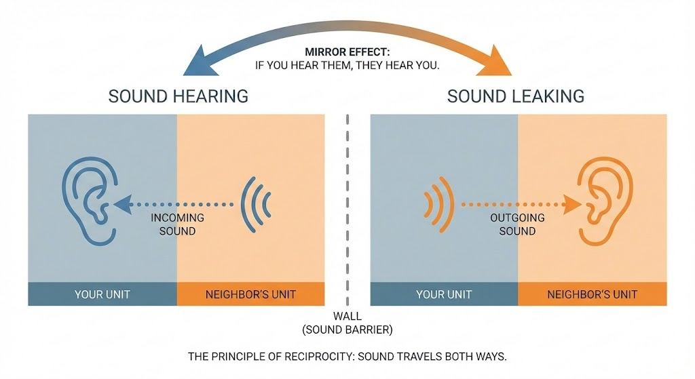

"I woke up to my neighbor's alarm clock."
"I can't sleep because of the footsteps upstairs."

If you live in a Japanese <strong>Wooden Apartment (Mokuzo)</strong>, these are common stories.

<strong>"If you can hear them, they can hear you."</strong>

Phone calls, gaming, TV, and late-night movement.
Even if you think you are being quiet, the thin walls of a wooden structure let sound pass through mercilessly.

This article starts with a cruel truth: <strong>"Perfect soundproofing in a wooden apartment is physically impossible."</strong>
Accepting this is the first step. Then, we will teach you <strong>realistic, low-cost methods to reduce noise leakage to a level that won't cause complaints.</strong>

Before you buy suspicious "soundproof wallpapers" online, read this.

## The Reality of Sound Insulation Performance (D-Value)

In terms of building standards, the sound insulation performance (D-value) of typical wooden apartment walls is around <strong>D-30 to D-40</strong>.
Let's compare this to a concrete condo (Mansion) to see just how "thin" it is.

- <strong>D-50 :</strong> Normal conversation is almost inaudible (Concrete Condo level).
- <strong>D-30 :</strong> <strong>You can hear the content of a normal conversation.</strong>
- <strong>D-20 :</strong> You can hear futons rustling (Paper sliding door level).

Essentially, wooden walls block vision but let sound pass through almost freely.
Sticking a few millimeters of "foam sheet" on such walls is, unfortunately, like <strong>throwing water on a burning house</strong>.

## 3 "Useless" DIY Measures to Avoid

The internet is full of dubious soundproofing techniques.
To avoid wasting your money and time, <strong>do NOT do the following</strong>:

### 1. Covering walls with thin insulation sheets

<strong>Conclusion: No effect due to lack of mass</strong>

To stop "low to mid-range" sounds like speech, you need <strong>overwhelming mass (weight)</strong> on the wall.
Thin sheets cannot stop sound. Worse, peeling them off when moving out often tears the wallpaper, leading to high repair fees.

### 2. Sticking Egg Cartons on walls

<strong>Conclusion: Urban legend level</strong>

It looks terrible and attracts bugs due to the uneven surface.
Both sound absorption and insulation effects are <strong>near zero</strong>. Absolutely avoid this.

### 3. Relying solely on Soundproof Curtains

<strong>Conclusion: Sound leaks freely from walls and floors</strong>

They help with windows, but wooden structures have thin walls and ceilings too.
Overconfidence ("I closed the curtains so I can scream") is the #1 cause of trouble.

## 3 Physical Measures That Actually Work

To fight noise in a wooden apartment, use weapons of <strong>"Mass"</strong> and <strong>"Sealing"</strong>, not expensive goods.
Here are 3 steps you can take without special construction.

### 1. Furniture Layout: Thicken the Wall with Bookshelves

The most effective tactic is to <strong>line up tall bookshelves or wardrobes against the wall shared with your neighbor.</strong>

Furniture packed with books and clothes acts as an excellent <strong>"Sound Absorber & Barrier"</strong>.
It's like adding 30cm of thickness to your wall. No thin sheet can beat this physics.

### 2. Gap Sealing: Block the Exit for Sound

Sound behaves like water; it leaks through needle-sized holes and spreads.
Older apartments are full of gaps.

- <strong>Door Gaps :</strong> Use <strong>EPDM (Rubber Sponge) tape. It has much better airtightness than cheap 100-yen shop foam.</strong>
- <strong>Window Sashes :</strong> Use <strong>Mohair (Brush) tape. It blocks noise and wind while allowing smooth opening/closing.</strong>

### 3. Floor Soundproofing: Kill the "Thump" of Footsteps

Actually, the #1 cause of trouble is not voice, but <strong>"Footsteps"</strong>.
Vibrations from walking ("Thump Thump") on flooring travel through pillars to every room around you.

- <strong>Solution :</strong> Lay a <strong>"P-Vibration Proof Mat (Rubber)" and cover it with a <strong>thick carpet.</strong></strong>
- <strong>Slippers :</strong> Wear soft-soled soundproof slippers. This alone drastically reduces the annoyance for the person living below you.

## The Final Defense: Mindset

After applying physical measures, a slight change in habits minimizes risk further.

1.  <strong>"Quiet Mode" after 10 PM</strong>
    Late at night, ambient noise drops, making your sounds effectively louder. After 10 PM, use headphones and walk softly ("Ninja Walk").
2.  <strong>Surround Yourself</strong>
    If you simply must talk (voice chat), don't treat the whole room. Create a "fort" around your desk with partitions or blankets. Absorbing sound near the source (your mouth) is most efficient.

---

## Summary: Limits of Wooden Structures

In a wooden apartment, please give up on "Playing instruments without a booth" or "Late night karaoke." Structure forbids it.

However, <strong>"Reducing normal living noise to a polite level" is possible.</strong>

1.  <strong>Move furniture to the wall</strong> (Physically thicken the wall)
2.  <strong>Seal with gap tape</strong> (Block sound escape routes)
3.  <strong>Lay mats on the floor</strong> (Eliminate vibration noise)

Just implementing these three things will improve your room's privacy and free you from the fear of neighbor trouble.

Why not start by moving that bookshelf today?

## Related Articles

- <strong>[Gap Sealing] : [Soundproof Room Gap Caulking](soundproof-room-gap-caulking)</strong>
- <strong>[Floor Noise] : [Floor Soundproofing Guide](floor-soundproofing-kids-exercise-layering)</strong>
- <strong>[Noise Complaints] : [Dealing with Noise Complaints](noise-complaint-solution)</strong>

