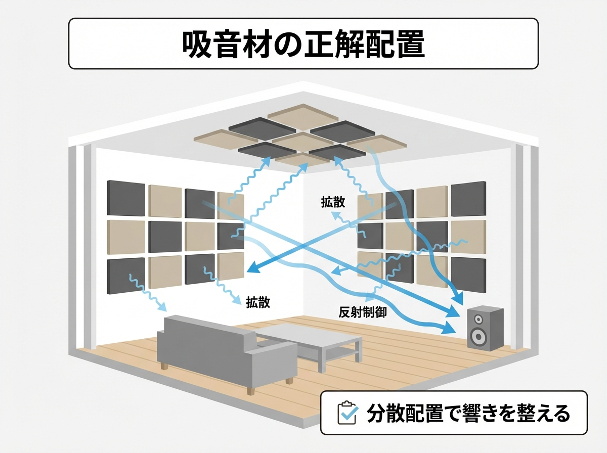

---
title: "吸音材の正しい配置場所とは？「貼りすぎ」を防いで理想の響きを作る"
description: "吸音材の正しい配置場所とは？「一次反射面」の見極め方から、低音の篭りを消すベーストラップの設置術まで。ただ貼るだけでは解決しないフラッターエコーや定在波を攻略し、プロの響きを手に入れるための音響調整マニュアルです。"
slug: "acoustic-panel-placement"
date: "2026-02-11"
lastmod: "2026-02-28"
draft: false
lang: "ja"
category: "knowledge"
tags: ["吸音材","配置","音響調整","DIY防音","フラッターエコー"]
image: ./cover.png
---
<RegionBanner />

「吸音材を買ったけど、どこに貼ればいいかわからない」
「とりあえず壁全面に貼ってみたら、音が詰まった感じで気持ち悪い…」

吸音材は、ただ闇雲に壁を埋めれば良いというものではありません。
<strong>「必要な場所に、ピンポイントで貼る」</strong>
これが、コストを抑えつつ最大の音響効果を得る秘訣です。

今回は、プロも実践する吸音材の「正解配置」を解説します。

## 貼るべき場所の優先順位ベスト3

どこから貼るべきか迷ったら、以下の3箇所を優先してください。

### 1. スピーカー/楽器の背面（デッドエンド）

音源（スピーカーや楽器）のすぐ後ろの壁です。
ここからの一次反射音は、直接音と干渉して音を濁らせる原因（低音のブーミングなど）になります。
まずはここに厚手の吸音材を貼りましょう。

### 2. 一次反射面（ミラーポイント）

リスニングポジション（自分が座る位置）から壁を見たとき、<strong>「鏡を置いたらスピーカーが見える位置」</strong> です。
ここには、横の壁からの反射音が一番早く到達します。
これをカットすることで、音の定位（ステレオ感）が劇的に向上します。

### 3. コーナー（部屋の角）

部屋の隅（コーナー）は、低音が溜まりやすい「ベース溜まり」の場所です。
ここに「ベーストラップ」と呼ばれる厚い吸音材や、三角形のスポンジを置くことで、部屋全体の低音のぼやけを解消できます。

## 「貼りすぎ」の弊害と、適度な<strong>散乱</strong>

### 全面貼りはNG?

壁全面に吸音スポンジを貼ると、高音域ばかりが吸われてしまい、<strong>「モコモコした音」</strong> の部屋になります。
これを「デッドすぎる部屋」と呼びます。
特に楽器演奏においては、適度な響き（余韻）がないと、自分の音が聞こえず演奏しにくい環境になってしまいます。

### おすすめは「市松貼り」

吸音材を隙間なく並べるのではなく、<strong>「吸音材」と「壁（反射面）」を交互に配置する（市松模様にする）</strong> 方法です。
これにより、吸音と反射をバランス良く行い、自然な響きを残すことができます。
見た目の圧迫感も減り、コストも半分で済みます。

## 天井：フラッターエコーの巣窟

手を叩くと「ビーン」という金属的な響きがしませんか？
これが「フラッターエコー」で、向かい合う平行な壁や、床と天井の間で音が往復することで発生します。
床がフローリングの場合、<strong>天井の一部に吸音材を貼る</strong> ことで、この不快な響きを効果的に消すことができます。

## まとめ：吸音材は「インテリア」ではなく「音響装置」

吸音材は、部屋をおしゃれにする壁紙ではありません。音をコントロールする装置です。

一度に全部貼るのではなく、
「まずはスピーカー裏だけ」
「次は左右の壁」
と、<strong>少しずつ貼って音を聴き比べる</strong> ことをおすすめします。
その変化を楽しむことも、防音DIYの醍醐味の一つです。

