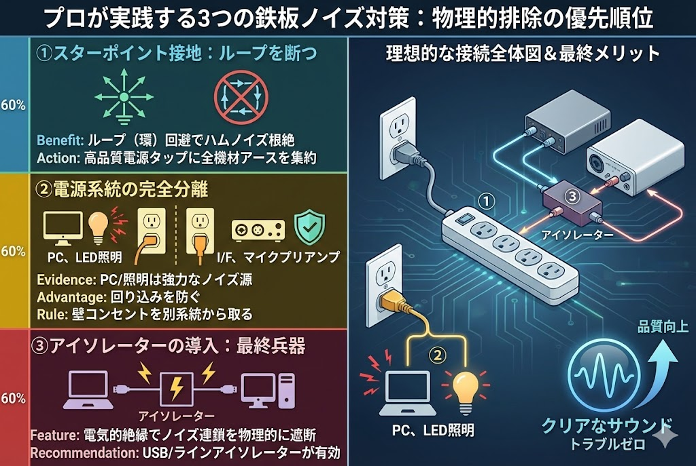

<RegionBanner />

せっかく高価な防音室を導入しても、スピーカーやマイクから「ブーン……」「ジー……」という不快な音が漏れていたら、創作意欲は台無しです。

防音性能（遮音）が「部屋の外」への対策なら、<strong>配線ノイズ対策は「部屋の中」の音質を守る最後の砦。</strong> 特に機材が密集する防音室内では、電源ラインの複雑化により「グランドループ」と呼ばれるノイズの通り道ができやすくなっています。

この記事では、音響エンジニアの視点から、<strong>配線ノイズを根本から消し去るためのアース接続とグランドループ対策の新常識</strong> を、チェックリスト形式で分かりやすく解説します。

---

## あなたのノイズはどこから？原因の特定

ノイズ対策の第一歩は、敵の正体を知ることです。

### 鳴り方でわかるノイズの正体

- <strong>「ブーン」という低い音：</strong>50/60Hzのハムノイズ。原因は <strong>アース（接地）不良やグランドループ。</strong>
- <strong>「ジジッ、パチッ」という音：</strong>PCの電源や照明、エアコンなどの <strong>電磁干渉（EMI）。</strong>
- <strong>「サーッ」という音：</strong>ホワイトノイズ。機材自体の <strong>S/N比やゲイン設定 の問題。</strong>

ストリーマーやDTMerを悩ませる最大の敵は、1つ目の「ハムノイズ」です。

これは複数の機材を繋いだときにできる「グランドの環（ループ）」を電気がぐるぐると回り続けることで発生します。

## プロが実践する3つの鉄板対策

ノイズを物理的に排除するための、優先順位の高い対策を公開します。

### ① 「スターポイント接地」でループを断つ

アース線をあちこちに繋ぐのではなく、1つの「中心点」から枝分かれさせる手法です。

- <strong>Benefit：</strong>ループ（環）ができなくなるため、ハムノイズが根絶されます。
- <strong>Action：</strong>高品質なオーディオ用電源タップを1点用意し、すべての機材のアースをそこへ集約します。

### ② 電源系統の完全分離

- <strong>Evidence：</strong>PCやモニター、LED照明は強力なノイズ源です。
- <strong>Advantage：</strong>オーディオインターフェースやマイクプリアンプといった「超精密機材」とは系統を分けることで、ノイズの回り込みを防ぎます。
- <strong>Rule：</strong>可能であれば、防音室内の照明用電源と、制作機材用電源は別々の壁コンセントから取りましょう。

### ③ アイソレーターの導入（最終兵器）

どうしてもノイズが消えない場合の「解決の証拠」がアイソレーターです。

- <strong>Feature：</strong>電気的に完全に絶縁（アイソレート）することで、ノイズの連鎖を物理的にシャットアウトします。
- <strong>Recommendation：</strong>USBバスパワー由来のノイズには「USBアイソレーター」、スピーカーへのノイズには「ラインアイソレーター」が極めて有効です。

## 防音室内でのチェックリスト

防音室特有の環境に合わせたチェックポイントです。

- <strong>[ ] <strong>照明のDC化 :</strong> AC直結のLEDはフリッカー（ちらつき）とノイズの原因。アダプターを室外に出すのが理想。</strong>
- <strong>[ ] <strong>換気ファンの干渉 :</strong> 強制換気ファンが回るとノイズが乗る場合、電源ラインが音声系と共有されている証拠。</strong>
- <strong>[ ] <strong>フェライトコアの装着 :</strong> 電源ケーブルに後付けできるノイズフィルター。安価で効果的。</strong>
- <strong>[ ] <strong>バランス接続の徹底 :</strong> マイクはTS（アンバランス）ではなくXLR/TRS（バランス）ケーブルを使用。</strong>

---

## QOLを最大化する「静寂」の音響設計

ノイズ対策を完了した環境で録音された音声は、編集（ポストプロダクション）の時間を劇的に短縮します。

「ノイズゲートで消せばいい」という考えは捨てましょう。<strong>元の信号（S）がクリーンであれば、ノイズ（N）を気にするストレスから解放され、より音楽的な表現に没頭できるからです。</strong>

機材を買う前に、まずは今の配線を見直してみてください。それだけで、数万円の機材アップグレード以上の音質改善が得られるはずです。

