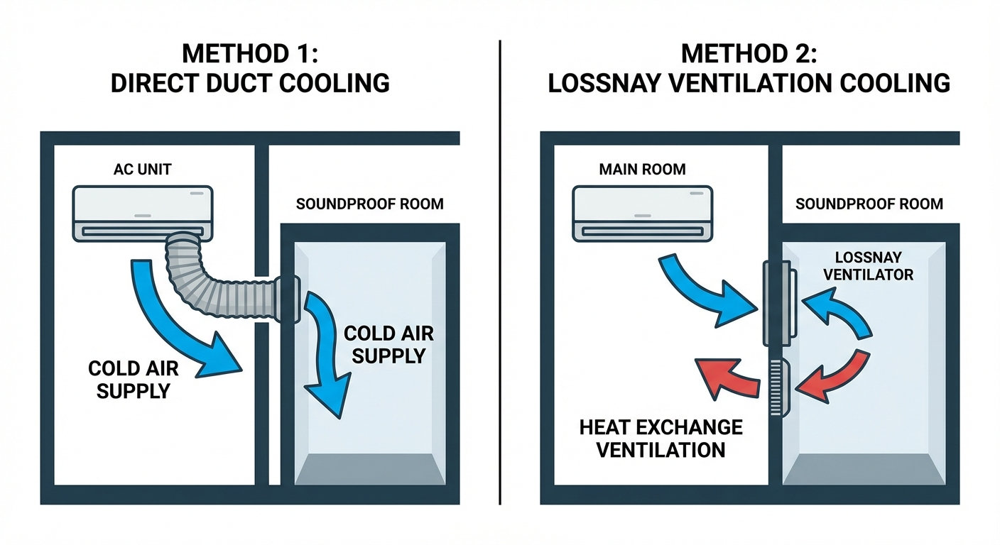

<RegionBanner />

「本格的な防音室（アビテックス等）を買いたいけれど、予算と部屋の広さの都合で <strong>0.8畳〜1.2畳</strong> しか置けない。でも、メーカーからは『このサイズだとエアコンの壁掛け設置はできません』と言われた……」

これは、マンションの1室に防音ブースを導入しようとする多くの人が直面する、最も絶望的な壁の一つです。
夏場の防音室はエアコン無しでは到底耐えられず、かといってスポットクーラーの爆音の中では、せっかくの静寂な録音環境が台無しになってしまいます。

本記事では、壁に穴を開けてエアコンを直接設置できない「狭小防音室」において、<strong>静寂を一切壊さずに冷暖房の恩恵をスマートに受けるための空調設計術</strong> を解説します。

## 1. なぜ1.2畳以下にはエアコンが付けられないのか？

防音室メーカーが推奨する「壁掛けエアコンの設置」は、通常 1.5畳〜 の広さが必要です。その理由は以下の通りです。

- <strong>物理的なスペース（壁の幅）の不足 :</strong> エアコン本体だけでなく、配管を通すための穴（スリーブ）と周囲のメンテナンススペースが確保できません。
- <strong>風が直接当たりすぎる（冷冷え・乾燥） :</strong> 1畳以下の空間にルームエアコンの冷風を直接吹き込むと、人が凍えるだけでなく、楽器や機材が異常乾燥・急冷塞結露を起こす危険があります。

## 2. スマート空調戦略 ①：親部屋のエアコンを「ダクト」で引き込む

最も現実的で、かつ静音性を完璧に保てるのが <strong>「親部屋（防音室を置いている部屋）のエアコンの風を、ダクトを使って防音室内に分岐させる」</strong> 方法です。

### 全館空調のようなアプローチ

防音室の中には「熱源（PC、人間）」しか存在せず、「冷媒（コンプレッサー）」は外にあるため、室内にエアコンの駆動音（ブゥーンという重低音や風切り音）が一切響きません。

- <strong>DIYでの実装 :</strong> フレキシブルダクト（アルミ蛇腹ホース等）の一端を、親部屋のエアコン吹き出し口に固定（またはカバーを作成して被せる）。もう一端を防音室の換気口の近く（吸気側）に繋ぎます。
- <strong>メリット :</strong> 室内に一切のノイズが入りません。歌のレコーディングやASMRの収録に最適な「究極の静音空調」が完成します。
- <strong>デメリット :</strong> 親部屋全体を冷やす必要があるため、電気代がやや高くなります。また、ダクトの取り回しが少し不格好になる可能性があります。

## 3. スマート空調戦略 ②：「ロスナイ」の強制換気力を利用する

ヤマハのアビテックスなど、<strong>「ロスナイ（同時給排型換気扇）」</strong> が標準装備されている防音室であれば、その強力な換気システムを「空調」として利用できます。

1.  <strong>親部屋を徹底的に冷やす（20℃設定など）</strong>。
2.  ロスナイは「防音室内の空気を外（親部屋）へ出し、外（親部屋）の空気を中へ入れる」役割を果たします。
3.  親部屋の冷たい空気が、ロスナイによる「強制吸気」によって防音室内にガンガン引き込まれます。

<strong>【ポイント】</strong>
ロスナイの吸気口付近に、親部屋のエアコンの風が直接（あるいはサーキュレーターを使って）届くように風向きを調整すると、驚くほど効率的に室温が下がります。

_図：親部屋のエアコンを利用する2つのスマート空調アプローチ_

## 4. やってはいけない！最悪の「簡易冷房」たち

狭小ブースで涼を得ようと、以下のアイテムを持ち込むと悲惨な結果を招きます。

- <strong>❌ <strong>冷風扇（水や氷を入れるタイプ） :</strong> 湿度を急激に上昇させ、数日で吸音材の奥深くにカビのコロニーを形成します。防音室では絶対に禁止です。</strong>
- <strong>❌ <strong>ペルチェ式・小型コンプレッサー式除湿冷風機 :</strong> 除湿はしてくれますが、背面から強烈な排熱が出るため、室温は逆に上がります。</strong>
- <strong>❌ <strong>スポットクーラーの直置き :</strong> 前述の通り、コンプレッサーの「爆音」により、防音室の最大の価値である「静寂」を完全に破壊します。</strong>

## まとめ：狭小防音室の空調は「親部屋との連携」で決まる

- <strong>1.2畳以下の場合、防音室単体で冷暖房を完結させようとしない。</strong>
- <strong>親部屋のエアコンから「ダクトで冷気を直送」するか、「ロスナイ経由で冷気を引き込む」のが大正解。</strong>
- <strong>湿度を上げる冷風扇は</strong>、防音室の機材と建材を破壊するため絶対厳禁。

防音室の小ささを悲観する必要はありません。熱源（エアコン本体）を室外に置ける狭小ブースは、考え方次第では <strong>「世界一ノイズの少ないプライベートスタジオ」</strong> になり得るのです。

