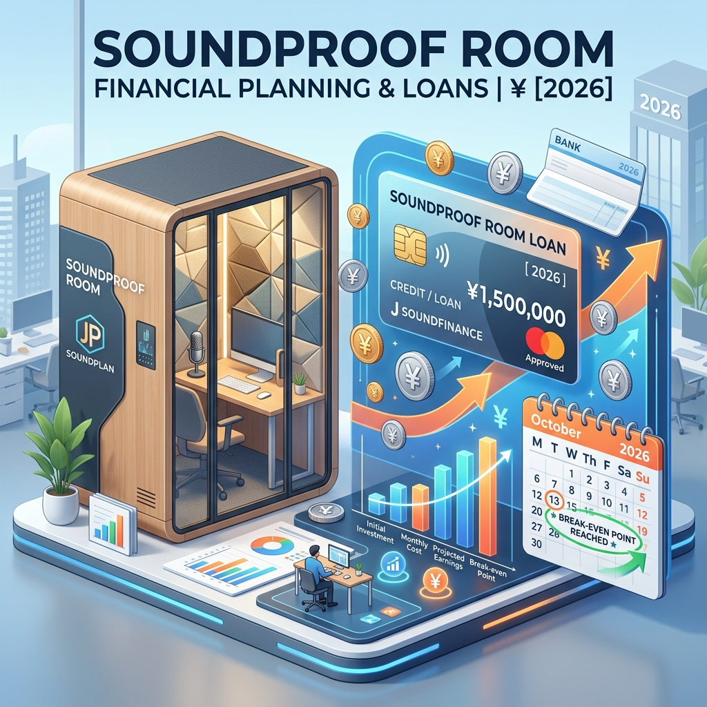

防音室の導入を検討する際、最大の壁となるのが「100万〜400万円」という初期費用の高さです。

しかし、2026年現在の市場において、防音室は <strong>高リセールバリュー（再販価値）を維持する「資産」</strong> として認知されており、ローンを活用した早期導入は極めて合理的な選択肢となります。

結論から言えば、<strong>「月々の分割支払額 ＜ 外部スタジオ代・移動コスト」</strong> の状態を作れるのであれば、手元資金を温存してローン（または分割払い）を利用すべきです。

## 1. 防音室の購入に利用できる4つの主要ファイナンス（2026年版）

防音室の導入には、大きく分けて4つの融資・分割購入の手法があります。自身の属性（給与所得者・個人事業主等）と、導入する製品（ユニット型・工事型）に合わせて選択するのが鉄則です。

| ファイナンス手法 | 推定金利 (年率) | 借入期間 | 特徴・メリット |
| :--- | :--- | :--- | :--- |
| <strong>メーカー無金利分割</strong> | <strong>0.0%</strong> | 36〜60回 | ヤマハ・カワイ等。利息負担ゼロでキャッシュを温存可能。 |
| <strong>銀行系楽器・趣味ローン</strong> | 2.5% 〜 5.0% | 最長10年 | スルガ銀行等。本体以外に「工事・空調費」も一本化できる。 |
| <strong>住宅・リフォームローン</strong> | 0.5% 〜 2.0% | 最長35年 | 住宅購入・改装時に組み込み。月々の負担を極限まで抑える。 |
| <strong>日本政策金融公庫</strong> | 1.0% 〜 2.5% | 最長10年 | 個人事業主・法人向け。事業用設備として低金利で調達可能。 |

## 2. 経済合理性の検証：「実質月額コスト」という考え方

防音室を「消費」ではなく「投資」と捉えるために必要なのが、<strong>実質月額コスト</strong>の算出です。

例えば、120万円のヤマハ・アビテックスを60回払いで導入する場合：
1.  <strong>月々の支払額</strong>：20,000円
2.  <strong>5年後の予想売却額</strong>：約600,000円（リセール率50%想定）
3.  <strong>実質負担総額</strong>：1,200,000円 - 600,000円 = 600,000円
4.  <strong>実質月額</strong>：600,000円 ÷ 60ヶ月 = <strong>10,000円</strong>

都心で週に数回スタジオを借りるコスト（月3〜5万円）と比較した場合、ローン利息を考慮しても <strong>「自宅防音室の方が圧倒的に安上がり」</strong> という逆転現象が起こります。

## 3. 【目的別】ユーザー属性に合わせたローン活用戦略

防音室の用途によって、ローンの審査基準や経費処理の可否が異なります。以下のリンクより、各ユーザーに特化した詳細な「ローン戦略」を確認してください。

### [ストリーマー・VTuber向け：ローン即日導入と経費化](/ja/knowledge/streamer-soundproof-loan-strategy)
配信環境をいち早く整え、収益化を加速させるための戦略。開業届を活用した事業用ローンの組み方についても解説します。

### [音楽家・プロ演奏家向け：キャリア投資としての資金計画](/ja/knowledge/musician-soundproof-loan-strategy)
練習時間を最大化し、音大入試やコンクール、仕事の質を高めるための「キャリア投資」としてのローン活用法。

### [テレワーク・ビジネス向け：生産性向上と複利効果](/ja/knowledge/telework-soundproof-loan-strategy)
自宅をコワーキングスペース化する際の、リフォームローンの活用や「書斎」としての減価償却メリットについて。

## 4. ローン審査をスムーズに通すための3つの準備

高額な防音室ローンでは、以下の準備があるだけで通過率が格段に向上します。

1.  <strong>「正確な見積書」の取得</strong>：本体価格だけでなく、運搬費、2階上げ費用、空調工事費が含まれた最終見積書を銀行に提出する。
2.  <strong>「頭金」の設定（1〜2割）</strong>：フルローンよりも一部自己資金を入れることで、金融機関への信用度が高まります。
3.  <strong>複数の金融機関を比較</strong>：特にハウスメーカーの住宅ローンに組み込める場合は、そちらの金利を最優先で確認してください。

## 結論：時間は「有限の資産」である

防音室の導入を1年先延ばしにすることは、その期間の <strong>「練習時間・配信時間・集中できる時間」</strong> をすべて失うことを意味します。2026年現在の低金利環境と高いリセールバリューを活用し、ローンを <strong>「未来の時間を買うためのレバレッジ」</strong> として賢く利用してください。

---
<strong>次に読むべき記事</strong>:
- <strong>[【資産分析】防音室のリセールバリュー比較｜ヤマハ・カワイの出口戦略](/ja/knowledge/soundproof-room-resale-value-comparison)</strong>
- <strong>[【2026最新】防音リフォーム補助金活用マニュアル](/ja/knowledge/soundproof-subsidy-system-list)</strong>
- <strong>[防音室の電気代と火災保険｜維持費のシミュレーション](/ja/knowledge/soundproof-room-maintenance-health)</strong>
