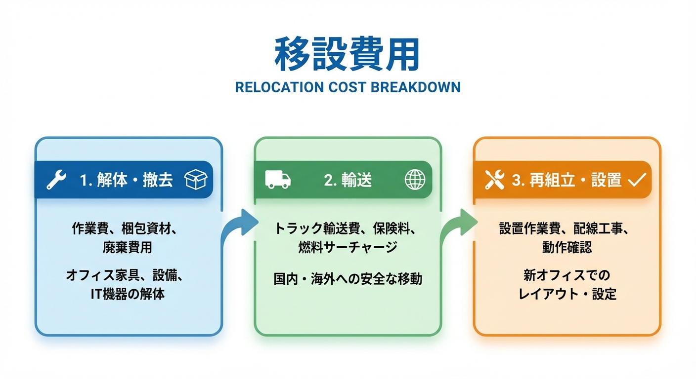

---
title: "引っ越しで防音室を移設する費用は？エアコン脱着や運搬の注意点まとめ"
description: "引っ越し先にも防音室を持っていきたい！でも移設費用は？一般の引越し業者で大丈夫？エアコンの脱着は？移設時の性能劣化リスクと対策を含めて徹底解説。"
slug: "soundproof-room-relocation-cost"
date: "2026-02-10T23:30:00+09:00"
lastmod: "2026-02-28"
draft: false
lang: "ja"
category: "knowledge"
tags: ["防音室","引越し","引っ越し","運搬","エアコン"]
image: ./cover.jpg
---
<RegionBanner />

「せっかく買った防音室、引っ越し先でも使いたい！」

しかし、いざ引越し業者に見積もりを依頼すると、 <strong>「防音室は対応できません」</strong> と断られることも少なくありません。
そもそも移設にいくらかかるのか？性能は落ちないのか？不安だらけですよね。

この記事では、Kind Life Advisorとして、防音室の移設にかかる費用とスムーズな引っ越しのコツをお伝えします。

## 防音室移設の総費用：15万〜40万円が相場

防音室の移設には、以下の3つの費用がかかります。

| 項目         | 費用相場                  |
| :----------- | :------------------------ |
| <strong>解体費</strong>   | 3万〜8万円                |
| <strong>運搬費</strong>   | 5万〜20万円（距離による） |
| <strong>再組立費</strong> | 5万〜12万円               |
| <strong>合計</strong>     | <strong>15万〜40万円</strong>          |

※1.5畳サイズのユニット防音室の場合。サイズや距離で変動します。

## 一般の引越し業者では対応不可の理由

「普通の引越し業者に頼めば安いのでは？」と思うかもしれませんが、ほとんどの業者は断ります。

### 理由1：専門知識が必要

防音室は、ただのパネルを組み合わせているわけではありません。
<strong>遮音パッキン（ゴム部品）の向き</strong> や <strong>締め付けトルク</strong> を間違えると、性能が大幅に落ちます。
一般の引越しスタッフでは対応できません。

### 理由2：重量物・破損リスク

防音室のパネル1枚で20kg〜30kgあります。
専用の工具と経験がないと、壁や床を傷つけたり、パネル自体を破損するリスクがあります。

## 解決策：防音室専門業者に依頼する

ヤマハやカワイの防音室なら、メーカーの公式移設サービス（または提携業者）があります。

### ヤマハアビテックスの場合

- <strong>窓口</strong> : 購入した楽器店経由で依頼
- <strong>費用目安</strong> : 近距離（同一県内）で15万円〜
- <strong>メリット</strong> : 性能保証がある、パッキン交換込み

### 非公式の専門業者

- <strong>費用</strong> : 公式より2〜3割安い場合も
- <strong>注意</strong> : 移設後の性能保証がない場合がある

## 移設時に性能が落ちるリスクと対策

### リスク1：パッキン劣化

一度解体すると、遮音パッキン（ゴムの部品）が劣化して、隙間ができることがあります。

<strong>対策</strong> : 移設業者に <strong>「パッキン交換」</strong> を依頼する（追加費用1〜3万円）。

### リスク2：再組立時の隙間

組立が甘いと、パネル同士の隙間から音が漏れます。

<strong>対策</strong> : 移設後、 <strong>必ず性能チェック</strong> をしてもらう。または自分で音漏れテスト（外で誰かに聞いてもらう）。

## エアコンの脱着問題

防音室専用のエアコンを設置している場合、別途 <strong>エアコン脱着業者</strong> を手配する必要があります。

- <strong>脱着費用</strong> : 1万5千円〜3万円（配管延長が必要な場合はさらに高額）
- <strong>タイミング</strong> : 防音室の解体 <strong>前</strong> にエアコンを外す必要がある

<strong>重要</strong> : 防音室業者とエアコン業者のスケジュール調整が必須。

## 引越し見積もり時の伝え方

引越し業者（または防音室専門業者）に見積もりを依頼する際、以下を必ず伝えましょう。

- <strong>メーカー・型番</strong> （例：ヤマハ アビテックス セフィーネNS 1.5畳）
- <strong>設置階</strong> （2階以上の場合、クレーン使用で費用増）
- <strong>エアコンの有無</strong>
- <strong>引越し先の設置場所</strong> （搬入経路の幅、エレベーター有無）

## まとめ：移設 vs 売却＆新規購入、どっちが得？

| 移設費用     | 新品購入価格  |
| :----------- | :------------ |
| 15万〜40万円 | 50万〜100万円 |

もし移設費用が30万円以上かかる場合、 <strong>「今の防音室を売却して、引越し先で中古を買う」</strong> という選択肢も検討する価値があります。

