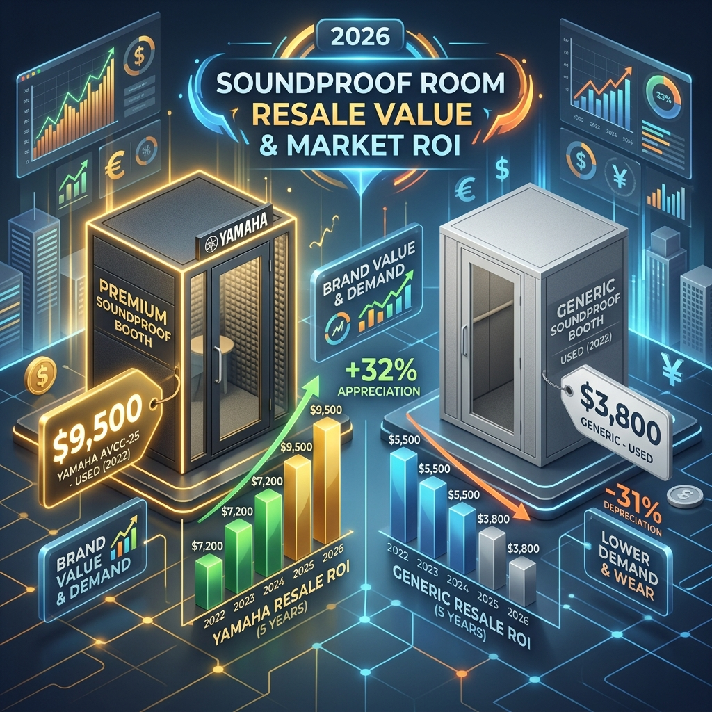

100万円を超える投資となる「ユニット防音室」。多くの人が「高い買い物」と躊躇する中、賢いクリエイターやストリーマーはこれを <strong>「流動性の高い資産」</strong> と捉えています。

実は、防音室は中古市場において需要が極めて安定しており、適切なモデルを選べば <strong>5年後でも新品価格の40〜50%で売却可能</strong> です。本記事では、2026年最新の中古実売データに基づき、防音室の「本当のコスト」を解明します。

## 1. 防音室「リセールバリュー」の真実：ブランドの力

防音室の価値を決定付けるのは「ブランド信頼性」と「移設の容易さ」です。特にヤマハ「セフィーネNS」は、品番から性能が即座に特定できるため、中古市場では「現金に近い」扱いを受けます。

### 主要モデルの5年後リセール予想（2026年調べ）

| モデル名 | 新品価格目安 | 5年後売却予想 | リセール率 | 特徴 |
| :--- | :--- | :--- | :--- | :--- |
| **ヤマハ セフィーネNS** | 120万円 | **55〜65万円** | **約50%** | 圧倒的なブランド力と需要 |
| **カワイ ナサール** | 115万円 | **45〜55万円** | **約45%** | オーダー性の高さが中古では若干不利 |
| **ベリーク（大建工業）** | 130万円 | **40〜50万円** | **約35%** | 建築一体型に近く移設コスト高 |
| **OTODASU / Danbocchi** | 15万円 | **1〜3万円** | **約10%** | 消耗品扱い。耐久性がネック |

<strong>※エンジニアのアドバイス：</strong> 「安物買いの銭失い」を避けるなら、リセールを前提に[ヤマハ・アビテックス](/knowledge/soundproof-room-purchase-price)の現行モデルを選ぶのが、トータルコストを最小化する最適解です。

## 2. 【ROI分析】外部スタジオ vs ローン購入の損益分岐点

「防音室は高い」という先入観を捨て、ランニングコストで比較してみましょう。週3回、各2時間スタジオを利用した場合と、防音室を[ローンで購入](/knowledge/streamer-soundproof-loan-resale)し、5年後に売却した場合のシミュレーションです。

### 累計コストの逆転ポイントは「2.4年」
- **スタジオ利用（5年累計）**: 約234万円（すべて「捨て金」）。
- **防音室購入（実質負担）**: (購入120万 - 売却60万 + 利息等) = **約70万円**。

わずか **2.4年目（29ヶ月目）** で、防音室を所有している方が経済的に有利になります。5年スパンでは、スタジオに通い続けるよりも **160万円以上の手残りキャッシュ** が増える計算です。

## 3. 大家・不動産オーナーも注目する「収益インフラ」としての側面

防音室の価値は、売却益だけではありません。賃貸物件に設置することで、強力な「賃料プレミアム」を生み出します。

- **賃料アップ**: 都心部の1R物件では、防音完備により **月額2万〜4万円の賃料上乗せ** が一般的です。
- **回収期間**: 約3年で防音室の投資額を回収。その後は純粋な利益となります。
- **出口戦略**: 物件売却時も、ユニット型なら別途中古市場で即座に現金化が可能です。

## 4. 資産価値を最大化する「運用ルール」

売却時に「最高ランク」の査定を引き出すための鉄則です。

1.  **非喫煙・ペット不可環境**: 臭い付着は **査定額が50%以上ダウン** する致命傷です。
2.  **エアコン設置の丁寧さ**: パネル加工が標準的で綺麗であるほど、中古購入者（個人）からの信頼が高まります。
3.  **[税務上の経費化](/knowledge/streamer-tax-strategy)**: 個人事業主なら減価償却（金属製15年/木製8年）を組み合わせることで、節税メリットによる「実質コスト低下」を狙えます。

## 結論：防音室は「賢い財務戦略」である

防音室は単なる設備ではなく、あなたの **「活動時間」と「将来の現金」を確保するためのインフラ** です。

5年後の売却を前提とした <strong>「実質月額 5,000円〜8,000円」</strong> という維持費は、サブスクリプション感覚で最高峰の録音環境を手に入れられることを意味します。

週に数回スタジオに通う、あるいは深夜の配信を我慢しているなら、今すぐ [最適な防音室の選定](/solutions/unit-rooms/bouon-osusume-hikaku) に入るべきです。

---
**合わせて読みたい関連記事**:
- [【実例】配信者のための防音室設置・テクニカルガイド](/use-case/streamer-tech/streamer-proofroom-setting)
- [防音室のローンと支払額シミュレーション｜月々の負担を抑えるコツ](/knowledge/streamer-soundproof-loan-resale)
- [【2026年最新】防音室の節税・税務ガイド｜個人事業主の減価償却](/knowledge/streamer-tax-strategy)
