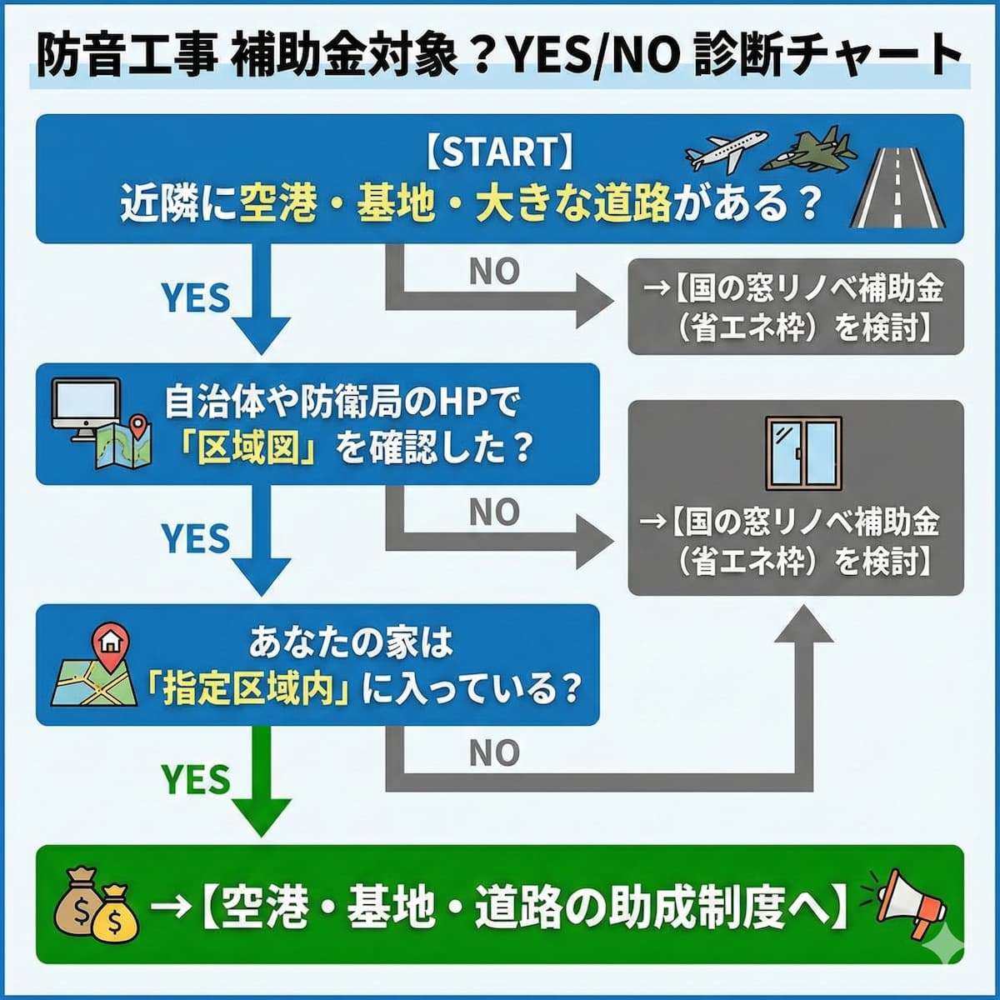

<RegionBanner />

防音工事の補助金が出ることを知っても、「うちの家は本当に対象なのか」という疑問が出てきますね。

この記事では、自宅が補助金の対象かどうかを、最短で調べる方法を解説します。

## 防音工事の補助金対象エリアか調べる最短の手順

「対象かどうか、今すぐ知りたい」という方のために、3つのステップをお示しします。

### ステップ1：「住所 ＋ 防音工事 ＋ 助成」でネット検索する

最も確実なのは、自治体や管轄団体の「区域図（PDF等）」を見つけることです。

検索ワード例：
- <strong>「〇〇市 自衛隊 防音助成」</strong>
- <strong>「〇〇区 沿道整備 防音」</strong>
- <strong>「〇〇空港 騒音区域図」</strong>

Googleで検索すると、多くの場合、公式の区域図がヒットします。

### ステップ2：主要な管轄団体の「区域図システム」を活用する

空港周辺なら「空港周辺整備機構」、基地周辺なら「地方防衛局」が地図を公開している場合が多いです。

これらは対話的な地図を提供していることがあり、住所を入力すると、自動で判定結果が表示されます。

### ステップ3：不動産購入時の「重要事項説明書」を確認する

持ち家の場合、購入時の書類に「防音工事助成区域内であるか」が記載されていることが多いです。

書類の「環境・騒音」の項目をチェックしてみましょう。

## 【エリア別】防音工事の補助金が出る条件と判定基準

補助金が出るかどうかは、「どのような騒音源の近くにいるか」で判定されます。

### 空港・自衛隊周辺：「騒音レベル（Lden）」の線引き

空港や基地からの距離ではなく、「<strong>騒音指数</strong>」で決まります。

第1種区域（Lden 62デシベル以上など）に入っているかが分かれ目です。

つまり：
- <strong>遠くても、騒音指数が高い地域は</strong>対象になる
- <strong>近くても、防音壁などで音が減っている地域は</strong>対象外になる可能性がある

という、距離ではなく「音の大きさ」で判定されるわけです。

### 幹線道路沿い：「道路からの距離」と「騒音測定結果」

道路沿いの補助金判定は、より複雑です。

- <strong>道路端からの距離：</strong>20m〜50m以内といった距離制限がある
- <strong>騒音測定：</strong>自治体が測定を行い、基準値（夜間65デシベル等）を超えている地域が指定される
- <strong>築年数：</strong>昭和○年以前など築年数条件がある場合も

つまり、距離・音量・築年数のすべてを満たす必要があります。

## どこに聞けばいい？「防音工事の補助金」相談窓口まとめ

対象エリアかどうかを最終確認する際は、直接管轄団体に相談するのが確実です。

### 空港周辺（民間空港）の窓口

成田、羽田、伊丹、中部、福岡など主要空港ごとに、財団や運営会社が異なります。

例えば：
- <strong>羽田空港：</strong>東京国際空港周辺対策室
- <strong>伊丹空港：</strong>関西エアポート（防音工事助成部門）

各空港の公式サイトで「防音工事」「助成」を検索すれば、相談窓口が見つかります。

### 自衛隊基地・在日米軍施設周辺の窓口

全国の「地方防衛局」が窓口です。

- <strong>北海道：</strong>北海道防衛局
- <strong>東北：</strong>東北防衛局
- <strong>関東：</strong>関東防衛局
- <strong>その他の地域：</strong>対応する地方防衛局

各地方防衛局は、Web上で「住宅防音工事」に関する情報を提供しています。

### 幹線道路（国道・高速道路）沿いの窓口

市役所の「環境課」や「道路課」が基本です。

東京都なら「沿道整備制度」など、自治体独自の名称があることを解説も大切です。例えば：
- <strong>「品川区 環境課」</strong>
- <strong>「大阪市 道路課」</strong>

といった具合に、自治体ごとに部署名が異なります。

## 重要：場所が対象でも補助金が出ないケース

注意してください。<strong>対象エリアに住んでいても、補助金が出ない場合があります</strong>。

### 住宅の「建築時期」による制限

騒音区域に指定された「後」に建てた住宅には補助が出ないことが多いです。

理由は、「自ら騒音エリアに飛び込んだとみなされるため」です。つまり、区域指定の時点で既に家が建っていることが条件なのです。

### 過去に一度でも補助金を受けている場合

防音工事の助成は、原則として「一つの住宅につき一度きり」です。

ただし、エアコン等の機器更新は例外として、改めて助成を受けられることもあります。

## エリア対象外だった場合の「賢い防音対策」

「調べたけど、うちはギリギリ対象外だった…」という結果が出たかもしれません。

<strong>でも、がっかりしないでください。</strong> 代替案があります。

### 住宅省エネ補助金（窓リノベ）を「防音工事の補助金」として活用

騒音区域外でも、国の「断熱リフォーム補助金」を使えば、内窓（二重窓）設置費用の約<strong>半額が助成</strong>されます。

この補助金は「エリア制限なし」です。つまり：
- <strong>全国どこでも利用可能</strong>
- <strong>工事費のおよそ50%が戻ってくる</strong>
- <strong>騒音対策として極めて有効</strong>

となるわけです。

### DIYや部分防音でコストを抑える

お金をかけない方法もあります。

- <strong>窓だけをプロに依頼し、壁や換気口は</strong>防音パネル等で自分で対策する
- <strong>防音カーテンを取り付ける</strong>
- <strong>隙間テープで窓の隙間をふさぐ</strong>

これらは完全な防音にはなりませんが、ある程度の効果は期待できます。

## まとめ：防音工事の補助金を確認して、静かな住環境を取り戻そう

調べるステップを整理すると：

1. <strong>ネットで「区域図」を探す</strong>ことから。
2. <strong>対象なら、対応する管轄団体に申請</strong>。
3. <strong>対象外なら「窓リノベ補助金」を検討</strong>。

対象エリアなら、全額助成のチャンスです。対象外なら、国の別の補助金で対策できます。

騒音ストレスを放置せず、公的制度を賢く利用しましょう。あなたの住環境改善は、十分に実現可能です。

