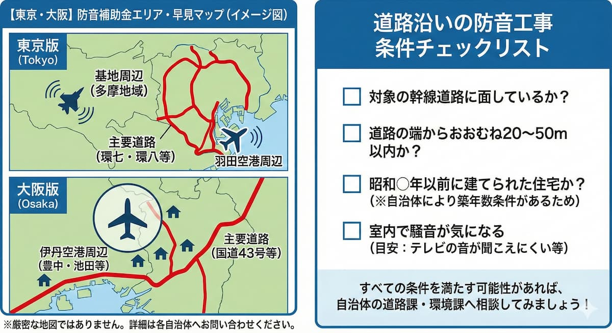

---
title: "【東京・大阪】防音工事で補助金が出る地域は？空港や幹線道路沿いの調べ方"
description: "東京・大阪で防音工事の補助金が出るのは「羽田・伊丹空港周辺」「米軍・自衛隊基地周辺」「環状線等の幹線道路沿い」です。具体的な対象エリアの例と、自宅が助成対象かピンポイントで調べる検索方法、補助内容の違いについて解説します。"
slug: "soundproof-subsidy-tokyo-osaka"
date: "2025-12-21T00:00:00+09:00"
lastmod: "2026-02-28"
draft: false
lang: "ja"
category: "knowledge"
tags: ["防音工事","補助金","東京","大阪","空港","幹線道路"]
image: ./cover.jpg
---
<RegionBanner />

東京や大阪にお住まいで、騒音に悩んでいる方へ。<strong>実は、防音工事の補助金が出る可能性があります</strong>。

特に大都市圏では、空港や米軍基地だけでなく、交通量の多い道路沿いも補助金の対象になります。ただし、「通り一本の違い」で対象外になることもあるため、正確な調べ方が重要です。

本記事では、東京・大阪で補助金が出る対象エリア、そしてあなたの家が対象かを調べる方法を解説します。

## 東京・大阪で防音工事の補助金が出る「3つのゾーン」

補助金が出るエリアは、大きく分けて3つあります。

### 東京：羽田空港・米軍基地周辺と環状道路沿い

<strong>空港・基地周辺：</strong>

- 大田区・品川区の一部（羽田空港周辺）
- 町田市・福生市など（厚木・横田基地関連）

これらの地域は、飛行機や戦闘機の騒音が環境基準を超えているため、国や防衛省が補助金を出しています。

<strong>主要道路沿い：</strong>

- 環状七号線（環七）
- 環状八号線（環八）
- 国道などの沿道で、区が指定する地域（板橋区、練馬区、大田区など多数）

東京は人口密集地のため、こうした幹線道路の騒音対策も積極的に行われています。

### 大阪：伊丹空港周辺と主要幹線道路沿い

<strong>空港周辺：</strong>

豊中市、池田市、箕面市、大阪市の一部など、広範囲にわたる「大阪国際空港（伊丹）」周辺が対象です。

伊丹空港は市街地に近く、周辺の影響を受ける地域が比較的広いのが特徴です。

<strong>主要道路沿い：</strong>

大阪市内の国道43号線沿いなど、自動車騒音が著しい指定地域が対象となります。

## 自分の家が対象かピンポイントで調べる方法

「でも、うちは本当に対象なの？」という疑問が出てきますね。ここは正確に調べることが大切です。

### 空港・基地周辺なら「騒音区域図」をチェック

最速で確認する方法は、「騒音区域図」を見ることです。

- 「羽田空港周辺 騒音区域図」
- 「伊丹空港 防音工事 区域」

などで検索し、管轄団体の地図情報で自宅の位置を確認するのが最速です。

多くの空港周辺では、Web上で対話的な地図が公開されており、住所を入力するだけで判定結果が出ます。

### 道路沿いは「区市町村名 ＋ 防音助成」で検索

道路の補助金は自治体（区役所・市役所）が窓口になることが多いです。

検索例：
- 「板橋区 沿道防音」
- 「豊中市 住宅防音」

道路沿いの補助金は、次のような条件があります：

- <strong>道路からの距離</strong>：端から20〜50メートル以内など距離条件あり
- <strong>騒音レベル</strong>：基準値（夜間65デシベル等）超過
- <strong>築年数</strong>：昭和○年以前など築年数制限あり

自治体によって細かいルールが異なるため、電話で問い合わせるのが確実です。

## 【空港・基地周辺】と【道路沿い】で補助内容が異なる

同じ「防音工事補助金」でも、申請先によって内容が大きく異なります。

### 空港・基地周辺：原則100%助成で手厚い

空港や基地周辺は、国や防衛省が管轄するため、補助がより手厚い傾向があります。

<strong>窓だけでなくエアコンや換気扇も対象</strong>

飛行機の音は上空から来るため、家の隙間を徹底的に埋める工事が行われます。

そのため：
- 防音サッシ（窓）
- エアコン設置・交換費用
- 換気扇の防音化

など、<strong>窓以外の設備も助成対象</strong>になります。

夏場の窓閉め切りのためにエアコン設置費用も出るのが特徴です。古い機器の「更新（買い替え）」補助がある場合も多いです。

### 道路沿い：上限あり・一部自己負担のケースも

道路騒音対策は、自治体ごとにルールが異なります。

<strong>防音サッシ（二重窓）と吸気口の改良がメイン</strong>

道路騒音対策は、主に「窓」と「通気口」の防音化です。自治体により「工事費の4分の3まで助成」「上限100万円まで」といった枠が設定されていることが多いです。

<strong>対象となる騒音レベルの基準（デシベル）</strong>

「夜間の騒音が65デシベル以上」など、測定による基準クリアが必要な場合があります。

## エリア外の東京・大阪都民が使うべき「別の補助金」

「調べたけど、うちはギリギリ対象外だった…」という経験をされた方も多いのではないでしょうか。

東京・大阪では、補助金の線引き（区域）からわずかに外れただけで対象外になるケースが非常によくあります。

<strong>でも、諦めないでください。</strong> 別の選択肢があります。

### 誰でも使える「国の省エネ補助金」が最強の代替案

防音工事の特定エリア外であっても、国の「断熱窓リフォーム補助金」を使えば、内窓設置費用の約50%が戻ってくるのです。

「先進的窓リノベ事業」という制度で、エリア制限がありません。

実質的に防音対策として機能するため、多くの都心ユーザーが利用しています。

つまり：
- <strong>補助金が出ない地域でも、別の補助金で対策可能</strong>
- <strong>工事費のおよそ半額が戻ってくる</strong>
- <strong>全国どこでも利用可能</strong>

というメリットがあります。

## まとめ：まずは「対象エリア検索」から。対象外なら「窓リノベ」

東京・大阪は、空港・基地に加え「道路沿い」もチャンスがあります。

まずは「自治体名＋防音助成」で検索し、行政の窓口に確認することが第一歩です。

その結果が「対象外」でも、全国対応の「省エネ補助金」で賢く静かな環境を手に入れることができます。

騒音ストレスを放置せず、公的制度を積極的に活用しましょう。あなたの努力次第で、静かな生活環境は十分に取り戻せます。

