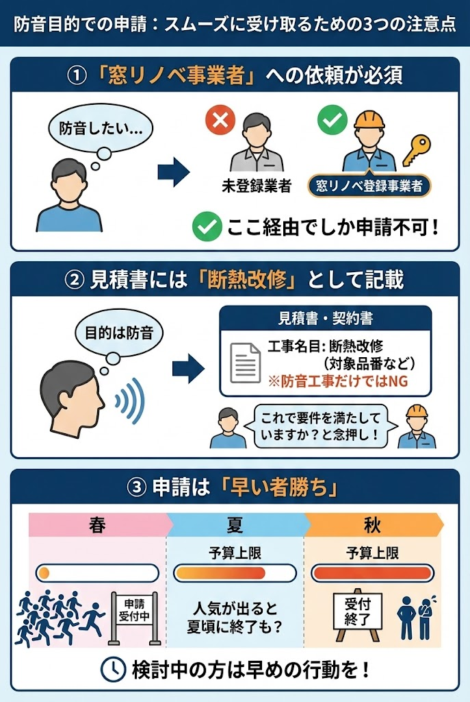

---
title: "二重窓と遮音窓、どっちが効く？補助金対応の最強の組み合わせを解説"
description: "窓リノベ補助金を活用しながら最強の防音効果を手に入れる方法を解説。「二重窓」と「遮音ガラス」の黄金の組み合わせと、失敗しないガラス選びのポイントを紹介します。"
slug: "subsidy-soundproof-window-combo"
date: "2026-01-18T21:43:00+09:00"
lastmod: "2026-02-28"
draft: false
lang: "ja"
category: "knowledge"
tags: ["内窓リフォーム","補助金","先進的窓リノベ事業","異厚複層ガラス","真空ガラス"]
image: ./cover.jpg
---
<RegionBanner />

# 二重窓と遮音窓、どっちが効く？補助金対応の最強の組み合わせを解説

「窓の防音をしたいけれど、費用は抑えたい」
「補助金があるって聞いたけど、防音窓は対象になるの？」

そんな悩みを抱える方へ。結論から言うと、「<strong>二重窓のリフォームで補助金をもらいつつ、最強の防音性能を手に入れることは可能</strong>」です。ただし、ガラス選びを間違えると「補助金が出ない」あるいは「防音効果がない」という最悪の結果になりかねません。

この記事では、2025年の最新補助金制度（先進的窓リノベ2025事業）を活用して、賢く静かな部屋を手に入れるための「ガラスの選び方」を解説します。

## 【結論】「二重窓」の枠の中に「遮音ガラス」を入れるのが正解

まず整理しておきたいのが、「二重窓」と「遮音窓」は対立するものではなく、組み合わせるものだということです。

*   <strong>二重窓（内窓）</strong>：今ある窓の内側にもう一つ窓をつける<strong>「工法」</strong>のこと。
*   <strong>遮音窓（防音ガラス）</strong>：サッシの中にはめ込む<strong>「ガラスの種類」</strong>のこと。

もっとも効果が高いのは、「<strong>二重窓（工法）を採用して、その中身を遮音ガラスにする</strong>」という組み合わせです。
これにより、窓が二重になる「気密性」と、ガラス自体が音を跳ね返す「遮音性」の相乗効果が得られます。

### 防音性能と断熱性能はトレードオフではない
「防音ガラスにすると断熱性が落ちて、補助金がもらえないのでは？」と心配される方がいますが、正しく選べば<strong>両立可能</strong>です。

むしろ、近年の高性能ガラスは「断熱も防音もすごい」製品が主流になりつつあります。
この「両取り」ができるガラスを選ぶことが、補助金活用の鍵となります。

## 補助金が出ない・効果がない「3つの失敗パターン」

補助金（先進的窓リノベ事業など）は、あくまで「<strong>断熱（省エネ）</strong>」に対する支援制度です。
そのため、以下のような選び方をすると補助金が出なかったり、防音で失敗したりします。

### ① 普通の単板ガラス（1枚ガラス）
*   <strong>× 補助金対象外</strong>
*   <strong>× 防音効果も断熱効果も低い</strong>

一番安上がりですが、性能が低すぎて補助金の要件（熱貫流率）を満たしません。
今の時代、あえてこれを選ぶメリットは費用面以外にありません。

### ② 防音合わせガラス（防音膜入り）
*   <strong>△ 補助金が出ないことが多い</strong>
*   <strong>◎ 防音効果は高い</strong>

2枚のガラスの間に防音特殊フィルムを挟んだガラスです。
防音性能は素晴らしいのですが、空気層がないため「断熱性能」があまり高くありません。

そのため、補助金（窓リノベSS/S/Aグレード）の基準を満たせず、対象外になるケースが多々あります。

### ③ 一般的なペアガラス（複層ガラス）
*   <strong>◯ 補助金対象</strong>
*   <strong>△ 防音効果に落とし穴あり</strong>

最も一般的なエコガラスです。
補助金はもらえますが、防音面では弱点があります。同じ厚さのガラス（例：3mm+3mm）を等間隔で並べることで、特定の高さの音が通り抜けやすくなる「共鳴現象（コインシデンス効果）」が起きるためです。

「二重窓にしたのに、電車の音が前より響く気がする」という失敗の多くがこれです。

## 補助金をもらいつつ、防音を最強にする「2つの選択肢」

では、何を入れれば「補助金獲得（断熱）」と「防音成功」を両立できるのか。正解は以下の2つです。

### 選択肢A：異厚複層ガラス（厚さ違いペアガラス）
<strong>【コスパ重視の方におすすめ】</strong>

一般的なペアガラスの弱点である「共鳴現象」を防ぐため、<strong>内側と外側のガラスの厚さを変えた製品</strong>です（例：3mmガラス ＋ 空気層 ＋ 5mmガラス）。

*   <strong>防音性</strong>：厚さを変えるだけで、音の通り抜けを大幅に防げます。
*   <strong>断熱性</strong>：空気層があるため高く、補助金の「Aグレード」や「Sグレード」を狙いやすいです。
*   <strong>費用</strong>：通常のペアガラス＋数千円程度の差額で済むことが多く、コスパは最強です。メーカーによっては「防音ペアガラス」等の名称で販売されています。

### 選択肢B：真空ガラス（スペーシア等）
<strong>【予算度外視で最強を求める方へ】</strong>

2枚のガラスの間を「真空」にしたハイテクガラスです。音も熱も伝える物質（空気）が存在しないため、圧倒的な性能を誇ります。

*   <strong>防音性</strong>：単板ガラスの遮音性能を遥かに凌駕し、JIS等級でも最高クラスです。
*   <strong>断熱性</strong>：魔法瓶と同じ原理で、結露もほぼゼロになります。補助金では最高ランクの「SSグレード」対象になることが多いです。
*   <strong>費用</strong>：非常に高価（通常のガラスの数倍）ですが、補助金の戻り額も大きいため、実質負担額で計算すると検討の余地があります。

### 費用対効果のシミュレーション（掃き出し窓1箇所）
※価格は目安です。補助金は2025年度の想定額。

| ガラスの種類 | 工事費目安 | 補助金目安 | 実質負担額 | 評価 |
| :--- | :---: | :---: | :---: | :--- |
| <strong>単板ガラス</strong> | 6万円 | 0円 | <strong>6万円</strong> | 正直もったいない |
| <strong>異厚複層</strong> | 11万円 | ▲5.8万円 | <strong>5.2万円</strong> | <strong>一番お得！</strong> |
| <strong>真空ガラス</strong> | 22万円 | ▲8.4万円 | <strong>13.6万円</strong> | 性能は最高 |

このように、補助金を活用すれば、<strong>性能の低い単板ガラスよりも、性能の高い異厚複層ガラスの方が安く済む</strong>という逆転現象が起こり得ます。これを知っているかどうかが最大の分かれ道です。

## 防音目的で申請する際の注意点

最後に、スムーズに補助金を受け取るための手続き上のポイントをお伝えします。

### ① 「窓リノベ事業者」への依頼が必須
この補助金は、登録された事業者経由でしか申請できません。
ホームセンターや地元のリフォーム店に相談する際は、必ず「先進的窓リノベ事業の登録事業者ですか？」と確認してください。

### ② 見積書には「断熱改修」として記載される
目的が防音であっても、書類上は「省エネ・断熱リフォーム」として扱われます。
「防音工事」という名目だけでは補助金が下りないため、業者が作成する見積書や契約書の記載内容（対象品番など）任せになります。

不安な場合は「これで補助金の要件を満たしていますか？」と念押ししましょう。

### ③ 申請は「早い者勝ち」
例年、予算上限に達した時点で受付が終了します（これまでの傾向では秋頃）。
人気が高まると夏頃に終わる可能性もあるため、検討中の方は早めの見積もり・契約をおすすめします。

## まとめ：賢く制度を利用して、静かで暖かい部屋を作る

「二重窓」と「遮音窓（防音ガラス）」は、補助金を活用することで賢く両立できます。

*   <strong>基本戦略</strong>：内窓（二重窓）を設置する。
*   <strong>ガラス選び（コスパ）</strong>：「異厚複層ガラス」を指定して共鳴現象を防ぐ。
*   <strong>ガラス選び（最強）</strong>：予算があれば「真空ガラス」を選ぶ。
*   <strong>注意点</strong>：必ず「窓リノベ事業者」に依頼し、早めに動く。

この構成なら、騒音の悩みと冬場の寒さ（結露）を一気に解決でき、さらに補助金でお財布にも優しいリフォームが可能です。
ぜひ、「ただの二重窓」ではなく「<strong>中身にこだわった二重窓</strong>」を検討してみてください。

