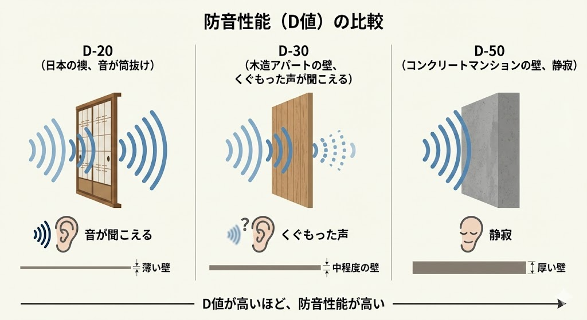
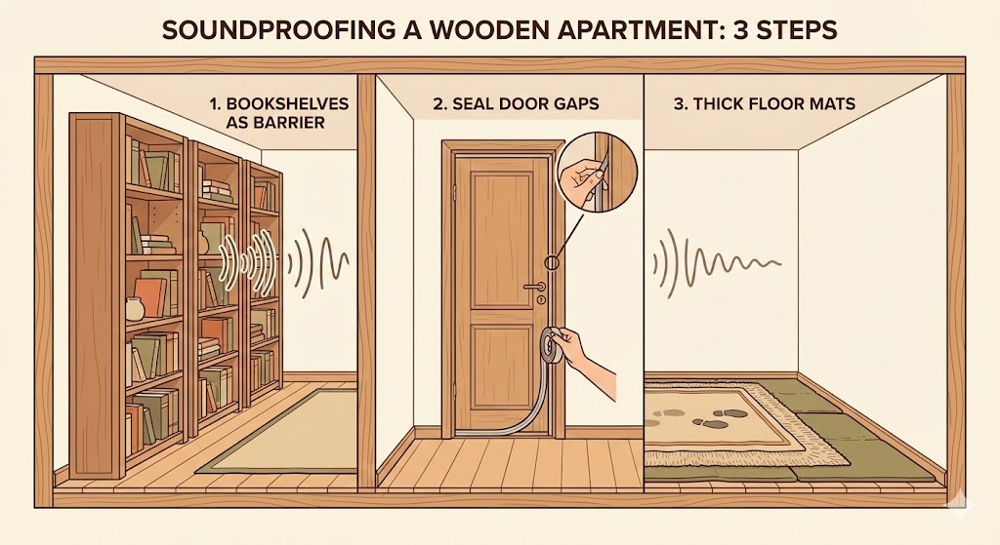

---
title: "木造アパートの防音は無理？苦情ゼロまで音を減らす3つの現実的対策"
description: "「隣の人の生活音が聞こえる＝自分の音も漏れている」。木造アパートの絶望的な遮音性能（D値）を解説し、高価なグッズを使わずに「苦情が来ないレベル」まで音漏れを軽減する家具配置や隙間埋めテクニックを紹介します。"
slug: "wooden-apartment-soundproof-guide"
date: "2026-01-06T02:50:00+09:00"
lastmod: "2026-02-28"
draft: false
lang: "ja"
category: "knowledge"
tags: ["木造アパート","防音賃貸","隙間テープ","生活音","家具配置"]
image: ./cover.jpg
---
<RegionBanner />

「隣の部屋の目覚まし時計で目が覚めた」
「上の階の足音がうるさくて眠れない」

もしあなたが木造アパートに住んでいて、こんな経験があるなら要注意です。

<strong>「隣の音が聞こえる」ということは、「あなたの出している音も、筒抜けになっている」からです。</strong>

通話、ゲーム、テレビ、そして深夜の足音。
「自分は静かにしているつもり」でも、木造アパートの薄い壁は容赦なく音を通します。

この記事では、 <strong>「木造アパートで完全防音は無理」</strong> という残酷な真実をまず受け入れていただいた上で、それでも「苦情が来ないレベル（マナーを守れるレベル）」まで音漏れを防ぐ、 <strong>現実的で低コストな方法</strong> を伝授します。

怪しい防音シートを買う前に、まずはこの記事を読んでください。

## 木造アパートの防音性能（D値）の現実

建築基準法や構造の話になりますが、木造アパートの壁（界壁）の遮音性能は一般的に <strong>D-30〜D-40</strong> 程度と言われています。
この数字がどれほど「薄い」か、コンクリート造のマンションと比較してみましょう。

- <strong>D-50</strong> : 通常の話し声がほぼ聞こえない（分譲マンションレベル）
- <strong>D-30</strong> : <strong>通常の話し声の内容まで聞き取れる</strong>
- <strong>D-20</strong> : 布団がこすれる音まで聞こえる（ふすまレベル）

つまり、木造アパートの壁は「視界は遮るけれど、音はほとんど素通り」させています。
ここに数ミリの「吸音シート」を貼ったところで、残念ながら <strong>焼け石に水</strong> です。

## やってはいけない「無駄な木造アパート防音」3選

ネット上には効果の怪しい防音テクニックが溢れています。
お金と時間を無駄にしないために、以下の3つは <strong>実行しないでください</strong> 。

### 1. 薄い遮音シートを壁一面に貼る

<strong>結論：重さが足りないため効果なし</strong>

話し声のような「低音〜中音」を止めるには、壁に <strong>圧倒的な質量（重さ）</strong> が必要です。
ペラペラのシートを貼っても音は止まりません。しかも退去時に剥がすと壁紙が破れ、多額の修繕費を請求されるリスクのほうが高いです。

### 2. 壁に卵パックを貼る

<strong>結論：都市伝説レベル</strong>

インテリアとしても最悪で、凸凹に虫が湧く原因にもなります。
吸音効果も遮音効果も <strong>ほぼゼロ</strong> です。絶対にやめましょう。

### 3. 防音カーテンだけで安心する

<strong>結論：壁と床からは漏れ放題</strong>

窓からの音は減りますが、木造は壁や天井も薄いのです。
「カーテン閉めたから大声出しても大丈夫」という過信が、一番のトラブル原因になります。

## 木造アパートで音漏れを防ぐ3つの物理対策

木造アパートで戦うための武器は、高価なグッズではなく <strong>「重さ」</strong> と <strong>「密閉」</strong> です。
特別な工事なしでできる、3つのステップを紹介します。

### 1. 家具配置：タンスと本棚で「壁を厚く」する

一番効果があるのは、 <strong>隣の部屋と接している壁に、背の高い本棚やタンスを並べること</strong> です。

本や衣類がぎっしり詰まった家具は、非常に優秀な <strong>「吸音・遮音体」</strong> になります。
壁の厚さが実質「+30cm」になるようなものです。これに勝る薄手のシートはありません。

### 2. 隙間対策：音の脱出口を塞ぐ

音は水と同じで、針の穴のような隙間から漏れ出して広がります。
特に古いアパートは隙間だらけです。

- <strong>ドアの隙間</strong> : 「EPDM（ゴムスポンジ）」製の隙間テープを貼ってください。100均のスポンジより、ホームセンターのゴム製が気密性が高くおすすめです。
- <strong>窓のサッシ</strong> : 「モヘア（起毛）」タイプのテープを貼ります。開閉をスムーズにしつつ風切り音も防げます。

### 3. 床防音：かかと歩きの「ドスン音」を消す

実は、トラブルの原因No.1は声よりも <strong>「足音」</strong> です。
フローリングを歩く「ドスドス」という振動は、柱を伝って全方向に響きます。

- <strong>対策</strong> : 「P防振マット（ゴム製）」の上に「厚手のカーペット」を敷く。
- <strong>スリッパ</strong> : 裏が柔らかい防音スリッパを履く。これだけで下の階への迷惑は激減します。

## 最後の砦は「マインドセット」

物理対策をした上で、生活習慣を少し変えるだけで、リスクはさらに下がります。

1.  <strong>22時以降は「静音モード」</strong>
    深夜は周囲も静まるため、音が何倍にも響きます。22時を過ぎたらヘッドホンをし、足音を忍ばせましょう。
2.  <strong>自分の周りだけ囲う</strong>
    どうしても通話をしたいなら、部屋全体ではなく「自分のデスク周り」だけをパーティションや布団で囲ってください。音源（口元）に近い場所で吸音するのが一番効率が良いです。

---

## まとめ：木造建造物の防音対策は限度がある

木造アパートで「防音室なしで楽器演奏」や「深夜の熱唱」は、残念ながら諦めてください。それは構造上不可能です。

しかし、 <strong>普通の生活音を、隣の人に不快に思われないレベルにすることは可能</strong> です。

1.  <strong>家具を壁際に寄せる</strong> （物理的な壁を厚くする）
2.  <strong>隙間テープで密閉する</strong> （音の抜け道を塞ぐ）
3.  <strong>床にマットを敷く</strong> （振動音を消す）

この3つを実践するだけで、あなたの部屋の居心地は劇的に良くなり、隣人トラブルの恐怖から解放されるはずです。

まずは今日、本棚を動かすところから始めてみませんか？

