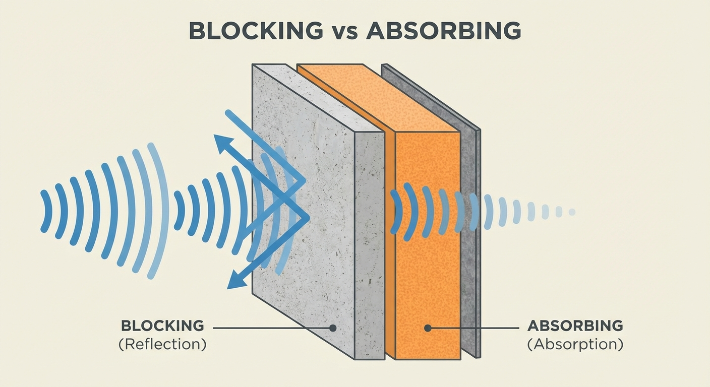

---
title: "DIY Soundproofing: Pro-Tips for Maximizing Performance on a Budget"
description: "A logic-driven breakdown of DIY soundproofing for renters. Learn the golden ratio of 'Isolation vs. Absorption,' material specs for D-value improvement, and the 5-step protocol for blocking external noise in 2026."
slug: "diy-soundproofing-tips"
date: "2026-02-22"
lastmod: "2026-03-07"
draft: false
lang: "en"
category: "solutions"
subcategory: "custom"
tags: ["防音"]
image: ./cover.jpg
---
Bottom Line: <strong>90% of DIY soundproofing fails because creators try to block noise using 'Acoustic Foam' alone.</strong>

Sticking egg-crate foam on your walls will make your recordings sound "dead" (reduced reverb), but it will do virtually nothing to stop your neighbor's low-frequency thumping. Real acoustic privacy is only achieved through a logical combination of <strong>"Isolation (Mass)" and "Absorption (Damping)."</strong>

This briefing outlines the 2026 protocol for securing a professional noise floor using off-the-shelf materials.

## 1. The Fundamental Equation: Isolation + Absorption = Silence

Before you buy a single item, internalize these definitions:

- <strong>Isolation (Blocking)</strong>: Rebounding sound and preventing transmission. This requires <strong>Mass (Density)</strong>. Think heavy vinyl sheets or lead-infused boards.
- <strong>Absorption (Damping)</strong>: Sopping up internal reflections and converting them into heat. This requires <strong>Porous Structure</strong> (Fiberglass, Rockwool).

<strong>The Golden Rule</strong>: If you want to stop noise leakage, first build a wall of "Mass," then layer your "Absorption" on the inside. Without this two-step architecture, your D-value (Sound Isolation Rating) will remain stagnant regardless of how much foam you use.

## 2. The 2026 "Renter-Safe" Installation Framework

As a creator in a rental property, your #1 priority is <strong>Restoration (Returning to Zero)</strong>. Here is how to achieve performance without property damage.

### I. The "Air-Gap" Window Strategy

80% of environmental noise enters through windows.

- <strong>DIY Fix</strong>: Create a rudimentary "Double Glazing" system using plastic corrugated boards (Pladan) layered with 1.2mm+ sound isolation sheets.
- <strong>The Secret</strong>: The "Air Gap" between the glass and your DIY panel provides an extra layer of decoupling. Tight seals are mandatory; a 1mm gap can negate 30% of your performance gain.

### II. Freestanding Partition Walls

Never glue heavy sheets directly to the apartment wall.

- <strong>Protocol</strong>: Use tension poles (Labrico / Diawall) to create a temporary frame. Attach your <strong>Mass-Loaded Vinyl (MLV)</strong> and <strong>Rockwool Boards</strong> to this frame.
- <strong>Why</strong>: This creates a decoupled "Room-within-a-Room" effect that blocks structural vibrations more effectively than any direct mount.

### III. The Floor Layering Stack

To stop "Footstep Noise" or chair movement from reaching the level below:

1.  <strong>Anti-vibration Pad</strong>: Decouple the structure.
2.  <strong>Sound Isolation Sheet</strong>: Add mass to the surface.
3.  <strong>Acoustic Carpet</strong>: Minimize surface reflections.
    _Note: Inverting this stack will significantly reduce its effective TL (Transmission Loss)._

## 3. Engineering-Grade Material Specs

Do not trust products marked "Soundproof" on massive marketplace sites without checking these metrics:

| Category       | Recommended Specs       | Recommended Material (Japan Example) |
| :------------- | :---------------------- | :----------------------------------- |
| <strong>Mass Sheet</strong> | Face Density 2.0kg/㎡+  | Daiken Isolation Sheet 455H          |
| <strong>Absorber</strong>   | Density 40-80kg/㎥      | MG Board (Rockwool) / GC Board       |
| <strong>Sealant</strong>    | E-type or P-type Rubber | Weather-proof adhesive gaskets       |

## 4. Why "Air-Tightness" is Your Best Asset

In acoustic engineering, a gap is a <strong>"Critical Error."</strong>
A 1% gap in your door seal can reduce the effective isolation of a heavy door by over 50%. Before spending ¥100k on high-end boards, spend ¥1k on high-quality <strong>Door Gaskets</strong>. If air can pass, sound can pass.

## 5. Summary: The Agile Approach to Silence

Soundproofing your studio is an iterative process. Start with the "Air Leaks" (Windows and Doors), measure the result using a dB meter app, and then progress to the "Mass Additions" (Walls and Floors).

By building your creative walls with logic and sweat, you ensure a noise floor that supports your growth—not just your silence.

---

_Caution: Always verify floor load limits (Standard 180kg/㎡ in JP) and ensure proper ventilation to manage CO2 levels during long recording sessions._

