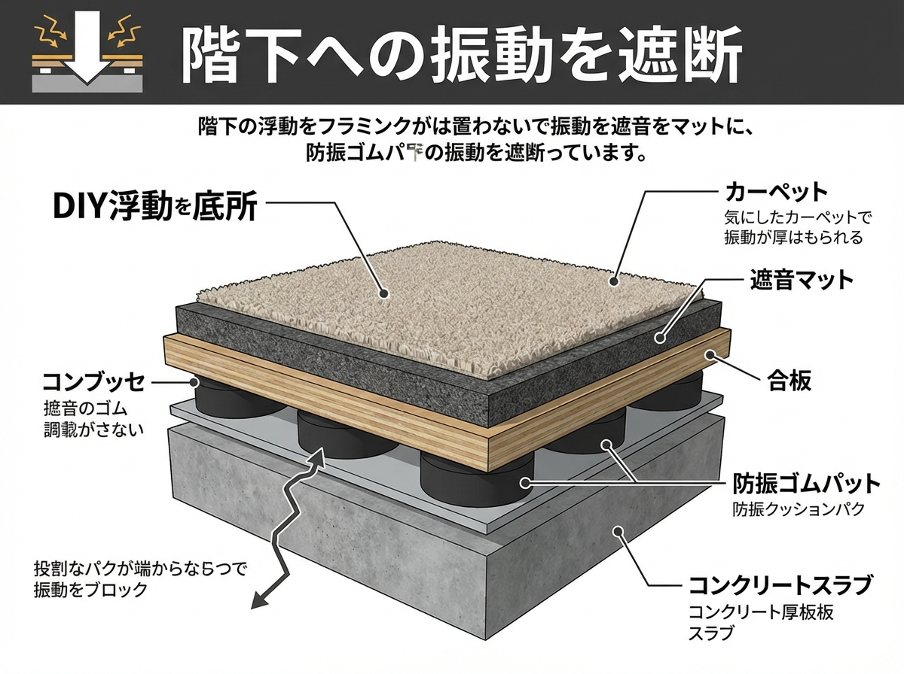

<RegionBanner />

「子供の足音がうるさいと苦情が来た」「電子ドラムの振動対策をしたい」

そう思ってホームセンターで「防音マット」を買い、床に敷き詰めたあなた。
残念ながら、<strong>それだけでは「ドスン」という重い音（重量床衝撃音）は防げません。</strong>

マンションの階下に響くこの振動を止める唯一の方法。
それが、床を物理的に浮かせる <strong>「浮き床（フローティングフロア）」</strong> です。

今回は、プロのスタジオでも採用されるこの構造を、DIYで安価に再現する「ディスクふにゃふにゃシステム」を中心に解説します。

## なぜ「マットを敷くだけ」では振動が止まらないのか

### 重さと硬さの物理学

音には「空気伝搬音（話し声など）」と「固体伝搬音（振動）」の2種類があります。
マットを敷くことで、スプーンを落とした時の「カチャン」という軽い音（軽量床衝撃音）は軽減されます。

しかし、子供が飛び跳ねたり、バスドラムを踏んだりする「ドスン」というエネルギーは、薄いマットを押しつぶし、その下のコンクリートスラブを直接揺らします。
床がつながっている限り、振動は建物全体に伝わってしまうのです。

### 「浮かす」ことによる絶縁

これを防ぐには、振動源（足や楽器）と建物（床）の縁を切る、つまり <strong>「絶縁」</strong> する必要があります。
空気の層、または柔らかいゴムやバネで床を支え、振動エネルギーを熱エネルギーに変えて吸収する。これが浮き床の原理です。

## コスパ最強の浮き床DIY：ディスクふにゃふにゃシステム

ネット上のDIY勢の間で「最強」と呼ばれるメソッドがあります。
通称 <strong>「ディスクふにゃふにゃシステム」</strong>。バランスディスク（空気の入ったクッション）を使って床を浮かせる方法です。

### 必要な材料

1.  <strong>バランスディスク</strong>: 直径30cm程度のもの。Amazonなどで安価に入手可能。
2.  <strong>合板（コンパネ）</strong>: 厚さ12mm以上推奨。剛性を出すために2枚重ねが理想。
3.  <strong>ジョイントマット/カーペット</strong>: 表面の仕上げ用。

### 施工手順

1.  <strong>ディスクの配置</strong>:
    床にバランスディスクを等間隔に並べます。
- <strong>ポイント:</strong> 空気圧は少し抜いて「ふにゃふにゃ」にしておくこと。パンパンだと振動を伝えてしまいます。
2.  <strong>合板を乗せる</strong>:
    ディスクの上に合板を敷きます。
- <strong>ポイント:</strong> 合板同士をガムテープなどで固定し、一枚の大きな「ステージ」にします。
3.  <strong>仕上げ</strong>:
    合板の上に好きなカーペットやマットを敷いて完成。

### 注意点：揺れとの戦い

このシステムは防振性能が非常に高い反面、<strong>「揺れます」</strong>。
ドラムなら問題ありませんが、アップライトピアノなどの背の高い家具を置くのは転倒リスクがあり危険です。
あくまで「人間」や「電子ドラム」用のスペースとして活用してください。

## 本格派：根太と防振ゴムで作る剛性床

「揺れるのは困る」「ピアノを置きたい」という場合は、建築レベルのDIYが必要です。

### 構成要素

- <strong>防振ゴム:</strong> 「万協フロアー」などの乾式二重床用支持脚を使用。
- <strong>根太（ねだ）:</strong> 木材で枠組みを作る。
- <strong>パーティクルボード/合板:</strong> 重ね張りして重さと剛性を出す。
- <strong>遮音シート:</strong> サンドイッチして質量を稼ぐ。

この方法は施工難易度が高く、材料費もかかりますが、歩行感もしっかりした「部屋の中の部屋」を作ることができます。

## まとめ：振動トラブルは「浮く」ことで解決する

床の防音対策において、「厚手のマット」は気休めに過ぎません。
本気で階下への配慮をするなら、<strong>「物理的に浮かす」</strong> ことを目指してください。

「ディスクふにゃふにゃシステム」なら、数万円の投資で、数十万円の工事に匹敵する防振効果が得られます。
今週末、まずはバランスディスクをポチるところから始めてみませんか？

