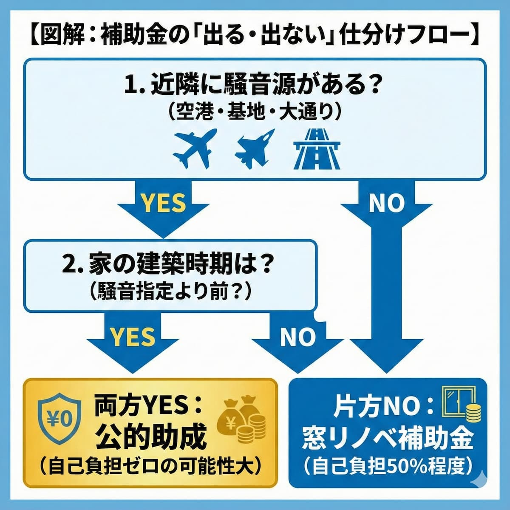

<RegionBanner />

防音工事について考えている方へ。<strong>「本当に自己負担ゼロで工事できるの？」という疑問をお持ちではありませんか？</strong>

実は、特定の条件下では、防音工事が完全に無料で行える可能性があります。

本記事では、自己負担ゼロになる条件を徹底解説します。

## 防音工事の補助金で「自己負担ゼロ」は可能？その条件を解説

### 結論：指定区域内なら「原則100%助成」で自己負担なしが可能

<strong>指定区域内なら「原則100%助成」で自己負担なしが可能</strong>

国や空港会社が定める「標準的な防音仕様」の範囲内であれば、工事費の全額が補助されます。

<strong>なぜ無料なのか：騒音源を作った側の法的義務</strong>

騒音源（空港や道路）を作った側が、周辺住民の生活環境を守る法的義務があるためです。つまり、「あなたの騒音問題は、国や企業の責任である」という考え方が背景にあります。

### 補助金が出る主な3つのケースと管轄

#### ケース1：空港周辺

- <strong>対象地域：</strong>成田・羽田・伊丹などの離着陸ルート
- <strong>管轄：</strong>空港会社・財団
- <strong>特徴：</strong>最も手厚い補助

#### ケース2：自衛隊・米軍基地周辺

- <strong>対象地域：</strong>戦闘機等の騒音がある基地周辺
- <strong>管轄：</strong>地方防衛局
- <strong>特徴：</strong>国による強力なサポート

#### ケース3：幹線道路・高速道路沿い

- <strong>対象地域：</strong>環七・環八や国道などの指定区間
- <strong>管轄：</strong>自治体・道路管理者
- <strong>特徴：</strong>自治体によってルールが異なる

### 自己負担が発生してしまうケースとは？

以下の場合は、自己負担が生じる可能性があります：

- <strong>助成の限度額を超える高級な建材・サッシを選んだ場合</strong>
- <strong>防音とは</strong>関係のないリフォーム（クロスの貼り替え等）を同時に行う場合

つまり、「標準的な防音工事」に収まれば、完全に無料ということです。

## あなたの家は対象？補助金が出るエリアの調べ方

### 公式サイトの「騒音区域図」で住所を確認する

空港や基地周辺は「WECPNL（うるささ指数）」や「Lden」という基準で色分けされた地図が公開されています。

### 役所の窓口へ電話一本で確認する

特に道路沿いの助成は条件が細かいため、「〇〇市 道路課（または環境課）」へ問い合わせるのが最短ルートです。

## 制度別の詳細：どんな工事が対象になるのか

### 空港・自衛隊周辺：手厚い助成が特徴

#### 窓だけでない！「エアコン」や「換気扇」も対象

騒音を防ぐために窓を閉め切る必要があるため、<strong>空調設備や換気設備の設置・更新費用も助成される</strong>のです。

つまり、ランニングコストまでカバーする、非常に手厚い制度なのです。

#### 古い機器の「機能復旧」としての交換工事

過去に一度工事をした家でも、10年以上経過したエアコン等の故障に対して、交換補助が出るケースがあります。

### 道路沿いの防音工事：自治体独自のルールを確認

#### 主な工事は「防音サッシ」と「吸気口」の改良

道路騒音は主に窓から侵入するため、<strong>サッシの二重化や防音フード付き吸気口への交換がメイン</strong>となります。

#### 助成率が「4分の3」になる場合もあるため注意

全額助成が多い空港・基地系に対し、<strong>道路沿いは「上限100万円」や「費用の75%まで」と制限がある場合</strong>があります。

## もし対象エリア外だった場合の「第2の補助金」

「調べたけど、対象エリア外だった…」という場合の対策があります。

### 国の「先進的窓リノベ事業」を代用する

空港や道路の特定助成から外れていても、<strong>断熱リフォームの名目で「内窓（二重窓）」の設置補助金が受けられます</strong>。

2025年も継続実施されており、<strong>工事費の約50%相当が還元される</strong>ため、実質的な防音補助金として機能します。

### 防音マンション・防音賃貸という選択肢

補助金が使えないエリアで騒音に悩んでいるなら、<strong>最初から性能が担保された物件へ住み替える方がコストが低い</strong>ことも。

つまり、「工事で対策」か「住み替えで対策」かの二者択一を考えることも重要です。

## 防音工事の補助金は「まず調べること」が第一歩

補助金の対象かどうかを調べるステップ：

1. <strong>「区域図」をチェック</strong>し、対象なら早めに申請する（予算枠があるため）
2. <strong>対象外でも諦めず</strong>、国の省エネ補助金を使って賢く静かな環境を手に入れよう

長年の騒音ストレスから解放されるチャンスを、ぜひ活用してください。

## まとめ：防音工事の補助金で、自己負担ゼロは実現可能

重要なポイントをまとめます：

| 項目 | 内容 |
|:--|:--|
| <strong>空港・基地周辺</strong> | 原則100%助成 |
| <strong>道路沿い</strong> | 75〜100%助成（自治体による） |
| <strong>対象外エリア</strong> | 国の省エネ補助金で50%助成可能 |

つまり、<strong>条件次第で、自己負担ゼロから最大50%の助成が可能</strong>ということです。

騒音に悩んでいるなら、今すぐ対象エリアを確認し、早めに相談することをおすすめします。あなたの静かな生活は、すぐそこにあります。

## 補助金の全体整理はこちら

- [防音補助金制度の全体一覧と比較ポイント](/ja/solutions/soundproof-subsidy-system-list/)

