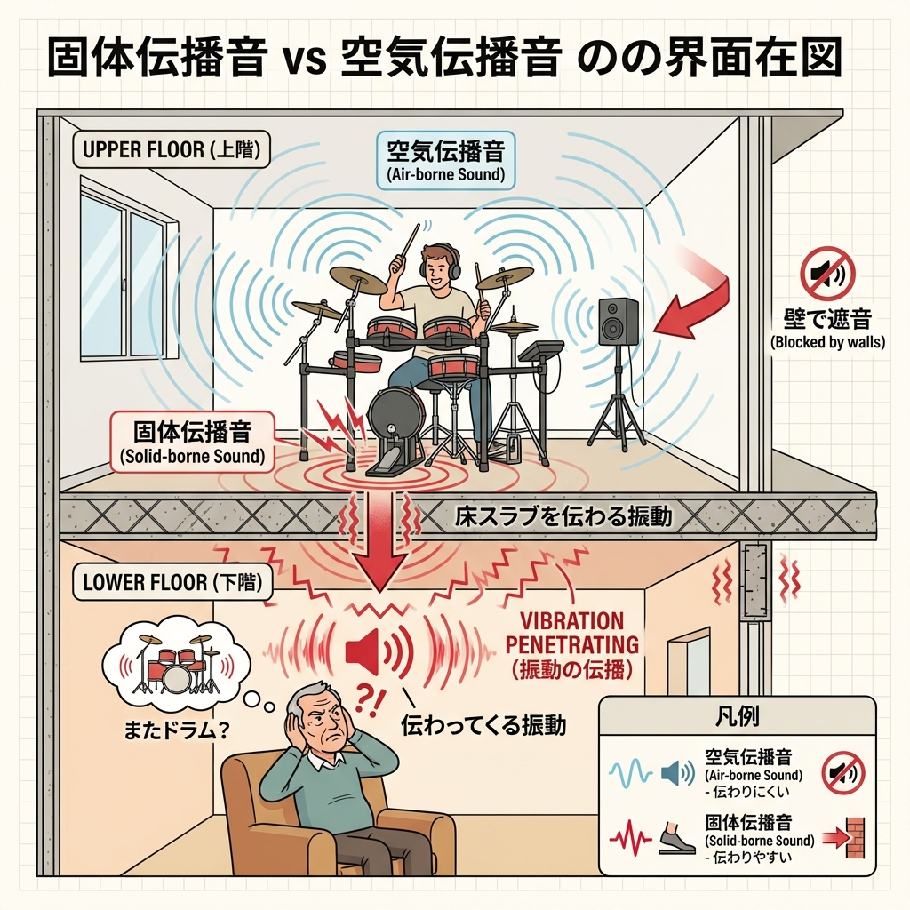

<RegionBanner />

「ようやく見つけた『楽器可』のマンション。これで気兼ねなく練習できる！」

そう思って引っ越し、ワクワクしながら初日の練習を終えたその翌日。
ポストに管理会社からの「<strong>騒音に対する苦情の通知</strong>」が入っていたら…？

これは決して他人事ではありません。
実は、「楽器可」「楽器相談」と書かれている物件に入居したにもかかわらず、近隣トラブルに巻き込まれ、最悪の場合は<strong>早期退去</strong>に追い込まれるケースが後を絶たないのです。

なぜ、「楽器を演奏してもいい」はずの物件で、怒られてしまうのでしょうか？
不動産屋の営業マンがあえて口にしない<strong>不都合な真実</strong>と、あなたが自分の身を守るために知っておくべき<strong>4つの落とし穴</strong>について解説します。

## 落とし穴1：「楽器可＝防音完備」という最大の誤解

最も多いトラブルの原因がこれです。
はっきり言います。<strong>楽器可（相談）と防音物件は、全くの別物です。</strong>

### 大家さんの「許可」と、建物の「性能」は無関係
多くの人が「楽器可」＝「壁が分厚くて音が漏れない部屋」だとイメージします。
しかし、不動産用語における「楽器相談」の本当の意味は、「<strong>大家さんが、この部屋で楽器を弾くことをルール上禁止していない</strong>」というだけです。

つまり、<strong>建物の壁の厚さや防音性能は、隣の「楽器不可」の一般的なアパートと全く同じ</strong>というケースが非常に多いのです（いわゆる「なんちゃって楽器可物件」）。

この場合、あなたが出す音は、隣の人には筒抜けです。
「許可されているから」といってガンガン音を出せば、隣の住人（楽器を弾かない一般の人）にとっては、ただの耐え難い騒音でしかありません。

## 落とし穴2：電子楽器の「見えない騒音」振動

「音が出ない電子ピアノだから大丈夫」「ヘッドホンをしてるから聞こえないはず」
そう思っている人ほど、足元をすくわれます。

### 階下に響く「ドンドン」「カタカタ」
電子楽器の盲点は、<strong>音（空気の振動）</strong>ではなく、<strong>打撃（床の振動）</strong>です。

*   <strong>電子ピアノ</strong>: 鍵盤を叩く「コトコト」「カタカタ」という打鍵音
*   <strong>電子ドラム</strong>: ペダルを思い切り踏み込む「ドンドン」という振動

これらの音は、空気中を伝わる音よりも遥かにエネルギーが強く、「<strong>固体伝搬音</strong>」として建物の骨組みを伝わり、階下の部屋の天井をスピーカーのように鳴らします。

階下の住人からすれば「<strong>天井裏で誰かが工事をしている</strong>」「<strong>太鼓を叩かれている</strong>」ような不快な響きになります。
演奏者本人はヘッドホンをしているため、この凄まじい振動音に全く気づけないのが恐ろしいところです。

## 落とし穴3：生活スタイルの不一致（煩音トラブル）

「規約では朝9時から夜8時までは演奏OKになっている。だから文句を言われる筋合いはない」
法律やルール上はその通りかもしれません。しかし、騒音トラブルは感情の問題です。

### 「テレワーク中」や「夜勤明け」の隣人
現代のライフスタイルは多様化しています。
あなたが練習したい昼間の時間帯に、隣人が必ずしも「活動中」とは限りません。

*   大事なWeb会議をしている在宅ワーカー
*   夜勤明けでようやく眠りについた看護師やドライバー
*   必死に寝かしつけをしたばかりの赤ちゃんとママ

こうした状況の隣人にとって、壁越しに聞こえてくる下手な練習音や反復練習の音は、たとえ小さな音量であっても、<strong>神経を逆撫でする「煩音（はんおん）」</strong>となり、猛烈な怒りを買います。

「ルールだから正しい」と主張し続けると、関係は泥沼化し、嫌がらせや警察沙汰に発展することさえあります。

## 落とし穴4：楽器ごとの「隠れNG」

「楽器可」と書いてあっても、すべての楽器が無条件に許されるわけではありません。
契約書の特約事項をよく見ると、実は禁止されている楽器があります。

### 無理ゲーな楽器たち
*   <strong>重低音が出る楽器</strong>: ベース、バスドラム、コントラバスなど。低音は壁を突き抜けて遠くまで響くため、本格的な防音室でも遮音は困難です。
*   <strong>生ドラム</strong>: 振動と音圧が桁違いなため、一般的な鉄筋コンクリートマンションでもまず不可です。
*   <strong>アンプを使う楽器</strong>: エレキギターなど。ボリューム調整ができるといっても、振動を伴うため嫌がられます。

知らずに持ち込んで演奏し、一度でもクレームが来れば、「契約違反としての即時停止」あるいは「退去」を迫られるリスクがあります。

## どうすればいい？トラブルを防ぐための防衛策

では、安心して楽器を楽しむためにはどうすれば良いのでしょうか？

### 1. 「遮音物件」か「防音物件」を選ぶ
物件探しの段階で、「楽器可」という言葉だけで選ばないことです。
不動産屋にこう聞いてください。

「ここは『一般の楽器可物件』ですか？それとも防音工事がされた『防音物件』ですか？」

さらに、「過去に騒音トラブルはありませんでしたか？」と直球で聞くのも有効です。

### 2. 自分でも防音・防振対策をする
今の部屋で対策するなら、ターゲットは「振動」です。
特に電子楽器奏者は、床への対策を徹底してください。

*   <strong>防音マット</strong>: ホームセンターのジョイントマットではなく、重量のある「P防振マット」などを重ね敷きする。
*   <strong>ディスクふにゃふにゃシステム</strong>: 電子ドラム界隈で有名な、バランスディスクと板を使った自作防振ステージを作る。

### 3. コミュニケーションという最強の防音
もし隣人と顔を合わせる機会があれば、先に挨拶をしてしまうのが効果的です。
「隣に越してきました。ピアノを練習することがあるので、もしうるさかったらすぐに言ってください」

この一言があるだけで、相手の許容範囲は驚くほど広がります（<strong>顔が見える相手には攻撃しにくい</strong>という心理効果です）。

## まとめ：自分の身は自分で守ろう

「楽器可」という甘い言葉を鵜呑みにせず、その物件の実力がどの程度なのかを冷静に見極めることが、あなたの音楽ライフと平穏な生活を守る唯一の方法です。

もし現在トラブルに悩んでいるなら、これ以上関係が悪化する前に、演奏を一度ストップし、防音対策を見直すか、本当に安心できる物件への転居を検討する勇気も必要です。

