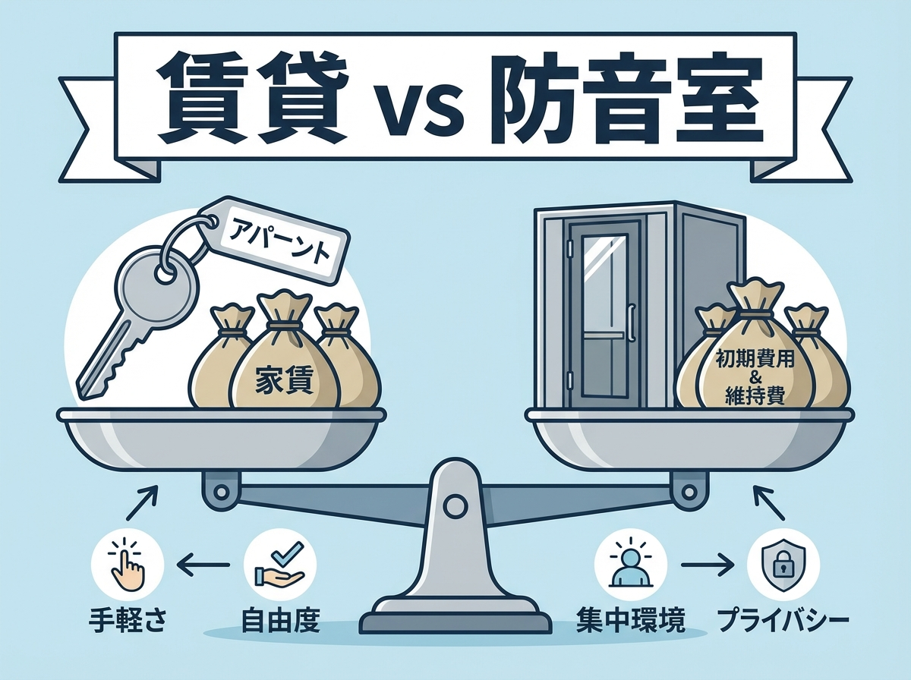

---
title: "賃貸マンション vs 防音室購入：フルート奏者はどっちが得？"
description: "『防音賃貸』と『一般賃貸＋防音室』、どちらが賢い選択か？初期費用、月々の家賃、引越し時のリスク、そして最も重要な「遮音性能」の差をプロが徹底比較。あなたのライフスタイルに最適な音楽空間の作り方を提案します。"
slug: "rental-vs-apartment"
date: "2026-02-11"
lastmod: "2026-02-28"
draft: false
lang: "ja"
category: "solutions"
subcategory: "rentals"
tags: ["フルート","防音賃貸","防音室","費用比較","一人暮らし"]
image: ./cover.png
---
<RegionBanner />

「高い家賃を払って防音マンションに住むか、今の部屋に防音室を買うか…」

これは音大生やアマチュア奏者が必ずぶつかる究極の選択です。
特にフルートのような高音楽器は、木造アパートではまず練習不可。
どちらを選ぶべきか、<strong>「コスト」と「練習環境」</strong> の2点から比較します。

## コスト比較：3年間でいくらかかる？

今回は東京都在住の一人暮らしを想定してシミュレーションします。

### パターンA：防音マンションに引っ越す

- <strong>家賃</strong>: 12万円（防音物件相場）
- <strong>初期費用</strong>: 敷礼金など約50万円
- <strong>3年間の総額</strong>: (12万 × 36ヶ月) + 50万 = <strong>482万円</strong>

### パターンB：普通のアパート（6万円）＋防音室購入

- <strong>家賃</strong>: 6万円
- <strong>防音室（0.8畳Dr-35）</strong>: 100万円（設置費込）
- <strong>3年間の総額</strong>: (6万 × 36ヶ月) + 100万 = <strong>316万円</strong>

<strong>結論</strong>: 長く住むなら、<strong>防音室購入の方が圧倒的に安い</strong> です。
さらに防音室は売却（リセール）が可能なので、実質コストはもっと下がります。

## 練習環境としての違い

### 防音マンションのメリット

- <strong>広さ</strong>: 部屋全体が防音なので、圧迫感がない。
- <strong>24時間演奏</strong>: 物件によるが、深夜早朝も弾ける場合が多い。
- <strong>アンサンブル</strong>: 友人を呼んで合奏できる。

### 防音室のメリット

- <strong>集中力</strong>: 狭い空間は逆に集中できる（個人差あり）。
- <strong>移設可能</strong>: 引っ越してもまた使える（移設費はかかる）。

### フルート奏者への推奨

もしあなたが <strong>「一人で黙々と練習したい」</strong> なら、今の部屋に防音室を入れるのが賢い選択です。
逆に <strong>「グランドピアノと合わせたい」「レッスン室として使いたい」</strong> なら、防音マンション一択です。

## まとめ：将来のライフプランに合わせて選べ

目先の家賃だけでなく、「何年住むか」「誰と練習するか」を考えて選んでください。
フルートは持ち運びができる楽器です。あなたのライフスタイルに合わせて、最適な「城」を選びましょう。

