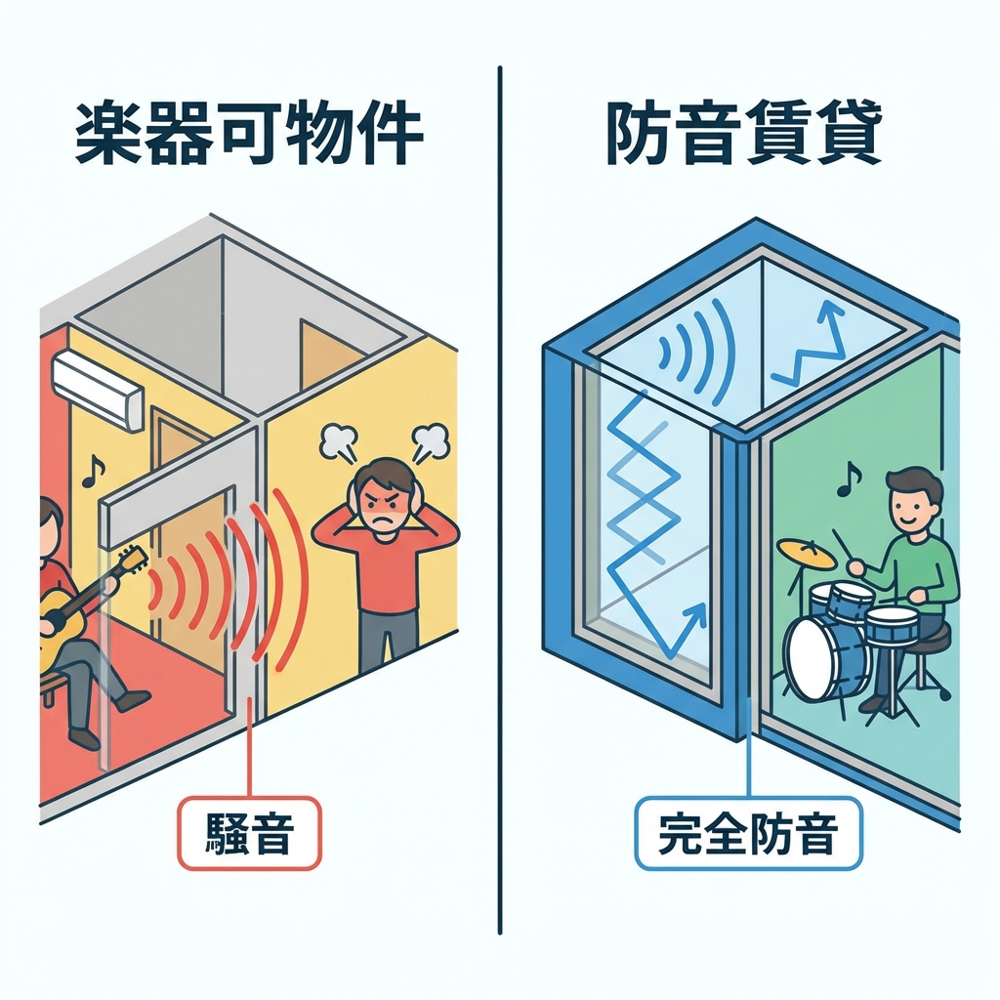

<RegionBanner />

「楽器可」と書かれていれば防音だと思っていませんか？

もしそう思っているなら、非常に危険です。
実は、<strong>防音賃貸と楽器可物件は、天と地ほど性能が違います。</strong>

「楽器可」と書かれていても、実際は「ルール上OKしただけ」であり、物理的な防音性能は保証されていないケースが大半です。
その結果、「入居後に苦情が殺到して、結局演奏できなくなった」という悲劇が後を絶ちません。

本記事では、後悔しないために知っておくべき「構造」「数値（D値）」「契約」の3つの決定的な違いと、偽物物件を見抜くチェックポイントを専門家の視点で解説します。

この記事を読めば、もう「なんちゃって防音」に騙されることはありません。

## 「防音賃貸」と「普通の賃貸（楽器可）」は何が違うのか？

結論から言うと、この2つは全く別物です。
例えるなら、携帯電話とスマートフォンくらい性能に差があります。

では、具体的に何が違うのでしょうか。
決定的な違いは以下の3点です。

### 1. 構造の決定的な差（壁の厚さ・浮き床・防音ドア）

最も大きな違いは、建物そのものの作り（構造）です。

<strong>普通の賃貸（楽器可含む）：</strong>
一般的なRC造（鉄筋コンクリート）マンションでも、部屋と部屋を仕切る壁（戸境壁）は、コンクリートに直接壁紙を貼ったものや、石膏ボード1枚だけで仕切られていることがほとんどです。
これでは、隣の話し声やテレビの音は防げても、楽器の演奏音や重低音までは防げません。

<strong>防音賃貸：</strong>
一方で、本格的な防音賃貸は「部屋の中にもう一つ部屋がある」ような多層構造になっています。

*   <strong>壁：</strong> 多層構造になっており、吸音材や遮音シートがサンドイッチされています。
*   <strong>床：</strong> 「浮き床構造」といって、床をコンクリートから浮かせることで振動を伝えない仕組みになっています。
*   <strong>ドア：</strong> スタジオのような分厚い防音ドアが設置され、隙間から漏れる音を完全にシャットアウトします。

この構造的な違いは、後からリフォームでどうにかなるレベルではありません。

### 2. 性能数値の差（D-50以上 vs D-30程度）

防音性能は「D値（遮音等級）」という数値で表されます。
この数値が高いほど、防音性能が高いことを意味します。

| 物件タイプ | D値 (目安) | 体感レベル |
| :--- | :--- | :--- |
| <strong>一般賃貸 (木造・鉄骨)</strong> | D-15〜25 | 隣の話し声が内容まで聞き取れる |
| <strong>一般賃貸 (RC造)</strong> | D-30〜40 | 隣のテレビ音や大きな笑い声が聞こえる |
| <strong>本格的防音賃貸</strong> | <strong>D-50〜80</strong> | <strong>ピアノやドラムの音が気にならないレベル</strong> |

「楽器可」や「楽器相談」の物件には、この<strong>D値の保証がない</strong>ことがほとんどです。
逆に、本物の防音賃貸であれば、「全戸D-60以上」のように数値で性能を保証しています。

「D値」という客観的な指標を示せない物件は、厳しい言い方をすれば「防音物件」とは呼べません。

### 3. ルールの差（24時間演奏保証 vs 近隣トラブルのリスク）

契約などの「ルール」にも大きな違いがあります。

<strong>普通の賃貸（楽器可）：</strong>
「楽器演奏してもいいですよ」という許可はありますが、「近隣に迷惑をかけない範囲で」という但し書きが必ずつきます。

つまり、「<strong>演奏していいけど、苦情が来たらあなたの責任でやめてね</strong>」ということです。

実際、入居後に隣人から苦情が入り、管理会社から「演奏禁止」を言い渡されるケースは非常に多いです。

<strong>防音賃貸：</strong>
最初から「音楽を楽しむための物件」として契約するため、入居者全員がお互い様という意識を持っています。
さらに、高性能な防音設備があるため、「<strong>24時間演奏可能</strong>」と契約書で保証されている物件も多くあります。

この「安心して音を出せる権利」が保証されているかどうかが、最大の違いと言えるでしょう。

## 素人でも分かる！「なんちゃって防音」を見抜く3つのポイント

では、物件探しの際にどうやって「本物」と「なんちゃって」を見分ければよいのでしょうか？
不動産屋の営業トークに惑わされないために、内見時に必ずチェックすべき3つのポイントを伝授します。

### 1. 募集図面に「D値（遮音等級）」の記載があるか

これが一番簡単で確実な方法です。

本物の防音賃貸なら、募集図面や物件資料に必ず「遮音性能 D-〇〇」と記載があります。
自信があるからこそ、数値を堂々と出せるのです。

逆に、「防音完備」「楽器相談」と書いてあるのに数値がない物件は<strong>要注意</strong>です。
「RC造だから防音です」という説明は、音楽家にとっては嘘と同じだと思ってください。

### 2. 窓枠（サッシ）の深さと二重窓の仕様

内見時に部屋に入ったら、まず窓を見てください。

*   <strong>窓が二重になっているか（二重サッシ）</strong>
*   <strong>窓枠（サッシ）の奥行きが深いか</strong>

音の逃げ道となりやすい窓は、防音対策で最もコストがかかる部分です。
本物の防音賃貸は、必ずと言っていいほど分厚い二重サッシになっています。
窓が1枚だけだったり、二重でも隙間風が入るような作りであれば、その物件の防音性能はお察しです。

### 3. 「相談」ではなく「推奨」されているか

物件情報の備考欄などで使われる言葉にも注目しましょう。

*   <strong>危険なワード：</strong> 「楽器相談」「ピアノ相談」
    *   意味：「大家さんがダメとは言っていない（けど防音設備はない）」
*   <strong>安心なワード：</strong> 「楽器可」「演奏推奨」「音楽マンション」
    *   意味：「音楽家のために作られた物件です」

特に「相談」という言葉は曖昧です。
「静かに弾くならいいよ」程度のニュアンスで使われていることが多く、トラブルの元になります。

## 家賃相場はどれくらい変わる？コストと価値のバランス

「防音賃貸がいいのは分かったけど、家賃が高いんでしょ？」
その通りです。高性能な設備にはコストがかかります。

では、具体的にどれくらい違うのでしょうか。

### 一般相場の1.3倍〜が妥当なライン

地域にもよりますが、<strong>同じ広さ・築年数の一般物件と比較して、家賃は1.3倍〜1.5倍程度</strong>高くなるのが一般的です。

例えば、相場8万円のエリアなら、防音賃貸は10万5千円〜12万円程度になります。
「ちょっと高いな」と感じるかもしれませんが、この差額には「スタジオ代」や「安心して暮らす権利」が含まれています。

逆に、<strong>相場とほとんど変わらない家賃の「防音物件」があれば、それは偽物の可能性が高い</strong>です。
安すぎる物件には、必ず「立地が極端に悪い」「築年数が古い」「実は防音性能が低い」といった理由があります。

### 防音室（ユニット）を自分で置くのとどちらが得か

よくある比較として、「普通の安い部屋を借りて、そこに防音室（ヤマハのアビテックスなど）を置くのとどっちが得か？」という疑問があります。

結論から言うと、<strong>居住期間によって正解が変わります。</strong>

*   <strong>2年未満の短期入居なら：</strong> ユニット防音室の購入がお得な場合もあります。引越しの際に持って行けるメリットがあります。
*   <strong>長期的に住むなら：</strong> 防音賃貸の方が圧倒的に快適で、トータルコストも満足度に見合います。

ユニット防音室は部屋が狭くなりますし、圧迫感もあります。
「住まいとしての快適性」を求めるなら、やはり最初から防音構造になっている賃貸物件には敵いません。

## まとめ：内見時に必ず持っていくべきチェックリスト

最後に、物件選びで失敗しないための内見時チェックリストをまとめました。
これをスマホに保存して、不動産屋さんに向かってください。

*   [ ] <strong>募集図面に「D値」の記載はあるか？（D-50以上が目安）</strong>
*   [ ] <strong>窓は二重サッシになっているか？</strong>
*   [ ] <strong>ドアは重量のある防音ドアか？（隙間がないか）</strong>
*   [ ] <strong>壁をノックした時、中が詰まっている音がするか？（軽い音はNG）</strong>
*   [ ] <strong>スマホで音楽を流して、廊下や隣の部屋への音漏れを確認させてもらえるか？</strong>
*   [ ] <strong>管理規約で「演奏可能時間」が明確に決まっているか？</strong>

妥協して「楽器相談」の物件を選び、後から演奏禁止になって引越す...という無駄なコストを払わないためにも、最初から「本物」を選ぶことを強くおすすめします。

もし、自分で見分ける自信がない場合は、防音物件を専門に扱う不動産会社に相談するのが一番の近道です。
専門家なら、あなたの楽器や演奏スタイルに合わせた最適な物件を紹介してくれますよ。

