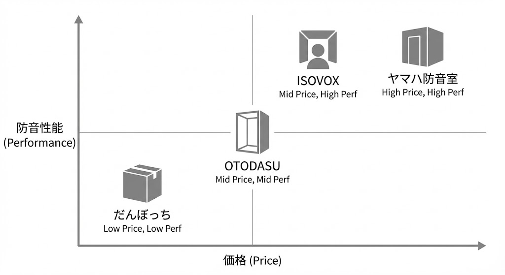
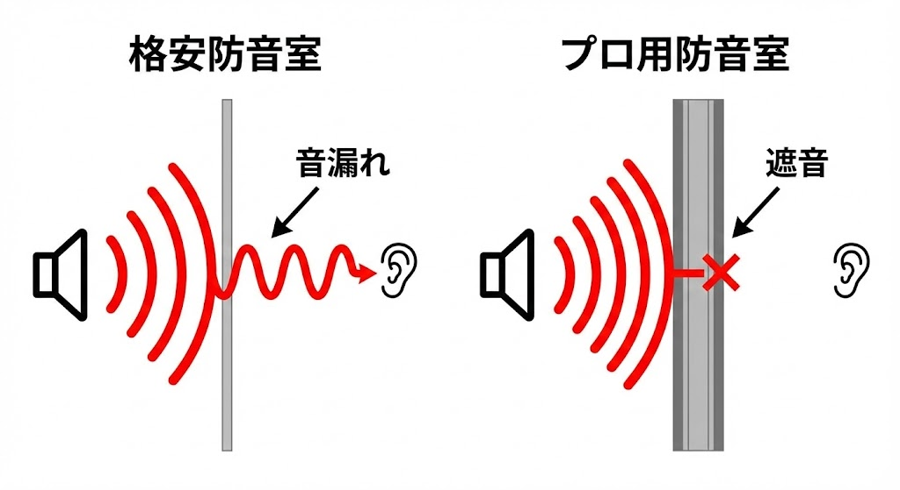

"I want a soundproof room at home. But professional ones from Yamaha cost thousands of dollars..."

If you're on the verge of giving up, you might have stumbled upon <strong>"Budget Soundproof Booths" priced between ¥100,000 and ¥200,000 ($700 - $1,500)</strong>.
Names like "Danbocchi" or "OTODASU" are famous in Japan.

But here is one <strong>"Cruel Truth"</strong> you need to know:

<strong>Budget soundproof booths, in their stock state, do not offer "professional soundproofing performance."</strong>

"So they are useless?"
No, thinking that is premature.
<strong>If you choose the right one for your "purpose" and "expectations," these can be the best cost-performance "Secret Bases."</strong>

In this article, we organize the 2025 budget soundproof booth market and honestly explain how to choose without regret, matching your specific goals.

## The Lineup (The Under ¥200,000 Contenders)

We compare these four main options:

1.  <strong>Danbocchi</strong> (Kanda Sangyo/VIBE): The pioneer cardboard booth.
2.  <strong>OTODASU II</strong> (Coolish Music): Lightweight, tool-free plastic cardboard assembly.
3.  <strong>ISOVOX 2</strong> (ISOVOX): A "head-only" booth specialized for singing.
4.  <strong>Full DIY</strong>: Buying materials from a hardware store and building it from scratch.

---

## Real Evaluation & Verdict

### 1. Danbocchi: The Strongest "Modification Base" material
<strong>Price: Approx. ¥90,000 - ¥110,000</strong>

It's the most famous product, but <strong>we do not recommend using it as is.</strong>
Since the material is "reinforced cardboard," it reduces conversational voices, but if you sing loudly, it will be clearly audible in the next room.

<strong>The true value of "Danbocchi" lies in its modifiability.</strong>
Because the surface is paper, you can easily stick "Lead Sheets (Sound Insulation)" and "Absorption Materials" bought from a hardware store using double-sided tape.
If you spend an extra ¥20,000 - ¥30,000 on heavy modifications, you can boost it to a performance level rivaling ¥200,000 class booths.

- <strong>Suitable for:</strong> DIY lovers, those who want to upgrade performance gradually.
- <strong>Not suitable for:</strong> People who want perfect soundproofing right out of the box.

### 2. OTODASU II: Looks and Convenience are Justice
<strong>Price: Approx. ¥154,000+</strong>

It is more stylish than "Danbocchi," and its biggest appeal is that <strong>it can be assembled without tools</strong>.
Since the material is lightweight plastic cardboard, sound isolation is modest (around D-20 to D-25). It is not suitable for drums, saxophones, or screaming game streams.

However, for uses like <strong>"not wanting family to hear telework conversations"</strong> or <strong>"late-night quiet chatting streams,"</strong> it is a perfect match.
Recently, optional absorption sets are available, making it easier to improve performance than before.

- <strong>Suitable for:</strong> Telework, conversational streaming, renters who can't place heavy objects.
- <strong>Not suitable for:</strong> People who want to play loud instruments.

### 3. ISOVOX 2: The Vocalist's Ultimate Weapon
<strong>Price: Approx. ¥165,000</strong>

This is not a "room." It is a <strong>"box for your head."</strong>
But the performance is real. With a massive <strong>-35dB</strong> sound reduction, you can sing at full volume even at night.

It provides a "dead" acoustic environment similar to a recording studio (booth). If you aim for <strong>Pro-level sound quality in "Utattemita" (Cover Songs) or Voice Acting</strong> , this is far better than buying a half-baked full-body soundproof booth.
The downsides are that you can't move much, and it becomes hellishly hot in summer.

- <strong>Suitable for:</strong> People specializing in singing or narration recording.
- <strong>Not suitable for:</strong> People who want to play instruments, claustrophobic people.

### 4. Full DIY: High Risk, High Return
<strong>Price: ¥50,000 - ¥200,000 (Materials)</strong>

The serious route, building with 2x4 lumber, gypsum board, and sound insulation sheets.
In terms of material costs alone, you can build a high-performance room for about ¥100,000, but the <strong>labor is immense</strong>. It’s common for design to completion to take a whole month.

Also, the biggest difficulty is <strong>"Disposal."</strong> When dismantling and disposing of it, materials like gypsum board are treated as industrial waste, costing tens of thousands of yen just to throw away. Moving it out of a rental apartment is also a struggle.

- <strong>Suitable for:</strong> People with construction knowledge, time, physical stamina, and homeowners.
- <strong>Not suitable for:</strong> Renters, DIY beginners.

---

## Specs & Performance Matrix

| Item | Danbocchi (Stock) | OTODASU II | ISOVOX 2 | DIY (Serious) |
| :--- | :--- | :--- | :--- | :--- |
| <strong>Est. Price</strong> | ¥90k - ¥110k | ¥154k+ | Approx. ¥165k | ¥50k - ¥200k |
| <strong>Material</strong> | Reinforced Cardboard | Plastic Cardboard | Special Acoustic Panels | Gypsum Board etc. |
| <strong>Isolation</strong> | Fair (Needs mods) | Good for Speech | Excellent (Voice) | Depends on skill |
| <strong>Assembly</strong> | Average (Heavy) | Easy (No tools) | Easy | <strong>Pure Hell</strong> |
| <strong>Best Use</strong> | Mod base / Streaming | Telework / Light Stream | Pro Vocals | Instruments / Drums |

---

## Conclusion: Which one is for you?

### Q1. I want to do Game Streaming / Chatting
→ <strong>"OTODASU II"</strong> or <strong>"Danbocchi (Modified)"</strong>
For normal speaking voices or occasional laughter, these will prevent neighbor trouble. If you care about looks, go for OTODASU. If you enjoy modifying, go for Danbocchi.

### Q2. I want to record Pro Vocals seriously
→ <strong>"ISOVOX 2"</strong>
It is overwhelmingly superior in both sound quality and isolation compared to a half-baked room. Just tolerate the heat.

### Q3. I want to practice Saxophone or Guitar
→ <strong>Give up on budget booths.</strong>
Products in this price range (excluding DIY) cannot stop the vibration and sound pressure of instruments. Get a loan for a "Yamaha Avitecs" or go to a rental studio.

### Summary: There is a Reason for "Cheap"

"Cheap" has its reasons.
But if it matches your purpose (the volume you want to reduce), it's a fantastic deal.

Don't expect too much, and use them wisely as a <strong>tool for "Better Manners."</strong>
If you are worried and think "I really want to soundproof the whole room properly," start by reviewing your own room's environment first.

