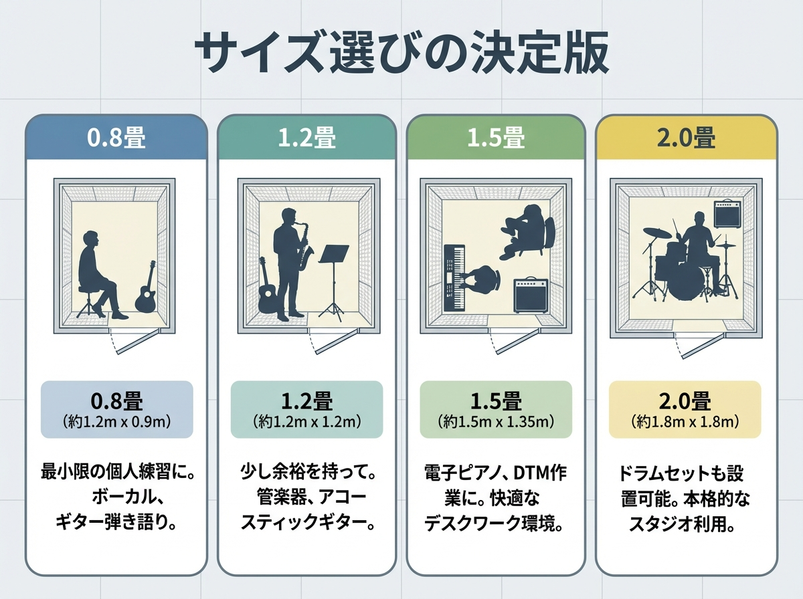

When purchasing a soundproof room, the part you can least afford to fail at is "Size Selection."
"Even though it was expensive, the bow hits the wall and I can't play..."
"Once I set up a music stand, I can't move..."

To prevent such tragedies, we'll explain how to choose not just by the "number of mats" in the catalog, but by the actual <strong>"interior dimensions (effective space)."</strong>

## The Trap of Mat Notations: Look at the "Interior," Not the "Exterior"

Sizes like "1.2 mats" or "2.0 mats" written in the catalog usually refer to the <strong>"exterior dimensions"</strong> of the soundproof room.

Since the walls of a soundproof room are around 10cm thick, the <strong>"interior dimensions (the actual space usable inside)"</strong> will be one size smaller.
Be sure to check the "Interior Dimensions (W×D×H)" in the specifications and get a sense of the width by applying marking tape or something similar to your room.

## Recommended Instrument List by Size

Here is a summary of suitable uses by size of general unit soundproof rooms.

### 0.8 to 1.0 Mats (Telephone Booth Size)

Extremely cramped. Limited to uses with little movement.

- <strong>OK:</strong> Vocals, narration, clarinet, flute (barely), oboe.
- <strong>NG:</strong> Guitar (neck hits), violin (bow hits).
- <strong>Note:</strong> Long-term stays can feel claustrophobic, and the risk of oxygen deficiency is also higher.

### 1.2 to 1.5 Mats (Standard Size)

The best-selling sizes, but can be a bit awkward depending on the instrument.

- <strong>OK:</strong> Alto saxophone, guitar vocals, violin (standing), DTM desk (small).
- <strong>Caution:</strong> Trombone (possible if placed diagonally), tenor saxophone (a bit cramped).
- <strong>Note:</strong> At least 1.5 mats are needed to put in an upright piano, but 2.0 mats are ideal when considering tuning space.

### 2.0 to 2.5 Mats (Private Room Feeling)

Suitable for instruments with movement, pianos, and comfortable desk work.

- <strong>OK:</strong> Upright piano, trombone, cello, two PC desks (streaming environment).
- <strong>Note:</strong> At this size, serious consideration for delivery to the room and air conditioner installation is also necessary.

### 3.0 Mats and Up (Studio Class)

For putting in a grand piano (C3 class), start from here.
Ensemble practice (two or more people) also becomes possible.

## Installation Space and Maintenance Space

What is easily forgotten is the space on the <strong>"outside"</strong> of the soundproof room.

1.  <strong>Air Layer</strong>: It is mandatory to install at least 5cm to 10cm away from the walls of the original room (to ensure soundproofing performance and prevent mold).
2.  <strong>Assembly Space</strong>: Space for construction workers to work is necessary.
3.  <strong>Opening/Closing the Door</strong>: Soundproof doors are heavy and typically open outwards. Confirm that there are no furniture within the radius where the door opens.

## Summary: Because it's an Expensive Purchase, Do a "Newspaper Simulation"

If you're unsure about the size, try taping newspapers together to create the "interior dimensions" of the room you're considering on the floor.
Place a music stand and a chair there and try holding your instrument.

"Ah, the bow hits." "I can't turn around."
This real feeling is the correct answer, more so than catalog values.

## Related Articles

- <strong>[Trombone Space]: [Preventing "Slide Collision" - 1.5 Mats vs. 2.0 Mats](trombone-room-size)</strong>
- <strong>[Violin Height]: [Ceiling Height over Floor Space! Reasons to Choose the High Type](violin-room-height)</strong>

