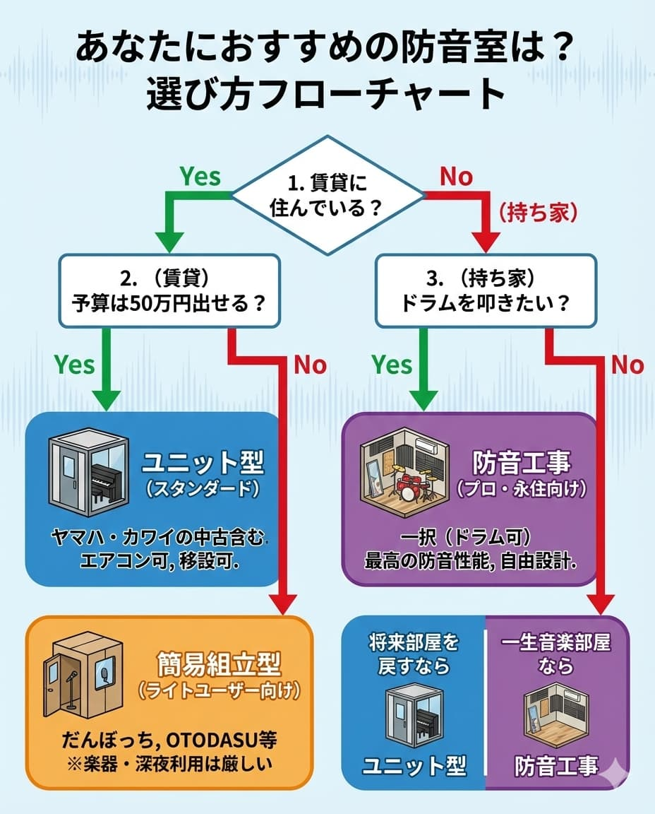

---
title: "Types and Selection of Soundproof Rooms | Differences in Unit, Assembly, and Construction"
description: "There are three main types of soundproof rooms: 'Simple Assembly', 'Unit Type', and 'Construction (Renovation)'. We compare each's price, soundproof performance, merits, and demerits, and guide you through choosing the optimal type for your purpose."
slug: "soundproof-room-types"
date: "2026-03-13"
lastmod: "2026-02-28"
draft: false
lang: "en"
category: "solutions"
subcategory: "unit-rooms"
tags: ["Soundproof","Soundproof Room","Construction","How","to","Choose"]
image: ./cover.jpg
---
"I want a soundproof room, but I don't know which one to choose."
"What is the difference between a cheap simple soundproof room and a Yamaha soundproof room?"

There are three main types of soundproof rooms: "<strong>Simple Assembly Type</strong>, <strong>Unit Type</strong>, and <strong>Construction (Renovation) Type</strong>". You should consider these as completely different things in terms of price and performance.

In conclusion, the type to choose is determined by "<strong>What (what kind of instrument), when (time period), and how seriously</strong>" you will do it.

In this article, we will compare the characteristics of the three types and explain how to choose the optimal soundproof room for you.

---

## Comparison Table of 3 Soundproof Room Types

First, let's grasp the overall picture.

| Type                       | <strong>Simple Assembly (Simple Soundproof)</strong>    | <strong>Unit Type (Fixed)</strong>                                        | <strong>Soundproof Construction (Renovation)</strong>   |
| :------------------------- | :----------------------------------------- | :----------------------------------------------------------- | :----------------------------------------- |
| <strong>Main Products</strong>          | Danbocchi, OTODASU                         | Yamaha (Avitecs), Kawai (Nasal)                              | Construction by professional contractors   |
| <strong>Price Guide</strong>            | $1,000 - $3,000                            | $5,000 - $15,000                                             | $20,000 -                                  |
| <strong>Soundproof Performance</strong> | <strong>Low (Dr-15 - 25)</strong> Conversation level | <strong>Medium - High (Dr-30 - 40)</strong> Piano/Singing almost stops | <strong>Highest (Dr-50 -)</strong> Drum/Studio level |
| <strong>Main Applications</strong>      | Telework, light singing, games             | Piano, flute, serious vocal recording                        | Drums, live piano, commercial studios      |
| <strong>Air Conditioning</strong>       | Many products cannot be attached           | Air conditioner can be installed                             | Can be installed freely                    |
| <strong>Moving/Removal</strong>         | Easy (DIY possible)                        | Professional contractors can relocate                        | Not possible (becomes demolition)          |

## 1. Simple Assembly Type (For light users)

Represented by "<strong>Danbocchi</strong>" and "<strong>OTODASU</strong>", these are booths made of lightweight materials (plastic, cardboard, or sound-absorbing boards).

- <strong>Merits</strong>: Cheap (around $1,000), can be assembled by yourself, lightweight so no floor reinforcement required.
- <strong>Demerits</strong>: Soundproof performance is low (speaking voice becomes a little smaller). <strong>Many products do not have air conditioners, and it becomes a sauna in summer</strong>, making long-term use difficult.
- <strong>Recommended for</strong>:
  - Do not want telework conference voices to leak.
  - Game commentary or light narration recording during the day.
  - Do not want to damage the rental property at all and want to introduce it easily.

## 2. Unit Type (Standard)

Represented by <strong>Yamaha "Avitecs"</strong> and <strong>Kawai "Nasal"</strong>, these are assembly-type soundproof rooms sold by instrument manufacturers. It corresponds to the image of "making a small room (box) inside a room".

- <strong>Merits</strong>: Stable high soundproof performance (there is a performance guarantee). Air conditioner can be attached. <strong>Asset value remains, and it can be sold used or relocated</strong> (this is the biggest feature).
- <strong>Demerits</strong>: Even 1.5 tatami costs nearly $10,000. It gives a sense of pressure in the room.
- <strong>Recommended for</strong>:
  - Want to practice upright piano or wind instruments (saxophone, etc.).
  - Pro-oriented vocal recording, late-night singing stream.
  - Possible to move in the future (living in a rental property).

## 3. Construction (Renovation) Type (For pros/permanent residents)

This is a method of <strong>remodeling the room itself into a soundproof room</strong> by demolishing the walls, floors, and ceilings of the room and incorporating sound-absorbing and soundproofing materials.

- <strong>Merits</strong>: Highest soundproof performance (drums possible). Can use the width of the room without waste. Layout and design are free.
- <strong>Demerits</strong>: Very expensive ($30,000 -). The construction period is long. Once made, it cannot be moved (recommended for homeowners).
- <strong>Recommended for</strong>:
  - Want to play drums or grand piano 24 hours a day.
  - Want to build a commercial-level recording studio at home.
  - Homeowner and no plans to move in the future.

## Flowchart for How to Choose

Which type is recommended for you?

1.  <strong>Do you live in a rental property?</strong>
    - Yes → Go to 2
    - No (Homeowner) → Go to 3

2.  <strong>(Rental) Can you afford a budget of $5,000?</strong>
    - Yes → <strong>Unit Type</strong> (including used Yamaha/Kawai)
    - No → <strong>Simple Assembly Type</strong> (but instruments/late-night use might be tough)

3.  <strong>(Homeowner) Do you want to play drums?</strong>
    - Yes → <strong>Soundproof Construction</strong> only (if unit, special high insulation type is required)
    - No → <strong>Unit Type</strong> if there is a possibility of returning the room to its original state in the future, <strong>Soundproof Construction</strong> if it will be a music room for a lifetime

## Summary

- <strong>For the time being, if cheap</strong> is "Simple Assembly". However, compromise is required for heat and performance.
- <strong>If you want to play instruments/singing properly</strong> is "Unit Type". A well-balanced choice that can also be sold.
- <strong>If you want ultimate performance</strong> is "Soundproof Construction". A lifetime music room is available.

Please make a choice without regret according to your application and lifestyle.

[→ Related: Soundproof Room Price Market | Average Price for 0.5 Tatami to 4.5 Tatami](soundproof-room-price-market)
[→ Back to Soundproof Room Basics Map (Top)](bouonroom-tettei-kaisetsu)

