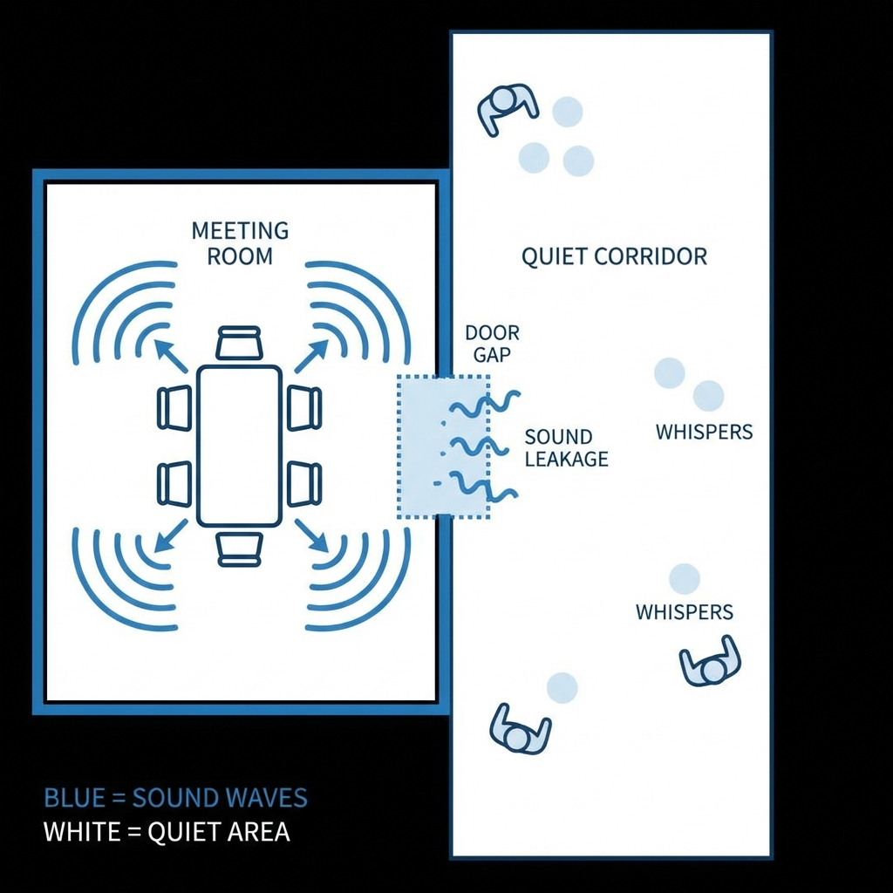
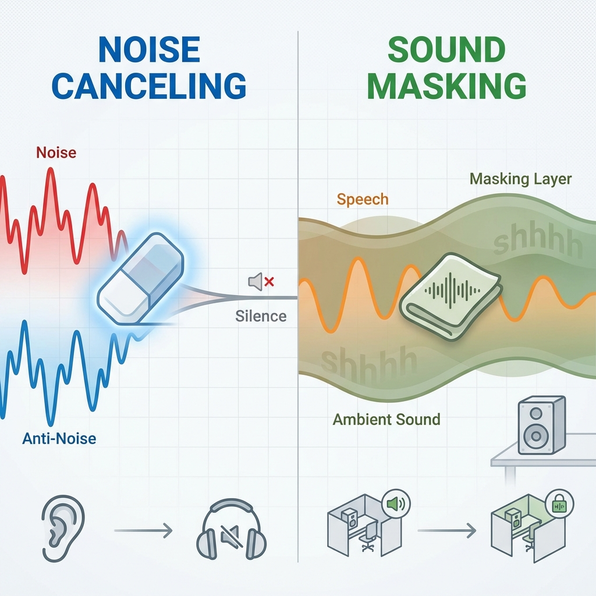

---
title: "会議室の会話を守る｜サウンドマスキング導入で音漏れリスク解決"
description: "「壁の厚さ」だけでは防げない会議室の音漏れ。会話の内容を聞き取りにくくする「サウンドマスキング」の仕組み、導入メリット、オフィスへの設置ポイントを専門家が解説します。"
slug: "office-sound-masking-security"
date: "2026-02-04T22:00:00+09:00"
lastmod: "2026-02-28"
draft: false
lang: "ja"
category: "solutions"
subcategory: "unit-rooms"
tags: ["防音"]
image: ./cover.jpg
---
<RegionBanner />

オフィスの会議室から、重要な機密情報や人事に関する会話が漏れていませんか？

「壁を厚くしたから大丈夫」と安心するのは危険です。実は、静かなオフィスほど、少しの隙間から漏れる「会話の内容」がはっきりと聞こえてしまうのです。

この記事では、物理的な防音工事だけでは防ぎきれない音漏れリスクに対して、<strong>「音で音を隠す」サウンドマスキング技術</strong>について、その仕組みと効果的な導入方法を専門的な視点から解説します。

_図：静かなオフィスほど「会話の内容」は漏れやすいというパラドックス_

## 【結論】「壁の厚さ」だけでは防げない音漏れリスク

結論から申し上げますと、オフィスの音漏れ対策において「壁の遮音性能（Dr値）」を高めるだけでは不十分なケースが多々あります。

なぜなら、人間は <strong>「静かな環境ほど、小さな話し声でも内容を聞き取れてしまう」</strong> という聴覚特性を持っているからです。

### 声の周波数と「聞こえやすさ」の正体

一般的な男性の話し声は約500Hz〜1kHz、女性はもう少し高い周波数帯域に主成分があります。これらは人間の耳が最も感度良く拾ってしまう帯域です。

例えば、高性能な防音壁で音の大きさ（dB）事態を半分に減らしたとしても、周囲が静まり返っていれば、その「半分になった声」の内容はクリアに聞こえてしまいます。これを <strong>「スピーチプライバシー」が守られていない状態</strong> と呼びます。

### 情報漏洩の多くは「うっかり」と「立ち聞き」から

情報セキュリティ事故の要因として、サイバー攻撃と同じくらい警戒すべきなのが、この「アナログな音漏れ」です。

- 会議室のドアの隙間から漏れる役員の声
- 静かな執務スペースで響く電話の内容

これらは、悪意のない従業員の耳にも自然と入ってしまい、結果として社内の士気低下や予期せぬ噂の拡散につながります。

## サウンドマスキングとは？音で音を隠す仕組み

そこで有効な解決策となるのが <strong>「サウンドマスキング」</strong> です。

これは、会話の周波数帯域を覆い隠すような特殊な「背景音（マスキング音）」をあえて流すことで、会話の内容を聞き取りにくくする技術です。

### ノイズキャンセリングとの違い

よく混同されますが、ノイズキャンセリングとは逆のアプローチです。

- <strong>ノイズキャンセリング</strong> : 逆位相の音をぶつけて、騒音そのものを<strong>消す</strong>技術。
- <strong>サウンドマスキング</strong> : 空調音のような環境音を流して、会話を <strong>隠す（目立たなくする）</strong> 技術。

例えるなら、静かな図書館ではヒソヒソ話が気になりますが、賑やかなカフェでは隣の席の会話内容があまり気にならないのと同じ原理（カクテルパーティー効果の逆利用）です。

### 導入効果：会話の内容を「不明瞭」にする

サウンドマスキングを導入すると、音漏れ自体がゼロになるわけではありません。しかし、 <strong>「何か喋っているのは分かるが、内容は聞き取れない」</strong> という状態を作り出すことができます。

| 状態               | 聞こえ方                      | セキュリティレベル |
| :----------------- | :---------------------------- | :----------------- |
| <strong>未対策</strong>         | 「A社の件、予算は300万で…」   | 危険（内容が漏洩） |
| <strong>マスキングあり</strong> | 「…ザワザワ…（不明瞭な音）…」 | 安全（内容は不明） |

_図：音を「消す」のではなく「隠す」アプローチの違い_

このように、意味のある「情報」を、意味のない「音」に変えてしまうのが最大のメリットです。

### 会議中の集中力を阻害しない「背景音」の技術

「余計な音を流すと集中できないのでは？」と心配されるかもしれませんが、最新のシステムは非常に巧妙に設計されています。

人間の耳に馴染みやすい「空調の風の音」に近い周波数特性（ピンクノイズの調整版など）を使用するため、脳が自然と「背景音（環境音）」として処理し、意識から除外してくれます。
入後数日で、多くの従業員はその音の存在自体を忘れてしまいます。

## オフィスのセキュリティレベルを上げる音響設計

効果を最大化するためには、スピーカーの配置と音量設定が重要です。

### 設置すべきエリア（会議室周辺、オープンスペース）

マスキング音は、 <strong>「音を聞かれたくない場所」ではなく「音が漏れている場所（聞く人がいる場所）」</strong> に流すのが基本です。

1.  <strong>会議室の廊下側</strong> : ドアの隙間から漏れる声を廊下で消すため。
2.  <strong>オープンスペースの天井</strong> : 静かすぎる執務エリアでの電話の声を隠すため。

### 物理的な遮音（パーティション）との併用が必須なケース

サウンドマスキングは魔法ではありません。もし、壁に大きな穴が開いていたり、パーティションが低すぎたりして「直接音」が届いてしまう環境では効果が薄れます。

- <strong>壁・パーティション</strong> : 音の <strong>大きさ</strong> を減らす（一次対策）
- <strong>サウンドマスキング</strong> : 残った音の <strong>内容</strong> を隠す（仕上げ対策）

この2つを組み合わせることで、コストを抑えつつ最高のセキュリティ環境を構築できます。

### デメリットと限界：完全な無音化ではない点への理解

導入時に社内へ説明しておくべき点は、「無音になるわけではない」ということです。
むしろ、シーンとした静寂を好む人にとっては、わずかな「サー」という音が気になる可能性がゼロではありません。

そのため、エリアごとに音量を調整できる機能付きのシステムを選定することをおすすめします。

## 導入前に確認すべきチェックリスト

失敗しない導入のために、以下のステップで検討を進めてください。

### 現状の「音漏れレベル」の測定

まず、実際にどれくらい会話が漏れているかを把握しましょう。
スマホのアプリでも簡易測定は可能ですが、専門業者に依頼して「どの周波数帯が漏れているか」を測定してもらうのが確実です。

### 費用対効果とセキュリティポリシーとの整合性

防音工事で壁を壊して作り直すと、数百万円〜のコストと数週間の工期がかかります。一方、サウンドマスキングなら、天井裏へのスピーカー設置だけで済むため、 <strong>コストは防音工事の1/3〜1/5程度</strong> で済む場合が多いです。

「物理的な改修が難しい賃貸オフィス」や「レイアウト変更が多い企業」において、非常に合理的（Optimized）な投資と言えます。

### 従業員の「不快感」テストの重要性

本格導入の前に、デモ機を借りてトライアルを行うことを強く推奨します。

- 実際に音を隠せているか？
- 業務中に音が気にならないか？

この2点を1週間程度テストし、現場のアンケートを取ることで、導入後のトラブルを未然に防げます。

_図：失敗しない導入フローの確認_

---

## まとめ：音のセキュリティは企業の信頼を守る「見えない壁」

オフィスの音漏れ対策は、単なる騒音問題ではありません。顧客情報や経営戦略を守るための <strong>「セキュリティ投資」</strong> です。

1.  <strong>壁だけでは不十分</strong> : 静寂は音漏れを助長する。
2.  <strong>サウンドマスキング</strong> : 会話を「不明瞭」にして情報を守る賢い技術。
3.  <strong>ハイブリッド対策</strong> : 物理的な遮音と組み合わせることで、コスパ良く環境を最適化。

「うっかり」による情報漏洩を防ぎ、社員が安心して議論できる環境を作るために、ぜひサウンドマスキングの導入を検討してみてください。

