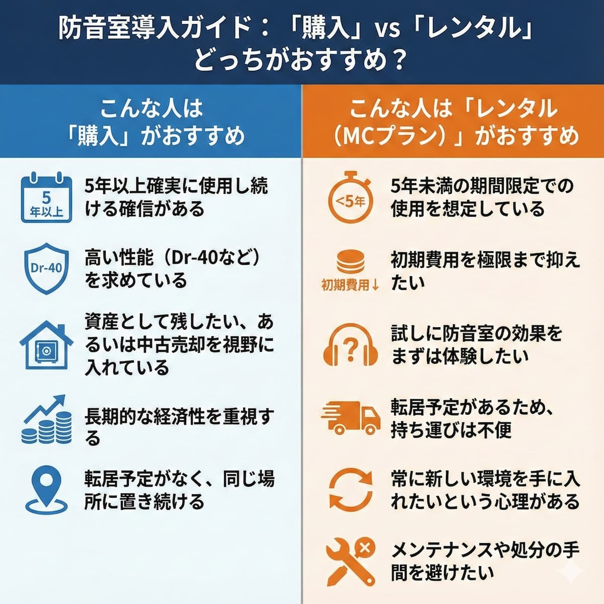

<RegionBanner />

ヤマハの防音室が月1万2千円くらいから借りれるプランが出来たことで、防音室を導入するハードルは一気に下がった。……厳密には、元からレンタルのプランはあるんだけど、リースの意味合いが強く、数年契約からの「買取？or契約破棄？」を迫られるタイプが多かった。

でも、新しい「MCプラン」はそうではない。月額定額で、最短15ヶ月から気軽に始められるレンタルです。

ただし、1年借りれば12万円以上の出費になる。5年もいけば60万になる。そこまで行くなら「買ったほうがよくない？」と思うかもしれません。

<strong>でも待ってください。</strong> あなたのニーズと用途、そして予算を考慮するなら、レンタル・リース・そして割賦（ローン）で最適な選択肢が浮かんでくるはず。

本記事では、防音室を借りるべきか買うべきかを、あなたの状況によってベストな選択をする手助けを目標にしています。

## 防音室「購入」と「レンタル」の価格比較

ヤマハの防音室「<strong>アビテックス（セフィーネ NS）</strong>」の0.8畳から1.5畳モデルにおける、メーカー希望小売価格（購入）とレンタルサービス「音レント」の月額料金の比較は以下の通りです。

### アビテックス（セフィーネ NS）価格・料金比較表

購入価格は遮音性能（D値）や壁の高さにより異なりますが、ここではレンタルプランの対象となっている<strong>Dr-35・標準壁モデル</strong>を基準に比較します。

| サイズ | 希望小売価格（税込・新品） | レンタル月額「MCプラン」（税込） |
|:--|:--|:--|
| <strong>0.8畳</strong> | <strong>770,000円</strong> | <strong>12,760円</strong> |
| <strong>1.2畳</strong> | <strong>858,000円</strong> | <strong>14,080円</strong> |
| <strong>1.5畳</strong> | <strong>979,000円</strong> | <strong>15,950円</strong> |

### 各プランの詳細と注意点

#### 購入（メーカー希望小売価格）の場合

購入を選んだ場合、いくつか把握しておくべきポイントがあります。

まず<strong>遮音性能の選択肢</strong>です。購入の場合は、Dr-35のほかに、より高性能な<strong>Dr-40</strong>を選択することも可能です。例えば、0.8畳 Dr-40は1,078,000円となります。

次に<strong>追加費用</strong>を忘れずに。上記の本体価格とは別に、<strong>組立費や運送費</strong>が別途発生します。これは数万円程度が目安となります。

そして<strong>資産性</strong>を考えましょう。高額な投資となりますが、解体・移設して使い続けることができ、不要になった際の処分（解体・移設）には別途費用がかかります。つまり、最初の投資は大きいですが、長く使う場合は資産として考えることもできます。

#### レンタル（音レント「MCプラン」）の場合

レンタルを選ぶ場合も、いくつかの特徴があります。

<strong>対象製品</strong>は2025年11月より開始される新プランで、<strong>新品・未使用</strong>の「アビテックス セフィーネ NS」が対象です。つまり、常に最新の防音室が手に入ります。

<strong>性能</strong>は遮音性能が<strong>Dr-35</strong>に限定されています。高性能モデル（Dr-40）は選べません。

<strong>初期費用と期間</strong>について。初回登録料として2,200円（税込）が必要です。レンタル期間は<strong>最短15ヶ月</strong>から設定されています。

<strong>運送費の扱い</strong>が重要です。納入時の<strong>基本運送組立費はレンタル料に含まれています</strong>。しかし、返却時の解体・運送費や、階段作業などの特殊作業料は別途負担となります。

## 「損益分岐点」はいつか：5年（約60ヶ月）が目安

ヤマハの防音室「アビテックス（セフィーネ NS）」の新品購入と、レンタルサービス「音レント」の月額定額利用（MCプラン）を比較した場合、支払い総額における<strong>損益分岐点は概ね「5年前後（約60〜61ヶ月）」</strong>となります。

以下に、サイズ別の具体的な算出結果と、価値を考慮する際の重要な要素をまとめます。

### サイズ別・損益分岐点の算出（Dr-35・標準壁モデル）

計算式：(メーカー希望小売価格 − 初回登録料2,200円) ÷ 月額レンタル料 ＝ 損益分岐月数

| サイズ | 購入価格（税込） | 月額レンタル料 | 損益分岐の目安 |
|:--|:--|:--|:--|
| <strong>0.8畳</strong> | <strong>770,000円</strong> | <strong>12,760円</strong> | <strong>約60ヶ月（5年）</strong> |
| <strong>1.2畳</strong> | <strong>858,000円</strong> | <strong>14,080円</strong> | <strong>約61ヶ月（5年1ヶ月）</strong> |
| <strong>1.5畳</strong> | <strong>979,000円</strong> | <strong>15,950円</strong> | <strong>約61ヶ月（5年1ヶ月）</strong> |

※計算は本体購入価格を基準にしており、運送・組立費は含まれていません。含めるとさらに購入の総額が高まります。

## 「価値」を左右する4つのポイント

単純な月数計算だけでなく、以下の要素を考慮することで、実質的な価値判断が可能になります。

### 1. 初期費用の差（運送・組立費）

<strong>購入の場合</strong>、本体代金の他に、<strong>数万円〜の運送費・組立費</strong>が別途発生します。

一方、<strong>レンタルの場合</strong>は納入時の<strong>基本運送組立費がレンタル料に含まれている</strong>ため、初期の現金支出を大幅に抑えられるメリットがあります。

資金に余裕がない場合、この初期費用の差は大きな判断材料になります。

### 2. 資産価値と出口戦略

<strong>購入の場合</strong>。高額な投資となりますが、最終的に<strong>「資産」として手元に残ります</strong>。不要になった際は中古として売却したり、解体・移設して転居先でも使い続けることが可能です。

実は防音室は<strong>リセールマーケットがある程度成立しています</strong>。メーカー品であれば、中古でも需要があります。

<strong>レンタルの場合</strong>。支払った料金はすべて掛け捨てとなりますが、<strong>返却時の解体・運送費を負担するだけでいつでも処分が可能</strong>です（最短期間15ヶ月経過後）。

つまり、「最終的に何も手元に残らない」という不安を感じる人もいれば、「手間なく返却できる」というメリットに感じる人もいるわけです。

### 3. 維持・処分のコスト

本格的な防音室は解体や撤去にも費用がかかります。処分費用目安は<strong>38,000円〜</strong>です。購入した場合はこの費用も自己負担となります。

つまり、購入時には「本体 + 運送・組立 + 最終的な処分費」という3つの費用が発生するのです。

### 4. 心理的・身体的メリット（健康投資）

防音室の導入は、単なる支払い比較を超えた「<strong>健康投資</strong>」としての側面を持ちます。

<strong>加害恐怖の解消</strong>（自分がうるさくないかという不安）、<strong>家族関係の緩和</strong>（「静かにして」という小言がなくなる）、<strong>睡眠の質の改善</strong>といった心理的利益は、導入した日から享受できます。

1日あたりの心の安定度を考えると、「月1万円でその不安が消える」というのは、実は非常にコストパフォーマンスが高い投資かもしれません。

## あなたはどちらを選ぶ？選択基準の整理

ここまで読んで、あなたの状況に当てはめてみましょう。

### こんな人は「購入」がおすすめ

- <strong>5年以上確実に使用し続ける 確信がある</strong>
- <strong>高い性能（Dr-40など）を求めている</strong>
- <strong>資産として残したい、あるいは</strong><strong>中古売却を視野に入れている</strong>
- <strong>長期的な経済性を重視する</strong>
- <strong>転居予定がなく、<strong>同じ場所に置き続ける</strong></strong>

### こんな人は「レンタル（MCプラン）」がおすすめ

- <strong>5年未満の期間限定での使用を想定している</strong>
- <strong>初期費用を極限まで抑えたい</strong>
- <strong>試しに防音室の効果を<strong>まずは</strong>体験したい</strong>
- <strong>転居予定があるため、持ち運びは</strong>不便
- <strong>常に新しい環境を手に入れたい という心理がある</strong>
- <strong>メンテナンスや処分の手間を避けたい</strong>

## まとめ：防音室を借りることは、車をリースするのと似ている

防音室を借りることは、「<strong>所有して長く乗る」か「定額で手軽に最新の環境を手に入れ、ライフスタイルの変化に合わせて手放すか</strong>」という視点で選ぶのが合理的です。

<strong>5年（1,825日）以上</strong>継続して使い続ける確信がある、あるいは将来的に売却してリセールバリューを得たい場合は、「<strong>購入</strong>」が有利です。

<strong>5年未満</strong>の期間限定での使用や、まずは騒音対策の効果を試したい、あるいは初期費用を極限まで抑えたい場合は、「<strong>レンタル（MCプラン）</strong>」が価値の高い選択肢となります。

防音室への投資は単なる贅沢ではなく、集中力の向上や家族関係の緩和、加害恐怖の解消につながる「<strong>健康投資</strong>」です。あなたの人生設計と照らし合わせて、最適な選択をしてください。

